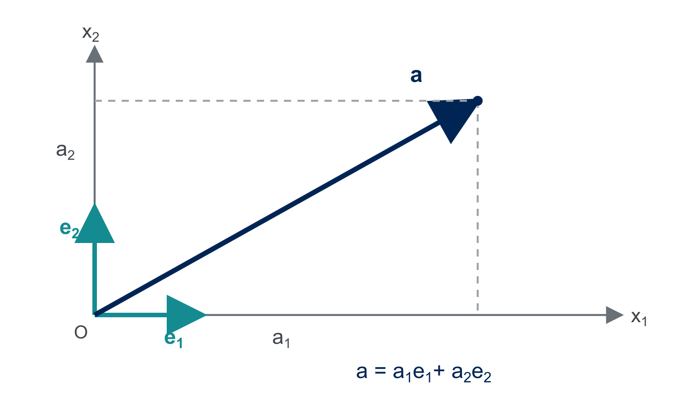

# Mathematical Foundations {#sec-math-foundations}

```{=latex}
\chaptershorttitle{Foundations}
```

Finite element analysis uses ideas from linear algebra, tensor calculus, and
functional analysis. Students often encounter these subjects separately. This
chapter collects the concepts needed to formulate boundary-value problems and
their finite element approximations in a consistent notation. The treatment is
selective and assumes only multivariable calculus and elementary linear
algebra. Additional details related to real analysis and tensor and continuum mechanics concepts used in this chapter can be found in @sec-appendix-real-analysis and @sec-appendix-tensor-notation.

## Sets and basic notation {#sec-foundations-sets}

A **set** is a collection of distinct objects. The objects in a set are its
**elements**. Curly braces $\{\,\}$ are used to specify which elements belong
to the set. For example,

$$
A=\{1,2,3\}
$$

defines the set whose elements are $1$, $2$, and $3$. We write $2\in A$ to
state that $2$ belongs to $A$, and $4\notin A$ to state that $4$ does not
belong to $A$. The order and repetition of listed elements do not matter:

$$
\{1,2,3\}=\{3,2,1\}=\{1,1,2,3\}.
$$

Two sets are equal when they have exactly the same elements. An element and a
set containing that element are different objects. For example,
$1\in\{1\}$, but $1\ne\{1\}$.

When listing every element is inconvenient or impossible, we use
**set-builder notation**. The general form

$$
\{x\in X:P(x)\}
$$

means “the set of all elements $x$ of $X$ for which the condition $P(x)$ is
true.” The colon is read as “such that.” A vertical bar is sometimes used in
place of the colon. For example,

$$
\{x\in\R:x^2<4\}=(-2,2),
$$

because the real numbers satisfying $x^2<4$ are precisely those between
$-2$ and $2$. Similarly,

$$
\{(x,y)\in\R^2:y=x\}
$$

is the line through the origin with slope one. The expression to the left of
the colon identifies the objects under consideration; the expression to the
right gives the condition those objects must satisfy.

A set $A$ is a **subset** of a set $B$, written $A\subset B$, if every element
of $A$ also belongs to $B$. In this book, $A\subset B$ allows the possibility
that $A=B$; a strict subset is written $A\subsetneq B$. The set with no
elements is the **empty set**, denoted by $\varnothing$.

For two sets $A$ and $B$,

$$
\begin{aligned}
A\cup B &=\{x:x\in A\text{ or }x\in B\},\\
A\cap B &=\{x:x\in A\text{ and }x\in B\},\\
A\setminus B &=\{x\in A:x\notin B\}.
\end{aligned}
$$

These are the **union**, **intersection**, and **set difference**,
respectively. The Cartesian product is

$$
A\times B=\{(a,b):a\in A\text{ and }b\in B\}.
$$

Thus $\R^2=\R\times\R$, and more generally $\R^d$ is the set of ordered
$d$-tuples of real numbers.

Intervals are sets of real numbers. For $a<b$,

$$
(a,b)=\{x\in\R:a<x<b\},
\qquad
[a,b]=\{x\in\R:a\leq x\leq b\}.
$$

The first interval excludes its endpoints and the second includes them.

The standard number sets used in this chapter are

$$
\mathbb{N}=\{0,1,2,\ldots\},
\qquad
\mathbb{Z}=\{\ldots,-2,-1,0,1,2,\ldots\},
\qquad
\mathbb{Q}\subset\R,
$$

where $\mathbb{N}$, $\mathbb{Z}$, $\mathbb{Q}$, and $\R$ denote the natural
numbers, integers, rational numbers, and real numbers, respectively.

A function $f:X\to Y$ assigns one element $f(x)\in Y$ to each $x\in X$.
The set $X$ is the domain of the function and $Y$ is its codomain. The braces
used to describe a set specify only its elements; they do not, by themselves,
define vector addition, scalar multiplication, a metric, or a norm.

::: {#exr-foundations-set-notation}
## Reading and writing sets

1. List the elements of
   $A=\{n\in\mathbb{N}:0\leq n\leq4\}$.
2. Write the interval $[-1,2)$ in set-builder notation.
3. Let $B=\{x\in\R:x^2=1\}$. List the elements of $B$ and determine whether
   $B\subset[-1,1]$.
4. List the ordered pairs in $\{0,1\}\times\{2,3\}$.
5. Describe $\{(x,y)\in\R^2:y=2x\}$ in words and determine whether
   $(2,4)$ and $(2,5)$ belong to this set.
:::

## Domains and boundary regularity {#sec-foundations-domains}

Throughout the book, $\Om\subset\R^d$ denotes a nonempty, connected, open
set. Unless stated otherwise, $\Om$ is also bounded. Its closure and boundary
are denoted by $\overline{\Om}$ and $\partial\Om$, respectively. Additional
regularity of the boundary will be stated when it is needed.

::: {#def-lipschitz-domain}
## Lipschitz domain
A bounded domain $\Om\subset\R^d$ is a **Lipschitz domain** if, near every
point of $\partial\Om$, its boundary can be represented as the graph of a
Lipschitz-continuous function after a translation and rotation of coordinates.
More precisely, for every $\bx_0\in\partial\Om$, there are a neighborhood
$U$ of $\bx_0$, local coordinates $(\bx',x_d)\in\R^{d-1}\times\R$, and a
function $\varphi:\R^{d-1}\to\R$ such that

$$
\Om\cap U
=\{(\bx',x_d)\in U:x_d>\varphi(\bx')\},
$$

with the opposite inequality allowed after reversing the $x_d$-axis. The
function $\varphi$ is Lipschitz continuous if there is a constant $L>0$ such
that

$$
|\varphi(\bx')-\varphi(\bm{y}')|
\leq L\norm{\bx'-\bm{y}'}_2
\qquad
\forall\bx',\bm{y}'\in\R^{d-1}.
$$

Here $\norm{\bm{z}}_2=(\sum_{i=1}^{d-1}z_i^2)^{1/2}$ is the Euclidean norm
of $\bm{z}\in\R^{d-1}$.
:::

::: {#exm-foundations-domains}
## Common domains

1. An open interval $(a,b)\subset\R$ is a bounded Lipschitz domain.
2. Open rectangles, polygons, boxes, and polyhedra with non-self-intersecting
   boundaries are Lipschitz domains. Corners and reentrant corners are
   permitted; the L-shaped domain
   $(-1,1)^2\setminus([0,1)\times(-1,0])$ is a standard example.
3. The open ball $\{\bx\in\R^d:\norm{\bx}_2<R\}$ has a smooth boundary and
   is therefore a Lipschitz domain.
:::

::: {#rem-foundations-domain-regularity}
## Use of domain assumptions
The fine distinctions among boundary regularity classes are not a main topic
of this book. When a result requires a Lipschitz boundary, a positive-measure
Dirichlet boundary, or another geometric property, that condition will be
assumed at the outset. These assumptions allow us to assign boundary values to
$H^1$ functions, use outward unit normals, apply integration by parts, and use
Poincare-type inequalities without
interrupting the finite element development with additional technical proofs.
:::

## Scalars, vectors, and tensors {#sec-foundations-tensors}

A **scalar** is a real number. Scalars describe quantities that have a value
but no direction. Temperature, density, and isotropic thermal conductivity are
examples. A scalar field assigns a scalar to each point of a domain; for
example, a temperature field is a function
$T:\Om\to\R$.

A **vector** describes a quantity with components along spatial directions.
Displacement, traction, velocity, and heat flux are vector fields. At each
point $\bx\in\Om$, a vector field $\bm{a}:\Om\to\R^d$ assigns a vector
$\bm{a}(\bx)$. Before working with vector and tensor components, we must specify
the coordinate directions with respect to which those components are measured.

### Cartesian coordinates and vector components

A Cartesian coordinate system in $\R^d$ consists of an origin and an
orthonormal basis

$$
\{\bm{e}_1,\ldots,\bm{e}_d\}.
$$

The basis vectors have unit length and are mutually perpendicular. Their dot
products satisfy

$$
\bm{e}_i\cdot\bm{e}_j=\delta_{ij},
\qquad
\delta_{ij}=
\begin{cases}
1, & i=j,\\
0, & i\ne j,
\end{cases}
$$ {#eq-foundations-cartesian-orthonormality}

where $\delta_{ij}$ is the **Kronecker delta**. In $\R^2$, the usual
Cartesian basis is
$\bm{e}_1=(1,0)$ and $\bm{e}_2=(0,1)$; in $\R^3$, it is
$\bm{e}_1=(1,0,0)$, $\bm{e}_2=(0,1,0)$, and
$\bm{e}_3=(0,0,1)$.

Every vector $\bm{a}\in\R^d$ has a unique expansion

$$
\bm{a}
=a_1\bm{e}_1+\cdots+a_d\bm{e}_d
=a_i\bm{e}_i.
$$ {#eq-foundations-vector-component-expansion}

The scalar $a_i$ is the component of $\bm{a}$ in the
$\bm{e}_i$ direction. Taking the dot product of
@eq-foundations-vector-component-expansion with $\bm{e}_j$ gives

$$
\bm{a}\cdot\bm{e}_j
=a_i(\bm{e}_i\cdot\bm{e}_j)
=a_i\delta_{ij}
=a_j.
$$

Thus the components can be recovered from the vector by
$a_i=\bm{a}\cdot\bm{e}_i$. The vector is the geometric object, whereas the
list of components $(a_1,\ldots,a_d)$ describes that vector in the selected
basis.

{#fig-foundations-cartesian-basis width="72%" fig-align="center"}

For vectors
$\bm{a}=a_i\bm{e}_i$ and $\bm{b}=b_i\bm{e}_i$, orthonormality gives

$$
\bm{a}\cdot\bm{b}=a_i b_i,
\qquad
\lVert\bm{a}\rVert
=\sqrt{\bm{a}\cdot\bm{a}}
=\left(\sum_{i=1}^d a_i^2\right)^{1/2}.
$$ {#eq-foundations-vector-dot-norm}

::: {#exm-foundations-vector-components}
## Components of a vector in $\R^3$
Let

$$
\bm{a}=2\bm{e}_1-\bm{e}_2+2\bm{e}_3.
$$

Its Cartesian components are $(a_1,a_2,a_3)=(2,-1,2)$. Therefore,

$$
\lVert\bm{a}\rVert
=\sqrt{2^2+(-1)^2+2^2}
=3.
$$

The component in the $\bm{e}_2$ direction is also recovered from
$\bm{a}\cdot\bm{e}_2=-1$.
:::

::: {#exr-foundations-vector-component-calculations}
## Elementary vector calculations
In the Cartesian basis of $\R^3$, let

$$
\bm{a}=2\bm{e}_1-\bm{e}_2+2\bm{e}_3,
\qquad
\bm{b}=\bm{e}_1+3\bm{e}_2.
$$

1. List the components of $\bm{a}$ and $\bm{b}$.
2. Compute $\bm{a}\cdot\bm{b}$,
   $\lVert\bm{a}\rVert$, and $\lVert\bm{b}\rVert$.
3. Use $a_i=\bm{a}\cdot\bm{e}_i$ to recover each component of
   $\bm{a}$.
:::

### Dyadic product and second-order tensors

For vectors $\bm{a},\bm{b}\in\R^d$, their **dyadic product**, also called
the tensor product, is the second-order tensor
$\bm{a}\otimes\bm{b}$ defined by its action on an arbitrary vector
$\bm{c}$:

$$
(\bm{a}\otimes\bm{b})\bm{c}
=\bm{a}(\bm{b}\cdot\bm{c}).
$$ {#eq-foundations-dyadic-action}

Using Cartesian components,

$$
\bm{a}\otimes\bm{b}
=a_i b_j\,\bm{e}_i\otimes\bm{e}_j,
\qquad
(\bm{a}\otimes\bm{b})_{ij}=a_i b_j.
$$ {#eq-foundations-dyadic-components}

The order of the vectors matters:
$\bm{a}\otimes\bm{b}$ and $\bm{b}\otimes\bm{a}$ are generally different
tensors.

::: {#exm-foundations-dyadic-product}
## A dyadic product in $\R^2$
Let

$$
\bm{a}=\bm{e}_1+2\bm{e}_2,
\qquad
\bm{b}=3\bm{e}_1-\bm{e}_2.
$$

The components of $\bm{a}\otimes\bm{b}$ form the matrix

$$
[\,\bm{a}\otimes\bm{b}\,]
=
\begin{bmatrix}
1\\[2pt]2
\end{bmatrix}
\begin{bmatrix}
3&-1
\end{bmatrix}
=
\begin{bmatrix}
3&-1\\
6&-2
\end{bmatrix}.
$$

For $\bm{c}=\bm{e}_1+\bm{e}_2$, we have
$\bm{b}\cdot\bm{c}=2$. Hence

$$
(\bm{a}\otimes\bm{b})\bm{c}
=2\bm{a}
=2\bm{e}_1+4\bm{e}_2.
$$

Multiplying the displayed matrix by the component vector $(1,1)^T$ gives
the same result.
:::

A **second-order tensor** $\bm{A}$ is a linear mapping from vectors to
vectors. Stress, strain, and the deformation gradient are second-order tensor
fields. Relative to a Cartesian basis, the tensor components are

$$
A_{ij}
=\bm{e}_i\cdot(\bm{A}\bm{e}_j),
$$

and the tensor has the expansion

$$
\bm{A}=A_{ij}\bm{e}_i\otimes\bm{e}_j.
$$ {#eq-foundations-component-expansion}

The component $A_{ij}$ is the $\bm{e}_i$ component of the vector obtained
when $\bm{A}$ acts on $\bm{e}_j$. The array $[A_{ij}]$ is the matrix
representation of $\bm{A}$ in the chosen basis. As with a vector, the tensor
is independent of the basis, although its components change when the basis
changes.

### Index notation and tensor-vector multiplication

Repeated indices are summed from $1$ to $d$ unless stated otherwise. An index
that appears once in a term is a **free index** and must appear in every term
of the equation. An index that appears twice is a **dummy index** and may be
renamed. For example,

$$
\bm{c}=\bm{A}\bm{a}
\qquad\Longleftrightarrow\qquad
c_i=A_{ij}a_j.
$$ {#eq-foundations-tensor-vector-components}

The index $i$ is free, whereas $j$ is summed. The Kronecker delta represents
the components of the identity tensor,

$$
\bI=\delta_{ij}\bm{e}_i\otimes\bm{e}_j,
$$

and satisfies $\delta_{ij}a_j=a_i$.

::: {#exr-foundations-tensor-vector-components}
## Tensor-vector multiplication
Let $\bm{c}=\bm{A}\bm{b}$. Starting from the basis expansions

$$
\bm{A}=A_{ij}\bm{e}_i\otimes\bm{e}_j,
\qquad
\bm{b}=b_k\bm{e}_k,
$$

use $\bm{e}_j\cdot\bm{e}_k=\delta_{jk}$ and the defining property of the
Kronecker delta to show that $c_i=A_{ij}b_j$.
:::

### Operations on second-order tensors

For second-order tensors $\bm{A}$ and $\bm{B}$,

$$
(\bm{A}\bm{B})_{ij}=A_{ik}B_{kj},
\qquad
(\bm{A}^{T})_{ij}=A_{ji},
\qquad
\tr(\bm{A})=A_{ii}.
$$

The double contraction and Frobenius norm are

$$
\bm{A}:\bm{B}=A_{ij}B_{ij},
\qquad
\lVert\bm{A}\rVert_F
=\sqrt{\bm{A}:\bm{A}}.
$$ {#eq-foundations-double-contraction}

Every second-order tensor has the decomposition

$$
\bm{A}
=\operatorname{sym}\bm{A}+\operatorname{skw}\bm{A},
\qquad
\operatorname{sym}\bm{A}=\frac12(\bm{A}+\bm{A}^{T}),
\qquad
\operatorname{skw}\bm{A}=\frac12(\bm{A}-\bm{A}^{T}).
$$ {#eq-foundations-sym-skew}

The symmetric and skew-symmetric parts are orthogonal under the double
contraction. In particular, if $\bm{S}$ is symmetric, then
$\bm{S}:\operatorname{skw}\bm{A}=0$.

::: {#exr-foundations-symmetric-skew-orthogonality}
## Orthogonality of the symmetric and skew-symmetric parts
Use the definition
$\bm{B}:\bm{C}=B_{ij}C_{ij}$ from
@eq-foundations-double-contraction, the decomposition in
@eq-foundations-sym-skew, and the identity
$\bm{B}^{T}:\bm{C}^{T}=\bm{B}:\bm{C}$ to prove that

$$
\operatorname{skw}\bm{A}:\operatorname{sym}\bm{A}=0.
$$
:::

### Fourth-order tensors

A fourth-order tensor maps second-order tensors to second-order tensors. For the
elasticity tensor $\mathbb{C}$,

$$
\bsig=\mathbb{C}:\beps,
\qquad
\sigma_{ij}=C_{ijkl}\varepsilon_{kl}.
$$

## Vector spaces {#sec-foundations-vector-spaces}

Vector spaces provide the algebraic setting for linear combinations. Their
elements need not be arrows in physical space. A matrix, a polynomial, a
continuous function, or a linear functional can be treated as a vector when
addition and scalar multiplication satisfy the vector-space axioms.

A set alone is not a vector space. Addition and scalar multiplication are part
of the structure placed on the set. Once these operations have been specified,
the set is a vector space only if all the axioms below hold.

::: {#def-vector-space}
## Real vector space
A **real vector space** is a nonempty set $V$ together with

- an addition that assigns an element $u+v\in V$ to every
  $u,v\in V$, and
- a scalar multiplication that assigns an element $\alpha v\in V$ to every
  $\alpha\in\R$ and $v\in V$,

such that, for all $u,v,w\in V$ and $\alpha,\beta\in\R$:

1. **Commutativity of addition:** $u+v=v+u$.
2. **Associativity of addition:** $(u+v)+w=u+(v+w)$.
3. **Additive identity:** there is an element $0\in V$ such that
   $v+0=v$.
4. **Additive inverse:** for each $v\in V$, there is an element
   $-v\in V$ such that $v+(-v)=0$.
5. **Identity for scalar multiplication:** $1v=v$.
6. **Compatibility of scalar multiplication:**
   $\alpha(\beta v)=(\alpha\beta)v$.
7. **Distributivity over vector addition:**
   $\alpha(u+v)=\alpha u+\alpha v$.
8. **Distributivity over scalar addition:**
   $(\alpha+\beta)v=\alpha v+\beta v$.
:::

::: {#def-linear-subspace}
## Linear subspace
Let $V$ be a real vector space. A nonempty subset $W\subset V$ is a
**linear subspace** of $V$ if

$$
\alpha u+\beta v\in W
\qquad
\text{for every }u,v\in W
\text{ and }\alpha,\beta\in\R.
$$

Thus a subspace uses the addition and scalar multiplication already defined on
$V$ and is itself a vector space under those operations.
:::

The subspace condition is a convenient test because it checks both operations
at once. Taking $\alpha=\beta=0$ shows that every nonempty subspace contains
the zero vector. Taking $(\alpha,\beta)=(1,1)$ checks addition, and taking
$\beta=0$ checks scalar multiplication.

::: {#exm-foundations-basic-vector-spaces}
## Vector spaces and nonexamples

1. $\R^n$ is a vector space under componentwise addition and scalar
   multiplication.
2. The set $\R^{m\times n}$ of real $m$-by-$n$ matrices is a vector space
   under the usual matrix addition and scalar multiplication.
3. The set of continuous functions on $[0,1]$ is a vector space under
   pointwise operations:

   $$
   (u+v)(x)=u(x)+v(x),
   \qquad
   (\alpha u)(x)=\alpha u(x).
   $$

   Sums and scalar multiples of continuous functions remain continuous.
4. The line
   $W=\{(x_1,x_2)\in\R^2:x_2=2x_1\}$ is a subspace of $\R^2$.
   The parallel line
   $\{(x_1,x_2)\in\R^2:x_2=2x_1+1\}$ is not a vector space because it
   does not contain $(0,0)$.
:::

::: {#exr-foundations-subspace-test}
## Identifying real vector spaces
For each set, use the usual addition and multiplication by scalars from $\R$.
Determine whether these operations make the set a real vector space. If they
do not, identify at least one vector-space requirement that fails.

1. $\R^n$, where $n\geq1$;
2. $\R$;
3. $\mathbb{Q}$, the rational numbers;
4. $\mathbb{Z}$, the integers;
5. $\mathbb{N}=\{0,1,2,\ldots\}$;
6. $C(\overline{\Om})=\{u:\overline{\Om}\to\R:u\text{ is continuous}\}$,
   with operations defined pointwise;
7. $\{u\in C(\overline{\Om}):u(\bx_0)=1\}$, where
   $\bx_0\in\overline{\Om}$ is fixed;
8. $\mathcal{P}_p$, the real polynomials of degree at most $p$, where
   $p\geq0$;
9. $\{(x,y)\in\R^2:y=x\}$;
10. $\{(x,y)\in\R^2:y=x+1\}$.
:::

### Basis and dimension

Let $V$ be a real vector space, let $n$ be a positive integer, and let
$v_1,\ldots,v_n\in V$. A **linear combination** of these vectors is a vector
of the form

$$
\alpha_1v_1+\cdots+\alpha_nv_n,
$$

where $\alpha_1,\ldots,\alpha_n\in\R$.

The **span** of $v_1,\ldots,v_n$ is the set of all their linear combinations:

$$
\operatorname{span}\{v_1,\ldots,v_n\}
=\left\{\alpha_1v_1+\cdots+\alpha_nv_n:
\alpha_1,\ldots,\alpha_n\in\R\right\}.
$$

The vectors $v_1,\ldots,v_n$ **span** $V$ if
$\operatorname{span}\{v_1,\ldots,v_n\}=V$. In other words, every vector in
$V$ can then be represented using $v_1,\ldots,v_n$.

The vectors $v_1,\ldots,v_n$ are **linearly independent** if

$$
\alpha_1v_1+\cdots+\alpha_nv_n=0
\quad\Longrightarrow\quad
\alpha_1=\cdots=\alpha_n=0.
$$

The set $\{v_1,\ldots,v_n\}$ is a **basis** of $V$ if it spans $V$ and is
linearly independent. The spanning property ensures that every $v\in V$ has a
representation

$$
v=\alpha_1v_1+\cdots+\alpha_nv_n,
$$

and linear independence ensures that the coefficients in this representation
are unique.

A vector space is **finite-dimensional** if it has a basis containing a finite
number of vectors. Every basis of a finite-dimensional vector space contains
the same number of vectors. This number is the **dimension** of the space. If
$\{v_1,\ldots,v_n\}$ is a basis of $V$, then

$$
\dim V=n.
$$

::: {#exm-foundations-standard-basis}
## The standard basis of $\R^2$
The vectors

$$
\bm{e}_1=(1,0),
\qquad
\bm{e}_2=(0,1)
$$

span $\R^2$ because every $\bm{x}=(x_1,x_2)\in\R^2$ can be written as

$$
\bm{x}=x_1\bm{e}_1+x_2\bm{e}_2.
$$

They are linearly independent because
$\alpha_1\bm{e}_1+\alpha_2\bm{e}_2=(0,0)$ implies
$\alpha_1=\alpha_2=0$. Hence $\{\bm{e}_1,\bm{e}_2\}$ is a basis of $\R^2$,
and $\dim\R^2=2$.
:::

::: {#exm-foundations-polynomial-dimension}
## Dimension of a polynomial space
Let $\mathcal{P}_p$ denote the polynomials of degree at most $p$. Every
$q\in\mathcal{P}_p$ has the form

$$
q(x)=c_0+c_1x+\cdots+c_px^p
=\sum_{i=0}^{p}c_i x^i.
$$ {#eq-foundations-polynomial-expansion}

Thus the $p+1$ monomials

$$
\{1,x,x^2,\ldots,x^p\}
$$

span $\mathcal{P}_p$. They are also linearly independent: the zero polynomial
has all coefficients equal to zero. They therefore form a basis, and

$$
\dim\mathcal{P}_p=p+1.
$$

Once this basis is fixed, the polynomial is determined by the $p+1$ numbers
$(c_0,\ldots,c_p)$. This is the same coordinate idea used for a vector in
$\R^{p+1}$. Different polynomials have different coefficient vectors, while
the basis functions remain fixed.
:::

::: {#exr-foundations-polynomial-coordinates}
## Representing a polynomial in two bases
Consider $\mathcal{P}_2$.

1. Show that $\{1,x,x^2\}$ is a basis.
2. Show that $\{1,x-1,(x-1)^2\}$ is also a basis.
3. For $q(x)=2-3x+x^2$, find constants $a_0,a_1,a_2$ and
   $b_0,b_1,b_2$ such that

   $$
   q(x)=a_0+a_1x+a_2x^2
   $$

   and

   $$
   q(x)=b_0+b_1(x-1)+b_2(x-1)^2.
   $$
:::

::: {#rem-foundations-fem-dimension}
## Finite-dimensional approximation
Chapter 5 constructs a finite element function space with finitely many basis
functions. The finite element method replaces an infinite-dimensional
variational problem by a problem in this finite-dimensional subspace. The
coefficients in the basis expansion become the unknowns of the assembled
linear or nonlinear algebraic system.
:::

::: {#exm-foundations-vector-spaces}
## Affine spaces
Let $V_0$ be a linear subspace of a vector space $V$, and choose
$u_g\in V$. The translated set

$$
V_g=u_g+V_0=\{u_g+w:w\in V_0\}.
$$ {#eq-foundations-affine-space}

is an **affine space**. If $u_g\notin V_0$, then $V_g$ does not contain the zero
vector and is not a vector space. For example, the line
$\{(x_1,x_2)\in\R^2:x_2=1\}$ is a translation of the one-dimensional subspace
$\{(x_1,0):x_1\in\R\}$.
:::

## Metrics, norms, and completeness {#sec-foundations-norms}

A metric is additional structure placed on a set, and a norm is additional
structure placed on a vector space. In either case, the proposed formula is
valid only if it satisfies the corresponding axioms below.

::: {#def-metric}
## Metric
Let $X$ be a set. A mapping $d:X\times X\to[0,\infty)$ is a **metric** if,
for all $u,v,w\in X$,

1. $d(u,v)=0$ if and only if $u=v$;
2. $d(u,v)=d(v,u)$;
3. $d(u,w)\leq d(u,v)+d(v,w)$.

The pair $(X,d)$ is called a metric space.
:::

::: {#def-norm}
## Norm
Let $V$ be a vector space over $\R$. A mapping
$\norm{\cdot}_V:V\to[0,\infty)$ is a **norm** if, for all $u,v\in V$ and
$\alpha\in\R$,

1. $\norm{v}_V=0$ if and only if $v=0$;
2. $\norm{\alpha v}_V=|\alpha|\norm{v}_V$;
3. $\norm{u+v}_V\leq\norm{u}_V+\norm{v}_V$.
:::

::: {#rem-foundations-constructing-a-norm}
## Constructing a norm from a basis
Suppose $\{v_1,\ldots,v_n\}$ is a basis of a finite-dimensional vector space
$V$. Every $v\in V$ has a unique representation

$$
v=\alpha_1v_1+\cdots+\alpha_nv_n.
$$

The formula

$$
\norm{v}_{1,B}=|\alpha_1|+\cdots+|\alpha_n|
$$

defines a norm on $V$. Thus every finite-dimensional real vector space can be
equipped with a norm. The norm is not determined by the set $V$ alone; the
formula above depends on the selected basis.
:::

::: {#def-seminorm}
## Seminorm
Let $V$ be a vector space over $\R$. A mapping
$\seminorm{\cdot}_V:V\to[0,\infty)$ is a **seminorm** if, for all
$u,v\in V$ and $\alpha\in\R$,

1. $\seminorm{\alpha v}_V=|\alpha|\seminorm{v}_V$;
2. $\seminorm{u+v}_V\leq\seminorm{u}_V+\seminorm{v}_V$.

Unlike a norm, a seminorm may satisfy $\seminorm{v}_V=0$ for a nonzero
$v$. We use double bars $\norm{v}_V$ for a norm and single bars
$\seminorm{v}_V$ for a seminorm.
:::

::: {#def-euclidean-p-norm}
## Euclidean $p$-norms
For $\bm{x}=(x_1,\ldots,x_n)\in\R^n$ and $1\leq p<\infty$, the
**$p$-norm** of $\bm{x}$ is

$$
\norm{\bm{x}}_p
=\left(\sum_{i=1}^{n}|x_i|^p\right)^{1/p}.
$$ {#eq-foundations-euclidean-p-norm}

The limiting case $p=\infty$ is defined by

$$
\norm{\bm{x}}_\infty=\max_{1\leq i\leq n}|x_i|.
$$ {#eq-foundations-euclidean-infinity-norm}

In particular, $\norm{\bm{x}}_1=\sum_i|x_i|$, and
$\norm{\bm{x}}_2=(\sum_i x_i^2)^{1/2}$ is the Euclidean norm.
:::

Every norm induces the metric

$$
d(u,v)=\norm{u-v}_V.
$$ {#eq-foundations-norm-metric}

::: {#rem-foundations-metric-linear-structure}
## Metrics and linear structure
Any nonempty set $X$ can be made into a metric space by choosing a mapping
$d:X\times X\to[0,\infty)$ that satisfies the metric axioms. For example, the
discrete metric

$$
d(u,v)=
\begin{cases}
0, & u=v,\\
1, & u\ne v,
\end{cases}
$$

is valid on every set, even when addition and scalar multiplication have no
meaning. The same set can carry many different metrics.

A norm, by contrast, must respect the vector-space operations. The metric
induced by a norm is translation invariant and homogeneous:

$$
d(u+w,v+w)=d(u,v),
\qquad
d(\alpha u,\alpha v)=|\alpha|d(u,v).
$$

These properties connect distance to the linear operations. In particular,
the discrete metric on a nonzero vector space is not induced by a norm. If
$v\ne0$, the proposed rule $\norm{v}=1$ would give
$\norm{2v}=1$, whereas norm homogeneity requires
$\norm{2v}=2\norm{v}=2$.
:::

::: {#rem-foundations-specifying-norm}
## A vector space and its norm
The vector-space axioms determine the algebraic object $V$. To discuss
distance, convergence, or completeness, we must additionally specify a norm;
the resulting normed vector space is the pair $(V,\norm{\cdot}_V)$. The same
vector space can carry different norms. For example, if
$\bm{x}=(1,-2)\in\R^2$, then

$$
\norm{\bm{x}}_1=3,
\qquad
\norm{\bm{x}}_2=\sqrt{5},
\qquad
\norm{\bm{x}}_\infty=2.
$$

These norms assign different distances. In finite-dimensional spaces they
produce the same convergent sequences, but this equivalence does not extend to
arbitrary pairs of norms on infinite-dimensional spaces.
:::

::: {#def-convergence-normed-space}
## Convergence in a normed vector space
Let $(v_n)_{n=1}^{\infty}$ be a sequence in a normed vector space
$(V,\norm{\cdot}_V)$. The sequence **converges** to $v\in V$ if, for every
$\varepsilon>0$, there is an integer $N$ such that

$$
\norm{v_n-v}_V<\varepsilon
\qquad\text{for every }n\geq N.
$$ {#eq-foundations-norm-convergence-epsilon}

We then write

$$
v_n\to v\text{ in }V
\quad\Longleftrightarrow\quad
\norm{v_n-v}_V\to0.
$$ {#eq-foundations-norm-convergence}

Here the statement $\norm{v_n-v}_V\to0$ concerns a sequence of nonnegative
real numbers: it means that, for every $\varepsilon>0$,
$\norm{v_n-v}_V<\varepsilon$ for all sufficiently large $n$. It is therefore
a compact restatement of @eq-foundations-norm-convergence-epsilon, not an
additional assumption.

The vector $v$ is called the **limit** of the sequence. The definition says
that, for any prescribed tolerance $\varepsilon$, all terms after some index
$N$ lie within distance $\varepsilon$ of $v$.
:::

::: {#exm-foundations-convergence-r2}
## A convergent sequence in $\R^2$
Consider

$$
\bm{x}_n=\left(\frac1n,1+\frac{(-1)^n}{n}\right),
\qquad
\bm{x}=(0,1).
$$

The error is
$\bm{x}_n-\bm{x}=(1/n,(-1)^n/n)$. Therefore,

$$
\norm{\bm{x}_n-\bm{x}}_p=\frac{2^{1/p}}{n}
\quad (1\leq p<\infty),
\qquad
\norm{\bm{x}_n-\bm{x}}_\infty=\frac1n.
$$

Both expressions tend to zero. Hence $\bm{x}_n\to\bm{x}$ in each of the
$p$-norms defined above. Given $\varepsilon>0$, for example, the
$\infty$-norm criterion holds whenever $n>1/\varepsilon$.
:::

::: {#def-cauchy-sequence}
## Cauchy sequence
A sequence $(v_n)$ in a metric space $(X,d)$ is a **Cauchy sequence** if, for
every $\varepsilon>0$, there is an index $N$ such that

$$
d(v_n,v_m)<\varepsilon
\qquad\text{whenever }m,n\geq N.
$$

In a normed vector space this condition is
$\norm{v_n-v_m}_V<\varepsilon$. A Cauchy sequence has members that eventually
become arbitrarily close to one another, without presupposing a candidate
limit.
:::

::: {#def-complete-metric-space}
## Complete metric space
A metric space is **complete** if every Cauchy sequence converges to an element
of that space.
:::

::: {#def-banach-space}
## Banach space
A **Banach space** is a normed vector space that is complete: every Cauchy
sequence converges in the norm to an element of the space.
:::

### Inner products and Hilbert spaces

::: {#def-inner-product}
## Inner product
An **inner product** on a real vector space $V$ is a mapping
$\inner{\cdot}{\cdot}_V:V\times V\to\R$ such that, for all
$u,v,w\in V$ and $\alpha,\beta\in\R$,

1. $\inner{\alpha u+\beta v}{w}_V
   =\alpha\inner{u}{w}_V+\beta\inner{v}{w}_V$;
2. $\inner{u}{v}_V=\inner{v}{u}_V$;
3. $\inner{v}{v}_V\geq0$, with equality if and only if $v=0$.

These properties imply linearity in the second argument as well. The inner
product induces the norm

$$
\norm{v}_V=\sqrt{\inner{v}{v}_V}
$$

and satisfies the Cauchy--Schwarz inequality

$$
|\inner{u}{v}_V|\leq\norm{u}_V\norm{v}_V.
$$
:::

An inner product supplies a notion of angle in addition to a norm. In
particular, two vectors $u,v\in V$ are **orthogonal** if
$\inner{u}{v}_V=0$. A general norm determines lengths and distances but does
not, by itself, define orthogonality.

Once a basis $\{v_1,\ldots,v_n\}$ of a finite-dimensional real vector space
has been selected, an inner product can be defined by declaring the basis
orthonormal. If

$$
u=\sum_{i=1}^n\alpha_i v_i,
\qquad
v=\sum_{i=1}^n\beta_i v_i,
$$

set

$$
\inner{u}{v}_B=\sum_{i=1}^n\alpha_i\beta_i.
$$

Therefore every finite-dimensional real vector space can be equipped with an
inner product. This does not mean that every norm chosen on the space is
induced by an inner product.

::: {#def-hilbert-space}
## Hilbert space
A **Hilbert space** is an inner-product space that is complete in the norm
induced by its inner product.
:::

Every Hilbert space is a Banach space under its induced norm. A Banach space,
however, need not have a norm induced by an inner product.

::: {#exm-foundations-norms-on-examples}
## Norms and inner products on familiar vector spaces

1. On $\R^n$, every $p$-norm in @def-euclidean-p-norm is a norm. The
   Euclidean norm $\norm{\cdot}_2$ is induced by the dot product.
2. On $\R^{m\times n}$, the Frobenius norm
   $\norm{\bm{A}}_F=(\bm{A}:\bm{A})^{1/2}$ is induced by the inner product
   $\inner{\bm{A}}{\bm{B}}_F=\bm{A}:\bm{B}$.
3. On $\mathcal{P}_p$, the formula

   $$
   \norm{q}_{\mathrm{int}}
   =\left(\int_0^1q(x)^2\,\dd x\right)^{1/2}
   $$

   is a norm induced by
   $\inner{q}{r}_{\mathrm{int}}=\int_0^1q(x)r(x)\,\dd x$. In particular,
   if the integral of the continuous, nonnegative function $q^2$ is zero,
   then $q=0$ on $[0,1]$. The supremum norm
   $\norm{q}_\infty=\max_{0\leq x\leq1}|q(x)|$ is another norm on
   $\mathcal{P}_p$.
4. On $C([0,1])$, the supremum norm
   $\norm{u}_\infty=\max_{0\leq x\leq1}|u(x)|$ is a norm, but it is not
   induced by an inner product.
:::


::: {#exr-inner-product-parallelogram-identity}
## Parallelogram identity for inner product space

Every norm induced by an inner product satisfies the parallelogram identity

$$
\norm{u+v}^2+\norm{u-v}^2
=2\norm{u}^2+2\norm{v}^2.
$$

Using the fact that norm satisfies $\norm{v}_V^2=\inner{v}{v}_V$ and the properties of $\inner{\cdot}{\cdot}_V$ in @def-inner-product, show that the left hand side of the above equation reduces to the right hand side.
:::

::: {#rem-foundations-finite-dimensional-completeness}
## Finite-dimensional normed spaces are complete
Every finite-dimensional normed vector space is complete. After a basis is
chosen, the space can be identified with $\R^n$, and every norm on it is
equivalent to the Euclidean norm. A Cauchy sequence therefore has convergent
coordinate sequences and a limit in the original space. In particular,
$\mathcal{P}_p$ is complete under either norm given in
@exm-foundations-norms-on-examples.
:::

## Continuous and integrable function spaces {#sec-foundations-function-spaces}

For a nonnegative integer $k$, $C^k(\Om)$ denotes the real-valued functions on
$\Om$ whose partial derivatives through total order $k$ exist and are
continuous at every point of $\Om$. In particular, $C(\Om)=C^0(\Om)$ is the
space of continuous functions on the open domain.

The notation $C(\overline{\Om})$ has a direct meaning: it is the space of
continuous functions $u:\overline{\Om}\to\R$. Such a function has values on
both the interior and the boundary. For $k\geq1$, a function belongs to
$C^k(\overline{\Om})$ if it belongs to $C^k(\Om)$ and the function and each of
its partial derivatives through order $k$ approach a finite, unique value as
an interior point approaches any point of $\partial\Om$. Assigning these
limiting values on the boundary makes the function and those derivatives
continuous on $\overline{\Om}$. This is what is meant when we say that the
derivatives extend continuously to the closure. Thus

$$
C(\Om)=C^0(\Om),
\qquad
C(\overline{\Om})=C^0(\overline{\Om}).
$$

The closed domain is useful for two reasons. First, classical boundary
conditions require values on $\partial\Om$. Second, because $\Om$ is bounded,
$\overline{\Om}$ is compact. A continuous function on $\overline{\Om}$ is
therefore bounded and attains a maximum and a minimum. Consequently,
pointwise addition and scalar multiplication make $C(\overline{\Om})$ a vector
space, and the supremum norm

$$
\norm{u}_{\infty}
=\sup_{\bx\in\overline{\Om}}|u(\bx)|.
$$ {#eq-foundations-supremum-norm}

is finite for every $u\in C(\overline{\Om})$.

There are several ways in which a sequence of functions can converge. A
sequence $(u_n)$ converges **pointwise** to $u$ if, for each fixed
$\bx\in\overline{\Om}$ and every $\varepsilon>0$, there is an index $N$ that
may depend on $\bx$ such that

$$
|u_n(\bx)-u(\bx)|<\varepsilon
\qquad\text{for all }n\geq N.
$$

The convergence is **uniform** if one index $N$ works for every point: for
each $\varepsilon>0$, there is an $N$ such that

$$
|u_n(\bx)-u(\bx)|<\varepsilon
\qquad
\text{for every }\bx\in\overline{\Om}
\text{ and every }n\geq N.
$$ {#eq-foundations-uniform-convergence}

The latter condition is exactly convergence in the supremum norm,

$$
u_n\to u\text{ uniformly on }\overline{\Om}
\quad\Longleftrightarrow\quad
\norm{u_n-u}_{\infty}\to0.
$$ {#eq-foundations-uniform-supremum}

::: {#exm-foundations-uniform-convergence}
## Uniform convergence on an interval
For $u_n(x)=x/n$ on $[0,1]$,

$$
\norm{u_n}_{\infty}
=\max_{0\leq x\leq1}\frac{x}{n}
=\frac1n.
$$

Therefore $u_n\to0$ uniformly. Given $\varepsilon>0$, any integer
$N>1/\varepsilon$ ensures that $|u_n(x)|<\varepsilon$ for every $x\in[0,1]$
and every $n\geq N$.
:::

::: {#rem-foundations-continuous-banach}
## Completeness of $C(\overline{\Om})$
The space $C(\overline{\Om})$ is complete in the supremum norm. Hence
$(C(\overline{\Om}),\norm{\cdot}_{\infty})$ is a Banach space. A proof is not
needed for the finite element developments in this book, but the result is
important: the uniform limit of continuous functions is continuous and
therefore remains in $C(\overline{\Om})$.
:::

::: {#exr-foundations-pointwise-not-uniform}
## Pointwise convergence need not be uniform
Let $u_n(x)=x^n$ on $[0,1]$ and define

$$
u(x)=
\begin{cases}
0, & 0\leq x<1,\\
1, & x=1.
\end{cases}
$$

1. Show that $u_n(x)\to u(x)$ at every fixed $x\in[0,1]$.
2. Show that $\sup_{0\leq x\leq1}|u_n(x)-u(x)|=1$ for every $n$.
3. Conclude that $(u_n)$ converges pointwise, but not uniformly, to $u$.
   Explain why this does not contradict the statement that a uniform limit of
   continuous functions is continuous.
:::

::: {#exm-foundations-supremum-not-hilbert}
## The supremum norm is not an inner-product norm

On $[0,1]$, take $u(x)=1$ and $v(x)=x$. Then

$$
\norm{u+v}_{\infty}=2,
\qquad
\norm{u-v}_{\infty}=1,
\qquad
\norm{u}_{\infty}=\norm{v}_{\infty}=1.
$$

It follows that

$$
\norm{u+v}_{\infty}^2+\norm{u-v}_{\infty}^2=5,
\qquad
2\norm{u}_{\infty}^2+2\norm{v}_{\infty}^2=4.
$$

The supremum norm therefore fails the parallelogram identity in
@exr-inner-product-parallelogram-identity. It cannot be induced by an inner
product. Thus $C([0,1])$ with the supremum norm is a Banach space but not a
Hilbert space under this norm.
:::

### The spaces $L^p(\Om)$

The definition of $L^p(\Om)$ uses the measure of subsets of $\R^d$. In one,
two, and three dimensions, measure corresponds to length, area, and volume,
respectively. A systematic treatment of measure and integration is beyond the
scope of this book; see [@oden-demkowicz]. The following definitions explain
the points needed for finite element analysis.

::: {#def-foundations-measure-zero}
## Set of measure zero
A measurable set $N\subset\R^d$ has **measure zero** if, for every
$\varepsilon>0$, it can be covered by countably many boxes whose total
$d$-dimensional volume is less than $\varepsilon$.
:::

A single point has measure zero. Every finite or countable set of points also
has measure zero. A smooth curve in $\R^2$ has two-dimensional measure zero,
even though it may have positive length. Similarly, a smooth surface in
$\R^3$ has three-dimensional measure zero, even though it may have positive
area. In contrast, a nonempty open interval, rectangle, or ball has positive
measure.

::: {#def-foundations-almost-everywhere}
## Almost everywhere
Let $P(\bx)$ be a statement defined for $\bx\in\Om$. The statement holds
**almost everywhere** in $\Om$, abbreviated **a.e. in $\Om$**, if the set

$$
N_P=\{\bx\in\Om:P(\bx)\text{ is false}\}
$$

has measure zero. Two functions $u$ and $v$ are equal almost everywhere if

$$
\{\bx\in\Om:u(\bx)\ne v(\bx)\}
$$

has measure zero.
:::

For example, let $u(x)=0$ on $(0,1)$ and define $v$ by
$v(1/2)=1$ and $v(x)=0$ for $x\ne1/2$. The functions are not equal at every
point, but they are equal almost everywhere because they differ only on the
one-point set $\{1/2\}$. Their integrals are equal.

Let $\Om\subset\R^d$ be measurable. For $1\leq p<\infty$, define

$$
L^p(\Om)
=\left\{u:\Om\to\R:
u\text{ is measurable and }
\int_{\Om}|u|^p\,\dx<\infty\right\},
$$ {#eq-foundations-lp-definition}

with norm

$$
\norm{u}_{L^p(\Om)}
=\left(\int_{\Om}|u|^p\,\dx\right)^{1/p}.
$$ {#eq-foundations-lp-norm}

Strictly speaking, an element of $L^p(\Om)$ is not one pointwise-defined
function. It is a collection of functions that are equal almost everywhere.
Such a collection is called an **equivalence class**. We choose one function
from the class when writing formulas and call it a **representative**. The
value of the integral and the norm is independent of which representative is
chosen.

This identification is necessary because

$$
\norm{u-v}_{L^p(\Om)}=0
\quad\Longleftrightarrow\quad
u=v\text{ a.e. in }\Om.
$$ {#eq-foundations-lp-equality}

Thus equality in $L^p(\Om)$ means equality almost everywhere, not equality at
every point. The two functions in the preceding example represent the same
element of every $L^p(0,1)$. Addition and scalar multiplication may be
performed using any representatives; changing representatives does not change
the resulting $L^p$ element.

The space $L^\infty(\Om)$ consists of measurable functions that are bounded
apart from a possible set of measure zero. Its norm is the essential supremum,

$$
\norm{u}_{L^\infty(\Om)}
=\mathop{\mathrm{ess\,sup}}_{\bx\in\Om}|u(\bx)|
=\inf\left\{M\geq0:
|u(\bx)|\leq M\text{ for a.e. }\bx\in\Om\right\},
$$

so values on a set of measure zero do not affect the $L^\infty$ norm.

::: {#exm-foundations-essential-supremum}
## Supremum and essential supremum
Define $u:(0,1)\to\R$ by

$$
u(x)=
\begin{cases}
100, & x=1/2,\\
1, & x\ne1/2.
\end{cases}
$$

Then

$$
\sup_{0<x<1}|u(x)|=100,
\qquad
\mathop{\mathrm{ess\,sup}}_{0<x<1}|u(x)|=1.
$$

The exceptional value occurs on a set of measure zero and is ignored by the
essential supremum.
:::

::: {#exr-foundations-ae-equality}
## Equality almost everywhere
Define the measurable function $w:(0,1)\to\R$ by

$$
w(x)=
\begin{cases}
1, & x\in\mathbb{Q},\\
0, & x\notin\mathbb{Q}.
\end{cases}
$$

1. Use the fact that $\mathbb{Q}\cap(0,1)$ is countable to show that
   $w=0$ almost everywhere in $(0,1)$.
2. Compute $\sup_{0<x<1}|w(x)|$ and
   $\mathop{\mathrm{ess\,sup}}_{0<x<1}|w(x)|$.
3. Show that $w$ and the zero function represent the same element of
   $L^p(0,1)$ for every $1\leq p\leq\infty$.
:::

For a continuous function $u\in C(\overline{\Om})$, isolated spikes cannot
occur. Continuity implies

$$
\norm{u}_{L^\infty(\Om)}
=\max_{\bx\in\overline{\Om}}|u(\bx)|
=\norm{u}_{\infty}.
$$ {#eq-foundations-continuous-essential-supremum}

Indeed, if $|u|$ is close to its maximum at one point, continuity keeps it
close to that value in a neighborhood having positive measure. Therefore no
smaller bound can hold almost everywhere.

Each $L^p(\Om)$, $1\leq p\leq\infty$, is complete and therefore is a Banach
space.

::: {#exm-foundations-lp-singularity}
## An unbounded function in $L^p(0,1)$
Let $u(x)=x^{-\alpha}$ on $(0,1)$, where $\alpha>0$. For
$1\leq p<\infty$,

$$
\int_0^1|u(x)|^p\,\dd x
=\int_0^1x^{-\alpha p}\,\dd x
$$

is finite exactly when $\alpha p<1$. Thus an unbounded function can belong to
$L^p(0,1)$; membership depends on whether its $p$th power is integrable, not
on pointwise boundedness.
:::

The case $p=2$ is especially important because its norm is induced by the
inner product

$$
\inner{u}{v}_{L^2(\Om)}=\int_{\Om}uv\,\dx,
\qquad
\norm{u}_{L^2(\Om)}
=\left(\int_{\Om}|u|^2\,\dx\right)^{1/2}.
$$ {#eq-foundations-l2}

Thus $L^2(\Om)$ is a Hilbert space. Two functions $u,v\in L^2(\Om)$ are
orthogonal precisely when $\int_{\Om}uv\,\dx=0$.

::: {#exr-foundations-continuous-l2-spaces}
## Comparing $C(\overline{\Om})$ and $L^2(\Om)$

1. Verify that $C(\overline{\Om})$ and $L^2(\Om)$ satisfy the vector-space
   axioms under their usual operations, with $L^2$ functions identified up to
   equality almost everywhere.
2. Verify the norm axioms for $\norm{\cdot}_\infty$.
3. Verify the inner-product axioms for
   $\inner{\cdot}{\cdot}_{L^2(\Om)}$.
4. Use the stated completeness results to classify each space as Banach or
   Hilbert under the norm given here.
:::

::: {#rem-foundations-fourier-basis}
## Fourier approximation in $L^2(-\pi,\pi)$
In the real Hilbert space $L^2(-\pi,\pi)$, the functions

$$
\frac{1}{\sqrt{2\pi}},
\qquad
\frac{\cos(nx)}{\sqrt{\pi}},
\qquad
\frac{\sin(nx)}{\sqrt{\pi}},
\qquad n=1,2,\ldots,
$$

are mutually orthonormal. For $u\in L^2(-\pi,\pi)$, define

$$
a_0=\frac{1}{\pi}\int_{-\pi}^{\pi}u(x)\,\dd x,
\qquad
a_n=\frac{1}{\pi}\int_{-\pi}^{\pi}u(x)\cos(nx)\,\dd x,
\qquad
b_n=\frac{1}{\pi}\int_{-\pi}^{\pi}u(x)\sin(nx)\,\dd x
$$

and

$$
S_Nu(x)
=\frac{a_0}{2}
+\sum_{n=1}^{N}\left(a_n\cos(nx)+b_n\sin(nx)\right).
$$

Then

$$
\lim_{N\to\infty}\norm{u-S_Nu}_{L^2(-\pi,\pi)}=0.
$$

The Fourier partial sums converge to $u$ in the $L^2$ norm. This statement
does not assert pointwise or uniform convergence.
:::

Let $|\Om|$ denote the measure, or volume, of $\Om$:

$$
|\Om|=\int_{\Om}1\,\dx.
$$

On a bounded domain, every function in $C(\overline{\Om})$ belongs to
$L^2(\Om)$, and

$$
\norm{u}_{L^2(\Om)}
\leq |\Om|^{1/2}\norm{u}_{\infty}.
$$ {#eq-foundations-continuous-l2-bound}

::: {#exr-foundations-continuous-l2-bound}
## Bounding the $L^2$ norm by the supremum norm
Prove @eq-foundations-continuous-l2-bound. Start with
$\norm{u}_{L^2(\Om)}^2$ and use the definition of
$\norm{u}_\infty$ in @eq-foundations-supremum-norm to bound
$|u(\bx)|^2$ at every $\bx\in\overline{\Om}$.
:::

The two norms describe different kinds of convergence.

::: {#exm-foundations-uniform-l2-convergence}
## Uniform and $L^2$ convergence differ
Let $u_n(x)=x^n$ on $[0,1]$. Each $u_n$ is continuous. Moreover,

$$
\norm{u_n}_{\infty}=1,
\qquad
\norm{u_n}_{L^2(0,1)}
=\left(\int_0^1x^{2n}\,\dd x\right)^{1/2}
=\frac{1}{\sqrt{2n+1}}.
$$

Thus $u_n\to0$ in $L^2(0,1)$ but not in the supremum norm. An $L^2$ norm can
be small even when the error remains large on a set whose measure is small.
:::

Vector- and tensor-valued $L^2$ spaces are defined componentwise. For example,

$$
\norm{\bu}_{[L^2(\Om)]^d}^2
=\int_{\Om}\bu\cdot\bu\,\dx.
$$

## Differential operators {#sec-foundations-differential-operators}

Let $u$ be a differentiable scalar field, $\bu$ a differentiable vector field,
and $\bm{A}$ a differentiable second-order tensor field.

### Gradient and divergence {#sec-foundations-gradient-divergence}

The **gradient** of a scalar field is the vector whose components are the rates
of change along the coordinate axes:

$$
\grad u
=\frac{\partial u}{\partial x_i}\bm{e}_i,
\qquad
(\grad u)_i=\frac{\partial u}{\partial x_i}.
$$ {#eq-foundations-scalar-gradient}

Thus $\grad u$ points in the direction of steepest increase of $u$, and its
magnitude gives the rate of increase in that direction.

The gradient of a vector field $\bu=u_i\bm{e}_i$ is a second-order tensor. Its
$(i,j)$ component measures the change of component $u_i$ in the $x_j$
direction:

$$
\grad\bu
=\frac{\partial u_i}{\partial x_j}\bm{e}_i\otimes\bm{e}_j,
\qquad
(\grad\bu)_{ij}=\frac{\partial u_i}{\partial x_j}.
$$ {#eq-foundations-vector-gradient}

The **divergence** of a vector field is the scalar obtained by summing the
coordinate derivatives of the corresponding components:

$$
\divg\bu=\frac{\partial u_i}{\partial x_i}.
$$ {#eq-foundations-vector-divergence}

Positive divergence indicates local net outflow, while negative divergence
indicates local net inflow. The divergence of a second-order tensor is the
vector defined row by row:

$$
(\divg\bm{A})_i=\frac{\partial A_{ij}}{\partial x_j}.
$$ {#eq-foundations-tensor-divergence}

::: {#exm-foundations-gradient-divergence}
## Computing a gradient and a divergence
In two dimensions, let

$$
u(x_1,x_2)=x_1^2x_2+\sin x_2,
\qquad
\bm{a}(x_1,x_2)=
\begin{bmatrix}
x_1x_2\\ x_2^2
\end{bmatrix}.
$$

Then

$$
\grad u=
\begin{bmatrix}
2x_1x_2\\ x_1^2+\cos x_2
\end{bmatrix},
\qquad
\divg\bm{a}
=\frac{\partial(x_1x_2)}{\partial x_1}
 +\frac{\partial x_2^2}{\partial x_2}
=3x_2.
$$

The gradient retains the direction of change of the scalar field, whereas the
divergence combines the component derivatives into one scalar.
:::

### Gauss gradient and divergence theorems {#sec-foundations-gauss-theorems}

Let $\Om\subset\R^d$ be a bounded Lipschitz domain, and let $\bn$ denote its
outward unit normal, defined almost everywhere on $\partial\Om$.

::: {#thm-foundations-gradient}
## Gradient theorem for a scalar field
If $u:\overline{\Om}\to\R$ is continuously differentiable, then

$$
\int_{\Om}\grad u\,\dx
=\int_{\partial\Om}u\bn\,\ds,
$$ {#eq-foundations-scalar-divergence-theorem}

or, in indicial notation, for each $i=1,\ldots,d$,

$$
\int_{\Om}\frac{\partial u}{\partial x_i}\,\dx
=\int_{\partial\Om}u n_i\,\ds.
$$ {#eq-foundations-scalar-divergence-theorem-indicial}
:::

The theorem converts the volume integral of the gradient into a boundary
integral involving the scalar field and the outward normal.

::: {#cor-foundations-divergence}
## Gauss divergence theorem
If $\bm{a}:\overline{\Om}\to\R^d$ is continuously differentiable, then

$$
\int_{\Om}\divg\bm{a}\,\dx
=\int_{\partial\Om}\bm{a}\cdot\bn\,\ds.
$$ {#eq-foundations-divergence-theorem}

Equivalently,

$$
\int_{\Om}\frac{\partial a_i}{\partial x_i}\,\dx
=\int_{\partial\Om}a_i n_i\,\ds.
$$ {#eq-foundations-gauss-divergence-indicial}
:::

**Proof.** For each component index $i$ and coordinate direction $j$, the
scalar gradient theorem applied to $a_i$ gives

$$
\int_{\Om}\frac{\partial a_i}{\partial x_j}\,\dx
=\int_{\partial\Om}a_i n_j\,\ds.
$$

Set $j=i$ and sum over $i=1,\ldots,d$. The left-hand side becomes
$\int_{\Om}\partial a_i/\partial x_i\,\dx$, and the right-hand side becomes
$\int_{\partial\Om}a_i n_i\,\ds$. These are the two sides of @eq-foundations-gauss-divergence-indicial.
$\square$

The volume integral in @eq-foundations-divergence-theorem measures the total
local expansion of the vector field, while the boundary integral measures its
net outward flux.

::: {#rem-foundations-gauss-vector-tensor}
## Extensions to vector and tensor fields
Applying the scalar gradient theorem to each component $v_i$ of a vector field
$\bv$ gives the vector-gradient identity

$$
\int_{\Om}\grad\bv\,\dx
=\int_{\partial\Om}\bv\otimes\bn\,\ds,
$$ {#eq-foundations-vector-gradient-theorem}

whose indicial form is

$$
\int_{\Om}\frac{\partial v_i}{\partial x_j}\,\dx
=\int_{\partial\Om}v_i n_j\,\ds.
$$ {#eq-foundations-vector-gradient-theorem-indicial}

Taking the trace of this identity, that is, setting $j=i$ and summing, gives
the vector-divergence formula in @eq-foundations-gauss-divergence-indicial.

For a second-order tensor field $\bm{A}$, apply the vector-divergence theorem
to each row of $\bm{A}$. The result is

$$
\int_{\Om}\divg\bm{A}\,\dx
=\int_{\partial\Om}\bm{A}\bn\,\ds,
$$ {#eq-foundations-tensor-divergence-theorem}

or, componentwise,

$$
\int_{\Om}\frac{\partial A_{ij}}{\partial x_j}\,\dx
=\int_{\partial\Om}A_{ij}n_j\,\ds.
$$ {#eq-foundations-tensor-divergence-theorem-indicial}

Thus the scalar-gradient theorem, vector-divergence theorem, vector-gradient
identity, and tensor-divergence identity are componentwise forms of the same
boundary-integration principle.
:::

::: {#exr-foundations-gauss-scalar-vector}
## Applying the scalar gradient theorem
Let $\bv$ and $\bm{a}$ be continuously differentiable vector fields, and let
$\bm{A}$ be a continuously differentiable second-order tensor field. Using
the scalar gradient theorem, prove each identity independently:

$$
\begin{aligned}
\int_{\Om}\frac{\partial v_i}{\partial x_j}\,\dx
&=\int_{\partial\Om}v_i n_j\,\ds
&& (i,j=1,\ldots,d),\\
\int_{\Om}\frac{\partial a_i}{\partial x_i}\,\dx
&=\int_{\partial\Om}a_i n_i\,\ds,\\
\int_{\Om}\frac{\partial A_{ij}}{\partial x_j}\,\dx
&=\int_{\partial\Om}A_{ij}n_j\,\ds
&& (i=1,\ldots,d).
\end{aligned}
$$
:::

::: {#exm-foundations-divergence-theorem}
## Flux through the boundary of a square
Let $\Om=(0,1)^2$ and $\bm{a}(x_1,x_2)=(x_1^2,x_1x_2)$. Since

$$
\divg\bm{a}
=\frac{\partial x_1^2}{\partial x_1}
 +\frac{\partial(x_1x_2)}{\partial x_2}
=3x_1,
$$

the volume integral is

$$
\int_{\Om}\divg\bm{a}\,\dx
=\int_0^1\int_0^1 3x_1\,\dd x_2\dd x_1
=\frac32.
$$

The boundary has four edges. On each edge, the outward normal and normal flux
are as follows:

- On the left edge $x_1=0$, $\bn=(-1,0)$ and
  $\bm{a}=(0,0)$, so $\bm{a}\cdot\bn=0$.
- On the right edge $x_1=1$, $\bn=(1,0)$ and
  $\bm{a}=(1,x_2)$, so $\bm{a}\cdot\bn=1$.
- On the bottom edge $x_2=0$, $\bn=(0,-1)$ and
  $\bm{a}=(x_1^2,0)$, so $\bm{a}\cdot\bn=0$.
- On the top edge $x_2=1$, $\bn=(0,1)$ and
  $\bm{a}=(x_1^2,x_1)$, so $\bm{a}\cdot\bn=x_1$.

Thus the left and bottom edges contribute zero. Integrating the two nonzero
fluxes gives

$$
\int_{\partial\Om}\bm{a}\cdot\bn\,\ds
=\int_0^1 1\,\dd x_2+\int_0^1x_1\,\dd x_1
=\frac32,
$$

as predicted by the divergence theorem.
:::

::: {#exr-foundations-divergence-square}
## Checking Gauss's theorem on a square
Let $\Om=(0,1)^2$ and
$\bm{a}=(x_1^2x_2,x_1x_2^2)$. Compute
$\int_{\Om}\divg\bm{a}\,\dx$ directly. Then compute the outward flux on
each side of $\partial\Om$ and verify
@eq-foundations-divergence-theorem.
:::

### Integration by parts

For a smooth scalar field $u$ and vector field $\bm{a}$, the product rule is

$$
\divg(u\bm{a})
=\grad u\cdot\bm{a}+u\,\divg\bm{a}.
$$ {#eq-foundations-product-rule}

Applying the divergence theorem to $u\bm{a}$ and rearranging gives Green's
formula

$$
\int_{\Om}u\,\divg\bm{a}\,\dx
=-\int_{\Om}\grad u\cdot\bm{a}\,\dx
+\int_{\partial\Om}u\,\bm{a}\cdot\bn\,\ds.
$$ {#eq-foundations-green-scalar}

Its indicial form makes the contracted derivative explicit:

$$
\int_{\Om}u\frac{\partial a_i}{\partial x_i}\,\dx
=-\int_{\Om}\frac{\partial u}{\partial x_i}a_i\,\dx
+\int_{\partial\Om}u a_i n_i\,\ds.
$$ {#eq-foundations-green-scalar-indicial}

For a vector field $\bv$ and a second-order tensor field $\bm{A}$, integration
by parts gives

$$
\int_{\Om}\bv\cdot\divg\bm{A}\,\dx
=-\int_{\Om}\grad\bv:\bm{A}\,\dx
+\int_{\partial\Om}\bv\cdot(\bm{A}\bn)\,\ds,
$$ {#eq-foundations-green-tensor}

or, in indicial notation,

$$
\int_{\Om}v_i\frac{\partial A_{ij}}{\partial x_j}\,\dx
=-\int_{\Om}\frac{\partial v_i}{\partial x_j}A_{ij}\,\dx
+\int_{\partial\Om}v_i A_{ij}n_j\,\ds.
$$ {#eq-foundations-green-tensor-indicial}

These identities transfer one derivative from one factor to another and
produce a boundary term. This is the principal calculus step used to derive
the weak formulations in Chapter 3.

::: {#exr-foundations-integration-by-parts-indicial}
## Deriving integration by parts in indicial notation
Starting from Gauss's theorem and the product rule, derive
@eq-foundations-green-scalar-indicial. Apply the same argument to
$v_iA_{ij}$ and obtain @eq-foundations-green-tensor-indicial.
:::

::: {#exm-foundations-integration-by-parts}
## Integration by parts on a square
Take $\Om=(0,1)^2$, $u=x_1+x_2$, and
$\bm{a}=(x_1^2,x_2^2)$. The left-hand side of
@eq-foundations-green-scalar is

$$
\int_{\Om}u\,\divg\bm{a}\,\dx
=\int_0^1\int_0^1 2(x_1+x_2)^2\,\dd x_2\dd x_1
=\frac73.
$$

Since $\grad u=(1,1)$,

$$
-\int_{\Om}\grad u\cdot\bm{a}\,\dx=-\frac23.
$$

Only the sides $x_1=1$ and $x_2=1$ contribute to the boundary integral. Its
value is

$$
\begin{aligned}
\int_{\partial\Om}u\,\bm{a}\cdot\bn\,\ds
&=\int_0^1(1+x_2)\,\dd x_2
  +\int_0^1(x_1+1)\,\dd x_1\\
&=\frac32+\frac32=3.
\end{aligned}
$$

The right-hand side of @eq-foundations-green-scalar is therefore
$-2/3+3=7/3$, which agrees with the left-hand side.
:::

## Weak derivatives and Sobolev spaces {#sec-foundations-sobolev}

In this section, $\Om\subset\R^d$ is open. The **support** of a function is
the closure of the set on which it is nonzero. The space
$C_0^\infty(\Om)$ consists of infinitely differentiable functions whose
support is a compact subset of $\Om$. Such functions vanish in a neighborhood
of $\partial\Om$ and are commonly called **test functions**.
Suppose first that $u$ is smooth and $\varphi\in C_0^\infty(\Om)$. For a fixed
index $i$, apply @eq-foundations-green-scalar-indicial with the scalar field
$\varphi$ and the vector field $u\bm{e}_i$. This gives the complete
integration-by-parts identity

$$
\int_{\Om}\varphi\frac{\partial u}{\partial x_i}\,\dx
=-\int_{\Om}u\frac{\partial\varphi}{\partial x_i}\,\dx
+\int_{\partial\Om}u\varphi n_i\,\ds.
$$

The boundary integral is zero because $\varphi=0$ on $\partial\Om$.
Therefore,

$$
\int_{\Om}\frac{\partial u}{\partial x_i}\varphi\,\dx
=-\int_{\Om}u\frac{\partial\varphi}{\partial x_i}\,\dx.
$$ {#eq-foundations-weak-derivative-motivation}

@eq-foundations-weak-derivative-motivation can therefore define a
derivative without assuming that $u$ is classically differentiable.

We write $L^p_{\mathrm{loc}}(\Om)$ for functions that belong to $L^p(K)$ on
every compact subset $K\subset\Om$. This local condition allows a function to
be integrable on each region strictly inside $\Om$ without requiring
integrability up to the boundary or on an unbounded domain.

::: {#def-weak-derivative}
## Weak derivative
A function $w_i\in L^1_{\mathrm{loc}}(\Om)$ is the **weak derivative** of
$u\in L^1_{\mathrm{loc}}(\Om)$ with respect to $x_i$ if

$$
\int_{\Om}w_i\varphi\,\dx
=-\int_{\Om}u\frac{\partial\varphi}{\partial x_i}\,\dx
\qquad\forall\varphi\in C_0^\infty(\Om).
$$

We then write $w_i=\partial u/\partial x_i$.
:::

A weak derivative, when it exists, is unique up to equality almost everywhere.
For a smooth function it agrees with the classical derivative. A function may
have a weak derivative even when its classical derivative fails at isolated
points. This enlarged notion of differentiation is essential for piecewise
polynomial finite element functions [@suli2012].

::: {#exm-foundations-weak-absolute-value}
## Weak derivative of an absolute-value function
Let $u(x)=|x|$ on $(-1,1)$. Its classical derivative exists except at $x=0$.
Define

$$
w(x)=
\begin{cases}
-1, & -1<x<0,\\
 1, & 0<x<1.
\end{cases}
$$

For $\varphi\in C_0^\infty(-1,1)$, split the integral at the origin:

$$
\begin{aligned}
-\int_{-1}^{1}|x|\varphi'(x)\,\dd x
&=\int_{-1}^{0}(-1)\varphi(x)\,\dd x
  +\int_{0}^{1}\varphi(x)\,\dd x\\
&=\int_{-1}^{1}w(x)\varphi(x)\,\dd x.
\end{aligned}
$$

The boundary contributions at $x=0$ cancel because $u$ is continuous there.
Therefore $w$ is the weak derivative of $|x|$. Its value at the single point
$x=0$ is irrelevant because $L^2$ functions are identified up to equality
almost everywhere.
:::

### Sobolev spaces $W^{k,p}(\Om)$

Weak derivatives allow us to define function spaces that control a function
and a specified number of its derivatives in $L^p$. A **multi-index** is a
tuple $\alpha=(\alpha_1,\ldots,\alpha_d)$ of nonnegative integers. We write

$$
|\alpha|=\alpha_1+\cdots+\alpha_d,
\qquad
D^\alpha u
=\frac{\partial^{|\alpha|}u}
{\partial x_1^{\alpha_1}\cdots\partial x_d^{\alpha_d}},
$$

where $D^\alpha u$ is understood as a weak derivative. For the zero
multi-index, $D^0u=u$.

::: {#def-sobolev-space}
## Sobolev space
Let $k$ be a nonnegative integer and let $1\leq p\leq\infty$. The
**Sobolev space** $W^{k,p}(\Om)$ is

$$
W^{k,p}(\Om)
=\left\{u\in L^p(\Om):
D^\alpha u\in L^p(\Om)
\text{ for every }\alpha\text{ with }|\alpha|\leq k\right\}.
$$ {#eq-foundations-wkp-definition}

For $1\leq p<\infty$, its norm is

$$
\norm{u}_{W^{k,p}(\Om)}
=\left(
\sum_{|\alpha|\leq k}
\norm{D^\alpha u}_{L^p(\Om)}^p
\right)^{1/p}.
$$ {#eq-foundations-wkp-norm}

For $p=\infty$, the corresponding norm is
$\max_{|\alpha|\leq k}\norm{D^\alpha u}_{L^\infty(\Om)}$.
:::

The space $W^{k,p}(\Om)$ is a Banach space. When $p=2$, its norm is induced
by the inner product

$$
\inner{u}{v}_{H^k(\Om)}
=\sum_{|\alpha|\leq k}
\int_{\Om}D^\alpha u\,D^\alpha v\,\dx,
$$

and we use the notation

$$
H^k(\Om)=W^{k,2}(\Om).
$$ {#eq-foundations-hk-wk2}

Thus $H^k(\Om)$ is a Hilbert space. In particular,

$$
H^1(\Om)=W^{1,2}(\Om),
\qquad
H^2(\Om)=W^{2,2}(\Om).
$$ {#eq-foundations-h1-h2-notation}

The space $H^1(\Om)$ is used to formulate the second-order boundary-value
problems in this book. The additional derivatives supplied by $H^2(\Om)$ are
used in interpolation and error estimates.

### The space $H^1(\Om)$

For the second-order problems considered in this book,

$$
H^1(\Om)=W^{1,2}(\Om)=
\left\{v\in L^2(\Om):
\frac{\partial v}{\partial x_i}\in L^2(\Om),\ i=1,\ldots,d
\right\}.
$$ {#eq-foundations-h1-definition}

The $H^1$ norm is

$$
\norm{v}_{H^1(\Om)}^2
=\norm{v}_{L^2(\Om)}^2+\norm{\grad v}_{[L^2(\Om)]^d}^2.
$$ {#eq-h1-norm}

The corresponding $H^1$ seminorm is

$$
\seminorm{v}_{H^1(\Om)}
=\norm{\grad v}_{[L^2(\Om)]^d}.
$$ {#eq-h1-seminorm}

For vector-valued fields we use $[H^1(\Om)]^d$, with the squared norm obtained
by summing the squared $H^1$ norms of the components.

### The space $H^2(\Om)$

The space $H^2(\Om)=W^{2,2}(\Om)$ consists of functions whose weak
derivatives through second order are square-integrable:

$$
H^2(\Om)
=\left\{v\in L^2(\Om):
\frac{\partial v}{\partial x_i}\in L^2(\Om),
\ \frac{\partial^2v}{\partial x_i\partial x_j}\in L^2(\Om),
\ i,j=1,\ldots,d
\right\}.
$$ {#eq-foundations-h2-definition}

Its norm and second-order seminorm are

$$
\norm{v}_{H^2(\Om)}^2
=\sum_{|\alpha|\leq2}
\norm{D^\alpha v}_{L^2(\Om)}^2
$$ {#eq-foundations-h2-norm}

and

$$
\seminorm{v}_{H^2(\Om)}^2
=\sum_{|\alpha|=2}
\norm{D^\alpha v}_{L^2(\Om)}^2.
$$ {#eq-foundations-h2-seminorm}

The second weak derivatives form the Hessian matrix

$$
(\operatorname{Hess}v)_{ij}
=\frac{\partial^2v}{\partial x_i\partial x_j}.
$$

For vector-valued fields, $[H^2(\Om)]^d$ is defined componentwise.

For first-order finite elements, the $H^2$ seminorm measures the second
derivatives that appear in estimates of the error in the $H^1$ norm. These
estimates are introduced after the finite element interpolation operator has
been defined.

::: {#exr-foundations-weak-tent-function}
## Weak derivative of a tent function
Let $u(x)=1-|x|$ on $(-1,1)$. Find its weak derivative and verify the defining
identity by splitting the integral at $x=0$. Determine whether $u$ belongs to
$H^1(-1,1)$ and whether it belongs to $H^2(-1,1)$, justifying both answers.
:::

::: {#exr-foundations-h1-norm}
## Computing $H^1$ and $H^2$ norms
For $v(x)=x(1-x)$ on $(0,1)$, compute
$\norm{v}_{L^2(0,1)}$, $\seminorm{v}_{H^1(0,1)}$,
$\norm{v}_{H^1(0,1)}$, $\seminorm{v}_{H^2(0,1)}$, and
$\norm{v}_{H^2(0,1)}$.
:::

### Boundary values and the trace operator

For a function in $C(\overline{\Om})$, the value on the boundary is obtained
by ordinary evaluation. A function in $H^1(\Om)$ need not be continuous, so
its value at an individual boundary point may not be defined. Nevertheless,
when $\Om$ is a bounded Lipschitz domain, there is a continuous linear mapping

$$
\operatorname{Tr}:H^1(\Om)\to L^2(\partial\Om)
$$

that agrees with ordinary boundary evaluation whenever the function is also
continuous on $\overline{\Om}$. The boundary function
$\operatorname{Tr}v$ is called the **trace** of $v$. Thus the statement
$v=g$ on a boundary portion $\Gamma$ means
$\operatorname{Tr}v=g$ almost everywhere on $\Gamma$.

This allows us to define

$$
H^1_{0,\Gam_D}(\Om)
=\{v\in H^1(\Om):v=0\text{ on }\Gam_D\}.
$$ {#eq-foundations-h1-gamma-d}

When $\Gam_D=\partial\Om$, this space is denoted $H_0^1(\Om)$.

::: {#rem-foundations-boundary-value-convention}
## Boundary-value convention
After introducing the trace operator, we will usually say that an
$H^1$ function **has the boundary value** $g$ on $\Gamma$, and we will write
$v=g$ on $\Gamma$. This wording is shorthand for
$\operatorname{Tr}v=g$ almost everywhere on $\Gamma$. We will use the word
“trace” explicitly only when the operator or a trace estimate is relevant.
:::

::: {#exm-foundations-boundary-value-spaces}
## Homogeneous and nonhomogeneous boundary-value spaces
The set

$$
V_0=\{v\in H^1(\Om):v=0\text{ on }\Gam_D\}
$$

is a vector space because linear combinations preserve the homogeneous
boundary value. In contrast, for nonzero boundary data $g$,

$$
V_g=\{v\in H^1(\Om):v=g\text{ on }\Gam_D\}
$$

is generally not a vector space: it does not contain the zero function, and
adding two members gives boundary value $2g$. If $u_g\in V_g$, then
$V_g=u_g+V_0$, so $V_g$ is the affine space introduced in
@eq-foundations-affine-space.
:::

::: {#exr-foundations-vector-affine-spaces}
## Vector and affine spaces
Determine which of the following sets are vector spaces:

1. polynomials of degree at most $p$;
2. functions in $H^1(\Om)$ equal to zero on $\Gam_D$;
3. functions in $H^1(\Om)$ equal to a nonzero function $g$ on $\Gam_D$.

For any set that is not a vector space, identify its associated homogeneous
linear space.
:::

If $\Gam_D$ has positive boundary measure, the Poincare inequality gives a
constant $C_P>0$ such that

$$
\norm{v}_{L^2(\Om)}\leq C_P\norm{\grad v}_{[L^2(\Om)]^d}
\qquad\forall v\in H^1_{0,\Gam_D}(\Om).
$$ {#eq-foundations-poincare}

Consequently, the $H^1$ seminorm is a norm equivalent to the full $H^1$ norm on
this homogeneous space.

## Functionals and forms {#sec-foundations-duality}

A functional assigns a real number to each element of a vector space and need
not be linear. The bilinear and semilinear forms introduced below have two
arguments. They will be used to express how a variational problem depends on
its trial and test functions.

::: {#def-functional}
## Functional
Let $V$ be a vector space over $\R$. A **functional** on $V$ is a mapping

$$
J:V\to\R.
$$

:::


::: {#def-continuous-functional}
## Continuous functional
Let $(V,\norm{\cdot}_V)$ be a normed vector space. A functional
$J:V\to\R$ is **continuous at** $u\in V$ if, for every $\varepsilon>0$,
there is a $\delta>0$ such that

$$
\norm{v-u}_V<\delta
\quad\Longrightarrow\quad
|J(v)-J(u)|<\varepsilon.
$$

The functional is **continuous on** $V$ if it is continuous at every
$u\in V$.
:::

::: {#exr-foundations-general-functional}
## Linear and nonlinear functionals on $\R^n$
For a fixed $\bm{f}\in\R^n$, consider

$$
J_1(\bm{x})=\bm{f}\cdot\bm{x},
\qquad
J_2(\bm{x})=\frac12\norm{\bm{x}}_2^2.
$$

Verify directly that both are functionals on $\R^n$. Determine which one is
linear, and use the Euclidean norm to show that both are continuous.
:::

### Linear functionals {#sec-foundations-linear-functionals}

::: {#def-linear-functional}
## Linear functional
A functional $\ell:V\to\R$ is **linear** if

$$
\ell(\alpha u+\beta v)
=\alpha\ell(u)+\beta\ell(v)
\qquad
\forall u,v\in V,
\quad
\forall\alpha,\beta\in\R.
$$
:::

::: {#exm-foundations-linear-functional-euclidean}
## Work of a force in $\R^n$
For a fixed force $\bm{f}\in\R^n$, the mapping

$$
\ell(\bm{x})=\bm{f}\cdot\bm{x}
$$

is a linear functional of the displacement $\bm{x}$. Its value is the work
done by the force through that displacement. Linearity follows from the
distributive property of the dot product.
:::

::: {#exm-foundations-linear-functional-loads}
## Body-force and traction functionals
Let $\Om$ be a bounded Lipschitz domain and let
$\bm{v}\in V=[H^1(\Om)]^d$ be a displacement field. A body force
$\bm{b}\in[L^2(\Om)]^d$ defines the functional

$$
\ell_b(\bm{v})
=\int_{\Om}\bm{b}\cdot\bm{v}\,\dx.
$$

Let $\Gamma_t\subset\partial\Om$ be a measurable boundary portion on which a
traction $\bm{t}\in[L^2(\Gamma_t)]^d$ is prescribed. The field $\bm{v}$ has a
well-defined boundary value on $\Gamma_t$, and the traction defines the
functional

$$
\ell_t(\bm{v})
=\int_{\Gamma_t}\bm{t}\cdot\bm{v}\,\ds.
$$

The total external-load functional is
$\ell(\bm{v})=\ell_b(\bm{v})+\ell_t(\bm{v})$. Both integrals are linear in
$\bm{v}$.
:::

::: {#thm-continuous-linear-functional}
## Characterization of a continuous linear functional
Let $(V,\norm{\cdot}_V)$ be a normed vector space. A linear functional
$\ell:V\to\R$ is continuous if and only if there is a constant
$C_\ell\geq0$ such that

$$
|\ell(v)|\leq C_\ell\norm{v}_V
\qquad\forall v\in V.
$$ {#eq-foundations-continuous-linear-functional}
:::

::: {#def-dual-space}
## Dual space and dual norm
Let $(V,\norm{\cdot}_V)$ be a normed vector space. Its **dual space** is

$$
V^*=\{\ell:V\to\R:\ell\text{ is linear and continuous}\}.
$$

For $\ell\in V^*$, the **dual norm** is

$$
\norm{\ell}_{V^*}
=\sup_{v\in V,\,v\ne0}\frac{|\ell(v)|}{\norm{v}_V}.
$$ {#eq-foundations-dual-norm}

This supremum is finite because $\ell$ is continuous, and it defines a norm
on $V^*$. When $V\ne\{0\}$, the same value is
$\sup_{\norm{v}_V=1}|\ell(v)|$.

The action of $\ell\in V^*$ on $v\in V$ may be written as $\ell(v)$ or as
the duality pairing $\dual{\ell}{v}$.
:::

::: {#exr-foundations-load-functional-continuity}
## Continuity of the external-load functional
For the loads in @exm-foundations-linear-functional-loads, use the
Cauchy--Schwarz inequality and the trace estimate

$$
\norm{\bm{v}}_{[L^2(\Gamma_t)]^d}
\leq C_{\mathrm{tr}}\norm{\bm{v}}_{[H^1(\Om)]^d}
$$

to prove

$$
|\ell(\bm{v})|
\leq
\left(
\norm{\bm{b}}_{[L^2(\Om)]^d}
+C_{\mathrm{tr}}\norm{\bm{t}}_{[L^2(\Gamma_t)]^d}
\right)
\norm{\bm{v}}_{[H^1(\Om)]^d}.
$$

Conclude that $\ell\in V^*$ and give an upper bound for
$\norm{\ell}_{V^*}$.
:::

### Bilinear forms {#sec-foundations-bilinear-forms}

::: {#def-bilinear-form}
## Bilinear form
A mapping $a:U\times V\to\R$ is a **bilinear form** if it is linear in each
argument:

$$
\begin{aligned}
a(\alpha u_1+\beta u_2,v)
&=\alpha a(u_1,v)+\beta a(u_2,v),\\
a(u,\alpha v_1+\beta v_2)
&=\alpha a(u,v_1)+\beta a(u,v_2).
\end{aligned}
$$
:::

::: {#exm-foundations-bilinear-form}
## A matrix bilinear form
For a fixed matrix $\bm{K}\in\R^{n\times n}$,

$$
a(\bm{x},\bm{y})=\bm{y}\cdot(\bm{K}\bm{x})
$$

is bilinear in $\bm{x}$ and $\bm{y}$. When $\bm{K}=\bI$, this is the
Euclidean inner product.
:::

::: {#exm-foundations-diffusion-bilinear-form}
## A diffusion bilinear form
Let $V=H^1(\Om)$ and let $k\in L^\infty(\Om)$. Define

$$
a(u,v)=\int_{\Om}k\grad u\cdot\grad v\,\dx.
$$

For a fixed $v$, linearity of the gradient and integral gives
$a(\alpha u_1+\beta u_2,v)=\alpha a(u_1,v)+\beta a(u_2,v)$. The same
calculation in the second argument proves that $a$ is bilinear. Because $k$
is scalar-valued, $a(u,v)=a(v,u)$.
:::

::: {#exr-foundations-bilinear-form-properties}
## Properties of two bilinear forms

1. For $a(\bm{x},\bm{y})=\bm{y}\cdot(\bm{K}\bm{x})$, verify linearity in
   each argument and prove that $a(\bm{x},\bm{y})=a(\bm{y},\bm{x})$ for all
   $\bm{x},\bm{y}\in\R^n$ if and only if $\bm{K}=\bm{K}^T$.
2. For the diffusion form in @exm-foundations-diffusion-bilinear-form, verify
   bilinearity directly and show that $a(v,v)\geq0$ when $k(\bx)\geq0$
   almost everywhere in $\Om$.
:::

### Semilinear forms {#sec-foundations-semilinear-forms}

::: {#def-semilinear-form}
## Semilinear form
In this book, a mapping $a:U\times V\to\R$, written $a(u;v)$, is a
**semilinear form** if it may depend nonlinearly on $u$ but is linear in $v$.
Thus, for each fixed $u\in U$,

$$
a(u;\alpha v_1+\beta v_2)
=\alpha a(u;v_1)+\beta a(u;v_2).
$$

The semicolon separates the possibly nonlinear trial argument from the linear
test argument.
:::

::: {#exm-foundations-semilinear-form}
## A nonlinear scalar equation
For fixed $f\in\R$, define

$$
a(x;y)=(x^3-f)y.
$$

This form is nonlinear in $x$ and linear in $y$. The condition
$a(x;y)=0$ for every $y\in\R$ is equivalent to $x^3=f$.
:::

::: {#exm-foundations-reaction-diffusion-semilinear-form}
## A reaction--diffusion semilinear form
Let $U=V=C^1(\overline{\Om})$, assume that $\Om$ is bounded, and define

$$
a(u;v)=\int_{\Om}\left(k\grad u\cdot\grad v+u^3v\right)\,\dx
$$

for a prescribed $k\in C(\overline{\Om})$. For each fixed $u\in U$, the gradient
term and the reaction term $u^3v$ are linear in $v$. The dependence on $u$ is
not linear because of $u^3$. Hence $a$ is semilinear under the convention used
in @def-semilinear-form.
:::

::: {#exr-foundations-semilinear-form-properties}
## Verifying semilinearity
For the form in @exm-foundations-reaction-diffusion-semilinear-form:

1. verify the defining identity
   $a(u;\alpha v_1+\beta v_2)=\alpha a(u;v_1)+\beta a(u;v_2)$;
2. compare $a(2;1)$ with $a(1;1)+a(1;1)$ to show that the dependence on the
   first argument is not linear.
:::

### Directional derivatives and first variations {#sec-foundations-functional-derivatives}

::: {#def-directional-derivative}
## Directional derivative and first variation
Let $J:V\to\R$ be a functional. The **directional derivative** of $J$ at
$u\in V$ in the direction $v\in V$ is

$$
DJ(u)[v]
=\left.\frac{\dd}{\dd\epsilon}J(u+\epsilon v)\right|_{\epsilon=0} = \lim_{\epsilon\to0}
\frac{J(u+\epsilon v)-J(u)}{\epsilon},
$$ {#eq-foundations-directional-derivative}

provided the limit exists. The same quantity is called the **first
variation** of $J$ and is written

$$
\delta J(u;v)
=DJ(u)[v].
$$ {#eq-foundations-first-variation}

The function $u+\epsilon v$ is a variation of $u$, and $v$ is the variation
direction. If $DJ(u)[v]$ exists for every $v$ and depends linearly and
continuously on $v$, then $DJ(u)\in V^*$ is the Gâteaux derivative of $J$ at
$u$.
:::

::: {#exm-foundations-quadratic-functional}
## Derivative of a quadratic functional on $\R^n$
Let $\bm{K}\in\R^{n\times n}$ be symmetric and define

$$
J(\bm{x})
=\frac12\bm{x}\cdot(\bm{K}\bm{x})-\bm{f}\cdot\bm{x}.
$$

Direct expansion gives

$$
\begin{aligned}
J(\bm{x}+\epsilon\bm{y})-J(\bm{x})
={}&\epsilon(\bm{K}\bm{x}-\bm{f})\cdot\bm{y}
+\frac{\epsilon^2}{2}\bm{y}\cdot(\bm{K}\bm{y}).
\end{aligned}
$$

Dividing by $\epsilon$ and taking the limit gives

$$
DJ(\bm{x})[\bm{y}]
=\delta J(\bm{x};\bm{y})
=(\bm{K}\bm{x}-\bm{f})\cdot\bm{y}.
$$ {#eq-foundations-quadratic-first-variation}

For fixed $\bm{x}$, this expression is a continuous linear functional of
$\bm{y}$. Hence the Gâteaux derivative is the member of $(\R^n)^*$ represented
by the vector $\bm{K}\bm{x}-\bm{f}$.
:::

::: {#exm-foundations-energy-functional-derivative}
## Derivative of an energy functional
Let $V=H_0^1(\Om)$, let $k\in L^\infty(\Om)$, and let $f\in L^2(\Om)$.
Consider

$$
J(u)
=\frac12\int_{\Om}k|\grad u|^2\,\dx
-\int_{\Om}fu\,\dx.
$$

For $u,v\in V$,

$$
\begin{aligned}
J(u+\epsilon v)-J(u)
={}&\epsilon\left(
\int_{\Om}k\grad u\cdot\grad v\,\dx
-\int_{\Om}fv\,\dx
\right)\\
&+\frac{\epsilon^2}{2}
\int_{\Om}k|\grad v|^2\,\dx.
\end{aligned}
$$

It follows that

$$
DJ(u)[v]
=\delta J(u;v)
=\int_{\Om}k\grad u\cdot\grad v\,\dx
-\int_{\Om}fv\,\dx.
$$ {#eq-foundations-energy-functional-derivative}

For fixed $u$, this expression is linear in $v$. The Cauchy--Schwarz
inequality gives

$$
|DJ(u)[v]|
\leq
\left(
\norm{k}_{L^\infty(\Om)}\norm{\grad u}_{[L^2(\Om)]^d}
+\norm{f}_{L^2(\Om)}
\right)
\norm{v}_{H^1(\Om)},
$$

so $DJ(u)\in V^*$. This is the Gâteaux derivative of $J$ at $u$.
:::

::: {#exr-foundations-nonlinear-functional-derivative}
## Derivative of a nonlinear energy functional
For smooth scalar functions on a bounded domain and prescribed
$k,f\in C(\overline{\Om})$, let

$$
J(u)=\int_{\Om}\left(
\frac{k}{2}|\grad u|^2+\frac14u^4-fu
\right)\,\dx.
$$

Compute $DJ(u)[v]$ from the definition in
@eq-foundations-directional-derivative. Verify that the result is linear in
$v$, and identify the associated semilinear form.
:::

## Continuity, coercivity, and well-posedness {#sec-foundations-bilinear}

For the Lax--Milgram theorem, two estimates on a bilinear form
$a:V\times V\to\R$ are central.

::: {#def-continuous-bilinear-form}
## Continuity
A bilinear form $a$ is **continuous** on $V\times V$ if a constant $M>0$
exists such that

$$
|a(u,v)|\leq M\norm{u}_V\norm{v}_V
\qquad\forall u,v\in V.
$$
:::

::: {#def-coercive-bilinear-form}
## Coercivity
A bilinear form $a$ is **coercive** on $V$ if a constant $\alpha>0$ exists
such that

$$
a(v,v)\geq\alpha\norm{v}_V^2
\qquad\forall v\in V.
$$
:::

Continuity prevents the form from growing too rapidly, while coercivity gives
control of the solution in the chosen norm.

::: {#thm-lax-milgram}
## Lax--Milgram theorem
Let $V$ be a real Hilbert space. If $a:V\times V\to\R$ is continuous and
coercive and $\ell\in V^*$, then there exists a unique $u\in V$ such that

$$
a(u,v)=\ell(v)\qquad\forall v\in V.
$$

Moreover,

$$
\norm{u}_V\leq\frac{1}{\alpha}\norm{\ell}_{V^*},
$$

where $\alpha$ is the coercivity constant.
:::

The estimate shows continuous dependence on the data. Chapter 3 applies the
theorem to a diffusion problem. Later chapters will require more general
stability conditions for mixed and constrained formulations
[@arnold2018; @oden-demkowicz].

```{=latex}
\Needspace{12\baselineskip}
```

::: {#exr-foundations-diffusion-continuity-coercivity}
## Continuity and coercivity of a diffusion form
Let $V=H_0^1(\Om)$ with $\norm{v}_V=\norm{v}_{H^1(\Om)}$, and let

$$
a(u,v)=\int_{\Om}k\grad u\cdot\grad v\,\dx,
$$

where $0<k_0\leq k(\bx)\leq k_1$. Use the Cauchy--Schwarz and Poincare
inequalities to prove

$$
|a(u,v)|
\leq k_1\norm{u}_{H^1(\Om)}\norm{v}_{H^1(\Om)}
\qquad\forall u,v\in V,
$$

and

$$
a(v,v)
\geq \frac{k_0}{1+C_P^2}\norm{v}_{H^1(\Om)}^2
\qquad\forall v\in V.
$$

Hence identify the continuity constant $M$ and coercivity constant $\alpha$.
:::

## Reference inequalities {#sec-foundations-reference-inequalities}

The inequalities used repeatedly in later chapters are stated below as named
results. Each statement includes the assumptions under which it applies.

::: {#thm-foundations-triangle-inequalities}
## Triangle and reverse triangle inequalities
Let $(V,\norm{\cdot}_V)$ be a normed vector space. For every $u,v\in V$,

$$
\norm{u+v}_V\leq\norm{u}_V+\norm{v}_V,
\qquad
\left|\norm{u}_V-\norm{v}_V\right|\leq\norm{u-v}_V.
$$ {#eq-foundations-reference-norm-inequalities}

Both inequalities hold in finite- and infinite-dimensional normed spaces.
:::

::: {#thm-foundations-cauchy-schwarz}
## Cauchy--Schwarz inequality
Let $V$ be a real inner-product space with the induced norm
$\norm{v}_V=\sqrt{\inner{v}{v}_V}$. Then

$$
|\inner{u}{v}_V|\leq\norm{u}_V\norm{v}_V
\qquad\forall u,v\in V.
$$ {#eq-foundations-reference-cauchy-schwarz}

Completeness of $V$ is not required.
:::

::: {#thm-foundations-finite-dimensional-norm-equivalence}
## Equivalence of norms in finite dimensions
Let $V$ be finite-dimensional, and let $\norm{\cdot}_a$ and
$\norm{\cdot}_b$ be any two norms on $V$. There are constants $c,C>0$ such
that

$$
c\norm{v}_a\leq\norm{v}_b\leq C\norm{v}_a
\qquad\forall v\in V.
$$ {#eq-foundations-finite-dimensional-norm-equivalence}

The constants depend on the two norms and on the space. Arbitrary norms on an
infinite-dimensional vector space need not be equivalent.
:::

::: {#thm-foundations-holder-inequality}
## Hölder inequality
Let $\Om\subset\R^d$ be measurable. Let $1\leq p,q\leq\infty$ satisfy
$1/p+1/q=1$, with $1/\infty=0$. If $u\in L^p(\Om)$ and
$v\in L^q(\Om)$, then

$$
\int_{\Om}|uv|\,\dx
\leq\norm{u}_{L^p(\Om)}\norm{v}_{L^q(\Om)}.
$$ {#eq-foundations-holder}

The case $p=q=2$ is the Cauchy--Schwarz inequality in $L^2(\Om)$.
:::

::: {#thm-foundations-supremum-l2-inequality}
## Finite-measure $L^\infty$-to-$L^2$ inequality
Let $\Om$ have finite measure and let $u\in L^\infty(\Om)$. Then

$$
\norm{u}_{L^2(\Om)}
\leq |\Om|^{1/2}\norm{u}_{L^\infty(\Om)}.
$$

For $u\in C(\overline{\Om})$, the $L^\infty$ norm equals the supremum norm,
and this result reduces to @eq-foundations-continuous-l2-bound.
:::

::: {#thm-foundations-trace-inequality}
## Trace inequality
Let $\Om$ be a bounded Lipschitz domain and let
$\Gamma\subset\partial\Om$ be measurable. There is a constant
$C_{\mathrm{tr}}>0$, depending on $\Om$ and $\Gamma$, such that

$$
\norm{v}_{L^2(\Gamma)}
\leq C_{\mathrm{tr}}\norm{v}_{H^1(\Om)}
\qquad\forall v\in H^1(\Om).
$$ {#eq-foundations-trace-inequality}
:::

::: {#thm-foundations-poincare-inequality}
## Poincare inequality
Let $\Om$ be a bounded Lipschitz domain, and let
$\Gam_D\subset\partial\Om$ have positive boundary measure. There is a
constant $C_P>0$, depending on $\Om$ and $\Gam_D$, such that

$$
\norm{v}_{L^2(\Om)}
\leq C_P\norm{\grad v}_{[L^2(\Om)]^d}
\qquad\forall v\in H^1_{0,\Gam_D}(\Om).
$$

This is the inequality stated earlier in @eq-foundations-poincare.
:::

::: {#cor-foundations-h1-seminorm-equivalence}
## Equivalence of the $H^1$ norm and seminorm
Under the assumptions of @thm-foundations-poincare-inequality,
@eq-h1-norm and the Poincare inequality give

$$
\norm{\grad v}_{[L^2(\Om)]^d}
\leq\norm{v}_{H^1(\Om)}
\leq\sqrt{1+C_P^2}\,
\norm{\grad v}_{[L^2(\Om)]^d}
\qquad\forall v\in H^1_{0,\Gam_D}(\Om).
$$ {#eq-foundations-h1-seminorm-equivalence}

Thus the $H^1$ seminorm is a norm equivalent to the full $H^1$ norm on this
homogeneous boundary-value space, but not on all of $H^1(\Om)$.
:::

## Chapter summary {#sec-foundations-key-ideas}

- Vector and tensor operations can be written in basis-independent or
  component form. The component form fixes the meaning of contractions,
  gradients, and divergences.
- A vector space specifies linear combinations. A norm adds distance and
  convergence. A complete normed vector space is a Banach space, and a
  complete inner-product space is a Hilbert space.
- The spaces $L^p(\Om)$ contain integrable functions, while Sobolev spaces
  also require weak derivatives to be integrable. The space $H^1(\Om)$ is
  used for the second-order problems considered in this book.
- The divergence theorem and integration by parts move derivatives between
  functions and introduce boundary terms.
- A functional maps a vector space to $\R$. The continuous linear functionals
  on a normed vector space form its dual space, while bilinear and semilinear
  forms take two arguments.
- The directional derivative of a functional is its first variation. When it
  is linear and continuous in the direction, it defines an element of the
  dual space.
- The Lax--Milgram theorem gives existence and uniqueness when a bilinear form
  is continuous and coercive and the right-hand side is a continuous linear
  functional.
