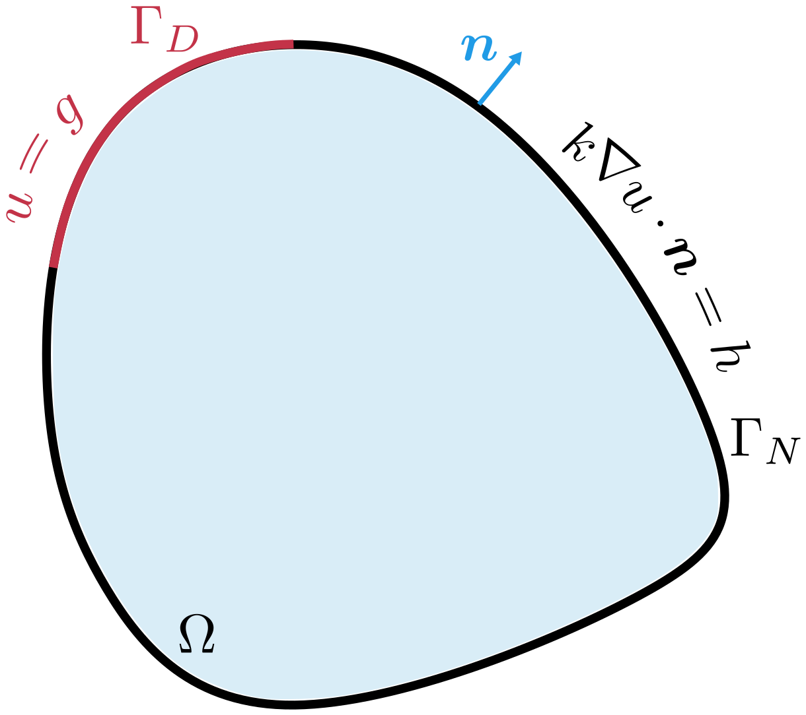

# Partial Differential Equations and Variational Formulations {#sec-variational}

```{=latex}
\chaptershorttitle{Variational Formulations}
```

A finite element approximation begins with a variational problem. The
variational problem is obtained from a boundary-value problem by introducing
test functions, integrating over the domain, and transferring derivatives by
integration by parts. This process also determines how the boundary conditions
enter the formulation and which function spaces contain the unknown and the
test functions.

Chapter 2 introduced the mathematical objects needed for this construction.
This chapter uses them to develop the formulation procedure for a scalar
diffusion problem. The same procedure will be applied to heat conduction and
solid mechanics in Chapter 4.

## Boundary-value problems and variational statements {#sec-variational-boundary-value-problems}

A boundary-value problem specifies a domain, an unknown field, a differential
equation in the domain, and conditions on the boundary. Its data include the
coefficients and source terms in the equation and the values or fluxes
prescribed on the boundary. All of these items are part of the mathematical
problem.

### Strong form and solution terminology

The differential equation together with its boundary conditions is called the
**strong form** of the boundary-value problem. In this book, a **strong
solution**, or **classical solution**, has enough pointwise differentiability
to satisfy that equation and its boundary conditions in the classical sense.
The required regularity depends on the differential operator and the
coefficients.

Many finite element functions are continuous across cell boundaries but do not
have the classical second derivatives required by a second-order differential
equation. The variational formulation reduces the required derivative order
and leads to the definition of a weak solution.

```{=latex}
\Needspace{32\baselineskip}
```

### Abstract strong and variational problems

Let $\mathcal{L}$ be a differential operator that may depend linearly or
nonlinearly on $u$. Two examples are

$$
\mathcal{L}(u)(\bx)=-\Delta u(\bx)
\quad\text{(linear)},
\qquad
\mathcal{L}(u)(\bx)=-\Delta u(\bx)+\sin\bigl(u(\bx)\bigr)
\quad\text{(nonlinear)}.
$$

In above $\Delta$ is the Laplacian and is defined as $\Delta u(\bx) = \nabla \cdot (\nabla u(\bx))$.

Suppose $\partial\Om$ is divided into two portions, $\Gam_D$ and $\Gam_N$,
and let $\bm q(u)$ denote the flux associated with the differential equation.
The abstract strong problem is

$$
\left.
\begin{aligned}
\mathcal{L}(u)(\bx)&=f(\bx)
&&\forall\bx\in\Om,\\
u(\bx)&=g(\bx)
&&\forall\bx\in\Gam_D,\\
\bm q(u)(\bx)\cdot\bn(\bx)&=h(\bx)
&&\forall\bx\in\Gam_N.
\end{aligned}
\right\}
\qquad\text{Strong form}
$$ {#eq-variational-abstract-strong}

The second equation prescribes the value of $u$ on $\Gam_D$. The third
prescribes the component of the flux normal to the boundary on $\Gam_N$,
where $\bn(\bx)$ is the outward unit normal at $\bx\in\partial\Om$.

The corresponding abstract variational problem uses a trial space
$\mathcal U_g$ and a test space $\mathcal V_0$:

$$
\left.
\begin{aligned}
&\text{Find }u\in\mathcal U_g\text{ such that}\\
&a(u;v)=\ell(v)
\qquad\forall v\in\mathcal V_0.
\end{aligned}
\right\}
\qquad\text{Variational form}
$$ {#eq-variational-abstract-weak-problem}

The trial space $\mathcal U_g$ contains functions satisfying $u=g$ on
$\Gam_D$, and the test space $\mathcal V_0$ contains functions satisfying
$v=0$ on $\Gam_D$. We next explain how the variational form follows from the
strong form.

For a candidate field $u$, define the residual at $\bx\in\Om$ by

$$
R(u)(\bx)=\mathcal{L}(u)(\bx)-f(\bx).
$$

A strong solution satisfies

$$
R(u)(\bx)=0
\qquad\forall\bx\in\Om.
$$

Multiplying this equation by a weighting function $v(\bx)$ and integrating
over $\Om$ gives

$$
\int_{\Om}v(\bx)R(u)(\bx)\,\dx=0.
$$ {#eq-variational-weighted-residual-general}

This is a **weighted residual statement**. The weighting function becomes the
test function in the variational problem. Requiring
@eq-variational-weighted-residual-general for one function $v$ would give only
one scalar condition. It must hold for every function in a specified test
space.

For a second-order equation, integration by parts transfers one derivative
from the candidate field to the test function and introduces boundary terms.
After the prescribed normal flux $h$ is substituted on $\Gam_N$, the resulting
equation has the form stated in @eq-variational-abstract-weak-problem. The form
$a$ contains the terms involving the unknown, while $\ell$ contains the
prescribed source $f$ and flux $h$.

If $\mathcal L$ and the flux $\bm q$ depend linearly on $u$, then $a$ is
bilinear and is written $a(u,v)$. If $\mathcal L$ or $\bm q$ depends
nonlinearly on $u$, then $a$ is generally nonlinear in the trial argument but
remains linear in the test argument. It is written $a(u;v)$ and is semilinear
in the sense of @def-semilinear-form. The semicolon identifies the argument in
which nonlinear dependence is allowed.

::: {#rem-variational-identity-problem}
## Weak identity and variational problem
An integral equation alone does not define a variational problem. The spaces
containing the unknown and the test functions determine the boundary values,
regularity, and admissible variations. They are part of the formulation.
:::

@fig-variational-formulation-process summarizes the steps. Each arrow represents
a mathematical operation or choice that must be stated in the formulation.

{#fig-variational-formulation-process width="60%" fig-align="center"}

## Canonical scalar diffusion problem {#sec-variational-model-problem}

We now carry out the complete procedure for a scalar diffusion equation. The
problem is used here as a mathematical prototype. Chapter 4 develops its heat
conduction interpretation from the corresponding physical balance law.

### Strong boundary-value problem

Let $\Om\subset\R^d$ be a bounded Lipschitz domain. Let $\Gam_D$ and
$\Gam_N$ be disjoint portions that are open relative to $\partial\Om$ and
whose closures cover the boundary:

$$
\partial\Om=\overline{\Gam_D}\cup\overline{\Gam_N},
\qquad
\Gam_D\cap\Gam_N=\varnothing.
$$ {#eq-variational-boundary-partition}

Assume that the interface
$\overline{\Gam_D}\cap\overline{\Gam_N}$ has boundary measure zero and that
$\Gam_D$ has positive boundary measure. The partition and the outward unit
normal are shown schematically in @fig-variational-boundary-partition.

{#fig-variational-boundary-partition width="40%" fig-align="center"}

Consider

$$
\bigl[-\divg(k\grad u)\bigr](\bx)=f(\bx)
\qquad\forall\bx\in\Om,
$$ {#eq-variational-strong-pde}

with boundary conditions

$$
u(\bx)=g(\bx)
\quad\forall\bx\in\Gam_D,
\qquad
k(\bx)\grad u(\bx)\cdot\bn(\bx)=h(\bx)
\quad\forall\bx\in\Gam_N.
$$ {#eq-variational-boundary-data}

The condition on $\Gam_D$ prescribes the value of $u$. The condition on
$\Gam_N$ prescribes the component of $k\grad u$ normal to the boundary, which
we call the normal flux for this prototype problem.

In the integral equations below, the explicit dependence on $\bx$ is
suppressed. Thus, for example, $k\grad u$ denotes the vector field
$\bx\mapsto k(\bx)\grad u(\bx)$.

To interpret this problem classically, suppose first that the boundary and the
data are sufficiently smooth and compatible. For example, take
$k\in C^1(\overline{\Om})$ with $k(\bx)\geq k_0>0$,
$f\in C(\overline{\Om})$, and smooth boundary data $g$ and $h$, and suppose
that a solution $u\in C^2(\Om)\cap C^1(\overline{\Om})$ exists. Then the
quantities in @eq-variational-strong-pde and @eq-variational-boundary-data are
defined at every stated point, and the equations can be imposed in the
classical sense.

These regularity assumptions need not hold in applications. A material
coefficient may be discontinuous, and source and flux data may have limited
regularity. We therefore replace the classical assumptions by

$$
k\in L^\infty(\Om),
\qquad
0<k_0\leq k(\bx)\leq k_1<\infty
\quad\text{for almost every }\bx\in\Om,
$$ {#eq-variational-coefficient-bounds}

and let $f\in L^2(\Om)$ and $h\in L^2(\Gam_N)$. We also assume that there is
at least one function $u_g\in H^1(\Om)$ with boundary value $g$ on $\Gam_D$.
This last assumption ensures that the trial space introduced below is nonempty.

Under these weaker assumptions, a solution need not belong to $C^2(\Om)$, and
@eq-variational-strong-pde need not be meaningful at every $\bx\in\Om$. We
therefore seek a weak solution defined by an integral equation.

### Weighted residual and integration by parts {#sec-variational-derivation}

Begin with a smooth weighting function $v$ satisfying

$$
v(\bx)=0
\qquad\forall\bx\in\Gam_D.
$$

Multiplication of @eq-variational-strong-pde by $v$ and integration over
$\Om$ gives

$$
-\int_{\Om}v\,\divg(k\grad u)\,\dx
-\int_{\Om}fv\,\dx=0.
$$ {#eq-variational-weighted-residual}

Equivalently,

$$
-\int_{\Om}v\,\divg(k\grad u)\,\dx
=\int_{\Om}fv\,\dx.
$$

Apply Green's formula in @eq-foundations-green-scalar with the vector field
$k\grad u$. The complete identity is

$$
\int_{\Om}k\grad u\cdot\grad v\,\dx
-\int_{\partial\Om}v\,k\grad u\cdot\bn\,\ds
=\int_{\Om}fv\,\dx.
$$ {#eq-variational-after-parts}

Using the boundary partition in @eq-variational-boundary-partition, the
boundary contribution is

$$
-\int_{\partial\Om}v\,k\grad u\cdot\bn\,\ds = -\int_{\Gam_D}v\,k\grad u\cdot\bn\,\ds
-\int_{\Gam_N}v\,k\grad u\cdot\bn\,\ds.
$$

The first integral is zero because $v=0$ on $\Gam_D$. On $\Gam_N$, substitute
$k\grad u\cdot\bn=h$. Equation @eq-variational-after-parts then becomes

$$
\int_{\Om}k\grad u\cdot\grad v\,\dx
=\int_{\Om}fv\,\dx+\int_{\Gam_N}hv\,\ds.
$$ {#eq-variational-diffusion-weak}

The highest derivative of $u$ in this identity is its first derivative. This
reduction from second to first derivatives determines the appropriate function
space for the formulation.

### Trial and test spaces {#sec-variational-spaces}

We now choose the space containing the solution, called the **trial space**, and
the space containing the weighting functions, called the **test space**. They
must be chosen so that every term in @eq-variational-diffusion-weak is well
defined; in particular, each integral must be finite for the assumed $k$, $f$,
and $h$.

By the $p=q=2$ case of the Hölder inequality in
@thm-foundations-holder-inequality, the source term satisfies

$$
\left|\int_{\Om}fv\,\dx\right|
\leq \norm{f}_{L^2(\Om)}\norm{v}_{L^2(\Om)}.
$$ {#eq-variational-source-bound}

Thus the source term is finite when $v\in L^2(\Om)$. For the left-hand side,
the upper bound on $k$ in @eq-variational-coefficient-bounds and another
application of Hölder give

$$
\left|\int_{\Om}k\grad u\cdot\grad v\,\dx\right|
\leq
\norm{k}_{L^\infty(\Om)}
\norm{\grad u}_{[L^2(\Om)]^d}
\norm{\grad v}_{[L^2(\Om)]^d}.
$$ {#eq-variational-bilinear-bound-preliminary}

Consequently, $u$ and $v$ should have first-order weak derivatives in
$[L^2(\Om)]^d$. Combining this requirement with $u,v\in L^2(\Om)$ gives
$u,v\in H^1(\Om)$. The Neumann term is also finite for such test functions.
Indeed, Hölder on $\Gam_N$ and the trace inequality
@thm-foundations-trace-inequality give

$$
\left|\int_{\Gam_N}hv\,\ds\right|
\leq
\norm{h}_{L^2(\Gam_N)}\norm{v}_{L^2(\Gam_N)}
\leq
C_{\mathrm{tr}}\norm{h}_{L^2(\Gam_N)}\norm{v}_{H^1(\Om)}.
$$ {#eq-variational-neumann-bound}

The derivation of @eq-variational-diffusion-weak additionally requires the test
function to vanish on $\Gam_D$. We therefore choose

$$
\Vzero
=\{v\in H^1(\Om):v=0\text{ on }\Gam_D\}
=H^1_{0,\Gam_D}(\Om)
$$ {#eq-variational-test-space}

as the test space. The solution must instead satisfy the prescribed value
$u=g$ on $\Gam_D$, which gives the trial space

$$
\Ug
=\{w\in H^1(\Om):w=g\text{ on }\Gam_D\}.
$$ {#eq-variational-trial-space}

The boundary-value notation uses the convention introduced in
@rem-foundations-boundary-value-convention.

The space $\Vzero$ is a vector space. Because the boundary-value mapping is
continuous, the functions with zero boundary value on $\Gam_D$ form a closed
subspace of $H^1(\Om)$. Thus $\Vzero$ is a Hilbert space with the $H^1$ inner
product and norm. When $g\ne0$, however, $\Ug$ does not contain the zero function
and is not a vector space; more precisely, it is an affine space of the form
$u_g+\Vzero$.

With these spaces specified, the weak formulation is to find $u\in\Ug$ such
that

$$
\int_{\Om}k\grad u\cdot\grad v\,\dx
=\int_{\Om}fv\,\dx+\int_{\Gam_N}hv\,\ds
\qquad\forall v\in\Vzero.
$$ {#eq-variational-weak-with-spaces}

### Variational problem

In @eq-variational-weak-with-spaces, the left-hand side depends on both $u$ and
$v$, whereas the right-hand side depends only on $v$. This structure leads
naturally to a bilinear form $a$ and a linear functional $\ell$, defined by

$$
a(w,v)=\int_{\Om}k\grad w\cdot\grad v\,\dx,
\qquad
\ell(v)=\int_{\Om}fv\,\dx+\int_{\Gam_N}hv\,\ds.
$$ {#eq-variational-forms}

::: {#def-weak-diffusion-problem}
## Variational diffusion problem
Find $u\in\Ug$ such that

$$
a(u,v)=\ell(v)
\qquad\forall v\in\Vzero.
$$ {#eq-variational-abstract-diffusion}
:::

A function $u\in\Ug$ that satisfies this problem is a **weak solution** of the
boundary-value problem. No mesh or finite-dimensional approximation has been
introduced. Both $\Ug$ and $\Vzero$ remain infinite dimensional.

The notation also displays the general structure of a variational problem. If
$\mathcal{U}$ is a trial space, $\mathcal{V}$ is a test space,
$a:\mathcal{U}\times\mathcal{V}\to\R$, and
$\ell:\mathcal{V}\to\R$, the problem is to find $u\in\mathcal{U}$ such that
$a(u,v)=\ell(v)$ for every $v\in\mathcal{V}$. The spaces and the two forms must
be specified for each problem.

::: {#exm-variational-one-dimensional-diffusion}
## A one-dimensional variational problem
Let $\Om=(0,1)$ and consider

$$
-u''(x)=1
\qquad 0<x<1,
$$

with boundary conditions

$$
u(0)=0,
\qquad
u'(1)=0.
$$

The trial and test spaces are the same in this homogeneous problem:

$$
\Ug=\Vzero=\{v\in H^1(0,1):v(0)=0\}.
$$

Multiplying the differential equation by $v\in\Vzero$ and integrating by
parts gives

$$
\int_0^1u'v'\,\dd x-[vu']_0^1=\int_0^1v\,\dd x.
$$

The endpoint term is zero: $v(0)=0$ at the Dirichlet endpoint and $u'(1)=0$
at the Neumann endpoint. The variational problem is therefore

$$
\text{find }u\in\Ug\text{ such that}\qquad
\int_0^1u'v'\,\dd x=\int_0^1v\,\dd x
\quad\forall v\in\Vzero.
$$

The classical solution is $u(x)=x-\tfrac12x^2$. Since $u'(x)=1-x$,

$$
\int_0^1u'v'\,\dd x
=\int_0^1(1-x)v'\,\dd x
=[(1-x)v]_0^1+\int_0^1v\,\dd x
=\int_0^1v\,\dd x,
$$

where $v(0)=0$. Thus the classical solution also satisfies the variational
problem.
:::

::: {#exr-variational-homogeneous-dirichlet}
## Diffusion with a fully Dirichlet boundary
Set $\Gam_D=\partial\Om$ and prescribe $u=0$ on $\partial\Om$.

1. State the trial and test spaces.
2. Starting from @eq-variational-after-parts, identify the boundary integral
   that vanishes and state why it is zero.
3. State the resulting bilinear form, linear functional, and variational
   problem.
:::

### Essential, natural, and Robin boundary conditions {#sec-variational-boundary-conditions}

The condition $u=g$ on $\Gam_D$ is called an **essential boundary condition**
because it is imposed through membership in $\Ug$. The corresponding test
function has the homogeneous value $v=0$ on $\Gam_D$.

The condition $k\grad u\cdot\bn=h$ on $\Gam_N$ is called a **natural boundary
condition** because it enters through the boundary integral produced by
integration by parts. It contributes to $\ell(v)$ but does not restrict the
test functions on $\Gam_N$. The terms essential and natural describe how the
conditions enter the variational problem; they do not rank their physical
importance.

A Robin condition combines the unknown and its normal flux. If

$$
k(\bx)\grad u(\bx)\cdot\bn(\bx)
+\beta(\bx)u(\bx)=r(\bx)
\qquad\forall\bx\in\Gam_N,
$$

then $k\grad u\cdot\bn=r-\beta u$. Substitution into
@eq-variational-after-parts gives

$$
\int_{\Om}k\grad u\cdot\grad v\,\dx
+\int_{\Gam_N}\beta uv\,\ds
=\int_{\Om}fv\,\dx+\int_{\Gam_N}rv\,\ds.
$$ {#eq-variational-robin-weak}

Thus the term containing the unknown $u$ belongs to the bilinear form, while
the prescribed datum $r$ belongs to the linear functional.

::: {#exr-variational-robin-boundary}
## A Robin boundary condition
Assume $\beta\in L^\infty(\Gam_N)$ with $\beta\geq0$ almost everywhere and
$r\in L^2(\Gam_N)$. For the Robin condition above:

1. derive @eq-variational-robin-weak from @eq-variational-after-parts;
2. state the trial and test spaces;
3. state the complete bilinear form and linear functional.
:::

::: {#rem-variational-pure-neumann}
## When only flux is prescribed
If $\Gam_D$ is empty, the boundary condition prescribes only the flux. This is
called a **pure Neumann problem**. Adding a constant $c$ to $u$ does not change
$\grad u$, so $u$ and $u+c$ satisfy the same differential equation and flux
condition. The solution is therefore not unique unless its constant value is
fixed in some other way.

The prescribed data must also satisfy a compatibility condition. Set
$\Gam_N=\partial\Om$ and $v=1$ in
@eq-variational-weak-with-spaces. Because $\grad v=0$, the equation gives

$$
\int_{\Om}f\,\dx+\int_{\partial\Om}h\,\ds=0.
$$

When this condition holds, a requirement such as
$\int_{\Om}u\,\dx=0$ selects one solution. In the problem considered above,
$\Gam_D$ has positive boundary measure and the prescribed value on $\Gam_D$
fixes the additive constant.
:::

## Weak solutions and the differential problem {#sec-variational-strong-weak}

The derivation above proves one implication directly: any sufficiently smooth
solution of the strong boundary-value problem satisfies the variational
problem. We now establish the reverse implication under classical regularity.

Let $u\in\Ug$ satisfy the variational problem
@eq-variational-weak-with-spaces. Assume that $u$, $k$, and the data have enough
regularity for $\divg(k\grad u)$ to be continuous in $\Om$ and for integration
by parts to hold classically. To recover the differential equation at points
inside $\Om$, choose a test function $v\in C_0^\infty(\Om)$ as defined in
@def-foundations-test-functions. Because $v$ is zero near $\partial\Om$,
integration by parts produces no boundary contribution, and
@eq-variational-weak-with-spaces gives

$$
\int_{\Om}
\bigl[-\divg(k\grad u)-f\bigr]v\,\dx=0
\qquad\forall v\in C_0^\infty(\Om).
$$

By the fundamental lemma @thm-foundations-fundamental-lemma, the expression
$-\divg(k\grad u)-f$ is zero almost everywhere. This expression is continuous
under the regularity assumed above, so it is zero at every point in $\Om$.
Hence

$$
\bigl[-\divg(k\grad u)\bigr](\bx)=f(\bx)
\qquad\forall\bx\in\Om.
$$

This is the differential equation @eq-variational-strong-pde in pointwise
form. Substituting it into the integration-by-parts identity for a general
$v\in\Vzero$ gives

$$
\int_{\Gam_N}v
\bigl(k\grad u\cdot\bn-h\bigr)\,\ds=0.
$$

No value is prescribed for $v$ on $\Gam_N$, so the boundary value of $v$ can
be varied there. Under classical boundary regularity, the identity therefore
implies

$$
k(\bx)\grad u(\bx)\cdot\bn(\bx)=h(\bx)
\qquad\forall\bx\in\Gam_N.
$$

The condition $u=g$ on $\Gam_D$ already follows from $u\in\Ug$. Thus the weak
solution satisfies the differential equation at every point in $\Om$ and both
boundary conditions when the required classical regularity is available.
Without this regularity, @eq-variational-abstract-diffusion remains meaningful
and defines the weak solution [@suli2012; @larson-bengzon2010].

::: {#exm-variational-discontinuous-coefficient}
## A weak solution with a discontinuous coefficient
Let $\Om=(0,1)$, prescribe $u(0)=0$ and $u(1)=1$, and set

$$
k(x)=
\begin{cases}
1, & 0<x<\tfrac12,\\
2, & \tfrac12<x<1.
\end{cases}
$$

For $f=0$, define

$$
u(x)=
\begin{cases}
\dfrac43x, & 0\leq x\leq\tfrac12,\\[0.4em]
\dfrac23+\dfrac23\left(x-\tfrac12\right),
& \tfrac12\leq x\leq1.
\end{cases}
$$

The function $u$ is continuous and belongs to $H^1(0,1)$, but its derivative
jumps at $x=1/2$. The test space is

$$
H_0^1(0,1)
=\{v\in H^1(0,1):v(0)=v(1)=0\}.
$$

Here the subscript $0$ indicates that $v=0$ on the entire boundary
$\partial\Om=\{0,1\}$. On both subintervals, $ku'=4/3$. Therefore, for every
$v\in H_0^1(0,1)$,

$$
\int_0^1ku'v'\,\dd x
=\frac43\int_0^1v'\,\dd x
=\frac43[v(1)-v(0)]=0.
$$

The right-hand side of @eq-variational-weak-with-spaces is zero because
$f=0$ and $\Gam_N$ is empty. Thus $u$ satisfies
@eq-variational-weak-with-spaces with $\Gam_D=\partial\Om$. This example shows
why continuity of the flux $ku'$, rather than continuity of $u'$, is the
relevant interface condition for this diffusion problem.
:::

## Well-posedness and stability {#sec-variational-well-posedness}

We now ask whether the variational problem has a unique solution and whether
that solution depends continuously on $f$ and $h$. For this discussion, assume
$g=0$. The trial and test spaces are then the same Hilbert space,
$\Ug=\Vzero$, equipped with the $H^1(\Om)$ norm, and the problem is

$$
\text{find }u\in\Vzero\text{ such that}\qquad
a(u,v)=\ell(v)
\quad\forall v\in\Vzero.
$$ {#eq-variational-homogeneous-dirichlet-problem}

The Lax--Milgram theorem @thm-lax-milgram gives existence, uniqueness, and a
stability estimate for a problem of this form once we verify that $a$ is
continuous and coercive and that $\ell$ is a continuous linear functional.
We verify these three requirements next.

For $w,v\in\Vzero$, the bilinear form is

$$
a(w,v)=\int_{\Om}k\grad w\cdot\grad v\,\dx.
$$

The coefficient upper bound in @eq-variational-coefficient-bounds and the
Cauchy--Schwarz inequality @thm-foundations-cauchy-schwarz give

$$
\begin{aligned}
|a(w,v)|
&=\left|\int_{\Om}k\grad w\cdot\grad v\,\dx\right|\\
&\leq k_1
\norm{\grad w}_{[L^2(\Om)]^d}
\norm{\grad v}_{[L^2(\Om)]^d}\\
&\leq k_1
\norm{w}_{H^1(\Om)}
\norm{v}_{H^1(\Om)}.
\end{aligned}
$$ {#eq-variational-continuity}

Thus the bilinear form $a$ is continuous on $\Vzero\times\Vzero$ according to
@def-continuous-bilinear-form, with continuity constant $M=k_1$.

For $v\in\Vzero$, the coefficient lower bound and the Poincare inequality
@thm-foundations-poincare-inequality give

$$
\begin{aligned}
a(v,v)
&=\int_{\Om}k|\grad v|^2\,\dx\\
&\geq k_0\norm{\grad v}_{[L^2(\Om)]^d}^2\\
&\geq
\frac{k_0}{1+C_P^2}
\norm{v}_{H^1(\Om)}^2
\qquad\forall v\in\Vzero.
\end{aligned}
$$ {#eq-variational-coercivity}

Therefore the bilinear form $a$ is coercive on $\Vzero$ according to
@def-coercive-bilinear-form, with coercivity constant
$\alpha=k_0/(1+C_P^2)$. The positive-measure assumption on $\Gam_D$ is needed
here because it is one of the hypotheses of the Poincare inequality.

For the linear functional $\ell$, the Cauchy--Schwarz inequality and the trace
inequality @thm-foundations-trace-inequality give

$$
\begin{aligned}
|\ell(v)|
&\leq
\norm{f}_{L^2(\Om)}\norm{v}_{L^2(\Om)}
+\norm{h}_{L^2(\Gam_N)}\norm{v}_{L^2(\Gam_N)}\\
&\leq
\left(
\norm{f}_{L^2(\Om)}
+C_{\mathrm{tr}}\norm{h}_{L^2(\Gam_N)}
\right)
\norm{v}_{H^1(\Om)}.
\end{aligned}
$$ {#eq-variational-load-continuity}

The characterization in @thm-continuous-linear-functional shows that $\ell$ is
continuous on $\Vzero$ and hence belongs to the dual space $\Vzero^*$.

All hypotheses of the Lax--Milgram theorem @thm-lax-milgram are now satisfied.
Therefore @eq-variational-homogeneous-dirichlet-problem has a unique weak
solution $u\in\Vzero$. The stability estimate supplied by the theorem is

$$
\norm{u}_{H^1(\Om)}
\leq
\frac{1}{\alpha}
\left(
\norm{f}_{L^2(\Om)}
+C_{\mathrm{tr}}\norm{h}_{L^2(\Gam_N)}
\right).
$$ {#eq-variational-stability}

The case $g\ne0$ requires an additional step because $\Ug$ is an affine set,
not the Hilbert space used in @thm-lax-milgram. We defer that construction to
the treatment of nonhomogeneous finite element boundary data in Chapter 5.

::: {#exr-variational-well-posedness-estimates}
## Estimates for the diffusion problem

1. Prove @eq-variational-continuity using the coefficient upper bound and the
   Cauchy--Schwarz inequality @thm-foundations-cauchy-schwarz.
2. Prove @eq-variational-coercivity using the coefficient lower bound and the
   Poincare inequality @thm-foundations-poincare-inequality.
3. Prove @eq-variational-load-continuity using the Cauchy--Schwarz inequality
   and the trace inequality @thm-foundations-trace-inequality.
4. Use the three estimates to derive @eq-variational-stability.
5. Explain which step fails for the pure Neumann problem when constants remain
   in the test space.
:::

## Energy minimization and first variation {#sec-variational-energy}

The variational diffusion problem was derived directly from the strong problem
by multiplying the differential equation by a test function and integrating
by parts. No energy functional was required.

We now show that the particular variational problem in
@def-weak-diffusion-problem, where $a(u,v)$ and $\ell(v)$ are defined in
@eq-variational-forms, can be obtained from an energy functional. Whenever
this is possible, we say that the problem has an energy structure. We show
that:

1. the variational equation is the stationarity condition of an energy
   functional; and
2. because the diffusion form is symmetric and coercive, the weak solution is
   the unique minimizer of that energy.

Return to the general trial space $\Ug$, which may include nonzero essential
boundary data. Define

$$
\Pi(z)=\frac12a(z,z)-\ell(z),
\qquad z\in\Ug.
$$ {#eq-variational-energy}

The quadratic term is the field contribution, and $\ell(z)$ is the
contribution from the prescribed data. We call their difference the total
energy functional for this prototype problem. Its physical interpretation
depends on the governing model; Chapter 4 develops that interpretation for
heat conduction and solid mechanics.

Let $u\in\Ug$. A permissible variation must preserve the prescribed boundary
value. Therefore, if $v\in\Vzero$, then $u+\epsilon v\in\Ug$ for every scalar
$\epsilon$. Indeed, $v=0$ on $\Gam_D$, so $u+\epsilon v=g$ on $\Gam_D$.
Symmetry and bilinearity give

$$
\Pi(u+\epsilon v)-\Pi(u)
=\epsilon\bigl(a(u,v)-\ell(v)\bigr)
+\frac{\epsilon^2}{2}a(v,v).
$$ {#eq-variational-energy-expansion}

Using the definition of first variation in @def-directional-derivative, divide
the preceding equation by $\epsilon$ and take the limit as $\epsilon\to0$.
The first variation of the energy functional is

$$
\delta\Pi(u;v)
=a(u,v)-\ell(v).
$$ {#eq-variational-first-variation}

A stationary point is one at which the first variation is zero in every
permissible direction. This condition alone does not distinguish a minimum
from a maximum. The stationarity condition for $\Pi$ is

$$
\delta\Pi(u;v)=0
\qquad\forall v\in\Vzero.
$$ {#eq-variational-energy-stationarity}

The above is exactly the variational equation
$a(u,v)=\ell(v)$ for every $v\in\Vzero$. Thus the variational problem can be
obtained by taking the first variation of $\Pi$ and setting it to zero.

Now suppose that $u$ satisfies
$\delta\Pi(u;v)=0$ for every $v\in\Vzero$. For any $v\in\Vzero$, set
$\epsilon=1$ in @eq-variational-energy-expansion. Then

$$
\Pi(u+v)-\Pi(u)
=\bigl(a(u,v)-\ell(v)\bigr)+\frac{1}{2}a(v,v)
=\frac{1}{2}a(v,v).
$$ {#eq-variational-minimum-difference}

Coercivity implies that $a(v,v)>0$ for every nonzero $v\in\Vzero$, while
$a(0,0)=0$. Therefore, @eq-variational-minimum-difference is positive for
every nonzero permissible variation. It follows that $u$ is the unique
minimizer of $\Pi$ over $\Ug$.

::: {#rem-nonequivalence-energy-variational-problem}
## Variational problem is more general

A variational
form can be derived from a strong differential equation through a weighted
residual statement and integration by parts without introducing an energy. An energy formulation requires a functional $\Pi$ whose first variation
reproduces the variational equation:

$$
\delta\Pi(u;v)=a(u;v)-\ell(v).
$$ {#eq-variational-energy-existence-condition}

Such a functional need not exist. For example, consider the case when a bilinear form $a$ is not symmetric. Take $J(u) := (1/2)a(u,u)$. It's first variation is 

$$
\delta J(u;v)
=\frac12\bigl(a(u,v)+a(v,u)\bigr),
$$

which does not reproduce $a(u,v)$ unless $a(u,v) = a(v,u)$, i.e., unless $a$ is symmetric.
Similarly, a nonlinear semilinear form $a(u;v)$ admits an energy formulation
only when it is the first variation of some scalar functional. Therefore the
variational formulation is more general than energy minimization. When a
suitable energy exists and has the required convexity, the variational problem
and energy minimization give the same solution [@jog].
:::

::: {#rem-guaranteed-energy-variational-problem}
## Energy functional for a symmetric bilinear form

Suppose that $a$ is a symmetric bilinear form and $\ell$ is a linear
functional. Then

$$
\Pi(z)=\frac12a(z,z)-\ell(z)
$$

has first variation $\delta\Pi(u;v)=a(u,v)-\ell(v)$. Its stationarity
condition is therefore equivalent to the variational equation
$a(u,v)=\ell(v)$ for every $v\in\Vzero$. Symmetry provides this energy
structure; positive definiteness or coercivity is additionally needed to
conclude that the stationary point is a unique minimizer.

:::


::: {#exr-variational-energy-variation}
## First variation and the minimum property

1. Starting from @eq-variational-energy, derive @eq-variational-energy-expansion.
2. Divide the expansion by $\epsilon$ and compute
   $\delta\Pi(u;v)$ from the definition of the first variation.
3. Show that a minimizer of $\Pi$ satisfies
   @eq-variational-energy-stationarity and hence the variational problem.
4. Assume that $u$ satisfies the variational problem and derive @eq-variational-minimum-difference.
5. Use coercivity to prove that $u$ is the unique minimizer of $\Pi$ over
   $\Ug$.
:::

```{=latex}
\Needspace{24\baselineskip}
```

## A nonlinear problem and its semilinear form {#sec-variational-nonlinear-example}

The scalar diffusion problem above is linear in $u$ and leads to the bilinear
form $a(u,v)$. For comparison, consider the nonlinear problem

$$
\left.
\begin{aligned}
-\Delta u(\bx)+\sin\bigl(u(\bx)\bigr)&=f(\bx)
&&\forall\bx\in\Om,\\
u(\bx)&=0
&&\forall\bx\in\partial\Om.
\end{aligned}
\right\}
\qquad\text{Strong form}
$$ {#eq-variational-nonlinear-reaction-strong}

Assume that $\Om$ is bounded and $f\in L^2(\Om)$. Multiplication by
$v\in H_0^1(\Om)$ and integration by parts give

$$
\int_{\Om}\grad u\cdot\grad v\,\dx
+\int_{\Om}(\sin u)v\,\dx
=\int_{\Om}fv\,\dx.
$$

Define

$$
a(u;v)
=\int_{\Om}\grad u\cdot\grad v\,\dx
+\int_{\Om}(\sin u)v\,\dx,
\qquad
\ell(v)=\int_{\Om}fv\,\dx.
$$ {#eq-variational-nonlinear-reaction-forms}

The corresponding variational problem is

$$
\left.
\begin{aligned}
&\text{Find }u\in H_0^1(\Om)\text{ such that}\\
&a(u;v)=\ell(v)
\qquad\forall v\in H_0^1(\Om).
\end{aligned}
\right\}
\qquad\text{Variational form}
$$ {#eq-variational-nonlinear-reaction-weak}

The form $a(u;v)$ is nonlinear in $u$ because of $\sin u$, but it is linear
in $v$. It is therefore semilinear. The reaction term is well defined because
$|\sin u|\leq1$, so $\sin u\in L^2(\Om)$ on a bounded domain.

## From the continuous problem to FEM {#sec-variational-to-fem}

The variational problem is still infinite dimensional. A conforming finite
element method for the homogeneous problem
@eq-variational-homogeneous-dirichlet-problem chooses a finite-dimensional
space $\Vh\subset\Vzero$. The discrete problem is

$$
\text{find }\uh\in\Vh\text{ such that}\qquad
a(\uh,\vh)=\ell(\vh)
\quad\forall\vh\in\Vh.
$$ {#eq-variational-galerkin-preview}

Chapter 4 supplies the continuum models to which this formulation will be
applied. Chapter 5 constructs the finite-dimensional spaces, explains how
homogeneous and nonhomogeneous boundary data are represented, and derives the
corresponding algebraic systems.

## Chapter summary {#sec-variational-key-ideas}

- A boundary-value problem specifies the differential equation, coefficients,
  sources, and boundary conditions on a stated domain.
- Integration by parts converts the weighted residual statement to a weak
  identity. The trial and test spaces complete the variational problem and
  determine how essential and natural boundary data enter it.
- A linear differential operator commonly produces a bilinear form. A
  nonlinear operator generally produces a semilinear form that is nonlinear in
  the trial argument and linear in the test argument.
- For homogeneous essential data, continuity and coercivity of the bilinear
  form and continuity of the load functional allow the Lax--Milgram theorem to
  establish existence, uniqueness, and stability.
- For symmetric diffusion, the variational equation is equivalent to energy
  minimization over the admissible affine space. An energy functional is
  additional structure and need not exist for a general variational problem.
