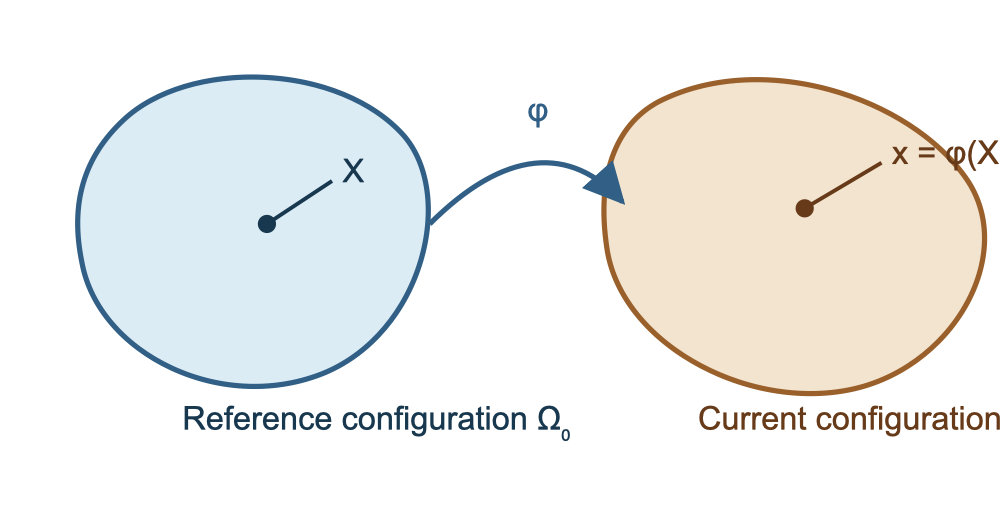

# Model Problems in Heat Transfer and Solid Mechanics {#sec-model-problems}

~~~{=latex}
\chaptershorttitle{Heat and Solid Mechanics}
~~~

Chapter 3 developed variational formulations using a scalar diffusion
equation. We now connect that mathematical prototype to physical models. The
first model is heat conduction, in which temperature is the unknown and the
flux is governed by Fourier's law. The second is deformation of an elastic
solid, in which displacement is the unknown and stress is governed by a
constitutive relation.

The models use the same sequence:

1. identify the body, unknown fields, and prescribed data;
2. state a balance law;
3. introduce constitutive equations;
4. prescribe boundary and, when needed, initial data; and
5. derive a variational problem.

Steady heat conduction and small-strain linear elasticity lead to bilinear
variational problems. Transient heat conduction adds a time derivative.
Finite-deformation elasticity leads to a nonlinear variational problem. These
continuous models will be discretized in Chapters 5, 10, and 11.

## Balance laws and constitutive equations {#sec-model-balance-laws}

A balance law accounts for the change of a physical quantity in an arbitrary
part of a body. For heat transfer, the quantity is thermal energy. For solid
mechanics, linear momentum is balanced. A balance law does not by itself
determine how heat flows or how a material develops stress. That information
is supplied by a **constitutive equation**.

The distinction is important. Conservation of energy applies to every
material considered here, but Fourier's law is a model for conductive heat
flux. Balance of momentum applies to every solid, but linear elasticity and
hyperelasticity describe different material responses and deformation
regimes.

::: {#rem-model-data-and-unknowns}
## Data must be distinguished from unknown fields
A model is not specified until its coefficients, sources, boundary data, and
initial data have been identified. For example, thermal conductivity is
prescribed in a heat-conduction problem, whereas temperature is solved for.
In elasticity, the constitutive parameters and applied loads are prescribed,
whereas displacement, strain, and stress are determined by the solution.
:::

## Heat conduction {#sec-model-heat}

Let a stationary body occupy a bounded Lipschitz domain
$\Om\subset\R^d$, where $d=1$, $2$, or $3$. Its temperature is denoted by
$T(\bx,t)$. The material quantities used below are:

- mass density $\rho>0$;
- specific heat capacity $c>0$;
- conductive heat-flux vector $\bq$; and
- volumetric heat supply $r$.

The product $\rho c$ is the heat capacity per unit volume. The vector
$\bq(\bx,t)$ points in the direction of heat flow, and
$\bq\cdot\bn$ is the rate of heat leaving the body per unit boundary area.
The source $r$ is positive when heat is supplied within the body.

### Energy balance and Fourier's law

Consider an arbitrary subdomain $\omega\subset\Om$. If $\rho$ and $c$ are
independent of temperature, the thermal energy stored in $\omega$, relative
to the chosen temperature scale, is

$$
\mathcal E_\omega(t)=\int_\omega \rho cT(\bx,t)\,\dx.
$$

The rate of stored energy equals the heat supplied inside $\omega$ minus the
heat leaving through its boundary:

$$
\frac{\dd}{\dd t}\int_\omega\rho cT\,\dx
=\int_\omega r\,\dx-\int_{\partial\omega}\bq\cdot\bn\,\ds.
$$ {#eq-model-heat-integral-balance}

Apply the Gauss divergence theorem
@cor-foundations-divergence to the boundary integral. Because
@eq-model-heat-integral-balance holds for every admissible subdomain,
localization gives

$$
\rho c\,\frac{\partial T}{\partial t}
+\divg\bq=r
\qquad\text{in }\Om.
$$ {#eq-model-heat-local-balance}

The balance equation contains two unknown fields, $T$ and $\bq$. Fourier's
law closes the model:

$$
\bq=-k\grad T.
$$ {#eq-model-fourier-law}

For an isotropic material, the conductivity $k$ is a positive scalar. The
minus sign states that conductive heat flows toward lower temperature. An
anisotropic material instead uses
$\bq=-\bm{K}\grad T$, where $\bm{K}$ is a symmetric positive-definite
second-order conductivity tensor. We use the isotropic form unless stated
otherwise.

Substitution into @eq-model-heat-local-balance gives

$$
\rho c\,\frac{\partial T}{\partial t}
-\divg(k\grad T)=r
\qquad\text{in }\Om.
$$ {#eq-model-transient-heat-equation}

This derivation follows the standard balance-law treatment of heat flow
[@arnold2018; @jog].

::: {#exr-model-heat-localization}
## From integral to local energy balance
Starting from @eq-model-heat-integral-balance:

1. use the Gauss divergence theorem to replace the boundary integral;
2. move all terms into one volume integral; and
3. state why requiring the result for every subdomain $\omega$ gives the
   local balance in @eq-model-heat-local-balance.
:::

### Boundary and initial data

Divide the boundary into disjoint portions
$\Gam_T$, $\Gam_q$, and $\Gam_R$, up to sets of boundary measure zero.
Three common thermal boundary conditions are

$$
\begin{aligned}
T&=\overline T &&\text{on }\Gam_T,\\
\bq\cdot\bn&=\overline q_n &&\text{on }\Gam_q,\\
\bq\cdot\bn&=h_c(T-T_\infty) &&\text{on }\Gam_R.
\end{aligned}
$$ {#eq-model-heat-boundary-conditions}

Here $\overline T$ is a prescribed temperature,
$\overline q_n$ is a prescribed **outward** heat flux, $h_c\geq0$ is a heat
transfer coefficient, and $T_\infty$ is an ambient temperature. Thus
$\overline q_n>0$ means that heat leaves the body. An insulated boundary is
the special case $\overline q_n=0$. The condition on $\Gam_R$ is a convection,
or Robin, condition.

Because $\bq=-k\grad T$, the prescribed-flux condition is

$$
-k\grad T\cdot\bn=\overline q_n
\qquad\text{on }\Gam_q.
$$ {#eq-model-heat-flux-gradient}

This sign differs from the generic datum $h$ in Chapter 3, where
$k\grad u\cdot\bn=h$. The two conventions are related by
$h=-\overline q_n$.

A transient problem also requires

$$
T(\bx,0)=T_0(\bx)
\qquad\forall\bx\in\Om.
$$ {#eq-model-heat-initial-condition}

The initial and prescribed boundary temperatures must be compatible wherever
they meet if a classical solution is sought.

### Steady heat conduction

At steady state, $\partial T/\partial t=0$. The strong problem is

$$
\left.
\begin{aligned}
-\divg(k\grad T)&=r &&\text{in }\Om,\\
T&=\overline T &&\text{on }\Gam_T,\\
-k\grad T\cdot\bn&=\overline q_n &&\text{on }\Gam_q,\\
-k\grad T\cdot\bn&=h_c(T-T_\infty) &&\text{on }\Gam_R.
\end{aligned}
\right\}
\qquad\text{Strong form}
$$ {#eq-model-steady-heat-strong}

Assume $k\in L^\infty(\Om)$ with
$0<k_0\leq k\leq k_1$ almost everywhere, $r\in L^2(\Om)$,
$\overline q_n\in L^2(\Gam_q)$, and suitable boundary data. Define

$$
\begin{aligned}
\mathcal U_{\overline T}
&=\{S\in H^1(\Om):S=\overline T\text{ on }\Gam_T\},\\
\mathcal V_0
&=\{v\in H^1(\Om):v=0\text{ on }\Gam_T\}.
\end{aligned}
$$ {#eq-model-heat-spaces}

Multiply the differential equation by $v\in\mathcal V_0$ and apply
integration by parts. The variational problem is

$$
\left.
\begin{aligned}
&\text{Find }T\in\mathcal U_{\overline T}\text{ such that}\\
&\int_{\Om}k\grad T\cdot\grad v\,\dx
+\int_{\Gam_R}h_cTv\,\ds\\
&\qquad
=\int_{\Om}rv\,\dx
-\int_{\Gam_q}\overline q_n v\,\ds
+\int_{\Gam_R}h_cT_\infty v\,\ds
\quad\forall v\in\mathcal V_0.
\end{aligned}
\right\}
\qquad\text{Variational form}
$$ {#eq-model-steady-heat-weak}

The negative sign multiplying $\overline q_n$ follows from defining it as an
outward flux. It also agrees with the global steady energy balance: internal
heat generation must equal the net outward heat flow.

Define

$$
\begin{aligned}
a_T(S,v)
&=\int_{\Om}k\grad S\cdot\grad v\,\dx
+\int_{\Gam_R}h_cSv\,\ds,\\
\ell_T(v)
&=\int_{\Om}rv\,\dx
-\int_{\Gam_q}\overline q_n v\,\ds
+\int_{\Gam_R}h_cT_\infty v\,\ds.
\end{aligned}
$$ {#eq-model-steady-heat-forms}

Then @eq-model-steady-heat-weak is
$a_T(T,v)=\ell_T(v)$ for every $v\in\mathcal V_0$. The form is symmetric. It
is coercive when temperature is prescribed on a boundary portion of positive
measure. A Robin boundary with $h_c>0$ on a portion of positive measure can
also remove the undetermined constant.

::: {#exm-model-one-dimensional-heat}
## Heat flux through a wall
Let $\Om=(0,L)$, let $k$ be constant, and assume $r=0$. Prescribe
$T(0)=T_0$ and an outward flux $\overline q_n$ at $x=L$. Then

$$
-(kT')'=0,\qquad
T(0)=T_0,\qquad
-kT'(L)=\overline q_n,
$$

and hence

$$
T(x)=T_0-\frac{\overline q_n}{k}x.
$$

When $\overline q_n>0$, heat leaves through $x=L$ and temperature decreases
in the positive $x$ direction.
:::

::: {#exr-model-steady-heat-form}
## Variational form with convection
For @eq-model-steady-heat-strong:

1. derive @eq-model-steady-heat-weak, showing every boundary term;
2. identify the terms that define $a_T$ and $\ell_T$; and
3. explain why the convection contribution containing $T$ belongs to
   $a_T$, whereas the contribution containing $T_\infty$ belongs to
   $\ell_T$.
:::

### Thermal potential for the steady problem

Because $a_T$ is symmetric, define

$$
\begin{aligned}
\Pi_T(S)
={}&\frac12\int_{\Om}k|\grad S|^2\,\dx
+\frac12\int_{\Gam_R}h_cS^2\,\ds
-\int_{\Om}rS\,\dx\\
&+\int_{\Gam_q}\overline q_nS\,\ds
-\int_{\Gam_R}h_cT_\infty S\,\ds,
\qquad S\in\mathcal U_{\overline T}.
\end{aligned}
$$ {#eq-model-thermal-potential}

For $v\in\mathcal V_0$,

$$
\delta\Pi_T(T;v)=a_T(T,v)-\ell_T(v).
$$

Thus stationarity gives @eq-model-steady-heat-weak. Under the coercivity
conditions above, the stationary temperature is the unique minimizer. The
functional $\Pi_T$ is a mathematical potential for steady conduction; it
should not be confused with the total thermal energy
$\int_\Om\rho cT\,\dx$ used in the physical energy balance.

### Transient heat conduction

For $t\in(0,t_f]$, the transient problem consists of
@eq-model-transient-heat-equation, the boundary conditions
@eq-model-heat-boundary-conditions, and the initial condition
@eq-model-heat-initial-condition. At each fixed time, use the same spatial
spaces as in @eq-model-heat-spaces. The spatial variational problem is

$$
\left.
\begin{aligned}
&\text{Find }T(t)\in\mathcal U_{\overline T}(t)\text{ such that}\\
&\int_{\Om}\rho c\,\frac{\partial T}{\partial t}v\,\dx
+a_T(T,v)=\ell_T(v)
\qquad\forall v\in\mathcal V_0,\\
&T(\bx,0)=T_0(\bx).
\end{aligned}
\right\}
\qquad\text{Spatial variational form}
$$ {#eq-model-transient-heat-weak}

The first integral is the **capacity term**. Equation
@eq-model-transient-heat-weak remains continuous in time; no time-stepping
method has been selected. Chapter 11 introduces temporal discretization.

::: {#rem-model-transient-mathematical-energy}
## A mathematical energy estimate
Suppose prescribed temperature is homogeneous, the remaining boundary is
insulated, and $r=0$. Choosing $v=T$ gives

$$
\frac{\dd}{\dd t}
\left(\frac12\int_{\Om}\rho cT^2\,\dx\right)
+\int_{\Om}k|\grad T|^2\,\dx=0
$$

when $\rho c$ is independent of time. This shows decay of a weighted
$L^2$ measure of temperature. It is not the physical thermal energy in
@eq-model-heat-integral-balance.
:::

::: {#exr-model-transient-heat}
## Spatial variational form of transient conduction
Starting from @eq-model-transient-heat-equation:

1. derive @eq-model-transient-heat-weak;
2. identify the capacity, conduction, source, prescribed-flux, and convection
   terms; and
3. explain why an initial condition is required for the transient problem.
:::

## Small-strain elasticity {#sec-model-linear-elasticity}

Let an elastic body occupy a bounded Lipschitz domain
$\Om\subset\R^d$ in its undeformed configuration. A material point initially
at $\bx$ moves to

$$
\bm{\varphi}(\bx)=\bx+\bu(\bx),
$$ {#eq-model-small-deformation-map}

where $\bu:\Om\to\R^d$ is displacement. Small-strain theory assumes that the
displacement gradient is sufficiently small for products of its components to
be neglected.

### Infinitesimal strain

The infinitesimal strain tensor is

$$
\beps(\bu)
=\operatorname{sym}\grad\bu
=\frac12\left(\grad\bu+(\grad\bu)^T\right),
\qquad
\varepsilon_{ij}(\bu)
=\frac12\left(u_{i,j}+u_{j,i}\right).
$$ {#eq-model-infinitesimal-strain}

The diagonal component $\varepsilon_{ii}$ measures extension in the
$\bm{e}_i$ direction. For $i\ne j$, $2\varepsilon_{ij}$ is engineering shear
strain in the $(\bm{e}_i,\bm{e}_j)$ plane. The skew-symmetric part of
$\grad\bu$ describes infinitesimal rotation and does not contribute to
$\beps$.

::: {#exm-model-affine-small-strain}
## Extension and simple shear
In two dimensions, let

$$
\bu(\bx)=
\begin{bmatrix}
\alpha x_1+\gamma x_2\\
0
\end{bmatrix}.
$$

Then

$$
\grad\bu=
\begin{bmatrix}
\alpha&\gamma\\
0&0
\end{bmatrix},
\qquad
\beps(\bu)=
\begin{bmatrix}
\alpha&\gamma/2\\
\gamma/2&0
\end{bmatrix}.
$$

Thus $\alpha$ is normal strain in the $\bm{e}_1$ direction and $\gamma$ is
engineering shear strain.
:::

### Stress, traction, and balance of momentum

The Cauchy stress tensor $\bsig(\bx)$ describes force per unit area in the
current configuration. The traction acting on a plane with unit normal $\bn$
is

$$
\bt(\bn)=\bsig\bn,
\qquad
t_i=\sigma_{ij}n_j.
$$ {#eq-model-cauchy-traction}

Balance of angular momentum gives $\bsig=\bsig^T$ in a classical continuum
without couple stresses. If $\bb$ is body force per unit mass and $\rho$ is
mass density, balance of linear momentum is

$$
\divg\bsig+\rho\bb
=\rho\frac{\partial^2\bu}{\partial t^2}.
$$ {#eq-model-linear-momentum}

For quasistatic loading, inertia is neglected:

$$
\divg\bsig+\rho\bb=\bm 0
\qquad\text{in }\Om.
$$ {#eq-model-quasistatic-equilibrium}

Divide the boundary into a displacement portion $\Gam_u$ and a traction
portion $\Gam_t$. The boundary conditions are

$$
\bu=\overline{\bu}\quad\text{on }\Gam_u,
\qquad
\bsig\bn=\overline{\bt}\quad\text{on }\Gam_t.
$$ {#eq-model-elasticity-boundary-conditions}

The prescribed displacement is essential boundary data. The prescribed
traction is natural boundary data.

### Linear elastic constitutive response

A linear elastic material satisfies

$$
\bsig=\mathbb C:\beps(\bu),
\qquad
\sigma_{ij}=C_{ijkl}\varepsilon_{kl}(\bu),
$$ {#eq-model-linear-elastic-law}

where $\mathbb C$ is the fourth-order elasticity tensor. Symmetry of stress
and strain gives the minor symmetries

$$
C_{ijkl}=C_{jikl}=C_{ijlk}.
$$

For a hyperelastic linear material, a quadratic strain energy also gives the
major symmetry $C_{ijkl}=C_{klij}$. We assume that $\mathbb C$ is bounded and
uniformly positive definite on symmetric tensors:

$$
\bm{A}:\mathbb C:\bm{A}
\geq c_{\mathbb C}\,\bm{A}:\bm{A}
\qquad\text{for every symmetric }\bm{A}
$$ {#eq-model-elasticity-positive-definite}

for some $c_{\mathbb C}>0$.

For a homogeneous isotropic material,

$$
\bsig=\lambda\,\tr(\beps)\bI+2\mu\beps,
$$ {#eq-model-isotropic-elasticity}

where $\lambda$ and $\mu$ are the Lamé parameters. In terms of Young's
modulus $E$ and Poisson's ratio $\nu$,

$$
\lambda=\frac{E\nu}{(1+\nu)(1-2\nu)},
\qquad
\mu=\frac{E}{2(1+\nu)}.
$$ {#eq-model-lame-parameters}

For three-dimensional isotropic elasticity, $E>0$ and $-1<\nu<1/2$ ensure
positive strain energy. The limit $\nu\to1/2$ is nearly incompressible and
will motivate the mixed formulation in Chapter 9.

::: {#rem-model-plane-stress-strain}
## Plane strain and plane stress
A two-dimensional mesh does not by itself determine the mechanical model.
In **plane strain**, out-of-plane strain components are constrained to zero,
as in a long body with negligible variation along its axis. In **plane
stress**, out-of-plane stress components are zero, as in a thin body loaded
in its plane. The effective two-dimensional constitutive equations are
different even when the same $E$ and $\nu$ are used.
:::

### Strong and variational problems

After substituting the constitutive equation, the quasistatic problem is

$$
\left.
\begin{aligned}
-\divg\bigl(\mathbb C:\beps(\bu)\bigr)&=\rho\bb
&&\text{in }\Om,\\
\bu&=\overline{\bu}&&\text{on }\Gam_u,\\
\bigl(\mathbb C:\beps(\bu)\bigr)\bn&=\overline{\bt}
&&\text{on }\Gam_t.
\end{aligned}
\right\}
\qquad\text{Strong form}
$$ {#eq-model-linear-elasticity-strong}

Define

$$
\begin{aligned}
\mathcal U_{\overline{\bu}}
&=\{\bm{w}\in[H^1(\Om)]^d:
\bm{w}=\overline{\bu}\text{ on }\Gam_u\},\\
\mathcal V_0
&=\{\bv\in[H^1(\Om)]^d:
\bv=\bm{0}\text{ on }\Gam_u\}.
\end{aligned}
$$ {#eq-model-elasticity-spaces}

Multiply equilibrium by $\bv\in\mathcal V_0$ and use tensor integration by
parts from @eq-foundations-green-tensor. Since $\bsig$ is symmetric,
$\bsig:\grad\bv=\bsig:\beps(\bv)$. The variational problem is

$$
\left.
\begin{aligned}
&\text{Find }\bu\in\mathcal U_{\overline{\bu}}\text{ such that}\\
&\int_{\Om}
\beps(\bv):\mathbb C:\beps(\bu)\,\dx
=
\int_{\Om}\rho\bb\cdot\bv\,\dx
+\int_{\Gam_t}\overline{\bt}\cdot\bv\,\ds
\quad\forall\bv\in\mathcal V_0.
\end{aligned}
\right\}
\qquad\text{Principle of virtual work}
$$ {#eq-model-linear-elasticity-weak}

The left-hand side is virtual internal work and the right-hand side is
virtual work of the prescribed external loads [@jog]. Define

$$
\begin{aligned}
a_{\mathrm{el}}(\bm{w},\bv)
&=\int_{\Om}
\beps(\bv):\mathbb C:\beps(\bm{w})\,\dx,\\
\ell_{\mathrm{el}}(\bv)
&=\int_{\Om}\rho\bb\cdot\bv\,\dx
+\int_{\Gam_t}\overline{\bt}\cdot\bv\,\ds.
\end{aligned}
$$ {#eq-model-linear-elasticity-forms}

Then @eq-model-linear-elasticity-weak is
$a_{\mathrm{el}}(\bu,\bv)=\ell_{\mathrm{el}}(\bv)$ for all
$\bv\in\mathcal V_0$.

The strain controls the full $H^1$ norm only after rigid-body motions have
been excluded.

::: {#thm-model-korn-inequality}
## Korn inequality
Let $\Om$ be a bounded Lipschitz domain and let $\Gam_u$ have positive
boundary measure. There is a constant $C_K>0$ such that

$$
\norm{\bv}_{[H^1(\Om)]^d}
\leq C_K
\norm{\beps(\bv)}_{[L^2(\Om)]^{d\times d}}
\qquad\forall\bv\in\mathcal V_0.
$$
:::

Positive definiteness of $\mathbb C$ and Korn's inequality make
$a_{\mathrm{el}}$ coercive. Boundedness of $\mathbb C$ gives continuity.
Under the corresponding assumptions on the loads, the Lax--Milgram theorem
therefore gives a unique weak displacement.

::: {#rem-model-pure-traction-elasticity}
## A body with only prescribed tractions
If $\Gam_u$ is empty, every infinitesimal rigid-body motion has zero strain.
The displacement is not unique: a rigid translation or infinitesimal
rotation can be added without changing stress. The applied body forces and
tractions must also have zero resultant force and moment. Prescribing
sufficient displacement data, or imposing separate constraints, removes the
rigid-body modes.
:::

::: {#exr-model-linear-elasticity-derivation}
## Deriving virtual work
Starting from @eq-model-quasistatic-equilibrium:

1. multiply the equation by $\bv\in\mathcal V_0$ and integrate over $\Om$;
2. apply tensor integration by parts and use
   $\bsig\bn=\overline{\bt}$ on $\Gam_t$;
3. replace $\bsig:\grad\bv$ by $\bsig:\beps(\bv)$; and
4. substitute @eq-model-linear-elastic-law to obtain the variational problem
   in @eq-model-linear-elasticity-weak.
:::

### Minimum potential energy

For linear elasticity, define

$$
\begin{aligned}
\Pi_{\mathrm{el}}(\bm{w})
={}&
\frac12\int_{\Om}
\beps(\bm{w}):\mathbb C:\beps(\bm{w})\,\dx\\
&-\int_{\Om}\rho\bb\cdot\bm{w}\,\dx
-\int_{\Gam_t}\overline{\bt}\cdot\bm{w}\,\ds,
\qquad
\bm{w}\in\mathcal U_{\overline{\bu}}.
\end{aligned}
$$ {#eq-model-linear-elasticity-potential}

For every $\bv\in\mathcal V_0$,

$$
\delta\Pi_{\mathrm{el}}(\bu;\bv)
=a_{\mathrm{el}}(\bu,\bv)-\ell_{\mathrm{el}}(\bv).
$$

The stationarity condition is the principle of virtual work. Positive
definiteness of $\mathbb C$, together with Korn's inequality, makes the
stationary displacement the unique minimizer.

::: {#exr-model-rigid-motion-and-energy}
## Strain, rigid motion, and elastic energy

1. Let $\bu(\bx)=\bm{c}+\bm{W}\bx$, where $\bm{c}$ is constant and
   $\bm{W}^T=-\bm{W}$. Show that $\beps(\bu)=\bm{0}$.
2. Explain why this produces nonuniqueness when no displacement is prescribed.
3. Compute the first variation of
   @eq-model-linear-elasticity-potential and recover the variational problem
   in @eq-model-linear-elasticity-weak.
:::

## Finite deformation and hyperelasticity {#sec-model-hyperelasticity}

Small-strain kinematics are not appropriate when changes in length, angle, or
orientation are large. We now distinguish reference and current
configurations and formulate equilibrium over the reference body. Numerical
linearization and solution are reserved for Chapter 10.

@fig-model-reference-current-configurations shows the two configurations and
the deformation map between them.

{#fig-model-reference-current-configurations width="72%" fig-align="center"}

### Reference and current configurations

Let $\Om_0\subset\R^d$ be the reference configuration. A material point is
labeled by $\bX\in\Om_0$. The deformation map

$$
\bm{\varphi}:\Om_0\to\Om_t,
\qquad
\bx=\bm{\varphi}(\bX)=\bX+\bu(\bX)
$$ {#eq-model-finite-deformation-map}

sends it to its current position $\bx\in\Om_t$. The deformation gradient is

$$
\bF
=\Grad\bm{\varphi}
=\bI+\Grad\bu,
\qquad
F_{iJ}=\frac{\partial x_i}{\partial X_J}.
$$ {#eq-model-deformation-gradient}

It maps an infinitesimal reference line element to its current counterpart:

$$
\dd\bx=\bF\,\dd\bX.
$$ {#eq-model-line-element-map}

The Jacobian and right Cauchy--Green tensor are

$$
J=\det\bF,
\qquad
\bC=\bF^T\bF.
$$ {#eq-model-jacobian-cauchy-green}

An admissible deformation must satisfy $J>0$. Reference and current volume
elements are related by

$$
\dd V_t=J\,\dd V_0.
$$ {#eq-model-volume-map}

The tensor $\bC$ measures changes of squared length:

$$
\dd\bx\cdot\dd\bx
=\dd\bX\cdot\bC\,\dd\bX.
$$

The Green--Lagrange strain is

$$
\bm{E}
=\frac12(\bC-\bI)
=\frac12\left(
\Grad\bu+(\Grad\bu)^T+(\Grad\bu)^T\Grad\bu
\right).
$$ {#eq-model-green-lagrange-strain}

Unlike infinitesimal strain, $\bm{E}$ retains the quadratic term needed at
finite deformation. A rigid motion
$\bm{\varphi}(\bX)=\bm{Q}\bX+\bm{c}$, with
$\bm{Q}^T\bm{Q}=\bI$ and $\det\bm{Q}=1$, gives
$\bC=\bI$ and $\bm{E}=\bm{0}$.

::: {#exm-model-homogeneous-deformation}
## Homogeneous stretch
For

$$
\bm{\varphi}(\bX)=
\begin{bmatrix}
\lambda_1X_1\\
\lambda_2X_2\\
\lambda_3X_3
\end{bmatrix},
$$

$$
\bF=\operatorname{diag}(\lambda_1,\lambda_2,\lambda_3),
\quad
J=\lambda_1\lambda_2\lambda_3,
\quad
\bC=\operatorname{diag}(\lambda_1^2,\lambda_2^2,\lambda_3^2).
$$

Thus $J$ is the local volume ratio and $\bC$ records the squared principal
stretches.
:::

### Stress measures and reference equilibrium

The Cauchy stress $\bsig$ acts on current area. For a formulation over
$\Om_0$, use the first Piola--Kirchhoff stress

$$
\bP=J\bsig\bF^{-T}.
$$ {#eq-model-first-piola-transform}

The traction per unit reference area is $\bP\bm{N}$, where $\bm{N}$ is the outward
unit normal to $\partial\Om_0$. Although $\bsig$ is symmetric, $\bP$ is
generally not symmetric because it relates current force components to
reference area.

Let $\bb_0$ be body force per unit reference volume. Divide
$\partial\Om_0$ into $\Gam_{0u}$ and $\Gam_{0t}$. Then

$$
\left.
\begin{aligned}
-\Div\bP&=\bb_0&&\text{in }\Om_0,\\
\bu&=\overline{\bu}&&\text{on }\Gam_{0u},\\
\bP\bm{N}&=\overline{\bt}_0&&\text{on }\Gam_{0t}.
\end{aligned}
\right\}
\qquad\text{Strong form}
$$ {#eq-model-hyperelastic-strong}

Uppercase $\Grad$ and $\Div$ indicate differentiation with respect to $\bX$.

### Hyperelastic constitutive response

A hyperelastic material is defined by a stored-energy density
$\Psi(\bF)$ per unit reference volume. Its first Piola--Kirchhoff stress is

$$
\bP=\frac{\partial\Psi}{\partial\bF}.
$$ {#eq-model-hyperelastic-constitutive-law}

The existence of $\Psi$ makes the material response conservative and
path-independent. Material frame indifference requires

$$
\Psi(\bm{Q}\bF)=\Psi(\bF)
$$

for every proper orthogonal tensor $\bm{Q}$. Consequently, an objective
isotropic energy can be expressed through invariants of $\bC$ and $J$
[@belytschko2000; @bonet-wood2008].

A common compressible neo-Hookean model is

$$
\Psi(\bF)
=\frac{\mu}{2}\bigl(\tr\bC-d\bigr)
-\mu\ln J
+\frac{\lambda}{2}(\ln J)^2,
\qquad J>0,
$$ {#eq-model-neo-hookean-energy}

for which

$$
\bP
=\mu\left(\bF-\bF^{-T}\right)
+\lambda(\ln J)\bF^{-T}.
$$ {#eq-model-neo-hookean-stress}

The algorithmic tangent obtained by differentiating $\bP$ is not needed until
Chapter 10.

### Reference-configuration variational problem

Define

$$
\begin{aligned}
\mathcal U_{\overline{\bu}}
&=\{\bm{w}\in[H^1(\Om_0)]^d:
\bm{w}=\overline{\bu}\text{ on }\Gam_{0u},\
\det(\bI+\Grad\bm{w})>0\},\\
\mathcal V_0
&=\{\bv\in[H^1(\Om_0)]^d:
\bv=\bm{0}\text{ on }\Gam_{0u}\}.
\end{aligned}
$$ {#eq-model-hyperelastic-spaces}

The determinant condition identifies locally admissible deformations.
Additional hypotheses are required for global invertibility; that technical
question is outside the scope of this chapter.

Multiply reference equilibrium by $\bv\in\mathcal V_0$ and integrate by
parts over $\Om_0$. The variational problem is

$$
\left.
\begin{aligned}
&\text{Find }\bu\in\mathcal U_{\overline{\bu}}\text{ such that}\\
&\int_{\Om_0}
\bP\bigl(\bF(\bu)\bigr):\Grad\bv\,\dd V
=
\int_{\Om_0}\bb_0\cdot\bv\,\dd V
+\int_{\Gam_{0t}}\overline{\bt}_0\cdot\bv\,\dd A\\
&\hspace{17em}\forall\bv\in\mathcal V_0.
\end{aligned}
\right\}
\qquad\text{Variational form}
$$ {#eq-model-hyperelastic-weak}

The internal form

$$
a_{\mathrm{hyp}}(\bu;\bv)
=\int_{\Om_0}
\bP\bigl(\bF(\bu)\bigr):\Grad\bv\,\dd V
$$ {#eq-model-hyperelastic-semilinear-form}

is nonlinear in $\bu$ and linear in $\bv$, and is therefore semilinear.

For conservative body forces and prescribed tractions, define

$$
\begin{aligned}
\Pi_{\mathrm{hyp}}(\bm{w})
={}&\int_{\Om_0}\Psi\bigl(\bF(\bm{w})\bigr)\,\dd V
-\int_{\Om_0}\bb_0\cdot\bm{w}\,\dd V\\
&-\int_{\Gam_{0t}}\overline{\bt}_0\cdot\bm{w}\,\dd A.
\end{aligned}
$$ {#eq-model-hyperelastic-potential}

Using $\delta\bF(\bu;\bv)=\Grad\bv$ gives

$$
\begin{aligned}
\delta\Pi_{\mathrm{hyp}}(\bu;\bv)
={}&
\int_{\Om_0}
\bP\bigl(\bF(\bu)\bigr):\Grad\bv\,\dd V\\
&-\int_{\Om_0}\bb_0\cdot\bv\,\dd V
-\int_{\Gam_{0t}}\overline{\bt}_0\cdot\bv\,\dd A.
\end{aligned}
$$ {#eq-model-hyperelastic-first-variation}

Thus stationarity gives @eq-model-hyperelastic-weak. Unlike the
linear-elastic energy, a finite-deformation potential need not be globally
convex. A stationary solution may be a local minimum, a maximum, or a saddle
point, and more than one equilibrium may exist.

::: {#exr-model-finite-deformation-measures}
## Deformation measures
For

$$
x_1=\lambda X_1+\gamma X_2,
\qquad
x_2=X_2,
$$

1. compute $\bF$, $J$, $\bC$, and $\bm{E}$;
2. state the condition on $\lambda$ required by $J>0$; and
3. identify the term in $\bm{E}$ omitted by the small-strain approximation.
:::

::: {#exr-model-hyperelastic-variation}
## First variation of hyperelastic potential
Starting from @eq-model-hyperelastic-potential:

1. use $\bF(\bu+\epsilon\bv)
   =\bF(\bu)+\epsilon\Grad\bv$;
2. apply the chain rule and
   $\bP=\partial\Psi/\partial\bF$; and
3. derive @eq-model-hyperelastic-first-variation and then obtain the
   variational problem in @eq-model-hyperelastic-weak.
:::

## Common mathematical structure {#sec-model-common-structure}

Steady heat conduction and linear elasticity have the form

$$
\text{find }u\in\mathcal U_g
\quad\text{such that}\quad
a(u,v)=\ell(v)
\qquad\forall v\in\mathcal V_0,
$$

where $a$ is bilinear. Temperature is scalar, while displacement and its test
functions are vector-valued.

Transient heat conduction adds a capacity form

$$
m(\dot T,v)+a_T(T,v)=\ell_T(v),
\qquad
m(S,v)=\int_{\Om}\rho cSv\,\dx.
$$

Hyperelasticity replaces the bilinear internal form by the semilinear form
$a_{\mathrm{hyp}}(\bu;\bv)$. The physical meanings must nevertheless be
retained:

- $k\grad T$ arises from energy balance and Fourier's law;
- $\mathbb C:\beps(\bu)$ arises from momentum balance, small-strain
  kinematics, and linear elasticity;
- $\bP(\bF)$ acts on reference area and is derived from stored energy; and
- boundary signs depend on whether the prescribed quantity is an outward
  physical flux or the normal component used in an abstract equation.

Chapter 5 replaces the continuous spaces by finite-dimensional spaces. The
physical models and continuous variational problems remain unchanged.

::: {#exr-model-compare-problems}
## Comparing the model problems
For steady heat conduction, transient heat conduction, linear elasticity,
and hyperelasticity, identify:

1. the primary unknown;
2. the balance law;
3. the constitutive equation;
4. the essential and natural boundary data; and
5. whether the variational form is bilinear, semilinear, or contains a time
   derivative.
:::

## Chapter summary {#sec-model-summary}

- Energy balance and Fourier's law give the transient heat equation. Removing
  the time derivative gives steady heat conduction.
- Prescribed temperature is essential boundary data. Prescribed outward heat
  flux is natural data, while convection produces a Robin term.
- Small-strain elasticity combines infinitesimal kinematics, balance of
  linear momentum, and a linear elastic constitutive equation.
- The principle of virtual work is the variational statement of quasistatic
  equilibrium and the stationarity condition of total potential energy.
- Finite-deformation kinematics distinguish reference and current
  configurations through the deformation map, $\bF$, $J$, and $\bC$.
- Hyperelastic stress is derived from stored energy. The resulting
  reference-configuration variational form is nonlinear in displacement and
  linear in the test function.
- Similar variational structures allow the same finite element framework to
  treat different physics, but each form retains the meaning and sign
  conventions of its physical model.
