# The Finite Element Method in One Dimension {#sec-one-dimensional-fem}

```{=latex}
\chaptershorttitle{One-Dimensional FEM}
```

Chapter 4 derived the variational problem for a one-dimensional axial bar. We
now use that problem to develop the finite element method from beginning to
end. The one-dimensional setting is especially useful because the main ideas
can be seen without the geometric complications of two- and three-dimensional
meshes. We can construct the approximation functions explicitly, see where the
algebraic equations come from, follow an element contribution into the global
system, and recover the displacement, strain, stress, and reactions after the
solve.

The discussion is detailed because these ideas are reused throughout the rest
of the book. Chapter 6 will change the element geometry and introduce
multidimensional mappings, but it will not change the basic sequence developed
here.

## Galerkin approximation and the finite element idea {#sec-c5-galerkin}

Consider the axial bar on $(0,L)$ with a prescribed displacement at the left
endpoint, a distributed axial load $f(x)$, and an applied axial force
$\overline P$ at the right endpoint. We first take the prescribed displacement
to be zero. The admissible functions therefore belong to

$$
\mathcal{V}_0
=
\{v\in H^1(0,L):v(0)=0\}.
$$

The variational problem from Chapter 4 is

$$
\text{find }u\in\mathcal{V}_0\text{ such that}\qquad
a(u,v)=\ell(v)
\qquad\forall v\in\mathcal{V}_0,
$$ {#eq-c5-continuous-variational}

where

$$
a(u,v)=\int_0^L AE\,u'v'\,\dd x,
\qquad
\ell(v)=\int_0^L fv\,\dd x+\overline P\,v(L).
$$ {#eq-c5-bar-forms}

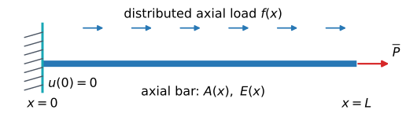{#fig-c5-bar-loading width="95%" fig-align="center"}

The unknown in this problem is a function. In principle, the equation must hold
for every admissible test function $v\in\mathcal{V}_0$. A computer, however, cannot
search an infinite-dimensional collection of functions directly. We therefore
begin by replacing that collection with functions built from a finite number
of known functions.

Choose admissible functions

$$
\psi_1,\psi_2,\ldots,\psi_n\in\mathcal{V}_0.
$$

For any coefficients $V_1,\ldots,V_n$, the linear combination

$$
v_n(x)
=
V_1\psi_1(x)+\cdots+V_n\psi_n(x)
=
\sum_{i=1}^{n}V_i\psi_i(x)
$$ {#eq-c5-test-linear-combination}

also belongs to $\mathcal{V}_0$, because each $\psi_i$ satisfies the homogeneous
essential boundary condition. Instead of allowing the test function to range
over all of $\mathcal{V}_0$, we can require the variational equation only for
functions of the form @eq-c5-test-linear-combination.

The same known functions are used to approximate the displacement:

$$
u_n(x)
=
\sum_{j=1}^{n}U_j\psi_j(x),
$$ {#eq-c5-trial-linear-combination}

where the coefficients $U_j$ are unknown. The unknown function has therefore
been replaced by $n$ unknown numbers.

The collection of all linear combinations of
$\psi_1,\ldots,\psi_n$ is a vector space contained in $\mathcal{V}_0$. In the
terminology of Chapter 2,

$$
\mathcal{V}_n
=
\operatorname{span}\{\psi_1,\ldots,\psi_n\}
\subset\mathcal{V}_0.
$$ {#eq-c5-galerkin-space}

The word *span* means precisely the set of all linear combinations in
@eq-c5-test-linear-combination. If the $\psi_i$ are linearly independent, they
form a basis of $\mathcal{V}_n$, and $\dim \mathcal{V}_n=n$. Thus *finite dimensional* means that
every function in the approximation space is determined by finitely many
coefficients.

The Galerkin approximation restricts both the trial and test functions to this
space:

$$
\text{find }u_n\in \mathcal{V}_n\text{ such that}\qquad
a(u_n,v_n)=\ell(v_n)
\qquad\forall v_n\in \mathcal{V}_n.
$$ {#eq-c5-galerkin-problem}

Substituting @eq-c5-test-linear-combination and
@eq-c5-trial-linear-combination gives

$$
\sum_{i=1}^{n}
V_i
\left[
\sum_{j=1}^{n}a(\psi_j,\psi_i)U_j-\ell(\psi_i)
\right]
=0.
$$

The coefficients $V_i$ are arbitrary. We may therefore choose them one at a
time, or equivalently require each bracketed expression to vanish. This gives
$n$ scalar equations,

$$
\sum_{j=1}^{n}a(\psi_j,\psi_i)U_j
=
\ell(\psi_i),
\qquad
i=1,\ldots,n.
$$ {#eq-c5-galerkin-equations}

Define

$$
K_{ij}=a(\psi_j,\psi_i),
\qquad
F_i=\ell(\psi_i).
$$

Then

$$
\bK\bU=\bF.
$$ {#eq-c5-galerkin-system}

The passage from the variational problem to the matrix system is therefore not
specific to finite elements. Any finite-dimensional Galerkin space leads to a
system of this form.

What makes the finite element method different is the way the functions
$\psi_i$ are chosen. If they are global polynomials or trigonometric functions,
they are typically nonzero over most of $(0,L)$, so many pairs
$(\psi_i,\psi_j)$ interact in the bilinear form and the matrix is generally
dense. The finite element method instead constructs basis functions from small
pieces associated with a partition of the domain. Each basis function is then
nonzero only near a small number of neighboring points.

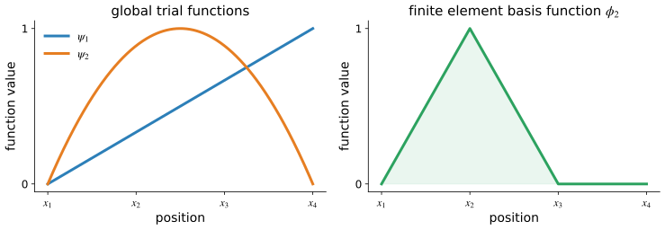{#fig-c5-global-vs-local width="95%" fig-align="center"}

This local support is the structural idea we now develop. The basis functions
constructed below will play exactly the same role as the generic
$\psi_i$ above; to emphasize their connection to the mesh, we will denote them
by $\phi_i$.

::: {#exm-c5-why-finite-dimensional}
## Why finitely many basis functions lead to finitely many unknowns

Suppose
$\mathcal{V}_3=\operatorname{span}\{\psi_1,\psi_2,\psi_3\}$.
Every function in $\mathcal{V}_3$ then has the form

$$
v_3=V_1\psi_1+V_2\psi_2+V_3\psi_3.
$$

No matter how complicated the functions $\psi_i$ themselves may be, the unknown
function $v_3$ is completely determined once the three coefficients
$V_1$, $V_2$, and $V_3$ are known. This is the basic reason the Galerkin
approximation converts a variational problem for an unknown function into a
system for finitely many unknown numbers.
:::

::: {#exr-c5-global-galerkin}
## A Galerkin approximation with global functions

For the same bar, take

$$
\psi_1(x)=x,\qquad
\psi_2(x)=x^2,\qquad
\psi_3(x)=x^3.
$$

1. Verify that each function belongs to $\mathcal{V}_0$.
2. Write $u_3(x)=\sum_{j=1}^3U_j\psi_j(x)$.
3. Write the three Galerkin equations in terms of
   $a(\psi_j,\psi_i)$ and $\ell(\psi_i)$.
4. Explain why the approximation is finite dimensional even though the basis
   functions are not finite element basis functions.
:::

## Mesh, elements, nodes, and connectivity {#sec-c5-mesh}

The generic Galerkin construction tells us that we need a finite collection of
basis functions, but it does not tell us how those functions should be chosen.
The finite element method makes that choice by first introducing a geometric
partition of the domain. The basis functions will then be built from simple
polynomials defined on the pieces of that partition.

For the bar occupying $[0,L]$, choose ordered points

$$
0=x_1<x_2<\cdots<x_{N+1}=L.
$$ {#eq-c5-mesh-nodes}

These points are the **nodes**. Consecutive nodes define the **elements**

$$
\mathcal{K}_e=(x_e,x_{e+1}),
\qquad
e=1,\ldots,N.
$$ {#eq-c5-elements}

The collection of elements

$$
\Th=\{\mathcal{K}_1,\mathcal{K}_2,\ldots,\mathcal{K}_{N}\}
$$

is the **finite element mesh**, or simply the **mesh**.

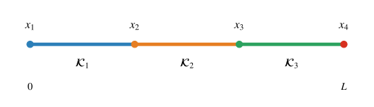{#fig-c5-mesh-partition width="90%" fig-align="center"}

The mesh has two roles. Geometrically, it partitions the bar into smaller
intervals. Computationally, it gives us places on which simple local
approximations can be defined and then connected. We will construct a
polynomial approximation separately on each element, but neighboring element
approximations will share information at their common node. This combination
of local approximation and shared degrees of freedom is what allows a global
finite element function to be assembled from small pieces.

The length of element $e$ is

$$
h_e=x_{e+1}-x_e,
$$

and the mesh size is

$$
h=\max_{1\le e\le N}h_e.
$$

A mesh is **uniform** if all element lengths are equal. It is **nonuniform** if
they are not. Nonuniform meshes are useful when smaller elements are desired
in selected parts of the domain, for example near a geometric feature or a
region where the solution varies rapidly. The convergence consequences of
mesh refinement are studied in Chapter 7; here we use the mesh to construct
the approximation itself.

The open element interiors are disjoint, while their closures cover the bar:

$$
[0,L]
=
\bigcup_{e=1}^{N}[x_e,x_{e+1}].
$$

This decomposition will later allow an integral over the whole bar to be
written as a sum of element integrals.

### Local and global numbering

A node can be described in two different ways. The **global node number**
identifies a point in the complete mesh. The **local node number** identifies
the position of that point within one element. Local numbers restart on each
element.

For a two-node linear element, local node 1 is the left endpoint and local
node 2 is the right endpoint. The **connectivity map**

$$
I^e:\{1,2\}\longrightarrow\{1,\ldots,N+1\}
$$

records which global nodes belong to element $e$. With the consecutive global
numbering used here,

$$
I^e(1)=e,
\qquad
I^e(2)=e+1.
$$ {#eq-c5-linear-connectivity}

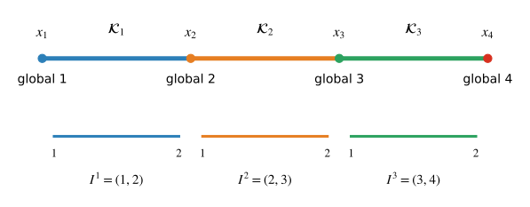{#fig-c5-local-global-numbering width="95%" fig-align="center"}

For example, the point $x_2$ is local node 2 of $\mathcal{K}_1$ and local node 1 of
$\mathcal{K}_2$, but it is only one global node. This distinction will matter during
assembly: both neighboring elements will contribute to equations associated
with that shared global node.

::: {.remark}
## Numbering in theory and in Python

The mathematical development in this book numbers elements, nodes, basis
functions, and matrix entries starting from 1. Python arrays and the degree-of-freedom
maps used by FEniCSx start from 0. Thus mathematical node $i$ is stored at Python
index `i - 1`, and mathematical element $e$ is stored at Python index `e - 1`.
This translation is made only when the mathematical objects are represented in
code; the two conventions should not be mixed within a derivation.
:::

It is also useful to distinguish a **node**, a **degree of freedom**, and an
**unknown coefficient**. A node is a geometric point in the mesh. A degree of
freedom is a quantity used to determine the finite element function. For the
one-dimensional nodal elements considered first, the degree of freedom is the
displacement value at a node. The corresponding coefficient is the number that
will be determined by the algebraic system. In this simple setting these three
ideas are closely aligned, but they are not identical concepts and need not
remain so for other finite element families.

At this point the mesh has been defined, but no finite element basis functions
have yet been chosen. We now use the mesh to make the generic Galerkin basis
$\psi_i$ from @sec-c5-galerkin local.

## Finite element basis functions on the mesh {#sec-c5-basis}

The functions $\psi_i$ in the Galerkin discussion were deliberately generic.
They only had to belong to the admissible function space and be linearly
independent. For a finite element approximation, we now choose those basis
functions in a particular mesh-based way. To distinguish this construction,
we write the finite element basis as

$$
\phi_1,\phi_2,\ldots,\phi_{N+1}.
$$

Thus the symbols have changed, but their role has not:
the $\phi_i$ are the basis functions used in the Galerkin expansion. The new
feature is that each $\phi_i$ will be assembled from polynomial pieces defined
on the elements of $\Th$.

For the nodal $H^1$-conforming Lagrange elements used in this chapter, three
requirements guide the construction.

1. **Polynomial on each element.** On every element $\mathcal{K}_e$, the restriction of
   a basis function belongs to a polynomial space
   $\mathbb P_{p_e}(\mathcal{K}_e)$.
2. **Continuous across shared endpoints.** The polynomial pieces from
   neighboring elements agree at their common node. Their derivatives are not
   required to agree.
3. **Nodal interpolation.** The global basis function associated with node
   $x_i$ satisfies
   $$
   \phi_i(x_j)=\delta_{ij}.
   $$ {#eq-c5-global-nodal-property}

The first requirement makes the approximation simple on each element. The
second makes the global function conform to the $H^1$ space required by the
axial-bar variational problem. The third gives the coefficients a direct nodal
interpretation.

These requirements describe the Lagrange family used here; they are not the
most general definition of a finite element. We will return to the general
definition near the end of the chapter after the concrete construction is
familiar.

### Linear basis functions

Begin with $p_e=1$ on every element. Consider again the three-element mesh

$$
\mathcal{K}_1=[x_1,x_2],
\qquad
\mathcal{K}_2=[x_2,x_3],
\qquad
\mathcal{K}_3=[x_3,x_4].
$$

We want one global basis function for each global node. Consider
$\phi_2$, associated with the interior node $x_2$. The nodal interpolation
property requires

$$
\phi_2(x_1)=0,\qquad
\phi_2(x_2)=1,\qquad
\phi_2(x_3)=0,\qquad
\phi_2(x_4)=0.
$$

Now apply the elementwise polynomial requirement. On $\mathcal{K}_1$, $\phi_2$ must be
the linear polynomial that rises from zero at $x_1$ to one at $x_2$:

$$
\phi_2(x)
=
\frac{x-x_1}{x_2-x_1},
\qquad
x\in[x_1,x_2].
$$

On $\mathcal{K}_2$, it must fall from one at $x_2$ to zero at $x_3$:

$$
\phi_2(x)
=
\frac{x_3-x}{x_3-x_2},
\qquad
x\in[x_2,x_3].
$$

On $\mathcal{K}_3$, the required nodal values at both endpoints are zero. The only
linear polynomial with those endpoint values is the zero polynomial.
Consequently,

$$
\phi_2(x)
=
\begin{cases}
\dfrac{x-x_1}{x_2-x_1},
&x\in[x_1,x_2],\\[1em]
\dfrac{x_3-x}{x_3-x_2},
&x\in[x_2,x_3],\\[1em]
0,
&\text{otherwise}.
\end{cases}
$$ {#eq-c5-global-phi2}

The remaining global basis functions are obtained by applying the same three
requirements at the other nodes.

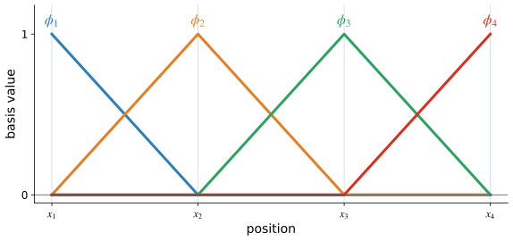{#fig-c5-global-linear-basis width="95%" fig-align="center"}

This construction explains where **local support** comes from. On an element
that does not contain the node associated with $\phi_i$, the function is zero
at both endpoints. Since its restriction is linear, it must vanish throughout
that element. An interior linear basis function therefore has support on only
the two elements adjacent to its node; an endpoint basis function has support
on only one element.

The same construction can be viewed locally. On one element
$\mathcal{K}_e=[x_e,x_{e+1}]$, define two local shape functions
$\phi_1^e$ and $\phi_2^e$ by

$$
\phi_1^e(x_e)=1,\quad
\phi_1^e(x_{e+1})=0,
\qquad
\phi_2^e(x_e)=0,\quad
\phi_2^e(x_{e+1})=1.
$$

Since the local functions are linear,

$$
\phi_1^e(x)=\frac{x_{e+1}-x}{h_e},
\qquad
\phi_2^e(x)=\frac{x-x_e}{h_e}.
$$ {#eq-c5-linear-shape-functions}

They satisfy

$$
\phi_1^e(x)+\phi_2^e(x)=1.
$$

This partition-of-unity relation means that equal nodal values reproduce a
constant field exactly.

If the displacement values at the two endpoints are $U_e$ and $U_{e+1}$,
then the finite element displacement on the element is

$$
\uh|_{\mathcal{K}_e}
=
U_e\phi_1^e+U_{e+1}\phi_2^e.
$$ {#eq-c5-linear-interpolation}

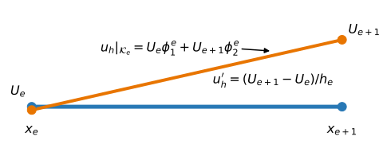{#fig-c5-linear-element-interpolation width="88%" fig-align="center"}

The interpolation property makes the meaning of the coefficients immediate:
evaluating @eq-c5-linear-interpolation at the left and right endpoints returns
$U_e$ and $U_{e+1}$. Differentiating gives

$$
\varepsilon_h|_{\mathcal{K}_e}
=
\uh'|_{\mathcal{K}_e}
=
\frac{U_{e+1}-U_e}{h_e}.
$$ {#eq-c5-linear-strain}

Thus the two-node bar element has a linear displacement field and a constant
strain field.

For later calculations, collect the element coefficients and shape functions
as

$$
\bU^e=
\begin{bmatrix}
U_e\\
U_{e+1}
\end{bmatrix},
\qquad
\bN^e=
\begin{bmatrix}
\phi_1^e&\phi_2^e
\end{bmatrix}.
$$

Then

$$
\uh|_{\mathcal{K}_e}
=
\bN^e\bU^e,
\qquad
\varepsilon_h|_{\mathcal{K}_e}
=
\bB^e\bU^e,
\qquad
\bB^e
=
\frac{\dd\bN^e}{\dd x}
=
\begin{bmatrix}
-1/h_e&1/h_e
\end{bmatrix}.
$$ {#eq-c5-linear-NB}

### From local shape functions to the global space

The local shape functions are not a second approximation. They are the pieces
from which the global Galerkin basis is assembled. If local node $a$ of element
$e$ corresponds to global node $I^e(a)$, then

$$
\phi_{I^e(a)}|_{\mathcal{K}_e}
=
\phi_a^e.
$$ {#eq-c5-local-global-relation}

For example, the global basis function associated with an interior node $x_i$
is $\phi_2^{\,i-1}$ on the element to the left, $\phi_1^{\,i}$ on the element
to the right, and zero elsewhere. Shared nodal values join the elementwise
pieces into one continuous global function.

The resulting piecewise-linear finite element space is

$$
\mathcal{V}_h
=
\left\{
v_h\in C([0,L]):
v_h|_{\mathcal{K}_e}\in\mathbb P_1(\mathcal{K}_e)
\text{ for }e=1,\ldots,N
\right\}.
$$ {#eq-c5-linear-space}

Its global nodal basis is
$\{\phi_1,\phi_2,\ldots,\phi_{N+1}\}$. Every $u_h\in\mathcal{V}_h$ has a unique expansion

$$
u_h(x)
=
\sum_{j=1}^{N+1}U_j\phi_j(x).
$$ {#eq-c5-global-expansion}

At node $x_i$,

$$
u_h(x_i)
=
\sum_{j=1}^{N+1}U_j\phi_j(x_i)
=
U_i.
$$ {#eq-c5-nodal-coefficient}

The global coefficients are therefore the nodal displacement values. Because
functions in $\mathcal{V}_h$ are continuous and have square-integrable piecewise
derivatives,

$$
\mathcal{V}_h\subset H^1(0,L).
$$

This is the conformity required by the axial-bar variational problem.

::: {#exm-c5-global-function}
## Constructing a finite element function

On the three-element mesh
$x_1=0$, $x_2=1$, $x_3=2$, $x_4=3$, assign

$$
U_1=0,\qquad
U_2=1,\qquad
U_3=-\frac12,\qquad
U_4=\frac12.
$$

Then

$$
u_h
=
U_1\phi_1+U_2\phi_2+U_3\phi_3+U_4\phi_4.
$$

On $\mathcal{K}_2=[1,2]$, only $\phi_2$ and $\phi_3$ are nonzero. Hence

$$
u_h|_{\mathcal{K}_2}
=
U_2\phi_2|_{\mathcal{K}_2}+U_3\phi_3|_{\mathcal{K}_2}
=
U_2\phi_1^2+U_3\phi_2^2.
$$

The global expansion and the local interpolation are two descriptions of the
same finite element function.
:::

::: {#exr-c5-construct-basis}
## Constructing a global basis function

For the nonuniform mesh
$x_1=0$, $x_2=1$, $x_3=3$, and $x_4=4$:

1. construct $\phi_3$ from elementwise linearity, continuity, and the nodal
   interpolation property;
2. state its support; and
3. verify its nodal values.
:::


## From the finite element space to element equations {#sec-c5-discrete}

The approximation space has now been constructed. We next return to the
variational problem and use exactly the same Galerkin idea as in
@sec-c5-galerkin, but with the mesh-based basis
$\phi_i$ in place of the generic basis $\psi_i$.

For the homogeneous displacement condition at $x=0$, define

$$
\mathcal{V}_{h,0}
=
\mathcal{V}_h\cap\mathcal{V}_0
=
\{v_h\in\mathcal{V}_h:v_h(0)=0\}.
$$

The finite element problem is

$$
\text{find }u_h\in\mathcal{V}_{h,0}\text{ such that}\qquad
a(u_h,v_h)=\ell(v_h)
\qquad
\forall v_h\in\mathcal{V}_{h,0}.
$$ {#eq-c5-discrete-variational}

Write $u_h=\sum_{j=1}^{N+1}U_j\phi_j$. The coefficient $U_1$ is prescribed by
the essential boundary condition. Testing with each free nodal basis function
gives

$$
\sum_{j=1}^{N+1}K_{ij}U_j=F_i,
$$

with

$$
K_{ij}
=
a(\phi_j,\phi_i)
=
\int_0^L AE\,\phi_j'\phi_i'\,\dd x,
\qquad
F_i
=
\int_0^L f\phi_i\,\dd x+\overline P\,\phi_i(L).
$$ {#eq-c5-global-entries}

The formula for $K_{ij}$ also explains the sparsity of the global matrix. If
the supports of $\phi_i$ and $\phi_j$ do not overlap except on a set of measure
zero, then their derivatives are never simultaneously nonzero over an interval,
and

$$
K_{ij}=0.
$$ {#eq-c5-support-sparsity}

For linear elements, an interior basis function overlaps only with itself and
its immediate neighbors.

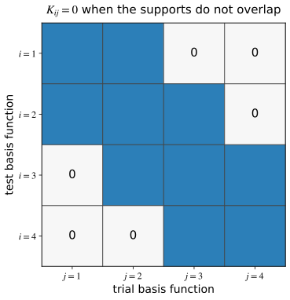{#fig-c5-basis-overlap-sparsity width="68%" fig-align="center"}

Equation @eq-c5-global-entries is already a complete definition of the
discrete problem. It would be possible to evaluate each entry by integrating
over the whole interval. Doing so, however, would ignore the local structure
that motivated the finite element basis.

The mesh partitions the interval, so

$$
K_{ij}
=
\sum_{e=1}^{N}
\int_{\mathcal{K}_e}
AE\,\phi_j'\phi_i'\,\dd x.
$$ {#eq-c5-global-entry-sum}

Only elements lying in the common support of $\phi_i$ and $\phi_j$ contribute.
On such an element, suppose
$i=I^e(a)$ and $j=I^e(b)$. The local-global relation
@eq-c5-local-global-relation gives

$$
\phi_i|_{\mathcal{K}_e}=\phi_a^e,
\qquad
\phi_j|_{\mathcal{K}_e}=\phi_b^e.
$$

The corresponding contribution can therefore be computed entirely with local
shape functions:

$$
K_{ab}^e
=
\int_{\mathcal{K}_e}
AE
\frac{\dd\phi_b^e}{\dd x}
\frac{\dd\phi_a^e}{\dd x}
\,\dd x.
$$ {#eq-c5-element-stiffness-entry}

Likewise, the distributed load contributes

$$
f_a^e
=
\int_{\mathcal{K}_e}f\,\phi_a^e\,\dd x.
$$ {#eq-c5-element-load-entry}

Collecting the local entries gives

$$
\bK^e
=
\int_{\mathcal{K}_e}
(\bB^e)^T AE\,\bB^e\,\dd x,
\qquad
\bfm^e
=
\int_{\mathcal{K}_e}
(\bN^e)^T f\,\dd x.
$$ {#eq-c5-element-matrix-vector}

For constant $A$, $E$, and $f$ on a linear element,

$$
\bK^e
=
\frac{A_eE_e}{h_e}
\begin{bmatrix}
1&-1\\
-1&1
\end{bmatrix},
\qquad
\bfm^e
=
\frac{f_eh_e}{2}
\begin{bmatrix}
1\\
1
\end{bmatrix}.
$$ {#eq-c5-linear-element-matrix-vector}

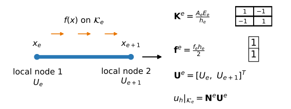{#fig-c5-typical-element width="100%" fig-align="center"}

The picture is worth pausing over. The geometry of one element
$\mathcal{K}_e$, the two nodal displacement values collected in $\bU^e$, the
interpolation formula for $u_h|_{\mathcal{K}_e}$, and the formulas for
$\bK^e$ and $\bfm^e$ belong together. In implementation, one element at a time
supplies exactly these local objects, which are then sent to the global system
through assembly.

The load vector is called a **consistent load vector** because it is obtained
from the same variational equation and basis functions used for the
displacement approximation. It is not an arbitrary replacement of the
distributed load by nodal point forces.

For example, if the distributed load varies linearly from $f_e^-$ to $f_e^+$
across the element, then

$$
f(x)=f_e^-\phi_1^e(x)+f_e^+\phi_2^e(x),
$$

and direct integration gives

$$
\bfm^e
=
\frac{h_e}{6}
\begin{bmatrix}
2f_e^-+f_e^+\\
f_e^-+2f_e^+
\end{bmatrix}.
$$ {#eq-c5-linear-varying-load}

The entries are generally unequal, but their sum is
$\int_{\mathcal{K}_e}f\,\dd x$. Thus the element vector preserves the total distributed
load.

The natural boundary term is already part of the global load functional. Since
$\phi_i(L)=\delta_{i,N+1}$, an applied force $\overline P$ at $x=L$ contributes
only to the right-end global load entry:

$$
F_{N+1}\mathrel{+}=\overline P.
$$

This is the discrete counterpart of the way a natural boundary condition enters
the continuous variational problem.

::: {#exm-c5-end-force}
## A natural boundary load at the right endpoint

Suppose the bar carries no distributed load, but the right endpoint is subject
to the axial force $\overline P$. Then every element load vector from the
distributed load is zero, yet the global load vector is not. The finite element
equations acquire the single contribution
$F_{N+1}\mathrel{+}=\overline P$ at the global degree of freedom associated with
$x=L$. This is why a natural boundary condition appears on the right-hand side
rather than in the definition of the admissible displacement space.
:::

::: {#rem-c5-direct-stiffness}
## Relation to the direct stiffness method

For a two-node linear axial bar, the direct stiffness method and the finite
element method give the same element stiffness matrix. The direct stiffness
method starts from an element force--displacement relation. The finite element
derivation starts from the variational problem and the finite-dimensional
basis. The latter construction extends without changing its basic logic to the
other boundary-value problems considered in this book.
:::

::: {#exr-c5-consistent-load}
## Consistent loading

On $\mathcal{K}_e=[0,h_e]$, let $f(x)=f_0+cx$.

1. Evaluate $\bfm^e$ exactly.
2. Verify that the sum of its entries equals
   $\int_{\mathcal{K}_e}f(x)\,\dd x$.
3. Compare the result with simply dividing the total load equally between the
   two nodes.
:::

::: {#exr-c5-foundation-matrix}
## A bar attached to distributed axial springs

Suppose the bar is attached to distributed axial springs that exert the
resisting force $-c(x)u(x)$ per unit length, where $c(x)\ge 0$. The variational
problem then contains the additional term

$$
\int_0^L c\,u v\,\dd x.
$$

For a linear element $\mathcal K_e$ on which $c(x)=c_e$ is constant:

1. show that this term contributes the element matrix
   $$
   C_{ab}^e
   =
   \int_{\mathcal K_e}c_e\phi_a^e\phi_b^e\,\dd x,
   \qquad a,b\in\{1,2\};
   $$
2. evaluate the integrals to obtain
   $$
   \bC^e
   =
   \frac{c_eh_e}{6}
   \begin{bmatrix}
   2&1\\
   1&2
   \end{bmatrix};
   $$
3. write the complete element matrix for the bar as
   $\bK^e+\bC^e$; and
4. explain why $\bK^e[1,1]^T=\bm{0}$ but
   $\bC^e[1,1]^T\ne\bm{0}$ when $c_e>0$.

The same matrix also appears in scalar reaction--diffusion equations
[@flaherty2000, Sec. 1.3].
:::

## Assembly, boundary conditions, and the computed solution {#sec-c5-assembly}

The element calculations produce small matrices and vectors in local numbering.
The global finite element equations require contributions in global numbering.
The connectivity map provides exactly the information needed to move from one
description to the other.

For each element $e$,

$$
F_{I^e(a)}\mathrel{+}=f_a^e,
\qquad
K_{I^e(a),I^e(b)}\mathrel{+}=K_{ab}^e.
$$ {#eq-c5-assembly-rule}

Consider again the three-element mesh with

$$
I^1=(1,2),
\qquad
I^2=(2,3),
\qquad
I^3=(3,4).
$$

Element 1 contributes only to global rows and columns 1 and 2. Element 2
contributes to rows and columns 2 and 3, and element 3 contributes to rows and
columns 3 and 4. At a shared global node, contributions from the neighboring
elements are added.

If

$$
\bK^e=
\begin{bmatrix}
K_{11}^e&K_{12}^e\\
K_{21}^e&K_{22}^e
\end{bmatrix},
$$

the assembled matrix is

$$
\bK
=
\begin{bmatrix}
K_{11}^1
&
K_{12}^1
&
0
&
0\\
K_{21}^1
&
K_{22}^1+K_{11}^2
&
K_{12}^2
&
0\\
0
&
K_{21}^2
&
K_{22}^2+K_{11}^3
&
K_{12}^3\\
0
&
0
&
K_{21}^3
&
K_{22}^3
\end{bmatrix}.
$$ {#eq-c5-three-element-K}

The distributed-load vector is

$$
\bF
=
\begin{bmatrix}
f_1^1\\
f_2^1+f_1^2\\
f_2^2+f_1^3\\
f_2^3
\end{bmatrix}
$$ {#eq-c5-three-element-F}

before any additional natural boundary contribution is added.

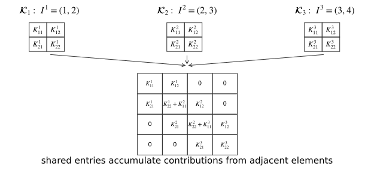{#fig-c5-assembly width="100%" fig-align="center"}

For equal element length $h$ and constant $AE$,

$$
\bK
=
\frac{AE}{h}
\begin{bmatrix}
1&-1&0&0\\
-1&2&-1&0\\
0&-1&2&-1\\
0&0&-1&1
\end{bmatrix}.
$$ {#eq-c5-unconstrained-K}

Before an essential displacement condition is imposed,
$[1,1,1,1]^T$ lies in the nullspace of this matrix. That vector represents a
rigid translation: all nodal displacements change by the same amount, so the
strain in every element remains zero.

### Essential boundary conditions and reactions

Suppose some nodal displacements are prescribed. Those coefficients are already
known and should not be solved for again. It is useful to see the algebra
before introducing block notation. If $U_1$ is prescribed, a free global
equation of the form

$$
K_{i1}U_1+K_{i2}U_2+\cdots+K_{i,N+1}U_{N+1}=F_i
$$

is rewritten by moving the known term to the right-hand side:

$$
K_{i2}U_2+\cdots+K_{i,N+1}U_{N+1}
=
F_i-K_{i1}U_1.
$$

A nonzero prescribed displacement therefore changes the right-hand side of the
free equations. The same operation can be written compactly by partitioning the
global vector into free and prescribed values,

$$
\bU=
\begin{bmatrix}
\bU_f\\
\bU_p
\end{bmatrix},
$$

and partitioning the assembled equations consistently:

$$
\begin{bmatrix}
\bK_{ff}&\bK_{fp}\\
\bK_{pf}&\bK_{pp}
\end{bmatrix}
\begin{bmatrix}
\bU_f\\
\bU_p
\end{bmatrix}
=
\begin{bmatrix}
\bF_f\\
\bF_p
\end{bmatrix}.
$$ {#eq-c5-partitioned-system}

The equations associated with the free degrees of freedom are

$$
\bK_{ff}\bU_f
=
\bF_f-\bK_{fp}\bU_p.
$$ {#eq-c5-reduced-system}

For a nonzero prescribed displacement, the term
$\bK_{fp}\bU_p$ is essential. It represents the contribution of the known
displacement values to the free equilibrium equations.

The equations associated with prescribed degrees of freedom are not discarded.
After the free displacements have been found, they provide the forces required
to enforce the prescribed values:

$$
\bR_p
=
\bK_{pf}\bU_f+\bK_{pp}\bU_p-\bF_p.
$$ {#eq-c5-reactions}

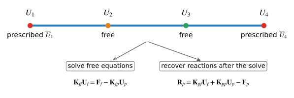{#fig-c5-essential-bc width="100%" fig-align="center"}

The distinction from the continuous variational problem is worth keeping in
view. Natural boundary data contribute through the load functional. Essential
boundary data restrict the admissible functions and, after discretization,
identify coefficients whose values are prescribed.

::: {#exm-c5-complete-bar}
## Complete analysis of a uniformly loaded bar

Consider a uniform bar of length $L$ and constant axial rigidity $AE$. Let the
left endpoint be fixed, the right endpoint be traction free, and let the
distributed load be the constant $f_0$.

Divide the bar into two equal elements. Then $h=L/2$ and

$$
I^1=(1,2),
\qquad
I^2=(2,3).
$$

Each element contributes

$$
\bK^e
=
\frac{AE}{h}
\begin{bmatrix}
1&-1\\
-1&1
\end{bmatrix},
\qquad
\bfm^e
=
\frac{f_0h}{2}
\begin{bmatrix}
1\\
1
\end{bmatrix}.
$$

After assembly,

$$
\frac{AE}{h}
\begin{bmatrix}
1&-1&0\\
-1&2&-1\\
0&-1&1
\end{bmatrix}
\begin{bmatrix}
U_1\\
U_2\\
U_3
\end{bmatrix}
=
\frac{f_0h}{2}
\begin{bmatrix}
1\\
2\\
1
\end{bmatrix}.
$$ {#eq-c5-two-element-system}

The middle load entry contains one contribution from each neighboring element.
Since $U_1=0$, the free equations are

$$
\frac{AE}{h}
\begin{bmatrix}
2&-1\\
-1&1
\end{bmatrix}
\begin{bmatrix}
U_2\\
U_3
\end{bmatrix}
=
\frac{f_0h}{2}
\begin{bmatrix}
2\\
1
\end{bmatrix}.
$$

Solving and using $h=L/2$ gives

$$
U_2
=
\frac{3f_0L^2}{8AE},
\qquad
U_3
=
\frac{f_0L^2}{2AE}.
$$ {#eq-c5-two-element-solution}

The exact displacement is

$$
u(x)
=
\frac{f_0}{AE}
\left(
Lx-\frac{x^2}{2}
\right).
$$ {#eq-c5-uniform-load-exact}

For this particular problem, the finite element solution agrees with the exact
solution at the three nodes, but it remains linear within each element.

The corresponding element strains are

$$
\varepsilon_h^1
=
\frac{U_2-U_1}{h}
=
\frac{3f_0L}{4AE},
\qquad
\varepsilon_h^2
=
\frac{U_3-U_2}{h}
=
\frac{f_0L}{4AE}.
$$

The exact strain
$u'(x)=f_0(L-x)/(AE)$ varies linearly, whereas the finite element strain is
piecewise constant. The element stresses and axial forces are obtained from

$$
\sigma_h^e=E\varepsilon_h^e,
\qquad
N_h^e=A\sigma_h^e.
$$

Finally, the reaction at node 1 is obtained from the first row of the original
assembled system:

$$
R_1
=
-\frac{AE}{h}U_2-\frac{f_0h}{2}
=
-f_0L.
$$

Because $\int_0^L f_0\,\dd x=f_0L$,

$$
R_1+\int_0^L f_0\,\dd x=0.
$$

The recovered reaction therefore satisfies global equilibrium.
:::

Once the global coefficient vector is known, postprocessing proceeds
element by element. Connectivity extracts the local coefficient vector
$\bU^e$ from $\bU$, and the formulas for $u_h$, strain, stress, and axial
force are evaluated on each element. Adjacent linear elements may give
different strains and stresses at a shared node. This does not violate
conformity: $\mathcal{V}_h$ requires displacement to be continuous, not its derivative.

Before accepting a result, check that the mesh and connectivity represent the
intended bar, all quantities use consistent units, prescribed and free degrees
of freedom are identified correctly, applied loads and recovered reactions
satisfy global equilibrium, and the displacement and axial-force trends are
consistent with the loading. Chapter 7 develops systematic error estimates and
convergence theory.

::: {#exr-c5-assembly-error}
## Diagnosing an assembly error

Two linear elements have
$k_1=(AE)_1/h_1$ and $k_2=(AE)_2/h_2$. A student assembles

$$
\bK
=
\begin{bmatrix}
k_1&-k_1&0\\
-k_1&k_1&-k_2\\
0&-k_2&k_2
\end{bmatrix}.
$$

Identify the missing contribution, correct the matrix, and explain which global
degree of freedom should receive the missing term.
:::

::: {#exm-c5-python-assembly}
## Assembly and mesh refinement in Python

We now repeat the uniformly loaded bar problem from
@exm-c5-complete-bar with an arbitrary number of uniform linear elements. Set
$L=AE=f_0=1$. The boundary-value problem and its exact solution are

$$
-u''=1\quad\text{in }(0,1),
\qquad
u(0)=0,
\qquad
u'(1)=0,
\qquad
u(x)=x-\frac{x^2}{2}.
$$

The following program exposes the element calculation, connectivity, assembly,
imposition of the prescribed displacement, solution of the reduced system,
and recovery of the reaction. The arrays use Python's zero-based indexing;
thus `dofs = [e, e + 1]` represents the theoretical connectivity
$I^{e+1}=(e+1,e+2)$.

```{python}
#| label: fig-c5-python-mesh-refinement
#| fig-cap: "Linear finite element solutions for a uniformly loaded bar. Mesh refinement reduces the error between nodes."
#| fig-width: 6.8
#| fig-height: 3.7
import numpy as np
import matplotlib.pyplot as plt

def solve_bar(num_elements):
    x = np.linspace(0.0, 1.0, num_elements + 1)
    K = np.zeros((num_elements + 1, num_elements + 1))
    F = np.zeros(num_elements + 1)

    for e in range(num_elements):
        dofs = np.array([e, e + 1])
        h = x[e + 1] - x[e]
        K_e = np.array([[1.0, -1.0], [-1.0, 1.0]]) / h
        F_e = 0.5 * h * np.ones(2)
        K[np.ix_(dofs, dofs)] += K_e
        F[dofs] += F_e

    prescribed = np.array([0])
    free = np.arange(1, num_elements + 1)
    U = np.zeros(num_elements + 1)
    rhs = F[free] - K[np.ix_(free, prescribed)] @ U[prescribed]
    U[free] = np.linalg.solve(K[np.ix_(free, free)], rhs)
    reaction = (K @ U - F)[prescribed]
    return x, U, reaction

x_plot = np.linspace(0.0, 1.0, 501)
u_exact = x_plot - 0.5 * x_plot**2
for N in (2, 4, 8):
    x, U, reaction = solve_bar(N)
    u_h = np.interp(x_plot, x, U)
    error = np.max(np.abs(u_h - u_exact))
    plt.plot(x, U, "o-", label=fr"$N={N}$, max. error $={error:.4f}$")

plt.plot(x_plot, u_exact, "k--", linewidth=2, label="exact")
plt.xlabel("$x$")
plt.ylabel("$u(x)$")
plt.legend()
plt.tight_layout()
```

The finite element coefficients agree with the exact solution at the nodes for
this particular problem, but the linear finite element field does not reproduce
the quadratic variation between nodes. As $N$ increases, the element length
decreases and the piecewise-linear curves in @fig-c5-python-mesh-refinement
approach the exact solution. The recovered reaction is $-1$ for every mesh,
which balances the total distributed load.
:::

## Higher-order elements and the reference interval {#sec-c5-higher-order}

The construction above is not restricted to linear interpolation. We can keep
the same mesh-based idea and enrich the polynomial space on each element.

Consider a three-node quadratic element with local nodes

$$
x_1^e<x_2^e<x_3^e.
$$

The local basis functions belong to $\mathbb P_2(\mathcal{K}_e)$ and satisfy

$$
\phi_a^e(x_b^e)=\delta_{ab},
\qquad
a,b\in\{1,2,3\}.
$$ {#eq-c5-quadratic-nodal-property}

The three Lagrange polynomials are

$$
\begin{aligned}
\phi_1^e(x)
&=
\frac{(x-x_2^e)(x-x_3^e)}
{(x_1^e-x_2^e)(x_1^e-x_3^e)},\\
\phi_2^e(x)
&=
\frac{(x-x_1^e)(x-x_3^e)}
{(x_2^e-x_1^e)(x_2^e-x_3^e)},\\
\phi_3^e(x)
&=
\frac{(x-x_1^e)(x-x_2^e)}
{(x_3^e-x_1^e)(x_3^e-x_2^e)}.
\end{aligned}
$$ {#eq-c5-quadratic-basis}

The interpolation

$$
u_h|_{\mathcal{K}_e}
=
U_1^e\phi_1^e+
U_2^e\phi_2^e+
U_3^e\phi_3^e
$$

is quadratic, so its derivative is linear. A quadratic bar element can
therefore represent a linearly varying strain within one element.

On a mesh of quadratic elements, adjacent elements share endpoint nodes, while
each midpoint node belongs to a single element. One convenient connectivity
for three elements is

$$
I^1=(1,2,3),
\qquad
I^2=(3,4,5),
\qquad
I^3=(5,6,7).
$$ {#eq-c5-quadratic-connectivity}

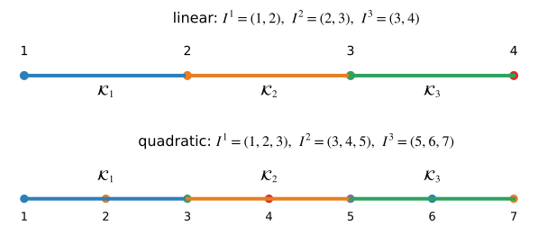{#fig-c5-linear-quadratic-connectivity width="95%" fig-align="center"}

A global quadratic basis function associated with a midpoint is supported on
one element. A basis function associated with a shared endpoint is obtained by
joining one quadratic piece from each neighboring element.

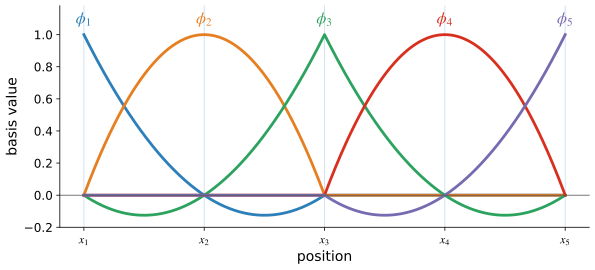{#fig-c5-global-quadratic-basis width="95%" fig-align="center"}

The corresponding global space is

$$
\mathcal{V}_h^{(2)}
=
\left\{
v_h\in C([0,L]):
v_h|_{\mathcal{K}_e}\in\mathbb P_2(\mathcal{K}_e)
\text{ for every }e
\right\}.
$$

Its functions are continuous across element boundaries, but their derivatives
need not be continuous. Increasing the polynomial degree on a fixed mesh is
called **$p$-refinement**; subdividing the mesh so that the element size
decreases is called **$h$-refinement**.

The local matrix for a quadratic element is $3\times3$, but the assembly
principle does not change. For two elements with
$I^1=(1,2,3)$ and $I^2=(3,4,5)$, the shared global degree of freedom 3 receives
contributions from both elements. For example,

$$
K_{33}\mathrel{+}=K_{33}^1,
\qquad
K_{33}\mathrel{+}=K_{11}^2.
$$

The element has more local degrees of freedom, but connectivity still tells us
where each local entry belongs.

### Reference interval and general degree

Constructing the linear and quadratic basis functions directly on physical
elements makes their meaning clear. It also reveals a repeated calculation:
every element uses the same type of interpolation problem. In a finite element
implementation, it is more convenient to define the local basis once on a
fixed reference interval and map it to each physical element.

Let

$$
\widehat{\mathcal{K}}=[-1,1]
$$

with reference coordinate $\xi$. For the physical interval
$\mathcal{K}_e=[x_e,x_{e+1}]$, seek an affine map
$F_e(\xi)=m_e\xi+c_e$ satisfying
$F_e(-1)=x_e$ and $F_e(1)=x_{e+1}$. Solving for $m_e$ and $c_e$ gives

$$
F_e(\xi)
=
\frac{x_e+x_{e+1}}{2}
+
\frac{h_e}{2}\xi,
\qquad
J_e=\frac{\dd x}{\dd\xi}=\frac{h_e}{2}.
$$ {#eq-c5-reference-map}

The inverse is

$$
F_e^{-1}(x)
=
\frac{2}{h_e}
\left(
x-\frac{x_e+x_{e+1}}{2}
\right).
$$

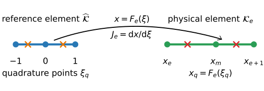{#fig-c5-reference-map width="95%" fig-align="center"}

For a degree-$p$ Lagrange element, choose $p+1$ distinct reference nodes
$\xi_1,\ldots,\xi_{p+1}$. The reference basis function associated with
$\xi_a$ is

$$
\widehat\phi_a(\xi)
=
\prod_{\substack{b=1\\b\ne a}}^{p+1}
\frac{\xi-\xi_b}{\xi_a-\xi_b},
\qquad
a=1,\ldots,p+1.
$$ {#eq-c5-reference-lagrange}

By construction,
$\widehat\phi_a(\xi_b)=\delta_{ab}$. For $p=1$, with nodes $-1$ and $1$,

$$
\widehat\phi_1(\xi)=\frac{1-\xi}{2},
\qquad
\widehat\phi_2(\xi)=\frac{1+\xi}{2}.
$$

For $p=2$, with nodes $-1,0,1$,

$$
\widehat\phi_1(\xi)=\frac12\xi(\xi-1),
\qquad
\widehat\phi_2(\xi)=1-\xi^2,
\qquad
\widehat\phi_3(\xi)=\frac12\xi(\xi+1).
$$ {#eq-c5-quadratic-reference-basis}

The physical basis function is obtained by composition:

$$
\phi_a^e(x)
=
\widehat\phi_a(F_e^{-1}(x)).
$$ {#eq-c5-reference-to-physical}

For an isoparametric degree-$p$ element, the same reference functions are used
to interpolate the geometry,

$$
F_e(\xi)
=
\sum_{a=1}^{p+1}
\widehat\phi_a(\xi)x_a^e,
\qquad
J_e(\xi)
=
\frac{\dd F_e}{\dd\xi}.
$$ {#eq-c5-isoparametric-map}

For a quadratic interval whose middle node lies at the physical midpoint, this
quadratic geometry interpolation reproduces the affine map exactly. If the
geometry map is nonaffine, the Jacobian varies with $\xi$. A valid
orientation-preserving map must satisfy

$$
J_e(\xi)>0
\qquad
\text{for }-1\le\xi\le1.
$$

The chain rule gives

$$
\frac{\dd\phi_a^e}{\dd x}
=
\frac{1}{J_e}
\frac{\dd\widehat\phi_a}{\dd\xi}.
$$ {#eq-c5-derivative-transform}

The reference basis can therefore be reused on every element; element-specific
information enters through the map and connectivity.

### Numerical integration on the reference interval

The same map standardizes element integration. For an integrable function
$g$,

$$
\int_{\mathcal{K}_e}g(x)\,\dd x
=
\int_{-1}^{1}g(F_e(\xi))J_e(\xi)\,\dd\xi.
$$ {#eq-c5-change-of-variables}

The element entries become

$$
K_{ab}^e
=
\int_{-1}^{1}
\frac{\dd\widehat\phi_b}{\dd\xi}
A(F_e(\xi))E(F_e(\xi))
\frac{\dd\widehat\phi_a}{\dd\xi}
\frac{1}{J_e(\xi)}
\,\dd\xi,
$$ {#eq-c5-reference-stiffness}

and

$$
f_a^e
=
\int_{-1}^{1}
\widehat\phi_a(\xi)
f(F_e(\xi))
J_e(\xi)
\,\dd\xi.
$$ {#eq-c5-reference-load}

These integrals have the same limits and use the same reference basis on every
element. For constant coefficients and simple polynomial data, some of them
can be evaluated analytically. A general finite element code, however, must
also handle spatially varying material properties, loads, and geometry. It is
therefore preferable to evaluate element integrals from values of the
integrand at a fixed set of points on the reference interval.

Gauss--Legendre quadrature provides such a rule. It approximates

$$
\int_{-1}^{1}g(\xi)\,\dd\xi
\approx
\sum_{q=1}^{n_q}w_qg(\xi_q).
$$ {#eq-c5-gauss-rule}

The first three rules are

| $n_q$ | quadrature points | weights | exact through degree |
|---:|---|---|---:|
| 1 | $0$ | $2$ | 1 |
| 2 | $-1/\sqrt{3},\,1/\sqrt{3}$ | $1,\,1$ | 3 |
| 3 | $-\sqrt{3/5},\,0,\,\sqrt{3/5}$ | $5/9,\,8/9,\,5/9$ | 5 |

Thus

$$
K_{ab}^e
\approx
\sum_{q=1}^{n_q}
w_q
\frac{\dd\widehat\phi_b}{\dd\xi}(\xi_q)
A(x_q)E(x_q)
\frac{\dd\widehat\phi_a}{\dd\xi}(\xi_q)
\frac{1}{J_e(\xi_q)},
$$

and

$$
f_a^e
\approx
\sum_{q=1}^{n_q}
w_q
\widehat\phi_a(\xi_q)
f(x_q)
J_e(\xi_q),
\qquad
x_q=F_e(\xi_q).
$$ {#eq-c5-quadrature-entries}

For affine geometry and constant $AE$, the linear-element stiffness integrand
is constant, so one Gauss point is sufficient. For a quadratic element the
basis derivatives are linear, so the stiffness integrand is quadratic and two
Gauss points integrate it exactly. If $A$, $E$, $f$, or the Jacobian varies,
the required quadrature order depends on the complete integrand.

For a three-node quadratic element with midpoint geometry and constant data,
two-point quadrature gives

$$
\bK^e
=
\frac{AE}{3h_e}
\begin{bmatrix}
7&-8&1\\
-8&16&-8\\
1&-8&7
\end{bmatrix},
\qquad
\bfm^e
=
\frac{f_eh_e}{6}
\begin{bmatrix}
1\\
4\\
1
\end{bmatrix}.
$$ {#eq-c5-quadratic-element-matrix-vector}

The load entries add to $f_eh_e$, and
$\bK^e[1,1,1]^T=\bm{0}$ because equal nodal displacements produce zero strain.

::: {#exm-c5-quadratic-exact}
## One quadratic element for the uniformly loaded bar

Return to @exm-c5-complete-bar. The exact displacement
@eq-c5-uniform-load-exact is quadratic. Use one quadratic element with
interpolation nodes at $0$, $L/2$, and $L$.

After imposing $U_1=0$, the finite element equations give

$$
U_2
=
\frac{3f_0L^2}{8AE},
\qquad
U_3
=
\frac{f_0L^2}{2AE}.
$$

These are the exact displacement values at $x=L/2$ and $x=L$. Since the exact
solution and the finite element interpolant are both quadratic and agree at all
three interpolation nodes,

$$
u_h(x)=u(x)
\qquad\forall x\in[0,L].
$$

The agreement occurs because the exact solution belongs to the selected finite
element space; it is not a general property of quadratic elements.
:::

::: {#exr-c5-quadratic-connectivity}
## Quadratic connectivity and assembly

For two quadratic elements with
$I^1=(1,2,3)$ and $I^2=(3,4,5)$:

1. state the support of each global basis function $\phi_1,\ldots,\phi_5$;
2. identify every element contribution to the global entry $K_{33}$; and
3. explain why the assembly rule has the same form as for linear elements.
:::

::: {#exr-c5-quadrature}
## Selecting a quadrature rule

Determine the minimum Gauss--Legendre rule that integrates the stiffness matrix
exactly for:

1. a linear element with affine geometry and constant $AE$;
2. a quadratic element with affine geometry and constant $AE$; and
3. a quadratic element with affine geometry and $AE$ varying linearly with
   $x$.
:::

## The finite element in general form {#sec-c5-general}

The linear and quadratic elements above were described through nodal values:
given the values of a polynomial at the interpolation nodes, the polynomial is
determined uniquely. The essential idea is more general than point values.
A local degree of freedom can be any linear rule that extracts a number from a
function in the local approximation space.

For example, point evaluation at $x_e$ is the rule

$$
N_1(w)=w(x_e).
$$

Such a rule is a **linear functional** because
$N_1(\alpha w+\beta z)=\alpha N_1(w)+\beta N_1(z)$. The collection of all
linear functionals on a vector space $\mathcal P$ is called its **dual
space** and is denoted by $\mathcal P^*$. With this terminology, the
construction can be stated without assuming that the degrees of freedom are
nodal values.

::: {#def-c5-finite-element}
## Finite element

A **finite element** is a triple $(K,\mathcal P,\mathcal N)$, where

1. $K$ is a cell;
2. $\mathcal P$ is a finite-dimensional vector space of functions on $K$; and
3. $\mathcal N=\{N_1,\ldots,N_m\}$ is a basis for the dual space
   $\mathcal P^*$.

Here $m=\dim\mathcal P$, and the functionals
$N_a:\mathcal P\to\R$ are the local degrees of freedom.
:::

For the two-node linear interval element,

$$
K=[x_e,x_{e+1}],
\qquad
\mathcal P=\mathbb P_1(K),
$$

and

$$
N_1(w)=w(x_e),
\qquad
N_2(w)=w(x_{e+1}).
$$

The degrees of freedom must determine every function in $\mathcal P$
uniquely. Equivalently,

$$
N_a(w)=0
\quad\forall a
\qquad\Longrightarrow\qquad
w=0.
$$

This property is called **unisolvence**. The nodal basis is characterized by

$$
N_a(\phi_b)=\delta_{ab}.
$$

For the Lagrange elements used in this chapter, the degrees of freedom are
point evaluations at interpolation nodes. Other finite element families use
different functionals.

The complete one-dimensional calculation can now be stated without assuming a
particular polynomial degree. Reference basis values and derivatives are
evaluated for the chosen element family and quadrature rule. Each element then
supplies its geometry, material data, loading, and connectivity:

```text
initialize the global matrix K and vector F

for each element e:
    read its coordinates and global degree-of-freedom numbers
    initialize K_e and f_e

    for each quadrature point:
        evaluate reference basis functions and derivatives
        map the point to the physical element
        compute the Jacobian and physical derivatives
        accumulate the contribution to K_e and f_e

    assemble K_e and f_e into K and F using connectivity

identify free and prescribed degrees of freedom
solve the reduced system
insert prescribed values into the global coefficient vector
recover reactions from the prescribed equations
postprocess displacement, strain, stress, and axial force element by element
```

Changing the polynomial degree modifies the local basis, the number of local
degrees of freedom, the size of the element arrays, the connectivity, and
usually the quadrature requirement. The Galerkin formulation,
local-to-global assembly, treatment of prescribed values, and overall solution
procedure remain the same.

::: {#exr-c5-trace-element}
## Tracing one element through the procedure

For the first element in @exm-c5-complete-bar, state

1. its connectivity and coordinate vector;
2. its element stiffness matrix and load vector;
3. every global matrix and vector entry to which it contributes;
4. the free and prescribed degrees of freedom after assembly; and
5. the quantities extracted during postprocessing.
:::

## Chapter summary {#sec-c5-summary}

A Galerkin approximation replaces the infinite-dimensional variational problem
by a finite-dimensional one. The finite element method obtains that
finite-dimensional space from a mesh. For the nodal $H^1$-conforming Lagrange
elements used here, the basis functions are polynomial on each element,
continuous across shared endpoints, and satisfy the nodal interpolation
property.

Those properties give the basis functions local support. The global
coefficients are nodal values, and only basis functions with overlapping
support contribute to the same stiffness entries. The local-global relation

$$
\phi_{I^e(a)}|_{\mathcal{K}_e}=\phi_a^e
$$

allows the global variational equations to be evaluated through element
matrices and vectors. Connectivity then determines where those local
contributions are added in the global algebraic system.

Essential boundary conditions prescribe selected coefficients and lead to a
reduced system for the free degrees of freedom. Natural boundary data enter the
load functional. After the free coefficients have been found, reactions and
derived fields are recovered from the assembled solution.

Quadratic and higher-order Lagrange elements use the same construction with
richer local polynomial spaces. The reference interval allows the basis,
coordinate mapping, and quadrature to be organized uniformly across elements.
The formal triple $(K,\mathcal P,\mathcal N)$ expresses the local finite
element construction independently of a particular polynomial degree.

Chapter 6 extends these ideas to multidimensional cells, vector-valued fields,
multidimensional coordinate mappings, boundary integrals, and finite element
software.
