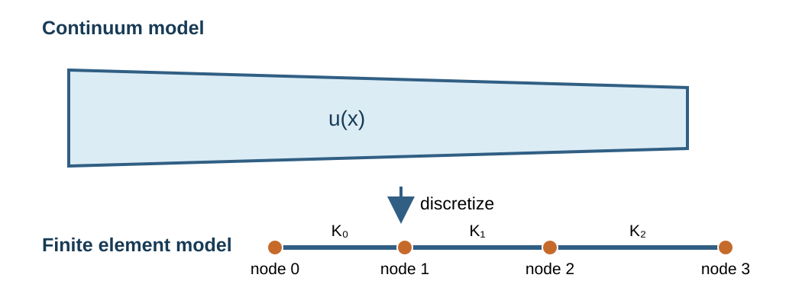
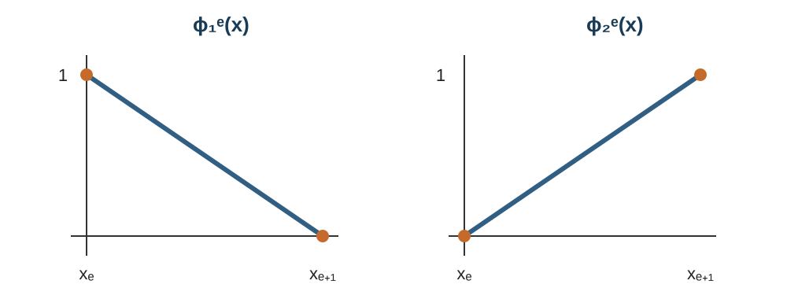
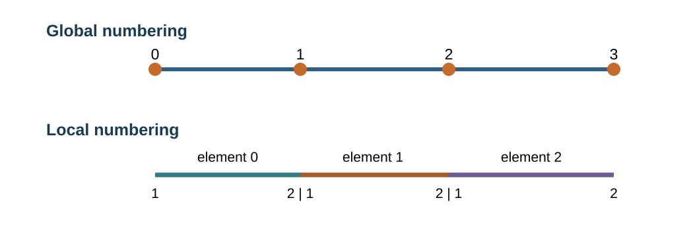
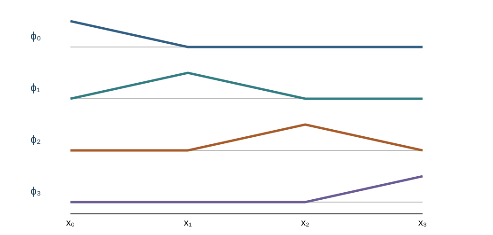
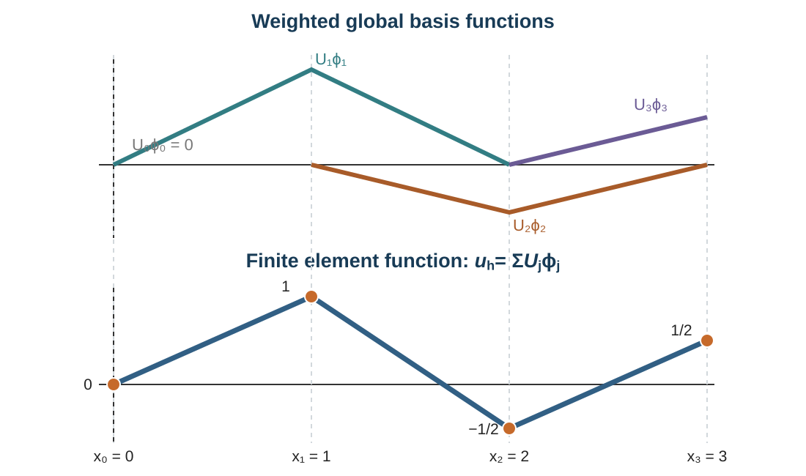
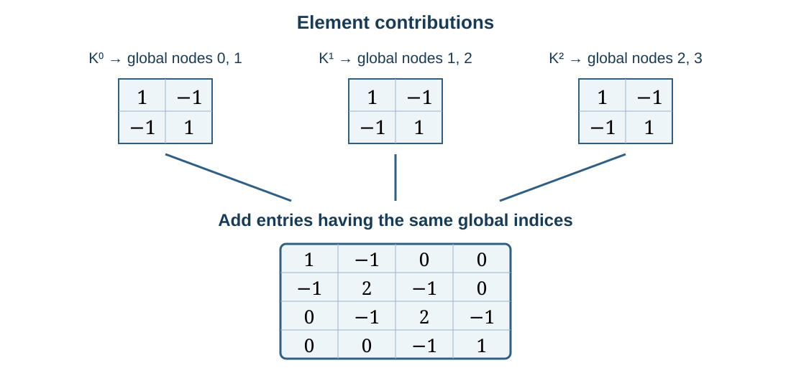
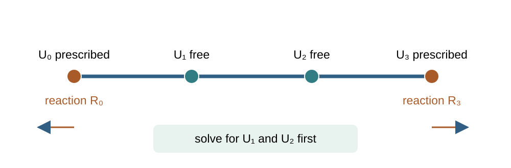
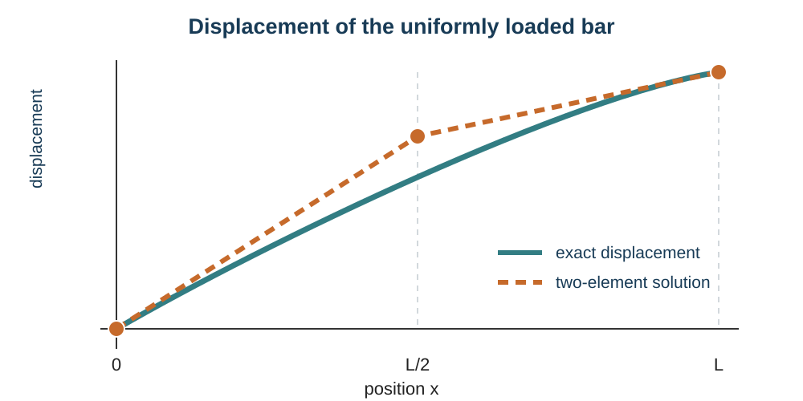
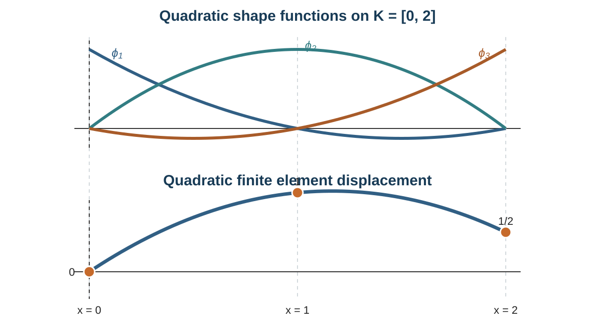
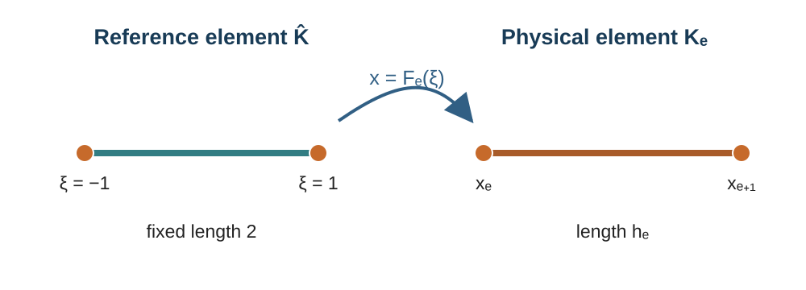

# The Finite Element Method in One Dimension {#sec-fem-one-dimensional}

```{=latex}
\chaptershorttitle{One-Dimensional FEM}
```

Chapter 4 formulated the axial-bar problem as a variational problem. We now use
that problem to develop the finite element method from beginning to end. The
one-dimensional setting allows us to see the mesh, basis functions, element
calculations, assembly, boundary conditions, and computed solution without the
additional geometry of two- and three-dimensional meshes. Chapter 6 will extend
the same construction to higher dimensions.

The purpose of this chapter is not only to obtain a matrix equation. A finite
element calculation represents a field over a continuum by joining simple local
approximations. The unknown coefficients have a physical interpretation, element
matrices describe local contributions, and assembly expresses how the connected
elements form one global model. These ideas are developed below using the notation
established in this book [@becker-carey-oden1981; @jog;
@larson-bengzon2010].

## From a bar to a finite element model {#sec-fem-bar-model}

Consider the axial bar from @sec-model-axial-bar. To keep the first finite element
construction focused, suppose that $u(0)=0$, the right endpoint is traction free,
and the bar is subjected to the distributed axial load $f(x)$. The corresponding
trial and test space is

$$
\mathcal V_0=\{v\in H^1(0,L):v(0)=0\},
$$

and the corresponding variational problem is

$$
\text{find }u\in\mathcal V_0
\quad\text{such that}\quad
\int_0^L AE\,u'v'\,\dd x
=\int_0^L fv\,\dd x
\quad\forall v\in\mathcal V_0.
$$ {#eq-fem-bar-continuous-problem}

The displacement $u$ is a function defined at every point of the interval. A
finite element model introduces a finite set of nodes and divides the interval
into elements. Within each element, the displacement is approximated by a
polynomial. Values shared by adjacent elements connect the local approximations
into one displacement field, as illustrated in @fig-fem-bar-discretization.

{#fig-fem-bar-discretization width="92%" fig-align="center"}

The principal steps are therefore:

1. divide the domain into elements;
2. select the approximation and degrees of freedom on one element;
3. join the elements to construct a global finite-dimensional space;
4. restrict the variational problem to that space;
5. calculate element matrices and vectors and assemble them globally;
6. impose prescribed displacement values and solve the algebraic system; and
7. use the computed displacement to evaluate strain, stress, axial force, and
   reactions.

These steps distinguish FEM from a procedure that begins with an assumed global
polynomial over the entire bar. The finite element approximation is assembled from
local functions, so local mesh refinement and spatially varying material properties
can be represented directly.

::: {.remark}
## Relation to the direct stiffness method

For a linear axial bar, the direct stiffness method and FEM produce the same element
stiffness matrix. Their starting points differ. The direct stiffness method begins
with an element force--displacement relation, whereas FEM obtains the element
equations by restricting a variational problem to a finite-dimensional function
space. The latter construction extends directly to the general boundary-value
problems considered in this book.
:::

## A one-dimensional mesh {#sec-fem-one-dimensional-mesh}

The first step is to replace the interval $[0,L]$ by a finite collection of
smaller intervals. Choose $N+1$ points

$$
0=x_0<x_1<\cdots<x_N=L.
$$ {#eq-fem-node-coordinates}

These points are the **nodes**. Consecutive nodes define $N$ **elements**

$$
K_e=(x_e,x_{e+1}),
\qquad e=0,\ldots,N-1.
$$ {#eq-fem-interval-elements}

Thus the number of nodes is $N_n=N+1$. With zero-based numbering, their indices
are $0,\ldots,N_n-1$, or equivalently $0,\ldots,N$. The nodes may therefore be
written as $x_0,x_1,\ldots,x_{N_n-1}$ or as $x_0,x_1,\ldots,x_N$.

The collection

$$
\Th=\{K_0,K_1,\ldots,K_{N-1}\}
$$

is a one-dimensional **mesh** of $(0,L)$. The open element interiors do not
overlap, while their closures cover the closed interval:

$$
[0,L]=\bigcup_{e=0}^{N-1}[x_e,x_{e+1}].
$$ {#eq-fem-one-dimensional-mesh-cover}

The length of element $e$ and the mesh size are

$$
h_e=x_{e+1}-x_e,
\qquad h=\max_{0\le e\le N-1}h_e.
$$ {#eq-fem-one-dimensional-mesh-size}

We use the open interval $K_e$ when integrating over an element and its closure
$[x_e,x_{e+1}]$ when referring to its endpoints. A uniform mesh has $h_e=L/N$
for every element. A nonuniform mesh permits smaller elements where the
displacement or material data vary more rapidly.

For the linear element used first in this chapter, the two endpoints are its nodes,
and each node carries one displacement degree of freedom.

::: {#exm-fem-three-element-mesh}
## A three-element mesh

Let $L=3$ and choose the nodes

$$
x_0=0,\qquad x_1=1,\qquad x_2=2,\qquad x_3=3.
$$

Here $N=3$, $N_n=4$, and the mesh consists of

$$
K_0=(0,1),\qquad K_1=(1,2),\qquad K_2=(2,3).
$$

The elements have separate interiors, but neighboring elements share an endpoint.
For example, $x_1$ is the right endpoint of $K_0$ and the left endpoint of $K_1$.
This shared node is what will connect the two local displacement approximations.
:::

::: {.remark}
## Node, degree of freedom, and unknown coefficient

A node is a point in the mesh. For the linear bar element, the displacement value
at each node is a degree of freedom. These nodal displacements are the unknown
numbers that will be determined by solving the finite element equations. More
general degrees of freedom will be discussed after the one-dimensional construction
is complete.
:::

## Approximating displacement within one element {#sec-fem-linear-element}

Consider one element $K_e=[x_e,x_{e+1}]$. We retain the displacement values
$U_e$ and $U_{e+1}$ at its two endpoints and approximate the displacement between
them by the straight line joining those values. Begin with

$$
u_h|_{K_e}(x)=a_e+b_ex.
$$

The endpoint conditions $u_h(x_e)=U_e$ and $u_h(x_{e+1})=U_{e+1}$ determine
$a_e$ and $b_e$. Solving these two equations and collecting the coefficients of
$U_e$ and $U_{e+1}$ gives

$$
u_h|_{K_e}(x)
=U_e\frac{x_{e+1}-x}{h_e}
+U_{e+1}\frac{x-x_e}{h_e}.
$$

This expression motivates two functions associated with the two local nodes:

$$
\phi_1^e(x)=\frac{x_{e+1}-x}{h_e},
\qquad
\phi_2^e(x)=\frac{x-x_e}{h_e}.
$$ {#eq-fem-linear-element-basis}

Their values and slopes are shown in @fig-fem-linear-shape-functions. They are
called the local shape functions, or local basis functions. Their endpoint values
are

$$
\phi_1^e(x_e)=1,
\qquad
\phi_1^e(x_{e+1})=0,
\qquad
\phi_2^e(x_e)=0,
\qquad
\phi_2^e(x_{e+1})=1.
$$

They also satisfy $\phi_1^e+\phi_2^e=1$.

{#fig-fem-linear-shape-functions width="88%" fig-align="center"}

Using these functions, the displacement approximation within element $e$ is

$$
u_h|_{K_e}(x)
=U_e\phi_1^e(x)+U_{e+1}\phi_2^e(x).
$$ {#eq-fem-element-interpolation}

Thus $u_h(x_e)=U_e$ and $u_h(x_{e+1})=U_{e+1}$. The shape functions describe how
the two nodal values determine the displacement at an interior point. Differentiating
@eq-fem-element-interpolation gives the element strain

$$
\varepsilon_h|_{K_e}=u_h'
=-\frac{U_e}{h_e}+\frac{U_{e+1}}{h_e}.
$$ {#eq-fem-linear-element-strain}

The displacement varies linearly, whereas strain is constant within a linear
element.

::: {#exr-fem-linear-interpolation}
## Linear interpolation on an element

Let $K=[2,5]$ with nodal displacements $U_1=1$ mm and $U_2=4$ mm.

1. Write the two shape functions.
2. Determine $u_h(x)$ and evaluate $u_h(3)$.
3. Compute the constant element strain.
:::

## From local functions to a global space {#sec-fem-global-basis}

Local node numbers describe positions within one element; global node numbers
identify nodes in the complete mesh. The connectivity map

$$
I_e:\{1,2\}\longrightarrow\{0,\ldots,N\}
$$

assigns each local node to its global node. For the consecutively numbered mesh in
@eq-fem-interval-elements,

$$
I_e(1)=e,
\qquad I_e(2)=e+1.
$$ {#eq-fem-connectivity-map}

@fig-fem-local-global-numbering shows why the node shared by two elements has two
local numbers but only one global number.

{#fig-fem-local-global-numbering width="88%" fig-align="center"}

For linear elements, the global finite element space is

$$
\Vh=
\{v_h\in C([0,L]):v_h|_{K_e}\in\mathbb P_1(K_e)
\text{ for }e=0,\ldots,N-1\}.
$$ {#eq-fem-one-dimensional-space}

A function in $\Vh$ is linear on each element and continuous at every shared node.
It need not have a continuous derivative. Since it is continuous and its cellwise
derivative is square integrable, $\Vh\subset H^1(0,L)$.

Chapter 2 defined a basis as a collection of functions whose linear combinations
represent every function in a vector space. We now construct such a basis for
$\Vh$. Instead of using powers $1,x,x^2,\ldots$, the finite element basis is tied
to the mesh: one basis function is associated with each node.

Let $\phi_i$ be the global basis function associated with node $x_i$. It equals one
at $x_i$, equals zero at every other node, and is linear on each element. Thus

$$
\phi_i(x_j)=\delta_{ij}.
$$ {#eq-fem-global-nodal-property}

An interior basis function is nonzero only on the two elements meeting at its node:

$$
\phi_i(x)=
\begin{cases}
\dfrac{x-x_{i-1}}{x_i-x_{i-1}}, & x\in[x_{i-1},x_i],\\[6pt]
\dfrac{x_{i+1}-x}{x_{i+1}-x_i}, & x\in[x_i,x_{i+1}],\\[6pt]
0, & \text{otherwise}.
\end{cases}
$$ {#eq-fem-global-hat-function}

@fig-fem-global-basis displays all four basis functions on a three-element mesh.
The shared nodal values make the assembled displacement continuous.

{#fig-fem-global-basis width="92%" fig-align="center"}

The relationship between a global basis function and a local shape function is

$$
\phi_{I_e(a)}|_{K_e}=\phi_a^e,
\qquad a\in\{1,2\}.
$$ {#eq-fem-local-global-basis-restriction}

For example, global node $i$ is local node 2 of element $K_{i-1}$ and local node 1
of element $K_i$. The two corresponding local shape functions form the two pieces
of the global hat function $\phi_i$. This is how local functions are joined across
the mesh.

Every $u_h\in\Vh$ has the unique representation

$$
u_h(x)=\sum_{j=0}^{N}U_j\phi_j(x),
$$ {#eq-fem-global-expansion}

where $U_j=u_h(x_j)$. At any point inside $K_e$, all global basis functions except
$\phi_e$ and $\phi_{e+1}$ vanish. Therefore,

$$
u_h|_{K_e}=U_e\phi_e|_{K_e}+U_{e+1}\phi_{e+1}|_{K_e}
=U_e\phi_1^e+U_{e+1}\phi_2^e,
$$

which is the local interpolation in @eq-fem-element-interpolation.

::: {#exm-fem-global-interpolant}
## Constructing and plotting a finite element function

Consider the three-element mesh with nodes

$$
x_0=0,\qquad x_1=1,\qquad x_2=2,\qquad x_3=3,
$$

and assign the nodal values

$$
U_0=0,\qquad U_1=1,\qquad U_2=-\frac12,\qquad U_3=\frac12.
$$

The corresponding finite element function is

$$
u_h=U_0\phi_0+U_1\phi_1+U_2\phi_2+U_3\phi_3.
$$ {#eq-fem-example-global-expansion}

Only two terms are nonzero on each element. Substituting the local shape functions
gives

$$
u_h(x)=
\begin{cases}
x, & 0\le x\le1,\\
\dfrac52-\dfrac32x, & 1\le x\le2,\\
x-\dfrac52, & 2\le x\le3.
\end{cases}
$$ {#eq-fem-example-piecewise-function}

To plot $u_h$, place the points $(x_j,U_j)$ on the coordinate plane and connect
successive points by straight segments. This works because $u_h$ is linear on each
element. @fig-fem-global-interpolation-example shows both the weighted basis-function
contributions $U_j\phi_j$ and their sum.
:::

{#fig-fem-global-interpolation-example width="94%" fig-align="center"}

::: {#exr-fem-global-basis-support}
## Local and global basis functions

For a mesh with nodes $x_0=0$, $x_1=1$, $x_2=3$, and $x_3=4$:

1. write the connectivity map for every element;
2. write the global basis function $\phi_2$ piecewise; and
3. identify the support of $\phi_2$ and verify its nodal values.
:::

## The discrete variational problem {#sec-fem-discrete-bar}

Let

$$
\mathcal V_{h,0}=\Vh\cap\mathcal V_0
=\{v_h\in\Vh:v_h(0)=0\}.
$$ {#eq-fem-discrete-bar-spaces}

Because $\Vh\subset H^1(0,L)$, $\mathcal V_{h,0}$ is a conforming finite element
space. The
finite element approximation is

$$
\boxed{
\text{find }u_h\in\mathcal V_{h,0}
\quad\text{such that}\quad
a_{\mathrm{bar}}(u_h,v_h)=\ell_{\mathrm{bar}}(v_h)
\quad\forall v_h\in\mathcal V_{h,0}.}
$$ {#eq-fem-discrete-bar-problem}

Write the finite element displacement using all nodal basis functions:

$$
u_h=\sum_{j=0}^{N}U_j\phi_j.
$$

Some coefficients $U_j$ are prescribed by the displacement boundary conditions;
the remaining coefficients are unknown. Let $\mathcal I_f$ denote the set of free
node numbers. Since the test functions vanish at prescribed nodes, it is sufficient
to enforce @eq-fem-discrete-bar-problem with $v_h=\phi_i$ for every
$i\in\mathcal I_f$. This gives

$$
\sum_{j=0}^{N}K_{ij}U_j=F_i,
\qquad i\in\mathcal I_f,
$$

where

$$
K_{ij}=a_{\mathrm{bar}}(\phi_j,\phi_i),
\qquad
F_i=\ell_{\mathrm{bar}}(\phi_i).
$$ {#eq-fem-global-algebraic-system}

The row index $i$ is associated with the test function and the column index $j$
with the trial function. In practice, element contributions are first assembled
into a matrix $\bm K$ and vector $\bm F$ containing all nodes. The equations for
the free nodes are then separated from the rows associated with prescribed nodes.
Those remaining rows are used later to recover the reactions. The matrix is
symmetric because $a_{\mathrm{bar}}$ is symmetric.

## Element equations {#sec-fem-bar-element-equations}

The global integrals are sums of element integrals:

$$
a_{\mathrm{bar}}(u_h,v_h)
=\sum_{e=0}^{N-1}\int_{K_e}AE\,u_h'v_h'\,\dd x,
\qquad
\ell_{\mathrm{bar}}(v_h)
=\sum_{e=0}^{N-1}\int_{K_e}fv_h\,\dd x.
$$ {#eq-fem-element-decomposition}

On element $e$, collect the nodal displacements in

$$
\bm U^e=\begin{bmatrix}U_e&U_{e+1}\end{bmatrix}^T,
\qquad
u_h|_{K_e}=\bm N^e\bm U^e,
\qquad
\bm N^e=\begin{bmatrix}\phi_1^e&\phi_2^e\end{bmatrix}.
$$ {#eq-fem-element-displacement-matrix}

The strain is

$$
\varepsilon_h|_{K_e}=\bm B^e\bm U^e,
\qquad
\bm B^e=\frac{\dd\bm N^e}{\dd x}
=\begin{bmatrix}-1/h_e&1/h_e\end{bmatrix}.
$$ {#eq-fem-bar-B-matrix}

Similarly, write $v_h|_{K_e}=\bm N^e\bm V^e$, so that
$v_h'|_{K_e}=\bm B^e\bm V^e$. Substitution into the two element integrals gives

$$
\int_{K_e}AE\,u_h'v_h'\,\dd x
=(\bm V^e)^T
\left[\int_{K_e}(\bm B^e)^TAE\bm B^e\,\dd x\right]\bm U^e,
$$

and

$$
\int_{K_e}fv_h\,\dd x
=(\bm V^e)^T\left[\int_{K_e}(\bm N^e)^Tf\,\dd x\right].
$$

The quantities in square brackets define the element stiffness matrix and the
element distributed-load vector:

$$
\bm K^e=\int_{K_e}(\bm B^e)^T AE\bm B^e\,\dd x,
\qquad
\bm f^e=\int_{K_e}(\bm N^e)^T f\,\dd x.
$$ {#eq-fem-bar-element-integrals}

The vector $\bm f^e$ is called a **consistent load vector** because it is obtained
by weighting the distributed load with the same shape functions used to approximate
the displacement.

If $AE$ and $f$ are constant on the element, these become

$$
\boxed{
\bm K^e=\frac{A_eE_e}{h_e}
\begin{bmatrix}1&-1\\-1&1\end{bmatrix}},
\qquad
\boxed{
\bm f^e=\frac{f_eh_e}{2}
\begin{bmatrix}1\\1\end{bmatrix}}.
$$ {#eq-fem-linear-bar-element}

The two entries in the load vector are the algebraic representation of the
distributed load within the linear finite element space; they are not additional
loads applied to the original bar.

::: {#exm-fem-linearly-varying-load}
## Consistent load vector for a linearly varying load

Suppose the distributed load varies linearly from $f_e^-$ at $x_e$ to $f_e^+$ at
$x_{e+1}$. It can be written using the linear shape functions as

$$
f(x)=f_e^-\phi_1^e(x)+f_e^+\phi_2^e(x).
$$

Substitution into @eq-fem-bar-element-integrals gives

$$
\bm f^e
=\frac{h_e}{6}
\begin{bmatrix}
2f_e^-+f_e^+\\
f_e^-+2f_e^+
\end{bmatrix}.
$$ {#eq-fem-linear-varying-load-vector}

The two entries are generally unequal. Their sum is

$$
f_1^e+f_2^e=\frac{h_e}{2}(f_e^-+f_e^+)
=\int_{K_e}f(x)\,\dd x,
$$

so the element vector preserves the total distributed load.
:::

::: {#exr-fem-bar-element-calculation}
## Linear bar element

Starting from @eq-fem-bar-element-integrals, use
@eq-fem-linear-element-basis to derive both expressions in
@eq-fem-linear-bar-element. Verify the physical units of every matrix and vector
entry.
:::

## Assembly {#sec-fem-one-dimensional-assembly}

Each element equation is written using local node numbers. Assembly adds its entries
to the rows and columns associated with the corresponding global nodes:

$$
K_{I_e(a),I_e(b)}\mathrel{+}=K_{ab}^e,
\qquad
F_{I_e(a)}\mathrel{+}=f_a^e,
\qquad a,b\in\{1,2\}.
$$ {#eq-fem-assembly-rule}

@fig-fem-assembly shows the contributions for three equal elements. Entries at an
interior node receive contributions from both adjoining elements.

{#fig-fem-assembly width="94%" fig-align="center"}

For constant $AE$ and equal element length $h$, the assembled stiffness matrix is

$$
\bm K=\frac{AE}{h}
\begin{bmatrix}
1&-1&0&0\\
-1&2&-1&0\\
0&-1&2&-1\\
0&0&-1&1
\end{bmatrix}.
$$ {#eq-fem-three-element-global-matrix}

Before a displacement is prescribed, the matrix in
@eq-fem-three-element-global-matrix has
$[1,1,1,1]^T$ in its nullspace. This vector represents a rigid translation: all
nodal displacements change by the same amount and the element strains remain zero.
A displacement boundary condition removes this undetermined translation.

The zero entries in @eq-fem-three-element-global-matrix follow from the local
support of the basis functions. In general,

$$
K_{ij}=0
\qquad\text{if}\qquad
\operatorname{supp}\phi_i\cap\operatorname{supp}\phi_j=\varnothing.
$$ {#eq-fem-stiffness-local-support}

Thus each basis function interacts only with basis functions supported on nearby
elements. The global stiffness matrix is therefore sparse; with the sequential
numbering used here, the linear one-dimensional matrix is also banded.

If $AE>0$ and at least one displacement value removes the rigid translation, the
reduced stiffness matrix is positive definite. Indeed, a nonzero finite element
function $v_h$ satisfying the homogeneous displacement condition has

$$
\bm V_f^T\bm K_{ff}\bm V_f
=\int_0^L AE\,(v_h')^2\,\dd x>0.
$$ {#eq-fem-reduced-stiffness-positive-definite}

The reduced matrix is consequently symmetric positive definite for this bar
problem.

::: {#exr-fem-nonuniform-assembly}
## Assembly on a nonuniform bar

Divide $[0,L]$ into two elements of lengths $h_1$ and $h_2$, with constant axial
rigidities $(AE)_1$ and $(AE)_2$. Derive the two element stiffness matrices and
assemble the $3\times3$ global stiffness matrix.
:::

## Prescribed displacements and reactions {#sec-fem-bar-boundary-conditions}

Suppose the coefficient vector is partitioned into free values $\bm U_f$ and
prescribed values $\bm U_p$. Partitioning the assembled equations gives

$$
\begin{bmatrix}
\bm K_{ff}&\bm K_{fp}\\
\bm K_{pf}&\bm K_{pp}
\end{bmatrix}
\begin{bmatrix}\bm U_f\\\bm U_p\end{bmatrix}
=
\begin{bmatrix}\bm F_f\\\bm F_p\end{bmatrix}.
$$ {#eq-fem-partitioned-system}

The free displacements satisfy

$$
\boxed{
\bm K_{ff}\bm U_f
=\bm F_f-\bm K_{fp}\bm U_p.}
$$ {#eq-fem-reduced-system}

After $\bm U_f$ is found, the forces required to enforce the prescribed
displacements are

$$
\boxed{
\bm R_p=\bm K_{pf}\bm U_f+\bm K_{pp}\bm U_p-\bm F_p.}
$$ {#eq-fem-reaction-forces}

@fig-fem-boundary-dofs shows this separation. Replacing a matrix row by an identity
row is another implementation, but the corresponding right-hand side and matrix
columns must be treated consistently.

{#fig-fem-boundary-dofs width="88%" fig-align="center"}

::: {#exr-fem-prescribed-bar-displacements}
## Prescribed endpoint displacement

For @eq-fem-three-element-global-matrix, let $U_0=0$ and $U_3=\overline u$.
Write the reduced $2\times2$ system for $U_1$ and $U_2$. Then write the two
reaction-force equations.
:::

## A complete two-element example {#sec-fem-two-element-example}

Consider a uniform bar of length $L$ and constant axial rigidity $AE$. Let
$u(0)=0$, let the right endpoint be traction free, and apply the constant
distributed load $f_0$. Divide the bar into two equal elements of length $h=L/2$.
Each element contributes

$$
\bm K^e=\frac{AE}{h}
\begin{bmatrix}1&-1\\-1&1\end{bmatrix},
\qquad
\bm f^e=\frac{f_0h}{2}
\begin{bmatrix}1\\1\end{bmatrix}.
$$

Adding the two element contributions at the shared node gives

$$
\frac{AE}{h}
\begin{bmatrix}
1&-1&0\\
-1&2&-1\\
0&-1&1
\end{bmatrix}
\begin{bmatrix}U_0\\U_1\\U_2\end{bmatrix}
=
\frac{f_0h}{2}
\begin{bmatrix}1\\2\\1\end{bmatrix}.
$$ {#eq-fem-two-element-example-system}

With $U_0=0$, the two free equations are

$$
\frac{AE}{h}
\begin{bmatrix}2&-1\\-1&1\end{bmatrix}
\begin{bmatrix}U_1\\U_2\end{bmatrix}
=\frac{f_0h}{2}\begin{bmatrix}2\\1\end{bmatrix}.
$$

Solving and using $h=L/2$ gives

$$
U_1=\frac{3f_0L^2}{8AE},
\qquad
U_2=\frac{f_0L^2}{2AE}.
$$ {#eq-fem-two-element-example-solution}

The exact displacement for comparison is

$$
u(x)=\frac{f_0}{AE}\left(Lx-\frac{x^2}{2}\right).
$$

The finite element solution agrees with this function at all three nodes but is
linear between them. The exact and finite element displacement fields are compared
in @fig-fem-two-element-solution.

{#fig-fem-two-element-solution width="88%" fig-align="center"}

The element strains are

$$
\varepsilon_h^0=\frac{U_1-U_0}{h}=\frac{3f_0L}{4AE},
\qquad
\varepsilon_h^1=\frac{U_2-U_1}{h}=\frac{f_0L}{4AE}.
$$

They are constant on their respective elements, whereas the exact strain
$u'(x)=f_0(L-x)/(AE)$ varies linearly. Finally, the reaction recovered at node 0 is

$$
R_0=-\frac{AE}{h}U_1-\frac{f_0h}{2}=-f_0L,
$$

which balances the total distributed load on the bar.

## Postprocessing and elementary checks {#sec-fem-bar-postprocessing}

Once the nodal coefficients are known, displacement is evaluated from
@eq-fem-global-expansion. On each element,

$$
\varepsilon_h^e=\bm B^e\bm U^e,
\qquad
\sigma_h^e=E_e\varepsilon_h^e,
\qquad
N_h^e=A_e\sigma_h^e.
$$ {#eq-fem-bar-postprocessing}

For linear elements, these quantities are constant within each element when $A_e$
and $E_e$ are constant. Values from adjacent elements may differ at a shared node.
This does not make the displacement inadmissible: the finite element space requires
continuous displacement, not continuous strain or stress.

Before accepting a result, check that:

1. the mesh and connectivity represent the intended bar;
2. $A$, $E$, element lengths, loads, and displacements use consistent units;
3. prescribed and free degrees of freedom are correctly identified;
4. assembled applied loads and recovered reactions satisfy global force balance;
5. the displacement and axial-force trends agree with the loading; and
6. a refined mesh produces a stable result when the exact solution is not contained
   in the finite element space.

::: {#exr-fem-bar-equilibrium-check}
## Global equilibrium

For a bar fixed at $x=0$, subject to a distributed load $f(x)$, and traction free at
$x=L$, show that the computed support reaction should satisfy

$$
R_0+\int_0^L f(x)\,\dd x=0.
$$

Explain how this relation can be used to check an assembled finite element model.
:::

## Relation to one-dimensional heat conduction {#sec-fem-bar-heat-analogy}

The same finite element construction applies to steady one-dimensional heat
conduction. The correspondence is

$$
u\longleftrightarrow T,
\qquad
AE\longleftrightarrow kA,
\qquad
f\longleftrightarrow rA,
\qquad
N\longleftrightarrow -kA\,T'.
$$ {#eq-fem-bar-heat-correspondence}

The algebraic matrix has the same form, although the physical meanings and signs of
the flux quantities must be retained. This correspondence illustrates why the same
finite element ideas apply to different boundary-value problems.

## Quadratic interpolation on a physical element {#sec-fem-quadratic-physical-element}

The linear element retains the displacement at two endpoints and joins those
values by a straight line. We can obtain a richer approximation by retaining one
additional value at the element midpoint. Let

$$
x_1^e=x_e,
\qquad
x_2^e=x_e+\frac{h_e}{2},
\qquad
x_3^e=x_{e+1}
$$ {#eq-fem-quadratic-physical-nodes}

be the three local nodes. We seek a quadratic polynomial whose values at these
points are $U_1^e$, $U_2^e$, and $U_3^e$. As in the linear construction, it is
convenient to build one shape function for each nodal value. The Lagrange formula
gives

$$
\begin{aligned}
\phi_1^e(x)
&=\frac{(x-x_2^e)(x-x_3^e)}
        {(x_1^e-x_2^e)(x_1^e-x_3^e)},\\
\phi_2^e(x)
&=\frac{(x-x_1^e)(x-x_3^e)}
        {(x_2^e-x_1^e)(x_2^e-x_3^e)},\\
\phi_3^e(x)
&=\frac{(x-x_1^e)(x-x_2^e)}
        {(x_3^e-x_1^e)(x_3^e-x_2^e)}.
\end{aligned}
$$ {#eq-fem-quadratic-physical-basis}

Each shape function equals one at its own local node and zero at the other two:

$$
\phi_a^e(x_b^e)=\delta_{ab},
\qquad a,b\in\{1,2,3\}.
$$ {#eq-fem-quadratic-physical-nodal-property}

The quadratic element interpolation is therefore

$$
u_h|_{K_e}(x)
=U_1^e\phi_1^e(x)+U_2^e\phi_2^e(x)+U_3^e\phi_3^e(x).
$$ {#eq-fem-quadratic-physical-interpolation}

The nodal property immediately gives $u_h(x_a^e)=U_a^e$. The displacement is
quadratic within the element, and its derivative is linear. Thus a quadratic bar
element can represent a linearly varying strain, whereas the linear bar element
has constant strain.

::: {#exm-fem-quadratic-physical-interpolation}
## A quadratic displacement on one element

Consider $K=[0,2]$ with local nodes $0$, $1$, and $2$. Substitution into
@eq-fem-quadratic-physical-basis gives

$$
\phi_1(x)=\frac{(x-1)(x-2)}{2},
\qquad
\phi_2(x)=x(2-x),
\qquad
\phi_3(x)=\frac{x(x-1)}{2}.
$$ {#eq-fem-quadratic-example-basis}

For the nodal values

$$
U_1=0,
\qquad U_2=1,
\qquad U_3=\frac12,
$$

the interpolated displacement is

$$
u_h(x)=U_1\phi_1(x)+U_2\phi_2(x)+U_3\phi_3(x)
=\frac74x-\frac34x^2.
$$ {#eq-fem-quadratic-example-function}

The curve passes through $(0,0)$, $(1,1)$, and $(2,1/2)$. Unlike the linear
interpolant, it is not obtained by joining these points with straight segments.
Its strain is $u_h'(x)=7/4-3x/2$, which varies linearly over the element.
:::

{#fig-fem-quadratic-physical-interpolation width="92%" fig-align="center"}

For a mesh of quadratic elements, adjacent elements share the displacement at
their common endpoint. Their midpoint degrees of freedom belong to only one
element. A mesh with $N$ quadratic elements therefore has $2N+1$ displacement
degrees of freedom when no displacement has yet been prescribed.

The corresponding global space is

$$
\Vh^{(2)}
=\{v_h\in C([0,L]):v_h|_{K_e}\in\mathbb P_2(K_e)
\text{ for }e=0,\ldots,N-1\}.
$$ {#eq-fem-one-dimensional-quadratic-space}

Functions in $\Vh^{(2)}$ are continuous across element boundaries, but their
derivatives need not be continuous there. This continuity is sufficient for
$\Vh^{(2)}\subset H^1(0,L)$ and for the axial-bar variational problem.

::: {#exr-fem-quadratic-physical-basis}
## Properties of the quadratic shape functions

For the element $K=[0,2]$:

1. verify the nine nodal values $\phi_a(x_b)=\delta_{ab}$ for the functions in
   @eq-fem-quadratic-example-basis;
2. show that $\phi_1+\phi_2+\phi_3=1$; and
3. use this identity to show that equal nodal values $U_1=U_2=U_3=c$ produce
   the constant function $u_h(x)=c$.
:::

### Lagrange interpolation of degree $p$

The same construction applies to any polynomial degree. Choose $p+1$ distinct
local nodes $x_1^e,\ldots,x_{p+1}^e$ in $K_e$. The degree-$p$ Lagrange shape
function associated with local node $a$ is

$$
\phi_a^e(x)
=\prod_{\substack{b=1\\b\ne a}}^{p+1}
\frac{x-x_b^e}{x_a^e-x_b^e},
\qquad a=1,\ldots,p+1.
$$ {#eq-fem-general-physical-lagrange-basis}

Every factor in this product is one when $x=x_a^e$. When $x=x_b^e$ for
$b\ne a$, one factor is zero. Consequently,
$\phi_a^e(x_b^e)=\delta_{ab}$, and

$$
u_h|_{K_e}(x)
=\sum_{a=1}^{p+1}U_a^e\phi_a^e(x)
$$ {#eq-fem-general-physical-interpolation}

is the unique polynomial in $\mathbb P_p(K_e)$ with the prescribed nodal values.
Increasing $p$ adds local approximation functions without subdividing the element;
this is called $p$-refinement. Subdividing the domain so that the element size
$h$ decreases is called $h$-refinement.

## The reference element {#sec-fem-reference-element}

The linear and quadratic shape functions above were constructed using the physical
coordinates of one element. The same calculation would have to be repeated for
every element, even though all interval elements have the same basic structure.
Numerical integration would also require quadrature points to be placed separately
on every interval.

A reference element avoids this repetition. Shape functions and quadrature rules
are defined once on the fixed interval

$$
\widehat K=[-1,1]
$$

with coordinate $\xi$. A map carries points from $\widehat K$ to each physical
element $K_e$. The element coordinates, material data, distributed load, and
connectivity may change with $e$, but the reference shape functions and quadrature
points do not.

### Mapping the reference interval to a physical element

For $K_e=[x_e,x_{e+1}]$, define

$$
x=F_e(\xi)
=\frac{x_e+x_{e+1}}{2}+\frac{h_e}{2}\xi.
$$ {#eq-fem-reference-map}

This affine map sends $-1$ to $x_e$ and $1$ to $x_{e+1}$. Its derivative and
inverse are

$$
J_e=\frac{\dd x}{\dd\xi}=\frac{h_e}{2},
\qquad
\xi=F_e^{-1}(x)=\frac{2x-x_e-x_{e+1}}{h_e}.
$$ {#eq-fem-reference-map-jacobian}

The positive number $J_e$ is the Jacobian of the map. It measures the change in
length between the reference and physical coordinates.

{#fig-fem-reference-interval-map width="88%" fig-align="center"}

If $\widehat q$ is a function on $\widehat K$, its corresponding function on
$K_e$ is defined by

$$
q(x)=\widehat q(F_e^{-1}(x)).
$$ {#eq-fem-reference-pullback}

The chain rule and the change of integration variable give

$$
\frac{\dd q}{\dd x}
=\frac{1}{J_e}\frac{\dd\widehat q}{\dd\xi}
=\frac{2}{h_e}\frac{\dd\widehat q}{\dd\xi},
$$ {#eq-fem-reference-derivative-transformation}

and

$$
\int_{K_e}q(x)\,\dd x
=\int_{-1}^{1}\widehat q(\xi)J_e\,\dd\xi
=\int_{-1}^{1}\widehat q(\xi)\frac{h_e}{2}\,\dd\xi.
$$ {#eq-fem-reference-integral-transformation}

### Linear element

The two reference nodes are $\xi_1=-1$ and $\xi_2=1$. Their shape functions are

$$
\widehat\phi_1(\xi)=\frac{1-\xi}{2},
\qquad
\widehat\phi_2(\xi)=\frac{1+\xi}{2}.
$$ {#eq-fem-reference-linear-basis}

The element geometry and displacement can both be interpolated with these
functions:

$$
x(\xi)=\widehat\phi_1(\xi)x_e
+\widehat\phi_2(\xi)x_{e+1},
\qquad
u_h(\xi)=\widehat\phi_1(\xi)U_e
+\widehat\phi_2(\xi)U_{e+1}.
$$ {#eq-fem-linear-isoparametric-interpolation}

Using the same shape functions for the geometry and the unknown field is called
an **isoparametric mapping**. The expression for $x(\xi)$ in
@eq-fem-linear-isoparametric-interpolation simplifies to the affine map
@eq-fem-reference-map.

The physical shape functions are

$$
\phi_a^e(x)=\widehat\phi_a(F_e^{-1}(x)).
$$ {#eq-fem-linear-basis-mapping}

For example,

$$
\widehat\phi_1(F_e^{-1}(x))
=\frac12\left(1-\frac{2x-x_e-x_{e+1}}{h_e}\right)
=\frac{x_{e+1}-x}{h_e}.
$$

This is precisely the first physical shape function in
@eq-fem-linear-element-basis. The same substitution recovers
$\phi_2^e(x)=(x-x_e)/h_e$.

### Quadratic element

For a quadratic element, choose the reference nodes

$$
\xi_1=-1,
\qquad \xi_2=0,
\qquad \xi_3=1.
$$

The reference shape functions are

$$
\widehat\phi_1(\xi)=\frac12\xi(\xi-1),
\qquad
\widehat\phi_2(\xi)=1-\xi^2,
\qquad
\widehat\phi_3(\xi)=\frac12\xi(\xi+1).
$$ {#eq-fem-quadratic-reference-basis}

Let $x_1^e$, $x_2^e$, and $x_3^e$ be the coordinates of the left, middle, and
right physical nodes. The quadratic isoparametric geometry map is

$$
x=F_e(\xi)
=\widehat\phi_1(\xi)x_1^e
+\widehat\phi_2(\xi)x_2^e
+\widehat\phi_3(\xi)x_3^e.
$$ {#eq-fem-quadratic-isoparametric-map}

Differentiation gives

$$
J_e(\xi)=\frac{\dd F_e}{\dd\xi}
=\frac{x_3^e-x_1^e}{2}
+\xi\bigl(x_1^e-2x_2^e+x_3^e\bigr).
$$ {#eq-fem-quadratic-isoparametric-jacobian}

For the usual midpoint placement

$$
x_2^e=\frac{x_1^e+x_3^e}{2},
$$

the coefficient of $\xi$ vanishes. The quadratic geometry interpolation then
reduces to the affine map in @eq-fem-reference-map, and
$J_e=(x_3^e-x_1^e)/2=h_e/2$. The displacement interpolation remains quadratic
because its three nodal coefficients need not lie on a straight line.

For a one-to-one map from the reference interval to the physical interval, we
require $J_e(\xi)>0$ for every $\xi\in[-1,1]$. This condition preserves the order
of points along the element. With the midpoint placement it follows directly from
$x_3^e>x_1^e$.

Under the midpoint map, the reference nodes $-1$, $0$, and $1$ correspond to
$x_e$, $x_e+h_e/2$, and $x_{e+1}$. Therefore,

$$
\phi_a^e(x)=\widehat\phi_a(F_e^{-1}(x)),
\qquad a=1,2,3,
$$ {#eq-fem-quadratic-basis-mapping}

gives the three physical functions in @eq-fem-quadratic-physical-basis. Chapter 6
will extend isoparametric mapping to multidimensional and curved cells.

::: {#exm-fem-quadratic-reference-mapping}
## Mapping a quadratic shape function

Let $K_e=[2,5]$, so $h_e=3$ and

$$
F_e(\xi)=\frac72+\frac32\xi,
\qquad
F_e^{-1}(x)=\frac{2x-7}{3}.
$$

The midpoint reference function maps to

$$
\begin{aligned}
\phi_2^e(x)
&=\widehat\phi_2(F_e^{-1}(x))\\
&=1-\left(\frac{2x-7}{3}\right)^2
=\frac{4(x-2)(5-x)}{9}.
\end{aligned}
$$

It equals zero at $x=2$ and $x=5$ and equals one at the midpoint $x=7/2$.
:::

### Element of degree $p$

Choose distinct reference nodes $\xi_1,\ldots,\xi_{p+1}$ in $[-1,1]$. The
reference Lagrange functions are

$$
\widehat\phi_a(\xi)
=\prod_{\substack{b=1\\b\ne a}}^{p+1}
\frac{\xi-\xi_b}{\xi_a-\xi_b},
\qquad a=1,\ldots,p+1.
$$ {#eq-fem-general-reference-lagrange-basis}

They are defined once for the selected degree and reference nodes. On every
physical element, an isoparametric degree-$p$ geometry map has the form

$$
F_e(\xi)=\sum_{a=1}^{p+1}\widehat\phi_a(\xi)x_a^e,
\qquad
J_e(\xi)=\frac{\dd F_e}{\dd\xi}
=\sum_{a=1}^{p+1}
\frac{\dd\widehat\phi_a}{\dd\xi}(\xi)x_a^e.
$$ {#eq-fem-general-isoparametric-map}

If the physical nodes $x_a^e$ are the images of the reference nodes under an
affine map, polynomial interpolation reproduces that affine map exactly, even
when $p>1$. Otherwise, $F_e$ and $J_e$ may vary with $\xi$, and the condition
$J_e(\xi)>0$ must be checked.

The field shape functions on the physical element satisfy

$$
\phi_a^e(x)=\widehat\phi_a(F_e^{-1}(x)),
\qquad
\frac{\dd\phi_a^e}{\dd x}
=\frac{1}{J_e(\xi)}\frac{\dd\widehat\phi_a}{\dd\xi}.
$$ {#eq-fem-general-basis-mapping}

The local interpolation can then be evaluated directly in reference coordinates:

$$
u_h(F_e(\xi))
=\sum_{a=1}^{p+1}U_a^e\widehat\phi_a(\xi).
$$ {#eq-fem-general-reference-interpolation}

This separation is useful in a program. Arrays containing
$\widehat\phi_a(\xi_q)$ and $\dd\widehat\phi_a/\dd\xi(\xi_q)$ can be computed
once. Each element calculation reuses those arrays and supplies only its map,
coefficients, load values, and global degree-of-freedom numbers.

::: {#exm-fem-quadratic-connectivity}
## Quadratic connectivity and assembly

Consider two quadratic elements with five global interpolation nodes ordered from
left to right. The local-to-global maps are

$$
\bigl(I_0(1),I_0(2),I_0(3)\bigr)=(0,1,2),
\qquad
\bigl(I_1(1),I_1(2),I_1(3)\bigr)=(2,3,4).
$$

Both elements use the same three reference shape functions. Their element
matrices differ only through their lengths and the values of $A$ and $E$. During
assembly, global degree of freedom 2 receives contributions from both elements.
For example,

$$
K_{22}\mathrel{+}=K_{33}^0,
\qquad
K_{22}\mathrel{+}=K_{11}^1.
$$

The reference calculation does not depend on the global node numbers. The
connectivity maps determine where each calculated entry is added.
:::

## Element integration on the reference interval {#sec-fem-reference-element-integration}

Substituting @eq-fem-general-basis-mapping and
@eq-fem-reference-integral-transformation into the element stiffness entry gives

$$
\begin{aligned}
K_{ab}^e
&=\int_{K_e}
\frac{\dd\phi_a^e}{\dd x}
AE
\frac{\dd\phi_b^e}{\dd x}\,\dd x\\
&=\int_{-1}^{1}
\frac{\dd\widehat\phi_a}{\dd\xi}
A(F_e(\xi))E(F_e(\xi))
\frac{\dd\widehat\phi_b}{\dd\xi}
\frac{1}{J_e(\xi)}\,\dd\xi.
\end{aligned}
$$ {#eq-fem-reference-element-stiffness}

Only one factor $1/J_e(\xi)$ remains: the two derivatives contribute
$1/J_e(\xi)^2$, while the transformed length element contributes $J_e(\xi)$.
Similarly, the element load entry becomes

$$
f_a^e
=\int_{K_e}\phi_a^e f\,\dd x
=\int_{-1}^{1}
\widehat\phi_a(\xi)f(F_e(\xi))J_e(\xi)\,\dd\xi.
$$ {#eq-fem-reference-element-load}

These equations have the same limits of integration and the same reference basis
on every element. After the local entries have been calculated, the connectivity
map places them into the global matrix and vector using @eq-fem-assembly-rule.

### Gauss quadrature

The integrals in @eq-fem-reference-element-stiffness and
@eq-fem-reference-element-load are usually evaluated numerically. A quadrature
rule approximates

$$
\int_{-1}^{1}g(\xi)\,\dd\xi
\approx\sum_{q=1}^{n_q}w_qg(\xi_q),
$$ {#eq-fem-one-dimensional-quadrature}

where $\xi_q$ is a quadrature point and $w_q$ is its weight. Gauss quadrature
chooses these points and weights so that an $n_q$-point rule integrates every
polynomial of degree at most $2n_q-1$ exactly.

For a one-point rule, write

$$
\int_{-1}^{1}g(\xi)\,\dd\xi\approx w_1g(\xi_1).
$$

Requiring this rule to be exact for $g(\xi)=a_0+a_1\xi$ gives

$$
2a_0=w_1a_0+w_1\xi_1a_1.
$$

Equality for every $a_0$ and $a_1$ requires $w_1=2$ and $\xi_1=0$. Hence

$$
\int_{-1}^{1}g(\xi)\,\dd\xi\approx2g(0).
$$ {#eq-fem-one-point-gauss-rule}

For a two-point rule, symmetry suggests points $-\alpha$ and $\alpha$ with the
same weight $w$. Exact integration of the constant function gives $2w=2$, so
$w=1$. Exact integration of $\xi^2$ then gives

$$
2\alpha^2=\int_{-1}^{1}\xi^2\,\dd\xi=\frac23,
$$

and therefore $\alpha=1/\sqrt{3}$. The odd powers $\xi$ and $\xi^3$ integrate
to zero both exactly and under this symmetric rule. The two-point rule is thus

$$
\int_{-1}^{1}g(\xi)\,\dd\xi
\approx g\left(-\frac{1}{\sqrt3}\right)
+g\left(\frac{1}{\sqrt3}\right).
$$ {#eq-fem-two-point-gauss-rule}

The first three Gauss rules are

| $n_q$ | Quadrature points $\xi_q$ | Weights $w_q$ | Exact through degree |
|---:|:---:|:---:|---:|
| 1 | $0$ | $2$ | 1 |
| 2 | $-1/\sqrt{3},\ 1/\sqrt{3}$ | $1,\ 1$ | 3 |
| 3 | $-\sqrt{3/5},\ 0,\ \sqrt{3/5}$ | $5/9,\ 8/9,\ 5/9$ | 5 |

Applying the rule to @eq-fem-reference-element-stiffness and
@eq-fem-reference-element-load gives

$$
K_{ab}^e\approx
\sum_{q=1}^{n_q}w_q
\frac{\dd\widehat\phi_a}{\dd\xi}(\xi_q)
A(x_q)E(x_q)
\frac{\dd\widehat\phi_b}{\dd\xi}(\xi_q)
\frac{1}{J_e(\xi_q)},
$$ {#eq-fem-one-dimensional-stiffness-quadrature}

and

$$
f_a^e\approx
\sum_{q=1}^{n_q}w_q
\widehat\phi_a(\xi_q)f(x_q)J_e(\xi_q),
\qquad x_q=F_e(\xi_q).
$$ {#eq-fem-one-dimensional-load-quadrature}

For an affine element with constant $AE$, the stiffness integrand has degree
$2(p-1)$. A linear element therefore requires one Gauss point for exact stiffness
integration, while a quadratic element requires two. If $f$ is constant, the load
integrand has degree $p$: one point is exact for a linear element and two points
are exact for a quadratic element. When $A$, $E$, $f$, or the geometric Jacobian
varies, the quadrature order must be selected for the complete integrand rather
than for the basis functions alone.

::: {#exm-fem-quadratic-element-matrices}
## Quadratic bar element with constant data

Using the quadratic reference functions in
@eq-fem-quadratic-reference-basis and two-point Gauss quadrature in
@eq-fem-reference-element-stiffness and @eq-fem-reference-element-load gives

$$
\bm K^e
=\frac{A_eE_e}{3h_e}
\begin{bmatrix}
7&-8&1\\
-8&16&-8\\
1&-8&7
\end{bmatrix},
\qquad
\bm f^e
=\frac{f_eh_e}{6}
\begin{bmatrix}1\\4\\1\end{bmatrix}.
$$ {#eq-fem-quadratic-bar-element}

The three load entries add to $f_eh_e$, the total distributed load on the
element. The stiffness matrix annihilates $[1,1,1]^T$, as expected for a constant
element displacement with zero strain.
:::

::: {#exm-fem-one-quadratic-bar}
## One quadratic element for the uniformly loaded bar

Return to the bar in @sec-fem-two-element-example. The exact displacement is a
quadratic function, so consider one quadratic element with global nodes at
$0$, $L/2$, and $L$. Using @eq-fem-quadratic-bar-element, the assembled system is

$$
\frac{AE}{3L}
\begin{bmatrix}
7&-8&1\\
-8&16&-8\\
1&-8&7
\end{bmatrix}
\begin{bmatrix}U_0\\U_1\\U_2\end{bmatrix}
=\frac{f_0L}{6}
\begin{bmatrix}1\\4\\1\end{bmatrix}.
$$ {#eq-fem-one-quadratic-bar-system}

After imposing $U_0=0$, the free equations are

$$
\frac{AE}{3L}
\begin{bmatrix}16&-8\\-8&7\end{bmatrix}
\begin{bmatrix}U_1\\U_2\end{bmatrix}
=\frac{f_0L}{6}
\begin{bmatrix}4\\1\end{bmatrix}.
$$

Their solution is

$$
U_1=\frac{3f_0L^2}{8AE},
\qquad
U_2=\frac{f_0L^2}{2AE}.
$$

These are the exact displacement values at $x=L/2$ and $x=L$. The finite element
interpolant and the exact solution

$$
u(x)=\frac{f_0}{AE}\left(Lx-\frac{x^2}{2}\right)
$$

are both quadratic and agree at the three element nodes. The uniqueness of
quadratic interpolation therefore gives $u_h(x)=u(x)$ for every $x\in[0,L]$.
This exact agreement occurs because the solution of this particular problem lies
in the quadratic finite element space; it is not a general property of every
problem solved with a quadratic element.
:::

::: {#exr-fem-quadratic-element}
## Quadratic element calculation

1. Differentiate the functions in @eq-fem-quadratic-reference-basis.
2. Use two-point Gauss quadrature to derive the stiffness matrix in
   @eq-fem-quadratic-bar-element when $AE$ is constant.
3. Use the same quadrature rule to derive the load vector when $f$ is constant.
:::

## Formal definition of a finite element {#sec-fem-formal-definition}

The preceding construction repeatedly used three pieces of information: the
element interval, the functions allowed within that interval, and the values used
to determine one such function. We can now state this construction in a form that
also applies to higher-dimensional and higher-order elements.

::: {#def-fem-element-triple}
## Finite element

A finite element is a triple $(K,\mathcal P,\mathcal N)$, where

1. $K$ is a cell;
2. $\mathcal P$ is a finite-dimensional vector space of functions on $K$; and
3. $\mathcal N=\{N_1,\ldots,N_m\}$ is a basis for the dual space
   $\mathcal P^*$.

Here $m=\dim\mathcal P$, and the linear functionals
$N_a:\mathcal P\to\R$ are the local degrees of freedom.
:::

For the two-node linear element used throughout this chapter, these three parts are

$$
K=[x_e,x_{e+1}],
\qquad
\mathcal P=\mathbb P_1(K)=\operatorname{span}\{1,x\},
\qquad
N_1(w)=w(x_e),\quad N_2(w)=w(x_{e+1}).
$$ {#eq-fem-linear-element-triple}

Thus $K$ is the interval occupied by the element, $\mathcal P$ contains the linear
displacement approximations allowed within it, and $N_1$ and $N_2$ evaluate a
function at its two nodes. The two nodal values uniquely determine a function in
$\mathbb P_1(K)$.

More generally, the degrees of freedom must uniquely determine every function in
$\mathcal P$. Equivalently,

$$
N_a(w)=0\quad\text{for every }a=1,\ldots,m
\qquad\Longrightarrow\qquad w=0.
$$ {#eq-fem-one-dimensional-unisolvence}

This uniqueness property is called *unisolvence*. It allows us to construct a
unique basis $\{\phi_1,\ldots,\phi_m\}$ satisfying

$$
N_a(\phi_b)=\delta_{ab}.
$$ {#eq-fem-one-dimensional-nodal-basis}

For the linear interval element, this relation is a compact statement of the four
endpoint values used earlier to construct the shape functions in
@eq-fem-linear-element-basis. The formal definition therefore describes the same
element developed earlier; it does not introduce a different procedure.

## A complete one-dimensional finite element procedure {#sec-fem-one-dimensional-procedure}

The derivations in this chapter can now be collected into one computational
procedure. The required input consists of the nodal coordinates, element
connectivity, polynomial degree, material functions, distributed load, and
prescribed displacement values. For a degree-$p$ element, each row of the
connectivity array contains the $p+1$ global degree-of-freedom numbers associated
with its local nodes.

Before the element loop, select a quadrature rule and evaluate the reference shape
functions and their $\xi$-derivatives at every quadrature point. These values are
the same for every element. The element loop then performs the following
calculations:

1. read the physical coordinates and global degree-of-freedom numbers for the
   element;
2. calculate the map $F_e$, the physical quadrature point $x_q$, and the Jacobian
   $J_e(\xi_q)$;
3. use $\bm B=J_e(\xi_q)^{-1}\dd\bm N/\dd\xi$ to evaluate the physical
   derivatives of the shape functions;
4. add the quadrature-point contributions to $\bm K^e$ and $\bm f^e$; and
5. assemble the local entries into the global matrix and vector.

After all elements have been assembled, separate the prescribed and free degrees
of freedom, solve @eq-fem-reduced-system, and recover the reactions using
@eq-fem-reaction-forces. Displacement, strain, stress, and axial force are then
evaluated element by element.

The following Python-like pseudocode shows the data flow. It is intended to make
the algorithm explicit; it does not depend on a finite element library. It uses
the isoparametric setting, so the same local-to-global array identifies the
coordinates used by $F_e$ and the coefficients used by $u_h$.

```python
# Input data
coordinates = [...]          # coordinates of all global interpolation nodes
element_dofs = [...]         # p + 1 global interpolation nodes for each element
prescribed_dofs = [...]
prescribed_values = [...]

# Reference data, computed once for the chosen degree and quadrature rule
quadrature_points, quadrature_weights = gauss_rule(number_of_points)
N_at_q = lagrange_basis(reference_nodes, quadrature_points)
dN_dxi_at_q = lagrange_basis_derivatives(reference_nodes, quadrature_points)

number_of_dofs = len(coordinates)
K = zeros((number_of_dofs, number_of_dofs))
F = zeros(number_of_dofs)

for e in range(number_of_elements):
    dofs = element_dofs[e]
    x_e = coordinates[dofs]

    K_e = zeros((p + 1, p + 1))
    f_e = zeros(p + 1)

    for q in range(number_of_points):
        xi = quadrature_points[q]
        weight = quadrature_weights[q]
        N = N_at_q[q]
        dN_dxi = dN_dxi_at_q[q]

        x_q = N @ x_e
        J_q = dN_dxi @ x_e
        require(J_q > 0)
        B = dN_dxi / J_q

        K_e += outer(B, B) * A(x_q) * E(x_q) * J_q * weight
        f_e += N * f(x_q) * J_q * weight

    for a in range(p + 1):
        row = dofs[a]
        F[row] += f_e[a]
        for b in range(p + 1):
            column = dofs[b]
            K[row, column] += K_e[a, b]

free_dofs = all_dofs_except(prescribed_dofs)
K_ff = submatrix(K, free_dofs, free_dofs)
K_fp = submatrix(K, free_dofs, prescribed_dofs)
F_free = F[free_dofs] - K_fp @ prescribed_values
U_free = solve(K_ff, F_free)

U = insert_prescribed_and_free_values(prescribed_values, U_free)
reactions = K[prescribed_dofs, :] @ U - F[prescribed_dofs]
```

::: {.remark}
## What changes for linear and quadratic elements

The overall procedure is unchanged when the polynomial degree changes. For a
linear element, `element_dofs[e]` contains two global numbers and the reference
basis has two functions. For a quadratic element, it contains three global
numbers and the reference basis has three functions. The sizes of the element
arrays and the appropriate quadrature rule change, but the mapping, element loop,
assembly, boundary-condition treatment, and solution steps retain the same form.
:::

::: {#exr-fem-trace-pseudocode}
## Tracing one element through the procedure

For the first element of the two-element mesh in
@sec-fem-two-element-example, state `dofs`, `x_e`, $J_q$, $\bm K^e$, and
$\bm f^e$. Then list the entries of the global matrix and vector that receive
contributions from this element.
:::

## Chapter summary {#sec-fem-one-dimensional-summary}

A one-dimensional finite element model divides an interval into connected elements.
Nodal displacements determine a simple approximation within each element, and shared
nodal values join those local approximations into a continuous displacement field.
The Galerkin problem produces element stiffness matrices and load vectors, and the
connectivity map assembles them into a global system. Prescribed displacements reduce
that system, reactions are recovered afterward, and element strains and stresses are
computed from the nodal solution. Quadratic and degree-$p$ elements extend the same
nodal interpolation construction. The reference element allows one set of basis
functions and quadrature rules to be reused on every physical element. The formal
triple $(K,\mathcal P,\mathcal N)$ collects the cell, the local function space, and
the local degrees of freedom used in this construction. Chapter 6 will apply the
same ideas to multidimensional cells, vector-valued fields, quadrature, and finite
element software.
