# Finite Element Approximation in Multiple Dimensions {#sec-multidimensional-fem}

```{=latex}
\chaptershorttitle{Multidimensional FEM}
```

Chapter 5 developed the finite element method on an interval. The essential
ideas were local even though the final algebraic problem was global: divide the
domain into elements, construct polynomial basis functions on those elements,
join neighboring pieces through shared degrees of freedom, evaluate the
variational problem element by element, and assemble the local contributions
into one sparse system.

The same structure carries over to two and three dimensions. What changes is
the geometry. An interval element has two endpoints and one spatial coordinate.
A triangle or tetrahedron has several facets and requires more than one
coordinate; a quadrilateral or hexahedron introduces tensor-product basis
functions and generally nonconstant geometry mappings. Gradients must be
transformed between physical and reference coordinates, and natural boundary
terms are integrated over element facets rather than over endpoints.

This chapter develops those changes without restarting the finite element
method from the beginning. We first construct a linear triangular element
directly on a physical triangle, then build the corresponding global space and
discrete scalar-diffusion problem. Only after that construction is clear do we
introduce reference cells, Jacobians, multidimensional quadrature, and
isoparametric mappings. The final sections extend the scalar construction to
vector-valued elasticity and connect the mathematical objects to their FEniCSx
counterparts. The presentation follows the physical-element and
local-to-global constructions commonly used in finite element texts and lecture
notes [@jog; @larson-bengzon2010; @arnold2018].

## From intervals to multidimensional meshes {#sec-c6-meshes}

Let $\Om\subset\R^d$, with $d=2$ or $3$, be the computational domain. In one
dimension, the mesh consisted of intervals. In multiple dimensions, the domain
is partitioned into **cells**. Typical two-dimensional cells are triangles and
quadrilaterals; typical three-dimensional cells are tetrahedra and hexahedra.
For the straight-sided cells developed first, $\Om$ is taken to be polygonal
in two dimensions or polyhedral in three dimensions. Curved boundaries require
an appropriate curved or isoparametric boundary representation, which is not
developed in this chapter.

We write

$$
\mathcal T_h
=
\{\mathcal K_1,\mathcal K_2,\ldots,\mathcal K_{N_c}\}
$$ {#eq-c6-mesh}

for a mesh containing $N_c$ cells. This chapter assumes a **conforming,
boundary-fitted mesh**. The interiors of distinct cells do not overlap, the
closures of the cells cover the computational domain,

$$
\overline{\Om}
=
\bigcup_{e=1}^{N_c}\overline{\mathcal K_e}.
$$

In addition, the intersection of two distinct closed cells is either empty or
a complete geometric entity shared by both cells. In two dimensions, the
intersection may be a vertex or a complete edge. In three dimensions, it may
be a vertex, a complete edge, or a complete face. Thus one cell is not allowed
to place a vertex in the interior of a neighboring cell edge. Such a vertex is
called a *hanging node*; meshes containing hanging nodes require additional
constraints and are not considered in this chapter.

The lower-dimensional parts of a cell also become important. In two
dimensions, the boundary of a cell consists of **facets**, which are edges. In
three dimensions, the facets are two-dimensional faces. A triangle has three
facets, a quadrilateral has four, a tetrahedron has four, and a hexahedron has
six. Vertices and edges are lower-dimensional entities used to describe cell
geometry and finite element degrees of freedom.

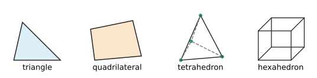{#fig-c6-cell-families width="90%" fig-align="center"}

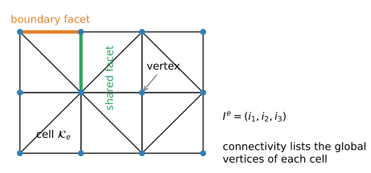{#fig-c6-mesh-concepts width="100%" fig-align="center"}

Two neighboring cells meet along a shared facet. A facet contained in
$\partial\Om$ is a **boundary facet**. This distinction matters because domain
integrals are evaluated over cells, whereas natural boundary conditions produce
integrals over boundary facets.

We also assume that the boundary mesh resolves the boundary-condition
partition: every boundary facet belongs entirely to one prescribed boundary
portion, such as $\Gam_D$ or $\Gam_N$. A change from one boundary type to
another occurs only at a boundary vertex in two dimensions or along a boundary
edge in three dimensions.

For later use, the size of a cell is measured by its diameter,

$$
h_e
=
\operatorname{diam}(\mathcal K_e)
=
\sup_{\bx,\bm y\in\mathcal K_e}\norm{\bx-\bm y}_2,
\qquad
h=\max_e h_e.
$$ {#eq-c6-mesh-size}

The number $h$ records the largest cell size. Chapter 7 will add conditions on
cell shape when it studies approximation error; those conditions are not
needed for the constructions in this chapter.

For a triangular mesh, let the global mesh vertices be

$$
\bx_1,\bx_2,\ldots,\bx_{N_v}\in\R^2.
$$

Each triangle has three local vertices. The connectivity map

$$
I^e:\{1,2,3\}\longrightarrow\{1,\ldots,N_v\}
$$ {#eq-c6-triangle-connectivity}

assigns each local vertex of cell $\mathcal K_e$ to its global vertex. If

$$
I^e=(4,7,9),
$$

then local vertices 1, 2, and 3 of cell $e$ are global vertices 4, 7, and 9.
The physical coordinates of the cell are therefore

$$
\bx_1^e=\bx_4,
\qquad
\bx_2^e=\bx_7,
\qquad
\bx_3^e=\bx_9.
$$

The geometry and connectivity play the same roles as in Chapter 5. The
coordinates determine the physical shape of each cell; the connectivity tells
us which global degrees of freedom are shared by neighboring cells.

It is useful to distinguish a **vertex**, which is a geometric entity of the
mesh, from an interpolation **node**, at which a nodal degree of freedom is
defined. For the linear triangular and bilinear quadrilateral elements used in
this chapter, the nodes are the cell vertices. For higher-order elements,
additional nodes may lie on edges, faces, or in the cell interior.

A mesh may contain many more entities than vertices and cells. In practical
finite element software, facets and edges are often stored or generated because
boundary conditions, interface terms, and adjacency queries require them. For
the constructions below, however, the key starting data are the cell
coordinates and connectivity.

::: {#exr-c6-mesh-connectivity}
## Reading a triangular mesh

Suppose the global vertices of two triangles are numbered
$1,2,3,4$, with

$$
\bx_1=(0,0),\quad
\bx_2=(1,0),\quad
\bx_3=(0,1),\quad
\bx_4=(1,1),
$$

and the cell connectivities are

$$
I^1=(1,2,3),
\qquad
I^2=(2,4,3).
$$

1. Identify the facet shared by the two cells.
2. List the boundary facets of the two-cell mesh.
3. State which global vertices receive contributions from both cells.
4. Explain why the shared facet is not part of the exterior boundary.
5. Check whether the two cells form a conforming mesh according to the
   definition above.
:::

## The linear triangular element on a physical triangle {#sec-c6-p1-triangle}

We begin with the simplest conforming two-dimensional element: a scalar
linear triangular element. The cell

$$
\mathcal K_e
=
\operatorname{conv}
\{\bx_1^e,\bx_2^e,\bx_3^e\}
$$

is the convex hull of the three noncollinear vertices
$\bx_a^e=(x_a^e,y_a^e)$, $a=1,2,3$. In this setting, the convex hull is simply
the filled triangle consisting of the vertices, edges, and interior.

The local polynomial space is

$$
\mathbb P_1(\mathcal K_e)
=
\operatorname{span}\{1,x,y\}.
$$ {#eq-c6-p1-space}

It has dimension three. We use the three vertex evaluations

$$
N_a(w)=w(\bx_a^e),
\qquad a=1,2,3,
$$

as the local degrees of freedom. In the terminology of @def-c5-finite-element,

$$
\left(
\mathcal K_e,
\mathbb P_1(\mathcal K_e),
\{N_1,N_2,N_3\}
\right)
$$

is a finite element.

As in the one-dimensional construction, we want one local basis function for
each nodal degree of freedom. The basis function $\phi_a^e$ must be linear on
the triangle and satisfy

$$
\phi_a^e(\bx_b^e)=\delta_{ab},
\qquad
a,b\in\{1,2,3\}.
$$ {#eq-c6-triangle-nodal-property}

A linear polynomial in two variables has the form

$$
\phi_a^e(x,y)
=
\alpha_a+\beta_a x+\gamma_a y.
$$ {#eq-c6-triangle-linear-polynomial}

The three nodal conditions determine the three coefficients. For each local
basis function,

$$
\begin{bmatrix}
1 & x_1^e & y_1^e\\
1 & x_2^e & y_2^e\\
1 & x_3^e & y_3^e
\end{bmatrix}
\begin{bmatrix}
\alpha_a\\
\beta_a\\
\gamma_a
\end{bmatrix}
=
\begin{bmatrix}
\delta_{a1}\\
\delta_{a2}\\
\delta_{a3}
\end{bmatrix}.
$$ {#eq-c6-physical-triangle-system}

The determinant of the matrix on the left has magnitude
$2|\mathcal K_e|$. It is therefore nonsingular when the three vertices are not
collinear. The vertex values uniquely determine a function in
$\mathbb P_1(\mathcal K_e)$, so the three degrees of freedom are unisolvent.

Because $\phi_a^e$ is linear, its gradient is constant on the cell:

$$
\grad\phi_a^e
=
\begin{bmatrix}
\beta_a\\
\gamma_a
\end{bmatrix}.
$$ {#eq-c6-p1-constant-gradient}

This is the two-dimensional analogue of the constant derivative of a
one-dimensional linear shape function.

The three nodal basis functions are also called the **barycentric coordinate
functions** of the triangle. The function $\phi_a^e$ equals one at vertex $a$,
vanishes on the edge opposite that vertex, and varies linearly between these
values. Inside the triangle,

$$
0\le \phi_a^e\le 1,
\qquad
\phi_1^e+\phi_2^e+\phi_3^e=1.
$$ {#eq-c6-barycentric-properties}

Consequently, every point of the triangle can be written as

$$
\bx
=
\sum_{a=1}^{3}\phi_a^e(\bx)\bx_a^e.
$$ {#eq-c6-barycentric-point}

The values $\phi_a^e(\bx)$ are the barycentric coordinates of $\bx$ relative
to the three vertices.

### A concrete physical triangle

Take the triangle with vertices

$$
\bx_1=(0,0),
\qquad
\bx_2=(2,0),
\qquad
\bx_3=(0,1).
$$

Solving @eq-c6-physical-triangle-system gives

$$
\phi_1(x,y)
=
1-\frac{x}{2}-y,
\qquad
\phi_2(x,y)
=
\frac{x}{2},
\qquad
\phi_3(x,y)
=
y.
$$ {#eq-c6-example-triangle-basis}

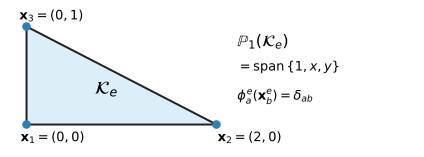{#fig-c6-physical-p1 width="90%" fig-align="center"}

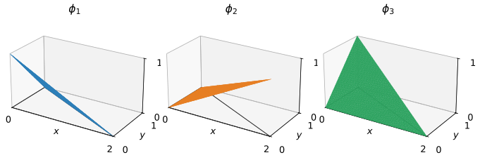{#fig-c6-p1-basis-surfaces width="100%" fig-align="center"}

Their gradients are

$$
\grad\phi_1
=
\begin{bmatrix}
-1/2\\
-1
\end{bmatrix},
\qquad
\grad\phi_2
=
\begin{bmatrix}
1/2\\
0
\end{bmatrix},
\qquad
\grad\phi_3
=
\begin{bmatrix}
0\\
1
\end{bmatrix}.
$$ {#eq-c6-example-triangle-gradients}

For this triangle, the general partition-of-unity identity in
@eq-c6-barycentric-properties becomes

$$
\phi_1+\phi_2+\phi_3=1.
$$ {#eq-c6-triangle-partition-unity}

For nodal values $U_1^e,U_2^e,U_3^e$, the local finite element field is

$$
u_h|_{\mathcal K_e}
=
U_1^e\phi_1^e
+
U_2^e\phi_2^e
+
U_3^e\phi_3^e.
$$ {#eq-c6-triangle-interpolation}

The nodal interpolation property gives
$u_h(\bx_a^e)=U_a^e$. Thus the interpretation of the coefficients is exactly
the same as in Chapter 5.

::: {#exm-c6-triangle-interpolation}
## Interpolation on the physical triangle

For the triangle in @fig-c6-physical-p1, let

$$
U_1=1,\qquad U_2=3,\qquad U_3=2.
$$

Using @eq-c6-example-triangle-basis,

$$
u_h(x,y)
=
1\left(1-\frac{x}{2}-y\right)
+3\left(\frac{x}{2}\right)
+2y
=
1+x+y.
$$

The gradient is therefore

$$
\grad u_h
=
\begin{bmatrix}
1\\
1
\end{bmatrix}.
$$

The local $P_1$ approximation is a plane over the triangle, just as the
one-dimensional $P_1$ approximation is a straight line over an interval.
:::

::: {#exr-c6-physical-triangle-basis}
## Basis functions on a general physical triangle

For the triangle with vertices
$(1,0)$, $(3,0)$, and $(2,2)$:

1. solve @eq-c6-physical-triangle-system for the three basis functions;
2. verify the nodal interpolation property;
3. verify that the basis functions sum to one; and
4. compute their gradients;
5. Identify the edge on which each basis function vanishes.
6. Use @eq-c6-barycentric-point to recover the point $(2,1)$ from its
   barycentric coordinates.
:::

::: {#exr-c6-affine-reproduction}
## Reproduction of an affine function

Let

$$
p(x,y)=c_0+c_1x+c_2y
$$

be any affine function, and let $p_a=p(\bx_a^e)$ be its values at the vertices
of a nondegenerate triangle. Use @eq-c6-barycentric-point and the
partition-of-unity property to show that

$$
p(\bx)=\sum_{a=1}^{3}p_a\phi_a^e(\bx)
$$

at every point $\bx\in\mathcal K_e$. Thus a $P_1$ triangle reproduces every
affine scalar field exactly.
:::

## From local triangles to a global conforming space {#sec-c6-global-space}

A finite element function is constructed cell by cell, but the final function
must be globally admissible. For the scalar diffusion problem, the natural
energy space is $H^1(\Om)$, so the finite element field must be continuous
across shared facets.

For a triangular $P_1$ mesh, define

$$
\mathcal V_h
=
\left\{
v_h\in C(\overline{\Om}):
v_h|_{\mathcal K_e}\in\mathbb P_1(\mathcal K_e)
\text{ for every }\mathcal K_e\in\mathcal T_h
\right\}.
$$ {#eq-c6-global-p1-space}

One global basis function $\phi_i$ is associated with each global mesh vertex
$\bx_i$. It satisfies

$$
\phi_i(\bx_j)=\delta_{ij}
$$

and is linear on every cell. Its support is the union of the cells incident to
vertex $\bx_i$.

The local and global basis functions are related exactly as in Chapter 5:

$$
\phi_{I^e(a)}|_{\mathcal K_e}
=
\phi_a^e.
$$ {#eq-c6-local-global-restriction}

This relation explains continuity across a shared facet. Consider two
triangles that share an edge with endpoints $\bx_i$ and $\bx_j$. The
restriction of a $P_1$ function to that edge is a one-dimensional linear
polynomial. Both cells use the same nodal values at $\bx_i$ and $\bx_j$, so
both restrictions are the same linear function along the entire shared edge.
The elementwise pieces therefore join continuously.

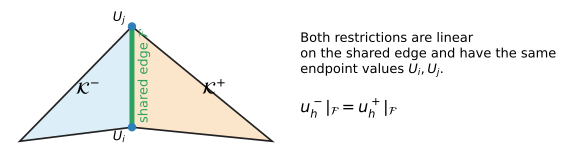{#fig-c6-shared-edge width="95%" fig-align="center"}

Every $u_h\in\mathcal V_h$ has the global representation

$$
u_h(\bx)
=
\sum_{j=1}^{N_v}
U_j\phi_j(\bx),
$$ {#eq-c6-global-p1-expansion}

and the nodal property again gives

$$
U_j=u_h(\bx_j).
$$

The difference from one dimension is geometric rather than algebraic. A global
basis function may now be supported on several triangles surrounding a vertex,
and the pattern of neighboring interactions depends on the mesh connectivity.

::: {#exr-c6-shared-facet-continuity}
## Continuity across a shared edge

Two $P_1$ triangles share the edge connecting global vertices $i$ and $j$.

1. Restrict the finite element function from each triangle to the shared edge.
2. Show that each restriction is a linear function of one edge coordinate.
3. Explain why equality of the values at the two shared vertices implies
   equality along the complete edge.
4. State why the conclusion would fail if one triangle placed an additional,
   independent degree of freedom in the interior of the shared edge.
:::

## Scalar diffusion and element equations {#sec-c6-scalar-diffusion}

We now apply the multidimensional space to the scalar diffusion problem from
@sec-variational-spaces. Let $\Gam_D$ and $\Gam_N$ partition the boundary, and
consider

$$
-\divg(k\grad u)=f
\qquad\text{in }\Om,
$$

with

$$
u=g\quad\text{on }\Gam_D,
\qquad
k\grad u\cdot\bn=h
\quad\text{on }\Gam_N.
$$

The variational problem is

$$
\text{find }u\in\mathcal U_g
\text{ such that}\qquad
a(u,v)=\ell(v)
\qquad\forall v\in\mathcal V_0,
$$

where

$$
a(w,v)
=
\int_\Om
k\,\grad w\cdot\grad v\,\dx,
$$

and

$$
\ell(v)
=
\int_\Om f v\,\dx
+
\int_{\Gam_N}h v\,\ds.
$$ {#eq-c6-diffusion-forms}

The homogeneous finite element test space is

$$
\mathcal V_{h,0}
=
\mathcal V_h\cap\mathcal V_0
=
\left\{
v_h\in\mathcal V_h:
v_h=0\text{ on }\Gam_D
\right\}.
$$ {#eq-c6-discrete-test-space}

To describe nonzero prescribed data, suppose $g$ is continuous on $\Gam_D$ and
let $g_h$ denote its nodal finite element interpolant on that boundary. The
finite element trial space is

$$
\mathcal U_{h,g_h}
=
\left\{
w_h\in\mathcal V_h:
w_h=g_h\text{ on }\Gam_D
\right\}.
$$ {#eq-c6-discrete-trial-space}

In general, $g_h$ is an approximation of $g$ rather than the exact boundary
function. If $g$ is itself piecewise linear on the boundary mesh, then
$g_h=g$. The discrete variational problem is

$$
\text{find }u_h\in\mathcal U_{h,g_h}
\text{ such that}\qquad
a(u_h,v_h)=\ell(v_h)
\qquad
\forall v_h\in\mathcal V_{h,0}.
$$ {#eq-c6-discrete-diffusion}

With the global basis,
$u_h=\sum_j U_j\phi_j$. This sum includes both prescribed and unknown nodal
coefficients. Testing with a basis function $\phi_i$ associated with a free
degree of freedom gives

$$
\sum_j
K_{ij}U_j
=
F_i,
$$

where

$$
K_{ij}
=
\int_\Om
k\,\grad\phi_j\cdot\grad\phi_i\,\dx,
$$

and

$$
F_i
=
\int_\Om f\phi_i\,\dx
+
\int_{\Gam_N}h\phi_i\,\ds.
$$ {#eq-c6-global-diffusion-entries}

After assembly, the terms containing prescribed coefficients are moved to the
right-hand side, exactly as in @eq-c5-reduced-system.

The global domain integral is decomposed cell by cell:

$$
K_{ij}
=
\sum_{e=1}^{N_c}
\int_{\mathcal K_e}
k\,\grad\phi_j\cdot\grad\phi_i\,\dx.
$$

Using @eq-c6-local-global-restriction, define the local stiffness entries

$$
K_{ab}^e
=
\int_{\mathcal K_e}
k\,
\grad\phi_b^e\cdot\grad\phi_a^e
\,\dx,
$$ {#eq-c6-scalar-element-stiffness}

and the local domain-load entries

$$
f_a^e
=
\int_{\mathcal K_e}
f\,\phi_a^e\,\dx.
$$ {#eq-c6-scalar-element-load}

Natural boundary data contribute through boundary facets. If a facet
$\mathcal F\subset\partial\mathcal K_e\cap\Gam_N$, its contribution is

$$
f_a^{\mathcal F}
=
\int_{\mathcal F}
h\,\phi_a^e\,\ds.
$$ {#eq-c6-boundary-facet-load}

To evaluate this integral, map the reference interval
$\widehat{\mathcal F}=[-1,1]$ to the straight physical edge with endpoints
$\bx_i$ and $\bx_j$:

$$
\bx(\zeta)
=
\frac{1-\zeta}{2}\bx_i
+
\frac{1+\zeta}{2}\bx_j.
$$ {#eq-c6-edge-map}

The edge Jacobian is the length of the tangent vector,

$$
J_{\mathcal F}
=
\norm{\frac{\dd\bx}{\dd\zeta}}_2
=
\frac{\norm{\bx_j-\bx_i}_2}{2}
=
\frac{L_{\mathcal F}}{2}.
$$ {#eq-c6-edge-jacobian}

Therefore,

$$
\int_{\mathcal F}h\,\phi_a^e\,\ds
=
\int_{-1}^{1}
h(\bx(\zeta))
\widehat\phi_a(\zeta)
J_{\mathcal F}
\,\dd\zeta.
$$ {#eq-c6-edge-integral-transform}

This is an ordinary one-dimensional integral on the reference edge.

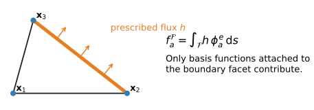{#fig-c6-boundary-facet width="95%" fig-align="center"}

The global load vector therefore receives contributions from both cells and
boundary facets.

::: {#exm-c6-concrete-triangle-matrix}
## Element matrix for the concrete triangle

For the triangle in @fig-c6-physical-p1, the area is

$$
|\mathcal K_e|=1.
$$

If $k$ is constant on the cell, the basis gradients in
@eq-c6-example-triangle-gradients are constant, so

$$
K_{ab}^e
=
k|\mathcal K_e|
\grad\phi_b^e\cdot\grad\phi_a^e.
$$

Hence

$$
\bK^e
=
k
\begin{bmatrix}
5/4 & -1/4 & -1\\
-1/4 & 1/4 & 0\\
-1 & 0 & 1
\end{bmatrix}.
$$ {#eq-c6-example-triangle-stiffness}

If the source $f$ is constant, each linear basis function has average value
$1/3$ over the triangle. Therefore

$$
\bfm^e
=
\frac{f|\mathcal K_e|}{3}
\begin{bmatrix}
1\\
1\\
1
\end{bmatrix}
=
\frac{f}{3}
\begin{bmatrix}
1\\
1\\
1
\end{bmatrix}.
$$ {#eq-c6-example-triangle-load}

As in one dimension,

$$
\bK^e
\begin{bmatrix}
1\\
1\\
1
\end{bmatrix}
=
\bm{0},
$$

because a constant nodal field has zero gradient.
:::

::: {#exm-c6-boundary-edge-load}
## A constant flux on one edge

Let a boundary edge of a $P_1$ triangle have length $L_{\mathcal F}$ and let
the prescribed normal flux be the constant $h_0$. Only the two vertex basis
functions associated with the edge are nonzero on that facet. Their
restrictions are $(1-\zeta)/2$ and $(1+\zeta)/2$. Using
@eq-c6-edge-integral-transform gives

$$
\int_{\mathcal F}h_0\phi_i^e\,\ds
=
\frac{h_0L_{\mathcal F}}{2}
\int_{-1}^{1}\frac{1-\zeta}{2}\,\dd\zeta
=
\frac{h_0L_{\mathcal F}}{2},
$$

and the same value is obtained for the other endpoint. Hence the facet load
vector is

$$
\bfm^{\mathcal F}
=
\frac{h_0L_{\mathcal F}}{2}
\begin{bmatrix}
1\\
1
\end{bmatrix}.
$$

These two entries are assembled into the global load vector at the two global
vertices of the boundary edge.
:::

::: {#exr-c6-edge-integration}
## A linearly varying boundary flux

On a straight edge of length $L_{\mathcal F}$, let the prescribed flux vary
linearly from $h_i$ at endpoint $i$ to $h_j$ at endpoint $j$.

1. Express $h(\zeta)$ using the two linear reference-edge basis functions.
2. Use @eq-c6-edge-integral-transform to derive the two-entry consistent
   facet load vector.
3. Verify that the sum of its entries equals
   $L_{\mathcal F}(h_i+h_j)/2$, the integral of the prescribed flux over the
   edge.
:::

::: {#exr-c6-triangle-element-matrix}
## A $P_1$ diffusion element

For the triangle with vertices
$(0,0)$, $(1,0)$, and $(0,1)$:

1. derive the three basis functions;
2. compute their gradients;
3. derive the element stiffness matrix for constant $k$;
4. derive the element load vector for constant $f$; and
5. verify that the row sums of the stiffness matrix are zero.
:::

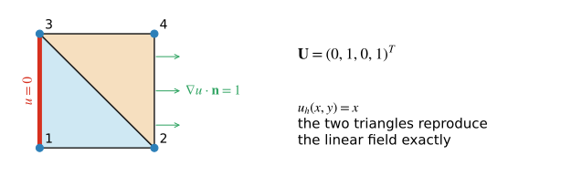{#fig-c6-two-triangle-patch width="90%" fig-align="center"}

::: {#exm-c6-two-triangle-solution}
## Assembly and solution on two triangles

Consider the unit square with vertices

$$
\bx_1=(0,0),\quad
\bx_2=(1,0),\quad
\bx_3=(0,1),\quad
\bx_4=(1,1),
$$

and triangle connectivities

$$
I^1=(1,2,3),
\qquad
I^2=(2,4,3).
$$

Let $k=1$ and $f=0$. Prescribe $u=0$ on the left boundary,
$\grad u\cdot\bn=1$ on the right boundary, and zero normal flux on the top and
bottom boundaries.

Direct calculation gives

$$
\bK^1
=
\frac12
\begin{bmatrix}
2&-1&-1\\
-1&1&0\\
-1&0&1
\end{bmatrix},
\qquad
\bK^2
=
\frac12
\begin{bmatrix}
1&-1&0\\
-1&2&-1\\
0&-1&1
\end{bmatrix}.
$$

Scatter-adding these matrices with the two connectivity maps produces

$$
\bK
=
\begin{bmatrix}
1&-1/2&-1/2&0\\
-1/2&1&0&-1/2\\
-1/2&0&1&-1/2\\
0&-1/2&-1/2&1
\end{bmatrix}.
$$ {#eq-c6-two-triangle-global-matrix}

The right boundary edge has length one, so the constant-flux calculation in
@exm-c6-boundary-edge-load gives

$$
\bF
=
\begin{bmatrix}
0&1/2&0&1/2
\end{bmatrix}^T.
$$

The entries are ordered by global vertices $1,2,3,4$.

The prescribed coefficients are $U_1=U_3=0$. The equations for the two free
coefficients are

$$
\begin{bmatrix}
1&-1/2\\
-1/2&1
\end{bmatrix}
\begin{bmatrix}
U_2\\U_4
\end{bmatrix}
=
\begin{bmatrix}
1/2\\1/2
\end{bmatrix},
$$

which gives $U_2=U_4=1$. Therefore the assembled finite element field is
$u_h(x,y)=x$ on both triangles. This linear field satisfies the differential
equation and all four boundary conditions, so the two-element mesh reproduces
the exact solution.
:::

::: {#exr-c6-two-triangle-source}
## Reusing the two-triangle mesh

On the mesh in @exm-c6-two-triangle-solution, set $k=1$, $f=1$, prescribe
$u=0$ on the left boundary, and prescribe zero normal flux elsewhere.

1. Derive the element load vector on each triangle.
2. Assemble the global load vector.
3. Solve the two-by-two reduced system for $U_2$ and $U_4$.
4. Write the resulting piecewise-linear function separately on each triangle.
:::

## Reference triangles and coordinate mappings {#sec-c6-reference-triangle}

The physical-triangle construction shows exactly what the basis functions mean,
but an implementation should not solve a new interpolation system on every
cell. As in Chapter 5, we define basis functions once on a reference cell and
map them to the physical cells.

For triangles, use the reference cell

$$
\widehat{\mathcal K}
=
\left\{
(\xi,\eta):
\xi\ge0,\ \eta\ge0,\ \xi+\eta\le1
\right\},
$$ {#eq-c6-reference-triangle}

with reference vertices

$$
\widehat{\bx}_1=(0,0),
\qquad
\widehat{\bx}_2=(1,0),
\qquad
\widehat{\bx}_3=(0,1).
$$

We collect the reference coordinates as

$$
\bm{\xi}
=
\begin{bmatrix}\xi&\eta\end{bmatrix}^T.
$$

The reference $P_1$ basis functions are

$$
\widehat\phi_1(\xi,\eta)
=
1-\xi-\eta,
\qquad
\widehat\phi_2(\xi,\eta)
=
\xi,
\qquad
\widehat\phi_3(\xi,\eta)
=
\eta.
$$ {#eq-c6-reference-triangle-basis}

For the physical triangle with vertices
$\bx_1^e,\bx_2^e,\bx_3^e$, define the affine map

$$
\bx
=
F_e(\bm{\xi})
=
\bx_1^e
+
\bm{J}_e
\begin{bmatrix}
\xi\\
\eta
\end{bmatrix},
$$ {#eq-c6-affine-triangle-map}

where

$$
\bm{J}_e
=
\begin{bmatrix}
x_2^e-x_1^e & x_3^e-x_1^e\\
y_2^e-y_1^e & y_3^e-y_1^e
\end{bmatrix}.
$$ {#eq-c6-triangle-jacobian}

The two columns of $\bm J_e$ are the physical edge vectors from local vertex 1
to local vertices 2 and 3.

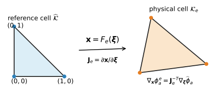{#fig-c6-reference-triangle-map width="95%" fig-align="center"}

The determinant measures the change in area:

$$
\dd x
=
|\det\bm J_e|\,
\dd\bm{\xi},
$$ {#eq-c6-area-transform}

where $\dd\bm{\xi}=\dd\xi\,\dd\eta$. Since the reference triangle has area
$1/2$,

$$
|\mathcal K_e|
=
\frac12|\det\bm J_e|.
$$ {#eq-c6-triangle-area-jacobian}

A valid affine triangle map requires $\det\bm J_e\ne0$. In a consistently
oriented mesh, the local vertex ordering is usually chosen so that
$\det\bm J_e>0$. In two dimensions this is obtained by listing the three local
vertices counterclockwise.

### Transformation of gradients

The physical basis function is

$$
\phi_a^e(\bx)
=
\widehat\phi_a(F_e^{-1}(\bx)).
$$

The gradient transformation follows from the chain rule. Since

$$
\widehat\phi_a(\bm{\xi})
=
\phi_a^e(F_e(\bm{\xi})),
$$

differentiation with respect to the reference coordinate gives

$$
\grad_{\bm{\xi}}\widehat\phi_a
=
\bm J_e^T
\grad_{\bx}\phi_a^e.
$$

Therefore,

$$
\boxed{
\grad_{\bx}\phi_a^e
=
\bm J_e^{-T}
\grad_{\bm{\xi}}\widehat\phi_a.
}
$$ {#eq-c6-gradient-transform}

This formula is the multidimensional counterpart of the one-dimensional factor
$1/J_e$ in Chapter 5. The difference is that the Jacobian is now a matrix and
the gradient is a vector.

For a two-dimensional triangle,
$\bm J_e\in\R^{2\times2}$,
$\grad_{\bm{\xi}}\widehat\phi_a\in\R^2$, and
$\grad_{\bx}\phi_a^e\in\R^2$. The inverse transpose follows directly from
solving the chain-rule relation
$\grad_{\bm{\xi}}\widehat\phi_a=\bm J_e^T\grad_{\bx}\phi_a^e$ for the physical
gradient.

::: {#exm-c6-reference-map-concrete}
## Mapping the concrete triangle

For the physical triangle with vertices
$(0,0)$, $(2,0)$, and $(0,1)$,

$$
\bm J_e
=
\begin{bmatrix}
2&0\\
0&1
\end{bmatrix},
\qquad
\det\bm J_e=2.
$$

Hence $|\mathcal K_e|=\tfrac12(2)=1$, as used previously. Moreover,

$$
\grad_{\bx}\phi_a^e
=
\begin{bmatrix}
1/2&0\\
0&1
\end{bmatrix}
\grad_{\bm{\xi}}\widehat\phi_a,
$$

which recovers the physical gradients in
@eq-c6-example-triangle-gradients.
:::

::: {#exr-c6-gradient-transform}
## Checking the gradient transformation

For a physical triangle with vertices
$(1,1)$, $(4,1)$, and $(2,3)$:

1. form $\bm J_e$ and compute its determinant;
2. calculate the physical area;
3. compute $\bm J_e^{-T}$;
4. transform the three reference gradients; and
5. construct the physical basis functions
   $\phi_a^e=\widehat\phi_a\circ F_e^{-1}$ and verify that their directly
   computed gradients agree with the transformed gradients from Part 4.
:::

## Multidimensional quadrature and boundary integration {#sec-c6-quadrature}

After transformation to a reference cell, a typical element integral has the
form

$$
\int_{\mathcal K_e}
g(\bx)\,\dx
=
\int_{\widehat{\mathcal K}}
g(F_e(\bm{\xi}))
|\det\bm J_e(\bm{\xi})|
\,\dd\bm{\xi}.
$$ {#eq-c6-reference-integration}

For affine triangles, $\bm J_e$ is constant. For more general isoparametric
cells, the Jacobian may vary across the cell.

A quadrature rule on the reference triangle approximates

$$
\int_{\widehat{\mathcal K}}
g(\xi,\eta)\,\dd\xi\,\dd\eta
\approx
\sum_{q=1}^{n_q}
w_qg(\xi_q,\eta_q).
$$ {#eq-c6-triangle-quadrature}

For the reference triangle in @eq-c6-reference-triangle, useful low-order rules
include:

| rule | points | weights | polynomial exactness |
|---|---|---|---|
| one point | $(1/3,1/3)$ | $1/2$ | degree 1 |
| three point | $(1/6,1/6)$, $(2/3,1/6)$, $(1/6,2/3)$ | $1/6$ each | degree 2 |

The weights sum to $1/2$, the area of the reference triangle.

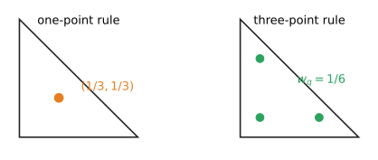{#fig-c6-triangle-quadrature width="80%" fig-align="center"}

The transformed scalar-diffusion stiffness entry is

$$
K_{ab}^e
=
\int_{\widehat{\mathcal K}}
k(F_e(\bm{\xi}))
\left(
\bm J_e^{-T}
\grad_{\bm{\xi}}\widehat\phi_b
\right)
\cdot
\left(
\bm J_e^{-T}
\grad_{\bm{\xi}}\widehat\phi_a
\right)
|\det\bm J_e|
\,\dd\bm{\xi}.
$$ {#eq-c6-reference-stiffness}

For a $P_1$ affine triangle with constant $k$, the physical gradients and the
Jacobian are constant, so the stiffness integrand is constant. A one-point rule
is therefore sufficient. More complicated coefficients, higher-order basis
functions, or nonaffine geometry may require higher-order quadrature.

For example, the element load entry is approximated by

$$
f_a^e
\approx
\sum_{q=1}^{n_q}
w_q
f(F_e(\bm\xi_q))
\widehat\phi_a(\bm\xi_q)
|\det\bm J_e(\bm\xi_q)|.
$$ {#eq-c6-triangle-load-quadrature}

For constant $f$ on an affine $P_1$ triangle, the integrand is linear. The
one-point rule gives

$$
f_a^e
=
\frac12 f\frac13|\det\bm J_e|
=
\frac{f|\mathcal K_e|}{3},
$$

which agrees with @eq-c6-example-triangle-load.

Boundary-facet integrals are transformed separately. In two dimensions a facet
is a line segment, so the one-dimensional quadrature rules from Chapter 5 can
be reused on a reference edge. In three dimensions a facet is a two-dimensional
surface and requires a surface quadrature rule.

::: {#exr-c6-triangle-quadrature}
## Triangle quadrature

1. Verify that the one-point rule integrates the three reference basis
   functions exactly.
2. Verify that the three-point rule integrates
   $\xi^2$, $\xi\eta$, and $\eta^2$ exactly.
3. Explain why the one-point rule is sufficient for the stiffness matrix of a
   $P_1$ affine triangle with constant diffusivity.
4. Determine whether the one-point rule exactly evaluates the load vector when
   $f(x,y)=x+y$ and the geometry map is affine.
:::

## Quadrilateral cells {#sec-c6-quadrilateral}

An affine map sends the reference triangle to any physical triangle. A general
four-sided cell requires a different construction because an affine map can
produce only a parallelogram. The standard four-node quadrilateral begins with
the reference square

$$
\widehat{\mathcal K}=[-1,1]^2
$$

and the tensor-product polynomial space

$$
\mathbb Q_1(\widehat{\mathcal K})
=
\operatorname{span}\{1,\xi,\eta,\xi\eta\}.
$$ {#eq-c6-q1-space}

The notation $\mathbb Q_1$ means that the polynomial degree is at most one in
each coordinate separately. The product $\xi\eta$ is therefore included even
though its total degree is two. The four local nodes are ordered

$$
(-1,-1),\qquad (1,-1),\qquad (1,1),\qquad (-1,1),
$$

and the corresponding nodal basis functions are

$$
\begin{aligned}
\widehat\phi_1(\xi,\eta)
&=\frac14(1-\xi)(1-\eta),&
\widehat\phi_2(\xi,\eta)
&=\frac14(1+\xi)(1-\eta),\\
\widehat\phi_3(\xi,\eta)
&=\frac14(1+\xi)(1+\eta),&
\widehat\phi_4(\xi,\eta)
&=\frac14(1-\xi)(1+\eta).
\end{aligned}
$$ {#eq-c6-q1-basis}

They satisfy the nodal interpolation property and sum to one. Each restriction
to a reference edge is a one-dimensional linear function.

### Isoparametric geometry and field interpolation

The geometry map is defined by

$$
\bx
=
F_e(\xi,\eta)
=
\sum_{a=1}^{4}
\widehat\phi_a(\xi,\eta)\bx_a^e.
$$ {#eq-c6-q1-map}

The same reference functions are used to interpolate the finite element field,

$$
u_h(F_e(\xi,\eta))
=
\sum_{a=1}^{4}
U_a^e\widehat\phi_a(\xi,\eta).
$$ {#eq-c6-q1-field}

Using the same basis for the geometry and the field is the **isoparametric
construction** introduced in Chapter 5.

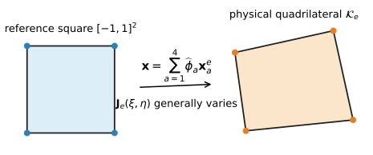{#fig-c6-q1-map width="95%" fig-align="center"}

The physical basis is again obtained by composition,

$$
\phi_a^e(\bx)
=
\widehat\phi_a(F_e^{-1}(\bx)).
$$

For a general quadrilateral, the Jacobian matrix

$$
\bm J_e(\xi,\eta)
=
\begin{bmatrix}
\partial x/\partial\xi&\partial x/\partial\eta\\
\partial y/\partial\xi&\partial y/\partial\eta
\end{bmatrix}
$$ {#eq-c6-q1-jacobian}

varies across the cell. Consequently, $\bm J_e^{-T}$ and
$|\det\bm J_e|$ must be evaluated at every quadrature point. A valid,
orientation-preserving element must satisfy

$$
\det\bm J_e(\xi,\eta)>0
\qquad
\text{throughout }\widehat{\mathcal K}.
$$ {#eq-c6-q1-validity}

If the physical cell is a parallelogram, the map reduces to an affine map and
$\bm J_e$ is constant. For a non-parallelogram, the map is bilinear and the
mapped basis functions are generally not polynomials in the physical
coordinates $(x,y)$.

::: {#exm-c6-q1-map}
## Jacobian of a nonrectangular quadrilateral

Consider the physical vertices

$$
\bx_1=(0,0),\quad
\bx_2=(2,0),\quad
\bx_3=(5/2,1),\quad
\bx_4=(0,1).
$$

Substitution into @eq-c6-q1-map gives

$$
x(\xi,\eta)
=
(1+\xi)\left(\frac98+\frac18\eta\right),
\qquad
y(\xi,\eta)=\frac{1+\eta}{2}.
$$

Therefore,

$$
\bm J_e(\xi,\eta)
=
\begin{bmatrix}
9/8+\eta/8&(1+\xi)/8\\
0&1/2
\end{bmatrix},
\qquad
\det\bm J_e
=
\frac{9+\eta}{16}.
$$ {#eq-c6-q1-example-jacobian}

The determinant varies between $1/2$ and $5/8$ on the reference square and is
positive everywhere. The mapping is valid, but geometric factors must be
recomputed at each quadrature point.
:::

A tensor-product Gauss rule is natural on the reference square. A $2\times2$
rule uses the four combinations

$$
(\xi_q,\eta_q)
\in
\left\{-\frac1{\sqrt3},\frac1{\sqrt3}\right\}
\times
\left\{-\frac1{\sqrt3},\frac1{\sqrt3}\right\},
$$ {#eq-c6-q1-gauss-points}

with unit weights. At each point, the implementation evaluates the reference
basis, $\bm J_e$, $\det\bm J_e$, the transformed gradients, and the integrand.

::: {#exr-c6-q1-properties}
## Properties and integration of a $Q_1$ element

1. Verify the nodal interpolation and partition-of-unity properties of
   @eq-c6-q1-basis.
2. Show that the restriction of the four basis functions to each reference
   edge is linear.
3. For the element in @exm-c6-q1-map, evaluate $F_e$, $\bm J_e$, and
   $\det\bm J_e$ at the four points in @eq-c6-q1-gauss-points.
4. Map the four Gauss points to the physical element.
5. Explain why one constant Jacobian cannot be used for this element.
:::

## Tetrahedral cells {#sec-c6-tetrahedron}

The three-dimensional analogue of a triangle is a tetrahedron. The reference
tetrahedron is

$$
\widehat{\mathcal K}
=
\left\{(\xi,\eta,\zeta):
\xi,\eta,\zeta\ge0,
\ \xi+\eta+\zeta\le1
\right\}.
$$ {#eq-c6-reference-tetrahedron}

Its four vertices are the origin and the three Cartesian unit vectors. The
$P_1$ nodal basis is

$$
\widehat\phi_1=1-\xi-\eta-\zeta,
\qquad
\widehat\phi_2=\xi,
\qquad
\widehat\phi_3=\eta,
\qquad
\widehat\phi_4=\zeta.
$$ {#eq-c6-tetra-p1-basis}

In this subsection the reference-coordinate vector is

$$
\bm\xi
=
\begin{bmatrix}\xi&\eta&\zeta\end{bmatrix}^T.
$$

For physical vertices $\bx_1^e,\ldots,\bx_4^e$, the affine map is

$$
F_e(\bm\xi)
=
\bx_1^e
+
\bm J_e
\begin{bmatrix}\xi\\\eta\\\zeta\end{bmatrix},
\qquad
\bm J_e
=
\begin{bmatrix}
\bx_2^e-\bx_1^e&
\bx_3^e-\bx_1^e&
\bx_4^e-\bx_1^e
\end{bmatrix}.
$$ {#eq-c6-tetra-map}

The reference tetrahedron has volume $1/6$, so

$$
|\mathcal K_e|
=
\frac{|\det\bm J_e|}{6}.
$$ {#eq-c6-tetra-volume}

With a consistent orientation, the local vertex ordering is chosen so that
$\det\bm J_e>0$.

The volume and gradient transformations have exactly the same form as in two
dimensions:

$$
\dx=|\det\bm J_e|\,\dd\bm\xi,
\qquad
\grad_{\bx}\phi_a^e
=
\bm J_e^{-T}\grad_{\bm\xi}\widehat\phi_a.
$$

The centroid rule evaluates the integrand at

$$
\bm\xi_q
=
\begin{bmatrix}1/4&1/4&1/4\end{bmatrix}^T
$$

with weight $w_q=1/6$. It integrates every polynomial of total degree at most
one exactly on the reference tetrahedron.

::: {#exr-c6-tetra-basis}
## A physical tetrahedron

Consider the tetrahedron with vertices

$$
(0,0,0),\qquad(2,0,0),\qquad(0,1,0),\qquad(0,0,3).
$$

1. Form $\bm J_e$ and compute the physical volume.
2. Compute the four physical basis gradients.
3. Verify that the gradients sum to zero.
4. For constant $k$, write the $4\times4$ element stiffness matrix in the form
   $K_{ab}^e=k|\mathcal K_e|\grad\phi_b^e\cdot\grad\phi_a^e$.
:::

## Hexahedral cells {#sec-c6-hexahedron}

A hexahedron is the three-dimensional tensor-product analogue of a
quadrilateral. On the reference cube $[-1,1]^3$, associate each vertex with a
sign triple $(\xi_a,\eta_a,\zeta_a)\in\{-1,1\}^3$. The eight trilinear basis
functions can be written compactly as

$$
\widehat\phi_a(\xi,\eta,\zeta)
=
\frac18
(1+\xi_a\xi)
(1+\eta_a\eta)
(1+\zeta_a\zeta),
\qquad a=1,\ldots,8.
$$ {#eq-c6-hex-q1-basis}

Their span is

$$
\mathbb Q_1
=
\operatorname{span}
\{1,\xi,\eta,\zeta,\xi\eta,\xi\zeta,\eta\zeta,\xi\eta\zeta\}.
$$

The geometry map $\bx=\sum_a\widehat\phi_a\bx_a^e$ is trilinear, and a
general physical hexahedron has a Jacobian that varies within the cell. Volume
integrals use

$$
\int_{\mathcal K_e}g(\bx)\,\dx
=
\int_{[-1,1]^3}
g(F_e(\bm\xi))|\det\bm J_e(\bm\xi)|\,\dd\bm\xi.
$$

A valid orientation-preserving hexahedral map must satisfy
$\det\bm J_e(\bm\xi)>0$ throughout the reference cube.

Tensor-product Gauss quadrature forms the three-dimensional quadrature points
from one-dimensional Gauss points. The same sequence—map points, evaluate the
Jacobian, transform gradients, and accumulate local arrays—therefore applies
to triangles, quadrilaterals, tetrahedra, and hexahedra.

::: {#exr-c6-hexahedron}
## The reference $Q_1$ hexahedron

1. Verify the nodal property of @eq-c6-hex-q1-basis at the eight sign triples.
2. Verify that the eight functions sum to one.
3. How many points are produced by a $2\times2\times2$ tensor-product Gauss
   rule?
4. Explain why the Jacobian is constant for an affine parallelepiped, including
   a rectangular box, but may vary for a general distorted hexahedron.
:::

## Vector-valued approximation and linear elasticity {#sec-c6-elasticity}

The scalar construction extends naturally to vector-valued fields. In
two-dimensional elasticity, the displacement has two components,

$$
\bu(\bx)
=
\begin{bmatrix}
u_1(\bx)\\
u_2(\bx)
\end{bmatrix},
$$

so each nodal vertex of a displacement-based element carries two displacement
degrees of freedom.

Let $\mathcal V_h$ be the scalar finite element space. Its vector-valued
counterpart is

$$
\mathcal V_h(\Om;\R^2)
=
\left\{
\bm w_h:\Om\to\R^2:
w_{h1},w_{h2}\in\mathcal V_h
\right\}.
$$ {#eq-c6-vector-fe-space}

Using the displacement boundary data from @eq-model-elasticity-spaces, define

$$
\begin{aligned}
\mathcal U_{h,\overline{\bu}_h}
&=\{\bm w_h\in\mathcal V_h(\Om;\R^2):
\bm w_h=\overline{\bu}_h\text{ on }\Gam_u\},\\
\mathcal V_{h,0}
&=\{\bv_h\in\mathcal V_h(\Om;\R^2):
\bv_h=\bm 0\text{ on }\Gam_u\}.
\end{aligned}
$$ {#eq-c6-elasticity-discrete-spaces}

Here $\overline{\bu}_h$ is the finite element interpolation of the prescribed
boundary displacement. The discrete elasticity problem is the restriction of
@eq-model-linear-elasticity-weak to these spaces:

$$
\left.
\begin{aligned}
&\text{Find }\bu_h\in\mathcal U_{h,\overline{\bu}_h}\text{ such that}\\
&\int_{\Om}
\beps(\bv_h):\mathbb C:\beps(\bu_h)\,\dx
=
\int_{\Om}\rho\bb\cdot\bv_h\,\dx
+
\int_{\Gam_t}\overline{\bt}\cdot\bv_h\,\ds
\quad\forall\bv_h\in\mathcal V_{h,0}.
\end{aligned}
\right\}
\qquad\text{Discrete variational problem}
$$ {#eq-c6-discrete-elasticity}

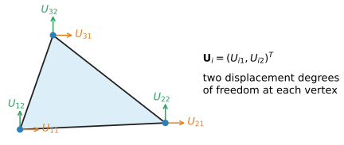{#fig-c6-vector-dofs width="90%" fig-align="center"}

Using the scalar basis functions $\phi_i$, write

$$
\bu_h(\bx)
=
\sum_i
\phi_i(\bx)\bm U_i,
\qquad
\bm U_i
=
\begin{bmatrix}
U_{i1}\\
U_{i2}
\end{bmatrix}.
$$ {#eq-c6-vector-global-expansion}

On one three-node triangle,

$$
\bu_h|_{\mathcal K_e}
=
\sum_{a=1}^{3}
\phi_a^e\bm U_a^e.
$$

Collect the six element coefficients as

$$
\bU^e
=
\begin{bmatrix}
U_{11}^e&
U_{12}^e&
U_{21}^e&
U_{22}^e&
U_{31}^e&
U_{32}^e
\end{bmatrix}^T.
$$

The ordering is by vertex: the two components at vertex 1 are followed by the
two components at vertex 2 and then those at vertex 3. Other orderings are
possible, but the element degree-of-freedom map and every element matrix must
use the same ordering.

Then

$$
\bu_h|_{\mathcal K_e}
=
\bN^e\bU^e,
$$

with

$$
\bN^e
=
\begin{bmatrix}
\phi_1^e&0&\phi_2^e&0&\phi_3^e&0\\
0&\phi_1^e&0&\phi_2^e&0&\phi_3^e
\end{bmatrix}.
$$ {#eq-c6-elasticity-N}

Using the engineering-strain ordering in @eq-model-voigt-vectors,

$$
\beps_{\mathrm V}
=
\begin{bmatrix}
\varepsilon_{11}\\
\varepsilon_{22}\\
\gamma_{12}
\end{bmatrix},
$$

the element strain is

$$
\beps_{\mathrm V}
=
\bB^e\bU^e,
$$

where

$$
\bB^e
=
\begin{bmatrix}
\phi_{1,x}^e&0&
\phi_{2,x}^e&0&
\phi_{3,x}^e&0\\
0&\phi_{1,y}^e&
0&\phi_{2,y}^e&
0&\phi_{3,y}^e\\
\phi_{1,y}^e&\phi_{1,x}^e&
\phi_{2,y}^e&\phi_{2,x}^e&
\phi_{3,y}^e&\phi_{3,x}^e
\end{bmatrix}.
$$ {#eq-c6-elasticity-B}

For a $P_1$ triangle, the basis gradients are constant, so $\bB^e$ is constant
on the cell. This is the familiar constant-strain triangle.

Let $\bm C_{\mathrm V}$ be the plane-stress or plane-strain constitutive matrix
consistent with @eq-model-voigt-constitutive-law. The element stiffness matrix
is

$$
\bK^e
=
\int_{\mathcal K_e}
(\bB^e)^T
\bm C_{\mathrm V}
\bB^e
\,\dx.
$$ {#eq-c6-elasticity-stiffness}

The body-force and traction contributions are

$$
\bfm^e
=
\int_{\mathcal K_e}
(\bN^e)^T\rho\bb\,\dx
+
\int_{\partial\mathcal K_e\cap\Gam_t}
(\bN^e)^T\overline{\bt}\,\ds.
$$ {#eq-c6-elasticity-load}

These two-dimensional formulas are written per unit out-of-plane thickness. If
the model represents a body with constant thickness $t$, both the domain and
edge contributions are multiplied by $t$.

The mathematical pattern is the same as for scalar diffusion: basis functions
define the approximation, derivatives form the element strain or gradient
operator, element integrals produce local arrays, and connectivity determines
where those arrays enter the global system.

::: {#exm-c6-cst-strain}
## Strain in a constant-strain triangle

For the triangle in @fig-c6-physical-p1, the basis gradients in
@eq-c6-example-triangle-gradients give

$$
\bB^e
=
\begin{bmatrix}
-1/2&0&1/2&0&0&0\\
0&-1&0&0&0&1\\
-1&-1/2&0&1/2&1&0
\end{bmatrix}.
$$ {#eq-c6-cst-example-B}

Consider the affine displacement field

$$
\bu(x,y)
=
\begin{bmatrix}
2x+y\\
-x+3y
\end{bmatrix}.
$$

Its nodal coefficient vector is

$$
\bU^e
=
\begin{bmatrix}
0&0&4&-2&1&3
\end{bmatrix}^T.
$$

Multiplication by @eq-c6-cst-example-B gives

$$
\beps_{\mathrm V}
=
\bB^e\bU^e
=
\begin{bmatrix}
2\\3\\0
\end{bmatrix}.
$$

The first two entries are $\varepsilon_{11}$ and $\varepsilon_{22}$. The third
is the engineering shear strain
$\gamma_{12}=u_{1,2}+u_{2,1}=1-1=0$. Because the element reproduces affine
displacements, it reproduces their constant strains exactly.
:::

::: {#exr-c6-cst-rigid-motion}
## Rigid motions and the constant-strain triangle

Use @eq-c6-cst-example-B to verify the following statements.

1. If every node is given the same translation $(c_1,c_2)^T$, then
   $\bB^e\bU^e=\bm 0$.
2. The infinitesimal rigid rotation
   $\bu(x,y)=(-\theta y,\theta x)^T$ also gives
   $\bB^e\bU^e=\bm 0$.
3. Explain why these results are required of a physically meaningful linear
   elastic element.
:::

::: {#exr-c6-elasticity-dofs}
## Local and global displacement degrees of freedom

A two-dimensional triangular mesh has global vertices
$1,2,3,4$ and cells

$$
I^1=(1,2,3),
\qquad
I^2=(2,4,3).
$$

Assume two displacement components per vertex.

1. Give one consistent global numbering of the eight displacement degrees of
   freedom.
2. Write the six global degree-of-freedom numbers associated with each cell.
3. Identify which displacement degrees of freedom are shared by the two
   triangles.
4. Explain how the scalar vertex connectivity is expanded into a vector-valued
   degree-of-freedom map.
:::

## Assembly and essential boundary conditions {#sec-c6-assembly}

For scalar $P_1$ diffusion, each triangular cell has three local degrees of
freedom. For two-dimensional displacement elasticity, the same triangle has
six. The local-to-global assembly rule itself is unchanged.

If local scalar indices $a,b$ correspond to global indices
$I^e(a),I^e(b)$,

$$
K_{I^e(a),I^e(b)}
\mathrel{+}=
K_{ab}^e,
\qquad
F_{I^e(a)}
\mathrel{+}=
f_a^e.
$$ {#eq-c6-scalar-assembly}

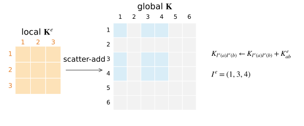{#fig-c6-assembly-scatter width="95%" fig-align="center"}

For vector-valued elements, the element degree-of-freedom map replaces the
vertex map in this rule. A vertex shared by several cells contributes the same
global displacement components to each incident cell.

The global stiffness matrix remains sparse because a basis function interacts
only with basis functions supported on cells that overlap its support. In two
and three dimensions, the sparsity pattern is no longer a simple narrow band
under arbitrary numbering, but it still reflects mesh adjacency.

Essential boundary conditions are imposed on global degrees of freedom
associated with the prescribed boundary. The same partitioning from Chapter 5
applies:

$$
\bK_{ff}\bU_f
=
\bF_f-\bK_{fp}\bU_p.
$$ {#eq-c6-reduced-system}

The geometric task is more involved because a boundary condition is usually
specified on a boundary portion rather than at a single endpoint. The mesh
must therefore identify the boundary facets belonging to $\Gam_D$ or
$\Gam_u$, and the finite element software must identify the degrees of freedom
attached to those facets.

Natural boundary conditions require the same boundary-facet identification,
but their contribution is assembled into the load vector through facet
integrals rather than through prescribed coefficient values.

## Connection to FEniCSx {#sec-c6-fenicsx}

The mathematical construction above corresponds closely to the objects used by
FEniCSx. The software automates reference-cell evaluation, coordinate mapping,
quadrature, degree-of-freedom maps, local element kernels, and sparse assembly,
but the objects being manipulated are the same ones developed in this chapter.
The theory in Chapters 5 and 6 uses one-based numbering. Python arrays and
FEniCSx degree-of-freedom maps use zero-based indices, so mathematical index
$i$ is represented by Python index `i - 1` when these objects are stored in
code. Accordingly, `x[0]` in the example below denotes the first spatial
coordinate.

| Mathematical object | FEniCSx counterpart |
|---|---|
| mesh $\mathcal T_h$ | `dolfinx.mesh.Mesh` |
| cell type and geometry | mesh topology and geometry |
| finite element space $\mathcal V_h$ | `fem.functionspace(...)` |
| trial and test functions | `ufl.TrialFunction`, `ufl.TestFunction` |
| gradient and inner products | UFL `grad`, `inner` |
| domain integral | `ufl.dx` |
| boundary-facet integral | `ufl.ds` |
| Dirichlet degrees of freedom | `fem.locate_dofs_*` |
| essential boundary condition | `fem.dirichletbc` |
| assembled linear problem | `dolfinx.fem.petsc.LinearProblem` |

A minimal scalar-diffusion example on a triangular mesh is:

```python
import numpy as np
import ufl
from mpi4py import MPI
from petsc4py import PETSc
from dolfinx import fem, mesh
from dolfinx.fem.petsc import LinearProblem

domain = mesh.create_unit_square(
    MPI.COMM_WORLD, 16, 16, cell_type=mesh.CellType.triangle
)

V = fem.functionspace(domain, ("Lagrange", 1))

u = ufl.TrialFunction(V)
v = ufl.TestFunction(V)

k = fem.Constant(domain, PETSc.ScalarType(1.0))
f = fem.Constant(domain, PETSc.ScalarType(1.0))

a = k * ufl.inner(ufl.grad(u), ufl.grad(v)) * ufl.dx
L = f * v * ufl.dx

fdim = domain.topology.dim - 1
left_facets = mesh.locate_entities_boundary(
    domain, fdim, lambda x: np.isclose(x[0], 0.0)
)
left_dofs = fem.locate_dofs_topological(V, fdim, left_facets)

bc = fem.dirichletbc(PETSc.ScalarType(0.0), left_dofs, V)

problem = LinearProblem(
    a,
    L,
    bcs=[bc],
    petsc_options_prefix="diffusion_",
    petsc_options={"ksp_type": "preonly", "pc_type": "lu"},
)

u_h = problem.solve()

# The exact solution is u(x, y) = x - x^2/2.
x = ufl.SpatialCoordinate(domain)
u_exact = x[0] - 0.5 * x[0] ** 2
error_form = fem.form((u_h - u_exact) ** 2 * ufl.dx)
error_local = fem.assemble_scalar(error_form)
error_L2 = np.sqrt(domain.comm.allreduce(error_local, op=MPI.SUM))

if domain.comm.rank == 0:
    print(f"L2 error: {error_L2:.6e}")
```

The exact solution satisfies

$$
-\Delta u=1,
\qquad
u=0\text{ on }x=0,
\qquad
\grad u\cdot\bn=0
\text{ on the remaining boundary}.
$$

The code therefore checks the computed field against the boundary-value
problem it solves rather than reporting a solution with no verification.

The UFL expression

```python
k * ufl.inner(ufl.grad(u), ufl.grad(v)) * ufl.dx
```

represents the same bilinear form as

$$
\int_\Om
k\,\grad u_h\cdot\grad v_h\,\dx.
$$

FEniCSx evaluates this form cell by cell, transforms basis gradients from
reference to physical coordinates, applies quadrature, and assembles the local
contributions into a global PETSc matrix. The code does not replace the
derivation; it implements it.

Boundary integrals are introduced by adding terms with `ufl.ds`. Vector-valued
elasticity uses a vector function space and the strain operator
$\operatorname{sym}\grad\bu$ from Chapter 4. The same mesh, mapping, quadrature,
and assembly concepts remain in place.

::: {#exr-c6-fenicsx-correspondence}
## Verifying the FEniCSx solution

For the code above:

1. Identify the mesh, finite element space, trial function, test function,
   bilinear form, linear functional, and prescribed boundary condition in the
   code.
2. Run the calculation with $8\times8$, $16\times16$, and $32\times32$
   subdivisions and record the $L^2$ error.
3. Confirm that the error decreases as the mesh is refined.
4. Change the finite element degree from one to two, repeat the calculation,
   and compare the errors on the same meshes. Before running the code, predict
   the result: $u=x-x^2/2$ belongs to the quadratic finite element space on
   this affine triangular mesh. Relate the observed error to the exact
   representation in @exm-c5-quadratic-exact.
5. Explain which steps of the element loop in @sec-c6-procedure are carried
   out internally by FEniCSx.
:::

## A complete multidimensional finite element procedure {#sec-c6-procedure}

The multidimensional finite element method can now be organized as the same
local-to-global procedure used in one dimension, with additional geometric
transformations.

```text
read the mesh coordinates, cell connectivity, and boundary tags
choose the finite element and quadrature rules
initialize the global matrix K and vector F

for each cell e:
    read the cell coordinates and global degree-of-freedom map
    initialize the element matrix K_e and domain-load vector f_e

    for each cell quadrature point q:
        evaluate reference basis functions and reference gradients
        map the quadrature point to the physical cell
        evaluate J_e, det(J_e), and J_e^{-T}
        transform the basis gradients to physical coordinates
        evaluate coefficients and source or body-force data
        add the quadrature contribution to K_e and f_e

    scatter-add K_e and f_e into K and F

for each boundary facet carrying natural data:
    read the facet degree-of-freedom map and geometry
    initialize the facet load vector f_F

    for each facet quadrature point:
        evaluate the restricted basis functions and facet Jacobian
        evaluate the prescribed flux or traction
        add the quadrature contribution to f_F

    scatter-add f_F into F

identify prescribed and free degrees of freedom
solve K_ff U_f = F_f - K_fp U_p
insert prescribed values into the global coefficient vector
postprocess flux, strain, stress, and reactions as required
```

The outer algorithm is largely independent of whether the cell is a triangle,
quadrilateral, tetrahedron, or hexahedron. What changes are the reference
basis, geometry map, Jacobian, quadrature rule, and number of local degrees of
freedom.

::: {#exr-c6-trace-cell}
## Trace one triangle through the complete algorithm

Use cell $\mathcal K_1$ with connectivity $I^1=(1,2,3)$ in
@exm-c6-two-triangle-solution.

1. Write its coordinate array, reference basis, and reference gradients.
2. Compute $\bm J_0$, $\det\bm J_0$, $\bm J_0^{-T}$, and the physical basis
   gradients.
3. Use one-point quadrature to recover $\bK^1$.
4. List all nine global matrix entries that receive contributions from
   $\bK^1$.
5. Identify the boundary facet of $\mathcal K_2$ that produces the right-edge
   flux vector and list the two global vector entries that receive it.
6. Starting from the assembled system, reproduce the reduced two-by-two system
   and solution reported in the example.
:::

## Chapter summary {#sec-c6-summary}

The finite element method in multiple dimensions uses the same Galerkin and
local-to-global structure developed in Chapter 5. A multidimensional mesh
partitions the domain into cells. Shared vertices, edges, and facets determine
how local polynomial pieces are connected and how degrees of freedom are
shared.

For a $P_1$ triangle, the local scalar basis consists of three linear
polynomials satisfying the nodal interpolation property. The gradients are
constant on the physical cell, and neighboring triangles join continuously
because they share the same nodal values along their common facet. Restricting
the scalar-diffusion variational problem to the resulting global space produces
element stiffness matrices, domain load vectors, and boundary-facet load
vectors.

Reference cells make the construction reusable. The Jacobian matrix maps
reference coordinates to physical coordinates, its determinant transforms
volume or area, and its inverse transpose transforms gradients. Quadrature is
then performed on fixed reference cells. Quadrilateral and hexahedral elements
use tensor-product basis functions and generally nonconstant isoparametric
mappings; tetrahedra extend the affine simplex construction to three
dimensions.

Vector-valued elasticity uses the same scalar basis to interpolate each
displacement component. The strain-displacement matrix collects basis
derivatives, and the element stiffness matrix has the familiar form
$\int(\bB^e)^T\bm C_{\mathrm V}\bB^e$. Assembly and essential boundary
conditions follow the same connectivity-based rules as in one dimension.

FEniCSx automates these local evaluations and global assembly operations, but
its mesh, function-space, variational-form, boundary-condition, and solve
objects correspond directly to the mathematical construction developed here.
Chapter 7 turns from construction to approximation theory and asks how the
finite element solution converges as the mesh is refined or the polynomial
degree is increased.
