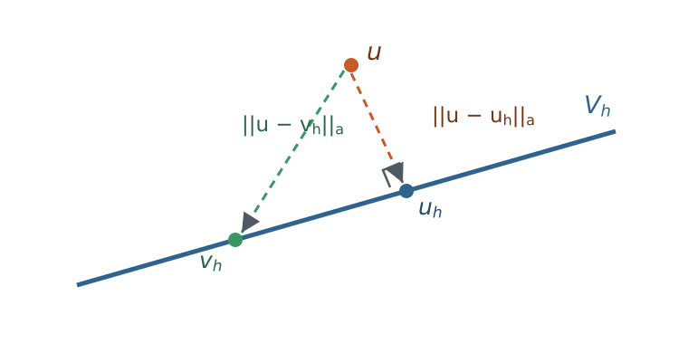
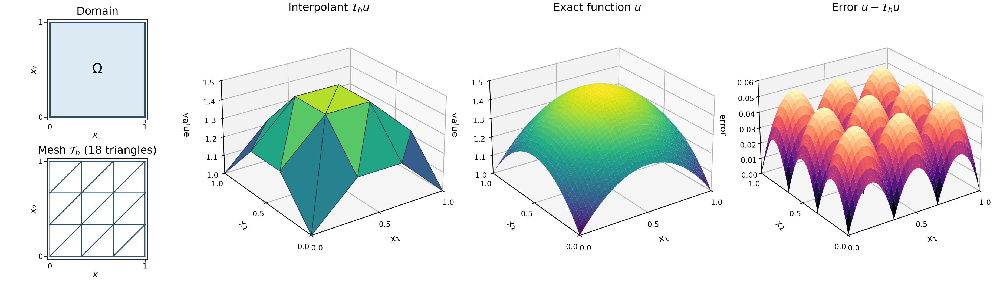
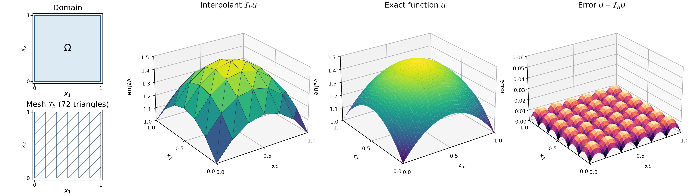
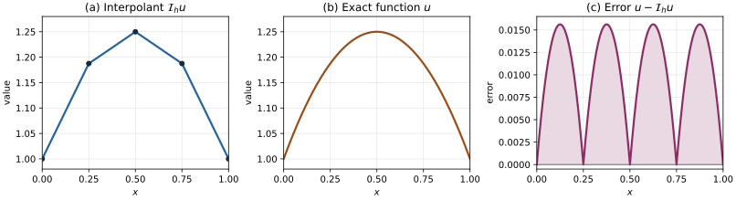
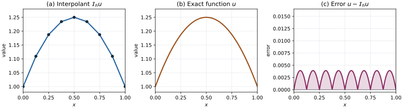

# A Priori Error Estimation and Convergence {#sec-apriori-error}

```{=latex}
\chaptershorttitle{A Priori Error Analysis}
```

Chapters 5 and 6 constructed the finite element solution $u_h$: a mesh, a
finite element space, element matrices and vectors, assembly, and a solve.
The computations in those chapters already suggested how well the method
works. In the uniformly loaded bar of @exm-c5-python-assembly, the nodal values
were exact and the maximum displacement error decreased by a factor of about
four whenever the number of elements was doubled. In @exm-c5-complete-bar, the
piecewise-constant element strains could only approximate the linearly varying
exact strain. This chapter explains such observations and states the
conditions under which they can be expected.

The central question is how large the error $u-u_h$ is and how quickly it
decreases when the mesh is refined or the polynomial degree is increased. An
**a priori error estimate** answers this question before a computation is
performed. It bounds the error in terms of the mesh size, the polynomial
degree, the smoothness of the exact solution, and constants determined by the
problem. Because the smoothness of the exact solution is usually not known
precisely, such an estimate predicts convergence rates rather than the size
of the error in a particular computation. Chapter 8 develops the complementary
*a posteriori* estimates, which use the computed solution to estimate its
error.

The argument has three parts, and the chapter follows them in order. Galerkin
orthogonality expresses what the discrete equations say about the error.
Continuity and coercivity then show that the finite element solution is almost
as accurate as the best approximation available in the finite element space;
this result is Céa's lemma. Finally, interpolation estimates bound that best
approximation in terms of the mesh size and the smoothness of the solution.
Combining the three parts gives the energy-norm and $H^1$-norm estimates. A
duality argument then gives the higher $L^2$ rate, and numerical experiments
test the predictions. Scalar diffusion is the principal model throughout. The
last section interprets the results for linear elasticity.

## The discrete problem and measures of error {#sec-c7-problem-setting}

We use the scalar diffusion problem of @def-weak-diffusion-problem with
homogeneous essential data. Let $\Om\subset\R^d$, $d\in\{1,2,3\}$, be a
bounded Lipschitz domain, let $\Gam_D$ have positive boundary measure, and let
the coefficient satisfy @eq-variational-coefficient-bounds,

$$
0<k_0\leq k(\bx)\leq k_1
\qquad\text{for almost every }\bx\in\Om.
$$

Assume $f\in L^2(\Om)$ and $q\in L^2(\Gam_N)$, and take $g=0$. The trial and
test spaces then coincide with $\Vzero=H^1_{0,\Gam_D}(\Om)$ from
@eq-variational-test-space, and the continuous problem is

$$
\text{find }u\in\Vzero\text{ such that}\qquad
a(u,v)=\ell(v)
\qquad\forall v\in\Vzero,
$$ {#eq-c7-continuous-problem}

with $a$ and $\ell$ given by @eq-variational-forms. Here $q=\bq\cdot\bn$ is
the prescribed outward normal flux, while $h$ denotes the mesh size.

For the discrete problem we make the following assumptions, which are those of
Chapter 6.

1. For $d=2$ or $3$, $\Om$ is polygonal or polyhedral and $\Th$ is a
   conforming, boundary-fitted mesh whose boundary facets resolve the partition
   into $\Gam_D$ and $\Gam_N$.
2. $\Vh$ is the continuous Lagrange finite element space of degree $p\geq1$
   on $\Th$, and $\Vhzero=\Vh\cap\Vzero$ as in @eq-c6-discrete-test-space.
3. The integrals defining $a$ and $\ell$ are evaluated exactly.

The finite element solution is then

$$
\text{find }u_h\in\Vhzero\text{ such that}\qquad
a(u_h,v_h)=\ell(v_h)
\qquad\forall v_h\in\Vhzero.
$$ {#eq-c7-discrete-problem}

This is @eq-c6-discrete-diffusion with $g=0$, and for $d=1$ it is the bar
problem @eq-c5-discrete-variational.

The third assumption idealizes the computations of Chapters 5 and 6, which use
quadrature, and the restriction $g=0$ avoids the boundary interpolant $g_h$ of
@eq-c6-discrete-trial-space. Replacing $a$, $\ell$, or the boundary data by
approximations introduces additional errors. Such departures from the exact
Galerkin method are called **variational crimes** [@suli2012, p. 84]. They
can be analyzed by extending the arguments below, but we do not pursue that
analysis here. The examples in this chapter integrate the element arrays
exactly or with a high-order quadrature rule, so that these additional errors
are negligible compared with the errors being measured.

### Existence and stability of the discrete solution

The two estimates used throughout this chapter are continuity,

$$
|a(w,v)|
\leq
M\norm{w}_{H^1(\Om)}\norm{v}_{H^1(\Om)}
\qquad\forall w,v\in\Vzero,
$$ {#eq-c7-continuity}

and coercivity,

$$
a(v,v)
\geq
\alpha\norm{v}_{H^1(\Om)}^2
\qquad\forall v\in\Vzero.
$$ {#eq-c7-coercivity}

For the diffusion form, Chapter 3 established these estimates in
@eq-variational-continuity and @eq-variational-coercivity with

$$
M=k_1,
\qquad
\alpha=\frac{k_0}{1+C_P^2},
\qquad
\frac{M}{\alpha}
=
\frac{k_1}{k_0}(1+C_P^2).
$$ {#eq-c7-diffusion-constants}

The ratio $M/\alpha$ will appear in the $H^1$ error estimate. It depends on
the coefficient contrast $k_1/k_0$ and the Poincare constant of the domain,
but not on the mesh size or polynomial degree.

Before estimating the error, we check that @eq-c7-discrete-problem has
exactly one solution. The space $\Vhzero$ is a finite-dimensional subspace of
$\Vzero$. A finite-dimensional subspace of a normed space is closed, so
$\Vhzero$ is itself a Hilbert space with the $H^1(\Om)$ norm. The continuity
and coercivity inequalities @eq-c7-continuity and @eq-c7-coercivity hold for
all functions in $\Vzero$, and hence for all functions in $\Vhzero$, with the
same constants $M$ and $\alpha$. The
Lax--Milgram theorem @thm-lax-milgram therefore gives a unique $u_h$ and the
discrete stability estimate

$$
\norm{u_h}_{H^1(\Om)}
\leq
\frac{1}{\alpha}\norm{\ell}_{\Vzero^*}.
$$ {#eq-c7-discrete-stability}

The constant on the right does not depend on the mesh or on the polynomial
degree. For a coercive problem, every conforming subspace inherits stability
from the continuous problem [@arnold2018, p. 58]. This will not remain true for
the mixed formulations of Chapter 10, where stability of the discrete problem
must be established separately.

The same fact has a direct algebraic meaning. If $\bV$ is the vector of free
coefficients of a nonzero $v_h\in\Vhzero$, then

$$
\bV^T\bK_{ff}\bV
=
a(v_h,v_h)
\geq
\alpha\norm{v_h}_{H^1(\Om)}^2
>0.
$$

Since $a$ is symmetric, the reduced stiffness matrix $\bK_{ff}$ of
@eq-c6-reduced-system is symmetric and positive definite, and the linear
system has a unique solution.

### Error norms and the energy norm

Let

$$
e=u-u_h
$$

denote the error. Because $u$ and $u_h$ both belong to $\Vzero$, so does $e$.
Several norms from Chapter 2 measure different aspects of $e$:

- $\norm{e}_{L^2(\Om)}$ measures the error in the solution values;
- $\seminorm{e}_{H^1(\Om)}=\norm{\grad e}_{L^2(\Om;\R^d)}$ from
  @eq-h1-seminorm measures the error in the gradient, and therefore in the
  flux or strain; and
- $\norm{e}_{H^1(\Om)}$ from @eq-h1-norm combines both.

In one dimension, the maximum error $\max_x|e(x)|$ is also useful because
$H^1$ functions on an interval are continuous. The computation in
@exm-c5-python-assembly reported this error.

The bilinear form itself defines a fourth measure, and this is the one in which
the finite element method is most naturally analyzed.

::: {#def-c7-energy-norm}
## Energy norm

Let $a$ be symmetric, continuous, and coercive on $\Vzero$. The **energy
norm** is

$$
\norm{v}_a=a(v,v)^{1/2},
\qquad v\in\Vzero.
$$ {#eq-c7-energy-norm}
:::

The expression $\norm{\cdot}_a$ is a norm on $\Vzero$ because
$(w,v)\mapsto a(w,v)$ is an inner product on $\Vzero$: it is bilinear and
symmetric, and coercivity gives $a(v,v)\geq\alpha\norm{v}_{H^1(\Om)}^2>0$ for
$v\ne0$. For the diffusion form,

$$
\norm{v}_a^2=\int_\Om k\,|\grad v|^2\,\dx.
$$

The coefficient bounds give

$$
\sqrt{k_0}\,\seminorm{v}_{H^1(\Om)}
\leq
\norm{v}_a
\leq
\sqrt{k_1}\,\seminorm{v}_{H^1(\Om)}
\qquad\forall v\in\Vzero,
$$ {#eq-c7-energy-seminorm-equivalence}

and the upper bound holds for every $v\in H^1(\Om)$. Combined with the
equivalence of the $H^1$ seminorm and norm on $\Vzero$ in
@cor-foundations-h1-seminorm-equivalence, the energy norm is equivalent to the
$H^1(\Om)$ norm on $\Vzero$. More explicitly,

$$
\sqrt{\frac{k_0}{1+C_P^2}}\,
\norm{v}_{H^1(\Om)}
\leq
\norm{v}_a
\leq
\sqrt{k_1}\,\norm{v}_{H^1(\Om)}
\qquad\forall v\in\Vzero.
$$ {#eq-c7-energy-h1-equivalence}

Thus the two norms define the same notion of convergence on $\Vzero$, but
their numerical values differ. The constants in
@eq-c7-energy-h1-equivalence depend on $k_0$, $k_1$, and $C_P$, while the
energy norm weights the gradient by the material coefficient $k$.

The name reflects the energy functional $\Pi$ of @eq-variational-energy. The
quantity $\tfrac12\norm{v}_a^2$ is the quadratic part of $\Pi(v)$. In heat
conduction it is the diffusion term of that functional, and in elasticity it
is the stored strain energy of a displacement field.

::: {#exm-c7-bar-energy-norm}
## Error norms for the axial bar

For the axial bar of @sec-model-axial-bar with $\mathcal V_0=\{v\in
H^1(0,L):v(0)=0\}$,

$$
\norm{e}_a^2=\int_0^L AE\,(e')^2\,\dd x .
$$

It weights the strain error by the axial rigidity. When $AE=1$, it equals the
$H^1$ seminorm of the error. Since $e(0)=0$, the
Poincare inequality makes it equivalent to the full $H^1$ norm
$\norm{e}_{H^1(0,L)}=\bigl(\norm{e}_{L^2(0,L)}^2+\norm{e'}_{L^2(0,L)}^2\bigr)^{1/2}$.
The energy norm and the $H^1$ norm therefore converge at the same rate, even
though their values differ.
:::

::: {#exr-c7-energy-norm}
## The energy norm of the bar

Let $0<(AE)_0\leq AE(x)\leq (AE)_1$ on $(0,L)$, and let
$\mathcal V_0=\{v\in H^1(0,L):v(0)=0\}$.

1. For $v\in\mathcal V_0$, write $v(x)=\int_0^x v'(t)\,\dd t$ and use the
   Cauchy--Schwarz inequality to prove
   $$
   \norm{v}_{L^2(0,L)}\leq\frac{L}{\sqrt2}\norm{v'}_{L^2(0,L)} .
   $$
2. Deduce constants $c_1,c_2>0$, depending only on $(AE)_0$, $(AE)_1$, and
   $L$, such that
   $c_1\norm{v}_{H^1(0,L)}\leq\norm{v}_a\leq c_2\norm{v}_{H^1(0,L)}$ for
   every $v\in\mathcal V_0$.
3. Give a function $v\in H^1(0,L)$ with $a(v,v)=0$ but $v\ne0$. Explain why
   this does not contradict the norm property of $\norm{\cdot}_a$ on
   $\mathcal V_0$, and identify the physical motion that $v$ represents.
:::

## Galerkin orthogonality {#sec-c7-galerkin-orthogonality}

The error analysis begins by comparing the equations satisfied by $u$ and
$u_h$. The discrete space is conforming: $\Vhzero\subset\Vzero$. Every
discrete test function is therefore also an admissible test function in the
continuous problem @eq-c7-continuous-problem, so

$$
a(u,v_h)=\ell(v_h)
\qquad\forall v_h\in\Vhzero.
$$

The discrete problem @eq-c7-discrete-problem gives

$$
a(u_h,v_h)=\ell(v_h)
\qquad\forall v_h\in\Vhzero.
$$

Subtracting the second equation from the first and using linearity of $a$ in
its first argument gives **Galerkin orthogonality**:

$$
a(u-u_h,v_h)=0
\qquad\forall v_h\in\Vhzero.
$$ {#eq-c7-galerkin-orthogonality}

The name comes from the symmetric case. There $a$ is an inner product on
$\Vzero$, and @eq-c7-galerkin-orthogonality says that the error is orthogonal
to the discrete space in that inner product. Thus $u_h$ is the orthogonal
projection of $u$ onto $\Vhzero$ with respect to $a$
[@suli2012, pp. 43--44].

The derivation used two facts that should be kept in view. First, it used
conformity: if the discrete test functions were not admissible in the
continuous problem, the first equation would not be available. Second, it used
the same forms $a$ and $\ell$ in both problems. If the discrete forms are
evaluated with inexact quadrature, the right-hand side of
@eq-c7-galerkin-orthogonality contains a consistency error instead of zero.

Galerkin orthogonality can also be read in terms of residuals. For any
$w\in\Vzero$, the linear functional $v\mapsto\ell(v)-a(w,v)$ measures how far
$w$ is from satisfying the variational equation. The discrete equations say
that this residual vanishes for $w=u_h$ on every discrete test function. In
general it does not vanish on functions outside $\Vhzero$, and it vanishes on
all of $\Vzero$ only when $u_h=u$. Chapter 8 estimates the size of this
remaining residual from the computed solution.

In the symmetric case, orthogonality gives an exact decomposition of the
energy. For any $v_h\in\Vhzero$, write
$u-v_h=(u-u_h)+(u_h-v_h)$. The second term lies in $\Vhzero$, so the cross
term vanishes by @eq-c7-galerkin-orthogonality, and

$$
\norm{u-v_h}_a^2
=
\norm{u-u_h}_a^2+\norm{u_h-v_h}_a^2
\qquad\forall v_h\in\Vhzero.
$$ {#eq-c7-pythagoras}

Here $\norm{\cdot}_a$ is the energy norm defined in @def-c7-energy-norm.
Equation @eq-c7-pythagoras is the Pythagorean theorem for the corresponding
energy inner product. It will give the best-approximation property in
@sec-c7-cea.

The energy functional of Chapter 3 gives the same result a physical reading.
With $g=0$, take $v=v_h-u\in\Vzero$ in
@eq-variational-minimum-difference. Then

$$
\Pi(v_h)-\Pi(u)
=
\frac12\norm{u-v_h}_a^2
\qquad\forall v_h\in\Vhzero.
$$ {#eq-c7-energy-excess}

Among all functions in $\Vhzero$, the finite element solution therefore has
the smallest energy, and the energy error measures the amount by which
$\Pi(u_h)$ exceeds the exact minimum $\Pi(u)$. In this setting the Galerkin
method coincides with the Ritz method, which defines the approximation by
minimizing the energy over the discrete space.

::: {#exr-c7-pythagoras}
## Consequences of Galerkin orthogonality

Assume that $a$ is symmetric, continuous, and coercive on $\Vzero$, and that
$g=0$.

1. Expand $a\bigl((u-u_h)+(u_h-v_h),(u-u_h)+(u_h-v_h)\bigr)$ and use
   @eq-c7-galerkin-orthogonality to prove @eq-c7-pythagoras. Identify the
   step at which symmetry is used.
2. Take $v_h=0$ in @eq-c7-pythagoras and prove
   $\norm{u_h}_a\leq\norm{u}_a$.
3. Use @eq-c7-energy-excess to prove that $u_h$ is the unique minimizer of
   $\Pi$ over $\Vhzero$.
4. Let $\mathcal V^{(1)}\subset\mathcal V^{(2)}\subset\Vzero$ be two nested
   finite element spaces, and let $u_h^{(1)}$ and $u_h^{(2)}$ be the
   corresponding Galerkin solutions. Prove
   $\norm{u-u_h^{(2)}}_a\leq\norm{u-u_h^{(1)}}_a$, and explain why this
   guarantees that refinement by subdividing cells never increases the
   energy error.
:::

## Best approximation from a discrete space {#sec-c7-best-approximation}

Let $V_h$ be a finite-dimensional subspace of a normed vector space $V$. For
$u\in V$, define the best-approximation error in the $V$ norm by

$$
E_V(u;V_h)
=
\min_{v_h\in V_h}\norm{u-v_h}_V.
$$ {#eq-c7-best-approximation-v}

The minimum exists because $V_h$ is finite-dimensional. It is the smallest
distance from $u$ to any point in $V_h$. A function attaining this minimum is
called a best approximation. It need not be unique for a general norm, and it
depends on the chosen norm. If $a$ is symmetric and coercive, the corresponding
best-approximation error in the energy norm is

$$
E_a(u;V_h)
=
\min_{v_h\in V_h}\norm{u-v_h}_a.
$$ {#eq-c7-best-approximation-a}

The geometric picture is a point $u$ outside a line or plane representing
$V_h$. The closest point is measured using the selected norm. For the energy
inner product, Galerkin orthogonality makes $u_h$ the orthogonal projection of
$u$ onto $V_h$, as illustrated in @fig-c7-best-approximation-geometry.

{#fig-c7-best-approximation-geometry width=72%}

::: {#exm-c7-weighted-projection}
## Best approximation depends on the norm

Let $V=\R^2$, $V_h=\operatorname{span}\{(1,1)\}$, and $\bu=(1,0)$. Define

$$
a(\bx,\bm{y})=4x_1y_1+x_2y_2,
\qquad
\ell(\bm{y})=4y_1,
\qquad
\norm{\bx}_a=\sqrt{4x_1^2+x_2^2}.
$$

The vector $\bu$ solves the continuous problem because
$a(\bu,\bm{y})=\ell(\bm{y})$ for every $\bm{y}\in\R^2$. The Galerkin problem restricts
the trial and test vectors to $V_h$.

Every vector in $V_h$ has the form $\bv_h=t(1,1)$. The energy-norm error is

$$
\norm{\bu-\bv_h}_a^2
=
4(1-t)^2+t^2.
$$

Differentiating this quadratic function of $t$ gives $-8(1-t)+2t=0$, so its
minimum occurs at $t=4/5$. Therefore

$$
\bu_h=\left(\frac45,\frac45\right).
$$

The same result follows from the Galerkin condition
$a(\bu-\bu_h,(1,1))=0$. In contrast, the closest point in the Euclidean norm is
$\tfrac12(1,1)$. The discrete space is unchanged, but changing the norm changes
which point in that space is the best approximation.
:::

## Céa's lemma {#sec-c7-cea}

Galerkin orthogonality relates the error to the discrete space, but it does
not yet say how large the error is. The next result shows that the finite
element error in the $V$ norm is controlled by @eq-c7-best-approximation-v,
multiplied by a constant that depends only on the continuity and coercivity
constants.

::: {#thm-c7-cea}
## Céa's lemma

Let $V$ be a real Hilbert space with norm $\norm{\cdot}_V$, let
$a:V\times V\to\R$ be a bilinear form that is continuous with constant $M$ and
coercive with constant $\alpha$, and let $\ell\in V^*$. Let $V_h\subset V$ be
a finite-dimensional subspace. If $u\in V$ satisfies $a(u,v)=\ell(v)$ for all
$v\in V$, and $u_h\in V_h$ satisfies $a(u_h,v_h)=\ell(v_h)$ for all
$v_h\in V_h$, then

$$
\norm{u-u_h}_V
\leq
\frac{M}{\alpha}
\inf_{v_h\in V_h}\norm{u-v_h}_V.
$$ {#eq-c7-cea}
:::

**Proof.** The Lax--Milgram theorem @thm-lax-milgram gives unique solutions
$u$ and $u_h$, and they satisfy
Galerkin orthogonality @eq-c7-galerkin-orthogonality with $V$ and $V_h$ in
place of $\Vzero$ and $\Vhzero$. Let $v_h\in V_h$ be arbitrary. Applying the
abstract version of the coercivity relation @eq-c7-coercivity, with
$\norm{\cdot}_V$ in place of $\norm{\cdot}_{H^1(\Om)}$, to the error gives

$$
\alpha\norm{u-u_h}_V^2
\leq
a(u-u_h,u-u_h).
$$

Use $u-u_h=(u-v_h)+(v_h-u_h)$ in the second argument:

$$
a(u-u_h,u-u_h)
=
a(u-u_h,u-v_h)+a(u-u_h,v_h-u_h).
$$

The last term is zero by Galerkin orthogonality because
$v_h-u_h\in V_h$. Applying the corresponding abstract version of the
continuity relation @eq-c7-continuity to the remaining term gives

$$
\alpha\norm{u-u_h}_V^2
\leq
M\norm{u-u_h}_V\norm{u-v_h}_V .
$$

If $u-u_h=0$, there is nothing to prove. Otherwise, divide by
$\alpha\norm{u-u_h}_V$. The resulting inequality holds for every
$v_h\in V_h$, so it also holds for the infimum over $V_h$. $\square$

Céa's lemma therefore compares the computed error with the best-approximation
error @eq-c7-best-approximation-v. It separates the error analysis into two
independent questions [@suli2012, pp. 40--42; @arnold2018, pp. 58--59]:

1. a stability question, answered by the ratio $M/\alpha$; and
2. an approximation question: how well can functions in the finite element
   space approximate the exact solution?

A method satisfying @eq-c7-cea is called **quasi-optimal**: its error is at
most a fixed multiple of the smallest error attainable in $V_h$. The factor
$M/\alpha$ does not depend on $h$ or on $p$.

For the diffusion problem in the $H^1(\Om)$ norm, the constants collected in
@eq-c7-diffusion-constants give
$M/\alpha=(k_1/k_0)(1+C_P^2)$. The ratio $k_1/k_0$ is the contrast of the
material coefficient. For a body made of materials whose conductivities
differ by several orders of magnitude, the $H^1$ bound becomes pessimistic.
When the form is symmetric, the next result shows that the constant in the
energy norm is exactly one. The contrast reappears only when an energy-norm
estimate is converted into an $H^1$-norm estimate using
@eq-c7-energy-h1-equivalence.

::: {#cor-c7-best-approximation}
## Best approximation in the energy norm

If, in addition to the hypotheses of @thm-c7-cea, the bilinear form $a$ is
symmetric, then

$$
\norm{u-u_h}_a
=
\min_{v_h\in V_h}\norm{u-v_h}_a .
$$ {#eq-c7-best-approximation}
:::

**Proof.** Let $v_h\in V_h$ be arbitrary. Since $u_h-v_h\in V_h$, Galerkin
orthogonality gives

$$
a(u-u_h,u_h-v_h)=0.
$$

Decompose the error associated with $v_h$ as

$$
u-v_h=(u-u_h)+(u_h-v_h).
$$

Because $a$ is symmetric, it is the inner product associated with
$\norm{\cdot}_a$. Expanding the squared energy norm and using the orthogonality
relation therefore gives

$$
\begin{aligned}
\norm{u-v_h}_a^2
&=a(u-v_h,u-v_h)\\
&=\norm{u-u_h}_a^2
  +2a(u-u_h,u_h-v_h)
  +\norm{u_h-v_h}_a^2\\
&=\norm{u-u_h}_a^2+\norm{u_h-v_h}_a^2.
\end{aligned}
$$

The last term is nonnegative. Hence
$\norm{u-u_h}_a\leq\norm{u-v_h}_a$ for every $v_h\in V_h$. Choosing
$v_h=u_h$ gives equality, so $u_h$ attains the minimum in
@eq-c7-best-approximation-a [@suli2012, pp. 44--45]. $\square$

In the energy norm, the finite element solution is therefore the best
approximation available in the discrete space, with constant one. The error
estimates of the next sections bound the right-hand side of
@eq-c7-best-approximation by choosing one convenient function $v_h$: the
finite element interpolant of $u$.

::: {#exr-c7-cea}
## Using Céa's lemma

1. For the diffusion problem, derive the ratio $M/\alpha$ in
   @eq-c7-diffusion-constants from @eq-c7-continuity and @eq-c7-coercivity.
2. Use @eq-c7-energy-h1-equivalence and @eq-c7-best-approximation to
   derive a bound of the form
   $\norm{u-u_h}_{H^1(\Om)}\leq C\inf_{v_h\in\Vhzero}\norm{u-v_h}_{H^1(\Om)}$.
   Compare your constant with $M/\alpha$ in @eq-c7-diffusion-constants.
3. Let $\Vh^{\mathrm{dc}}$ be the space of functions that are linear on each
   cell of a triangular mesh but may be discontinuous across cell edges.
   Explain why $\Vh^{\mathrm{dc}}\not\subset H^1(\Om)$, and identify the step
   of the derivation of @eq-c7-galerkin-orthogonality that fails if this
   space is used in @eq-c7-discrete-problem.
:::

## Interpolation estimates {#sec-c7-interpolation}

Céa's lemma reduces the error analysis to a question about approximation:
how small can $\norm{u-v_h}$ be for some $v_h$ in the finite element space?
It is not necessary to find the best approximation. Any explicit choice of
$v_h$ gives an upper bound. The natural choice is the function in the finite
element space that has the same degrees of freedom as $u$.

### The finite element interpolant

::: {#def-c7-interpolant}
## Finite element interpolant

Let $\Vh$ be a Lagrange finite element space with global nodes
$\bx_1,\ldots,\bx_{N_n}$ and nodal basis $\phi_1,\ldots,\phi_{N_n}$. For a
function $u$ continuous on $\overline\Om$, the **finite element interpolant**
is

$$
\Ih u
=
\sum_{i=1}^{N_n}u(\bx_i)\,\phi_i .
$$ {#eq-c7-global-interpolant}
:::

The calligraphic symbol $\Ih$ denotes the interpolation operator and
distinguishes it from the connectivity map $I^e$. For linear elements, the
nodes are the mesh vertices. For higher-degree Lagrange elements they also include
additional nodes, such as the element midpoints of the quadratic interval in
Chapter 5 and the edge midpoints of the $P_2$ triangle in Chapter 6.

The interpolant can also be built cell by cell. In the terminology of
@def-c5-finite-element, the **local interpolant** on $\mathcal K_e$ is

$$
\Ie w
=
\sum_{a}N_a(w)\,\phi_a^e ,
$$

where $N_a$ are the local degrees of freedom. For a Lagrange element,
$N_a(w)=w(\bx_a^e)$. The local-global relation
@eq-c6-local-global-restriction and the nodal property give

$$
(\Ih u)|_{\mathcal K_e}
=
\Ie\bigl(u|_{\mathcal K_e}\bigr).
$$

@fig-c7-interpolation-2d makes this construction visible. On
$\Om=(0,1)^2$, consider the positive function

$$
u(x_1,x_2)=1+x_1(1-x_1)+x_2(1-x_2).
$$

Its values at the vertices of the coarse triangular mesh determine the
piecewise-planar $P_1$ interpolant. The exact function, interpolant, and error
are evaluated at finer plotting points to display the surfaces clearly. These
additional points are not finite element nodes and do not change
$\Ih u$.

{#fig-c7-interpolation-2d width=100%}

The error is nonnegative for this particular concave function. Moreover, the
Hessian of $u$ is the constant matrix $-2\bI$, and all triangles in this
uniform mesh are congruent. Consequently, the error has the same shape and
maximum value on every triangle, up to translation and reflection. Neither
the sign nor this repeated error pattern holds for a general function on a
general mesh.

Now halve the grid spacing in both coordinate directions. The resulting mesh
has $72$ triangles, compared with $18$ triangles in
@fig-c7-interpolation-2d. The refined interpolant in
@fig-c7-interpolation-2d-fine follows the exact surface more closely. Both
figures use the same vertical scales, including the scale of the error plot.

{#fig-c7-interpolation-2d-fine width=100%}

For this quadratic function, the maximum error decreases from $1/18$ on the
coarse mesh to $1/72$ on the refined mesh. Thus halving the grid spacing
reduces the maximum error by a factor of four. This example displays the
$h^2$ behavior of the error in the function values that will be established
later in the chapter.

Three properties of the interpolant will be used repeatedly.

1. **Locality.** The restriction of $\Ih u$ to $\mathcal K_e$ depends
   only on the values of $u$ at the nodes of $\mathcal K_e$.
2. **Polynomial reproduction.** If $u|_{\mathcal K_e}$ belongs to the local
   finite element space, then $\Ie u=u$ on $\mathcal K_e$. This does
   not mean that a degree-$p$ element reproduces polynomials of arbitrary
   degree. For an affine Lagrange simplex, the local space is
   $\mathcal P_p(\mathcal K_e)$, so every polynomial of total degree at most
   $p$ is reproduced exactly. For a tensor-product element, the corresponding
   statement uses its local $\mathcal Q_p$ space. On a nonaffine
   isoparametric cell, the local space is defined through the pullback from the
   reference cell and need not consist of polynomials in the physical
   coordinates. This property generalizes the affine reproduction in
   @exr-c5-affine-reproduction and @exr-c6-affine-reproduction.
3. **Boundary values.** If $u=0$ on $\Gam_D$ and the mesh resolves $\Gam_D$,
   then every node on $\Gam_D$ has zero value. On each facet contained in
   $\Gam_D$, the restriction of $\Ih u$ is determined by the nodal
   values on that facet, so $\Ih u=0$ on $\Gam_D$ and
   $\Ih u\in\Vhzero$.

The interpolant requires point values. For $d\leq3$ and a bounded Lipschitz
domain, every function in $H^2(\Om)$ has a continuous representative on
$\overline\Om$ [@arnold2018, pp. 59, 65]. In one dimension, every function in
$H^1(0,L)$ is already continuous. In two and three dimensions, a general
function in $H^1(\Om)$ need not be continuous, so the nodal interpolant is not
defined for every function in $\Vzero$. This is why the multidimensional
estimates below assume at least $H^2$ regularity.

### Linear interpolation in one dimension

The one-dimensional case shows how an interpolation estimate is obtained. For
$\mathcal K_e=(x_e,x_{e+1})$ and a function $u$ continuous on
$\overline{\mathcal K}_e$, the linear interpolant is

$$
\Ie u
=
u(x_e)\,\phi_1^e+u(x_{e+1})\,\phi_2^e ,
$$

with the local shape functions @eq-c5-linear-shape-functions.

@fig-c7-interpolation-1d shows the same construction for
$u(x)=1+x(1-x)$ on a uniform mesh of four linear elements. Its five nodes are

$$
x_1=0,\qquad x_2=\frac14,\qquad x_3=\frac12,\qquad
x_4=\frac34,\qquad x_5=1.
$$

The interpolant agrees with $u$ at every node and is linear between adjacent
nodes. As in
@fig-c7-interpolation-2d, the finer plotting points only reveal the shapes of
the exact function and the error; they are not additional degrees of freedom.

{#fig-c7-interpolation-1d width=100%}

On an element $\mathcal K_e=[x_e,x_{e+1}]$, direct calculation gives

$$
u(x)-\Ie u(x)
=
(x-x_e)(x_{e+1}-x).
$$

Because every element has length $h=1/4$, this error has the same shape on
every element and reaches the same maximum, $h^2/4=1/64$, at each element
midpoint. This repeated pattern results from combining a uniform mesh with a
quadratic function having constant second derivative.

Refine the one-dimensional mesh by dividing every element in two. The refined
mesh has eight linear elements and nine nodes,
$x_i=(i-1)/8$ for $i=1,\ldots,9$. The plots in
@fig-c7-interpolation-1d-fine use the same vertical scales as
@fig-c7-interpolation-1d.

{#fig-c7-interpolation-1d-fine width=100%}

On the refined mesh, $h=1/8$, so the maximum error is
$h^2/4=1/256$. Halving the element length has again reduced the maximum error
by a factor of four.

::: {#thm-c7-1d-interpolation}
## Linear interpolation on an interval

Let $u\in H^2(\mathcal K_e)$. Then

$$
\norm{(u-\Ie u)'}_{L^2(\mathcal K_e)}
\leq
h_e\norm{u''}_{L^2(\mathcal K_e)},
\qquad
\norm{u-\Ie u}_{L^2(\mathcal K_e)}
\leq
h_e^2\norm{u''}_{L^2(\mathcal K_e)} .
$$ {#eq-c7-1d-local-interpolation}

If $u\in H^1(0,L)$ and $u|_{\mathcal K_e}\in H^2(\mathcal K_e)$ for every
element, then

$$
\seminorm{u-\Ih u}_{H^1(0,L)}^2
\leq
\sum_{e=1}^{N}h_e^2\norm{u''}_{L^2(\mathcal K_e)}^2,
\qquad
\norm{u-\Ih u}_{L^2(0,L)}^2
\leq
\sum_{e=1}^{N}h_e^4\norm{u''}_{L^2(\mathcal K_e)}^2 .
$$ {#eq-c7-1d-global-interpolation}
:::

**Proof.** Let $w=u-\Ie u$ on $\mathcal K_e$. Since
$\Ie u$ is linear, its second derivative is zero. Hence

$$
w''=u''
\qquad\text{on }\mathcal K_e.
$$

Moreover, $u\in H^2(\mathcal K_e)$ implies $u'\in H^1(\mathcal K_e)$. In one
dimension, $H^1$ functions have continuous representatives. Thus $u'$ and
$w'$ may be taken to be continuous, $w$ is continuously differentiable, and
the classical fundamental theorem of calculus and Rolle's theorem can be
used.

By the definition of the nodal interpolant,

$$
(\Ie u)(x_e)=u(x_e),
\qquad
(\Ie u)(x_{e+1})=u(x_{e+1}).
$$

Therefore $w(x_e)=w(x_{e+1})=0$. Rolle's theorem then gives a point
$x_\ast\in(x_e,x_{e+1})$ such that $w'(x_\ast)=0$. For any
$y\in\mathcal K_e$, the fundamental theorem of calculus gives

$$
w'(y)
=
\int_{x_\ast}^{y}w''(t)\,\dd t .
$$

Applying the Cauchy--Schwarz inequality on the interval with endpoints
$x_\ast$ and $y$ gives

$$
|w'(y)|^2
\leq
|y-x_\ast|\int_{\min\{x_\ast,y\}}^{\max\{x_\ast,y\}}|w''(t)|^2\,\dd t
\leq
h_e\norm{w''}_{L^2(\mathcal K_e)}^2 .
$$

This pointwise bound holds for every $y$ in an interval of length $h_e$.
Integrating it with respect to $y$ therefore gives

$$
\norm{w'}_{L^2(\mathcal K_e)}^2
\leq
h_e^2\norm{w''}_{L^2(\mathcal K_e)}^2
=
h_e^2\norm{u''}_{L^2(\mathcal K_e)}^2.
$$

Taking square roots proves the first local estimate. To estimate $w$ itself,
use $w(x_e)=0$ and write

$$
w(y)=\int_{x_e}^{y}w'(t)\,\dd t.
$$

Another application of Cauchy--Schwarz gives

$$
|w(y)|^2
\leq
(y-x_e)\int_{x_e}^{y}|w'(t)|^2\,\dd t
\leq
h_e\norm{w'}_{L^2(\mathcal K_e)}^2.
$$

Integrating over $y\in\mathcal K_e$ and taking square roots yields

$$
\norm{w}_{L^2(\mathcal K_e)}
\leq
h_e\norm{w'}_{L^2(\mathcal K_e)}.
$$

Combining this inequality with the first local estimate proves the second.
Finally, the elements have disjoint interiors, so the squared global norms are
the sums of the squared element norms. Summing the local estimates gives
@eq-c7-1d-global-interpolation. $\square$

The proof follows @larson-bengzon2010 [pp. 5--7]. Sharper constants are
available: a Fourier-series argument replaces $h_e$ by $h_e/\pi$ in both
estimates [@suli2012, pp. 46--47]. The powers of $h_e$ are what matter for
convergence rates. Using $h_e\leq h$ in @eq-c7-1d-global-interpolation gives

$$
\seminorm{u-\Ih u}_{H^1(0,L)}
\leq
h\norm{u''}_{L^2(0,L)},
\qquad
\norm{u-\Ih u}_{L^2(0,L)}
\leq
h^2\norm{u''}_{L^2(0,L)}
$$

when $u\in H^2(0,L)$. The elementwise form is more informative: it shows that
small elements are most useful where $|u''|$ is large, which is the idea behind
the adaptive meshes of Chapter 8.

The one-dimensional bar has an additional property that explains the exact
nodal values observed in Chapter 5.

::: {#exm-c7-nodal-exactness}
## When the finite element solution equals the interpolant

Consider the bar problem @eq-c5-discrete-variational with linear elements, and
assume that $AE$ is constant on each element, with value $(AE)_e$ on
$\mathcal K_e$. The load $f\in L^2(0,L)$ and the end force $\overline P$ are
arbitrary. The exact solution $u$ belongs to $H^1(0,L)$ and is therefore
continuous, so $\Ih u$ is defined; it belongs to $\Vhzero$ because
$u(0)=0$.

Let $v_h\in\Vhzero$. Its derivative is a constant $v_h'|_e$ on each element,
so

$$
a(u-\Ih u,v_h)
=
\sum_{e=1}^{N}(AE)_e\,v_h'|_e
\int_{x_e}^{x_{e+1}}(u-\Ih u)'\,\dd x
=
\sum_{e=1}^{N}(AE)_e\,v_h'|_e
\Bigl[(u-\Ih u)(x)\Bigr]_{x_e}^{x_{e+1}}
=0,
$$

because the interpolation error vanishes at every node. Galerkin orthogonality
@eq-c7-galerkin-orthogonality gives $a(u-u_h,v_h)=0$ as well. Subtracting,

$$
a(u_h-\Ih u,v_h)=0
\qquad\forall v_h\in\Vhzero .
$$

Choosing $v_h=u_h-\Ih u$ and using coercivity gives
$u_h=\Ih u$. The finite element solution is the interpolant of the
exact solution, so its nodal values are exact and its whole error is
interpolation error.

For the problem of @exm-c5-python-assembly, with $L=AE=f_0=1$ and
$u(x)=x-x^2/2$, the error on an element of length $h$ is therefore the
interpolation error of a quadratic with $u''=-1$. With $s=x-x_e$,

$$
e(x)=\frac{s(h-s)}{2},
\qquad
e'(x)=\frac{h-2s}{2},
\qquad 0\leq s\leq h .
$$

Direct integration over one element gives
$\int_0^h e^2\,\dd s=h^5/120$ and $\int_0^h(e')^2\,\dd s=h^3/12$. Summing over
$N=1/h$ elements,

$$
\max_{x}|e(x)|=\frac{h^2}{8},
\qquad
\norm{e}_{L^2(0,1)}=\frac{h^2}{\sqrt{120}},
\qquad
\norm{e}_a=\seminorm{e}_{H^1(0,1)}=\frac{h}{\sqrt{12}} .
$$ {#eq-c7-uniform-bar-errors}

The maximum error $h^2/8$ is the value reported in the legend of
@fig-c5-python-mesh-refinement. The displacement errors decrease like $h^2$,
whereas the strain error decreases only like $h$. The estimates of
@thm-c7-1d-interpolation, with $\norm{u''}_{L^2(0,1)}=1$, give the upper
bounds $h^2$ and $h$, so they predict the correct powers of $h$ with
conservative constants.

Exact nodal values are a special property of this one-dimensional problem with
elementwise-constant $AE$. They do not hold in general in two or three
dimensions. A convergence study should therefore never measure the error only
at the nodes.
:::

::: {#exr-c7-pointwise-interpolation}
## A pointwise interpolation estimate

Let $u\in C^2(\overline{\mathcal K}_e)$ and $w=u-\Ie u$.

1. For a fixed $y$ in the interior of $\mathcal K_e$, define
   $$
   \psi(x)=w(x)-w(y)\,
   \frac{(x-x_e)(x-x_{e+1})}{(y-x_e)(y-x_{e+1})}.
   $$
   Show that $\psi$ vanishes at three points of $\overline{\mathcal K}_e$, and
   use Rolle's theorem twice to prove that
   $w(y)=\tfrac12u''(\bar x)(y-x_e)(y-x_{e+1})$ for some
   $\bar x\in\mathcal K_e$.
2. Deduce
   $\max_{\overline{\mathcal K}_e}|w|\leq
   \tfrac18h_e^2\max_{\overline{\mathcal K}_e}|u''|$.
3. Show that the bound in Part 2 is attained for $u(x)=x-x^2/2$, and compare
   it with the exact error expressions in @exm-c7-nodal-exactness.
:::

### Mesh size and shape regularity

In two and three dimensions, the size of a cell is not the only geometric
quantity that affects interpolation. A long thin triangle and an equilateral
triangle can have the same diameter but very different interpolation
properties. We therefore measure the shape of each cell.

::: {#def-c7-shape-regular}
## Shape-regular family of meshes

For a cell $\mathcal K_e$, let $h_e=\operatorname{diam}(\mathcal K_e)$ as in
@eq-c6-mesh-size, and let $\rho_e$ be the diameter of the largest ball
contained in $\mathcal K_e$. The ratio $h_e/\rho_e\geq1$ is the **shape
parameter** of the cell. A family of meshes $\{\Th\}_{h>0}$ is
**shape regular** if there is a constant $\sigma\geq1$ such that

$$
\frac{h_e}{\rho_e}\leq\sigma
\qquad
\text{for every cell }\mathcal K_e\in\Th\text{ and every mesh in the family.}
$$ {#eq-c7-shape-regularity}
:::

The definition concerns a family of meshes rather than a single mesh because
convergence is a statement about a sequence of refinements. Every single mesh
has some finite bound $\sigma$; shape regularity requires that repeated
refinement does not make the cells progressively flatter. For triangles, a
uniform bound on $h_e/\rho_e$ is equivalent to a uniform positive lower bound
on the interior angles, and interpolation constants for linear triangles grow
as the smallest angle decreases [@larson-bengzon2010, p. 52]. In one
dimension, $\rho_e=h_e$ and every family of meshes is shape regular.

The role of $\rho_e$ becomes clear from the reference-cell construction of
Chapter 6. For an affine simplex, $\phi_a^e=\widehat\phi_a\circ F_e^{-1}$ and
the interpolant commutes with the mapping: the pullback
$(\Ie u)\circ F_e$ is the reference interpolant of $u\circ F_e$,
because the nodes of $\mathcal K_e$ are the images of the reference nodes. An
interpolation estimate can therefore be proved once on the reference cell
$\widehat{\mathcal K}$ and transferred to every physical cell. On the
reference cell, the Bramble--Hilbert lemma gives a bound of the reference
interpolation error by second derivatives, with a constant that depends only
on $\widehat{\mathcal K}$ and $p$ [@arnold2018, pp. 61--62]. Transferring the
bound to $\mathcal K_e$ involves three factors:

1. by @eq-c6-reference-integration, $L^2$ norms change by the factor
   $|\det\bm J_e|^{1/2}$;
2. by @eq-c6-gradient-transform, first derivatives on $\mathcal K_e$ are
   bounded by $\norm{\bm J_e^{-1}}$ times reference first derivatives, and
   $\norm{\bm J_e^{-1}}\leq C/\rho_e$; and
3. second reference derivatives involve two factors of $\bm J_e$, whose columns
   are edge vectors of length at most $h_e$, so $\norm{\bm J_e}\leq Ch_e$.

Here $\norm{\cdot}$ denotes the spectral norm of a matrix, and $C$ depends only
on $d$. Combining these factors for linear triangles gives
[@arnold2018, pp. 62--64]

$$
\norm{u-\Ie u}_{L^2(\mathcal K_e)}
\leq
Ch_e^2\seminorm{u}_{H^2(\mathcal K_e)},
\qquad
\seminorm{u-\Ie u}_{H^1(\mathcal K_e)}
\leq
C\,\frac{h_e}{\rho_e}\,h_e\,\seminorm{u}_{H^2(\mathcal K_e)} .
$$ {#eq-c7-triangle-scaling}

The gradient estimate contains the shape parameter, whereas the $L^2$
estimate does not. On a shape-regular family, $h_e/\rho_e\leq\sigma$, and the
gradient error is bounded by $C\sigma h_e\seminorm{u}_{H^2(\mathcal K_e)}$.

For general degree, we use the $H^s$ seminorm of an integer order $s\geq1$,

$$
\seminorm{v}_{H^s(\Om)}^2
=
\sum_{|\alpha|=s}\norm{D^\alpha v}_{L^2(\Om)}^2,
$$ {#eq-c7-hs-seminorm}

which extends @eq-foundations-h2-seminorm with the multi-index notation of
@def-sobolev-space. The elementwise seminorm $\seminorm{v}_{H^s(\mathcal K_e)}$
is defined in the same way with $\Om$ replaced by $\mathcal K_e$.

::: {#thm-c7-interpolation}
## Interpolation estimate for Lagrange elements

Let $d\leq3$, and let $\{\Th\}$ be a shape-regular family of conforming affine
simplicial meshes of a polygonal or polyhedral domain $\Om$, with shape bound
$\sigma$. Let $\Vh$ be the continuous Lagrange space of degree $p\geq1$, and
let $s$ be an integer with $2\leq s\leq p+1$. There is a constant $C_I$,
depending only on $d$, $p$, $s$, and $\sigma$, such that for every
$u\in H^s(\Om)$ and every cell $\mathcal K_e\in\Th$,

$$
\norm{u-\Ih u}_{L^2(\mathcal K_e)}
\leq
C_Ih_e^s\seminorm{u}_{H^s(\mathcal K_e)},
\qquad
\seminorm{u-\Ih u}_{H^1(\mathcal K_e)}
\leq
C_Ih_e^{s-1}\seminorm{u}_{H^s(\mathcal K_e)} .
$$ {#eq-c7-local-interpolation}

Consequently,

$$
\norm{u-\Ih u}_{L^2(\Om)}
\leq
C_Ih^s\seminorm{u}_{H^s(\Om)},
\qquad
\seminorm{u-\Ih u}_{H^1(\Om)}
\leq
C_Ih^{s-1}\seminorm{u}_{H^s(\Om)} .
$$ {#eq-c7-global-interpolation}
:::

The proof combines the Bramble--Hilbert lemma on the reference cell with the
scaling argument sketched above [@arnold2018, p. 65, Theorem 4.6;
@suli2012, pp. 80--83]. The global estimate follows by squaring
@eq-c7-local-interpolation, summing over the cells, and using $h_e\leq h$.
Four features of the theorem deserve emphasis.

First, the general estimate guarantees at most order $p$ in the $H^1$ seminorm
and order $p+1$ in $L^2$, even for smoother $u$. Particular solutions can be
represented exactly or exhibit faster convergence; an upper error bound is
not a lower bound on the error. The interpolant reproduces polynomials of degree
$p$ but not of degree $p+1$, and the upper limit $s\leq p+1$ records this fact.

Second, the estimate guarantees order $s-1$ in the $H^1$ seminorm when only
$s$ square-integrable derivatives are assumed. Increasing $p$ therefore improves the rate
only when the exact solution has the corresponding smoothness.

Third, the lower limit $s\geq2$ ensures that point values exist. Estimates for
less regular functions require a different quasi-interpolation operator; such
operators are used in the a posteriori analysis of Chapter 8
[@arnold2018, pp. 67--68].

Fourth, the theorem is stated for affine simplicial cells. For quadrilateral
and hexahedral cells, the reference space $\mathbb Q_p$ contains
$\mathbb P_p$, and estimates of the same form hold on meshes of
parallelograms and parallelepipeds. Nonaffine isoparametric cells require
additional conditions on the geometry map, which we do not develop.

::: {#exr-c7-flat-triangle}
## A triangle with an angle near $180^\circ$

For $0<\epsilon\leq1$, consider the triangle $\mathcal K_\epsilon$ with
vertices $(-1,0)$, $(1,0)$, and $(0,\epsilon)$, and let $u(x,y)=x^2$.

1. Compute $h_e$ and $\rho_e$ for $\mathcal K_\epsilon$, using the fact that
   the inscribed circle has radius equal to the area divided by the
   semiperimeter. Show that $h_e/\rho_e$ grows like $1/\epsilon$ as
   $\epsilon\to0$.
2. Show that the linear interpolant of $u$ on $\mathcal K_\epsilon$ is
   $\Ie u=1-y/\epsilon$.
3. Compute $\seminorm{u}_{H^2(\mathcal K_\epsilon)}^2$ and
   $\seminorm{u-\Ie u}_{H^1(\mathcal K_\epsilon)}^2$.
4. Explain why no estimate of the form
   $\seminorm{u-\Ie u}_{H^1(\mathcal K_e)}\leq
   Ch_e\seminorm{u}_{H^2(\mathcal K_e)}$ can hold with a constant $C$
   independent of $\epsilon$. Relate the result to the shape parameter in
   @eq-c7-triangle-scaling.
:::

## Convergence in the energy and $H^1$ norms {#sec-c7-energy-estimates}

We can now combine the best-approximation property with the interpolation
estimate.

::: {#thm-c7-energy-convergence}
## Energy-norm and $H^1$-norm convergence

Assume the diffusion problem and finite element spaces defined by
@eq-c7-continuous-problem and @eq-c7-discrete-problem, with a shape-regular
family of affine simplicial meshes and Lagrange elements of degree $p\geq1$.
If
$u\in H^s(\Om)$ for an integer $s$ with $2\leq s\leq p+1$, then

$$
\norm{u-u_h}_a
\leq
C_I\sqrt{k_1}\;h^{s-1}\seminorm{u}_{H^s(\Om)}
$$ {#eq-c7-energy-estimate}

and

$$
\norm{u-u_h}_{H^1(\Om)}
\leq
C_I\sqrt{\frac{k_1(1+C_P^2)}{k_0}}\;h^{s-1}\seminorm{u}_{H^s(\Om)},
$$ {#eq-c7-h1-estimate}

where $C_I$ is the constant of @thm-c7-interpolation.
:::

**Proof.** Since $u\in H^s(\Om)$ with $s\geq2$, the interpolant
$\Ih u$ is defined, and it belongs to $\Vhzero$ by the boundary-value
property of @sec-c7-interpolation. The diffusion form is symmetric, so
@cor-c7-best-approximation applies with $v_h=\Ih u$. The upper bound in
@eq-c7-energy-seminorm-equivalence and @eq-c7-global-interpolation then give

$$
\norm{u-u_h}_a
\leq
\norm{u-\Ih u}_a
\leq
\sqrt{k_1}\,\seminorm{u-\Ih u}_{H^1(\Om)}
\leq
C_I\sqrt{k_1}\,h^{s-1}\seminorm{u}_{H^s(\Om)} .
$$

For the $H^1$ norm, @cor-foundations-h1-seminorm-equivalence and the lower
bound in @eq-c7-energy-seminorm-equivalence give, for every $v\in\Vzero$,

$$
\norm{v}_{H^1(\Om)}
\leq
\sqrt{1+C_P^2}\,\seminorm{v}_{H^1(\Om)}
\leq
\sqrt{\frac{1+C_P^2}{k_0}}\,\norm{v}_a .
$$

Applying this inequality to $v=u-u_h$ and using @eq-c7-energy-estimate gives
@eq-c7-h1-estimate. $\square$

When $u$ is smooth enough that $u\in H^{p+1}(\Om)$, the choice $s=p+1$ gives

$$
\norm{u-u_h}_a=O(h^p),
\qquad
\norm{u-u_h}_{H^1(\Om)}=O(h^p).
$$

Here $E(h)=O(h^r)$ means that $E(h)\leq Ch^r$ for a constant $C$ independent
of $h$. Linear elements therefore converge at first order in the energy norm,
and quadratic elements at second order, provided $u\in H^2(\Om)$ or
$u\in H^3(\Om)$, respectively. The exponent $r$ in such a bound is called the
**convergence rate**, or order of convergence, in that norm.

The same estimate controls the flux or, in one dimension, the axial force.
Because $k\leq k_1$,

$$
\norm{k\grad u-k\grad u_h}_{L^2(\Om;\R^d)}
\leq
\sqrt{k_1}\,\norm{u-u_h}_a ,
$$

so the flux error converges at the same rate as the energy error. For affine linear elements the computed gradient is piecewise constant.
The flux is piecewise constant only when $k$ is also constant on each cell.
Under the stated regularity assumptions its error is bounded by $O(h)$, as
the strains in @exm-c5-complete-bar suggest.

Several practical consequences follow from the hypotheses of the theorem.

*The rate is limited by the smaller of $p$ and $s-1$.* If the solution belongs
to $H^s(\Om)$ but not to $H^{s+1}(\Om)$, then elements of degree higher than
$s-1$ do not improve the guaranteed rate on quasi-uniform meshes. The
smoothness of $u$ depends on the data and on the geometry. For the Laplace
equation on a polygon with a reentrant corner, such as an L-shaped domain,
the solution generally behaves near the corner like $r^{\pi/\omega}$, where
$r$ is the distance from the corner and $\omega>\pi$ is the interior angle.
This function does not belong to $H^2$ near the corner, and uniform refinement
then converges more slowly than $O(h)$ in the energy norm, whatever the degree.
Recovering the optimal rate for such problems requires locally refined meshes,
which is one motivation for Chapter 8.

*Mesh size and degrees of freedom.* A family of meshes is called
quasi-uniform if, in addition to shape regularity, there is a constant $c>0$
with $h_e\geq ch$ for every cell. On such meshes the number of cells, and
hence for fixed $p$ the number of degrees of freedom $N_{\mathrm{dof}}$, is
proportional to $h^{-d}$. An energy-norm rate $h^{p}$ therefore corresponds
to $N_{\mathrm{dof}}^{-p/d}$. In three dimensions, halving $h$ multiplies the
number of unknowns by about eight but reduces the energy error of linear
elements by only a factor of about two.

*$h$-refinement and $p$-refinement.* The estimate describes $h$-refinement
with a fixed degree $p$: the constant $C_I$ depends on $p$. It does not by
itself describe the limit $p\to\infty$ on a fixed mesh, for which a separate
approximation theory is needed and is not developed in this book. What the
estimate does say is that, on a fixed sequence of meshes, raising $p$ raises
the attainable rate from $h^{p}$ to $h^{p+1}$ only when $u$ has the additional
smoothness.

*The estimate usually does not supply a numerical error value.* The right-hand side contains
$\seminorm{u}_{H^s(\Om)}$, which depends on the unknown solution, and $C_I$,
which is rarely known sharply. An a priori estimate predicts the rate of
convergence and the dependence on the mesh and the material, but it does not
give a reliable number for the error in a given computation
[@suli2012, p. 42]. That is the purpose of the a posteriori estimates of
Chapter 8.

::: {#exr-c7-predicted-rates}
## Predicting convergence rates

Assume the hypotheses of @thm-c7-energy-convergence.

1. Complete a table of the guaranteed energy-norm rate for $p=1,2,3$ when the
   largest integer $s$ with $u\in H^s(\Om)$ is $s=2$, $3$, and $4$.
2. For a two-dimensional quasi-uniform mesh and linear elements, estimate the
   factor by which the energy error decreases when $N_{\mathrm{dof}}$ is
   multiplied by $16$. Repeat for quadratic elements with $u\in H^3(\Om)$.
3. Explain why the rate for $p=3$ and $s=2$ is not better than the rate for
   $p=1$ and $s=2$, and state what information about $u$ would justify using
   cubic elements.
:::

## $L^2$ estimates by duality {#sec-c7-duality}

The $L^2$ norm is bounded by the $H^1$ norm, so @eq-c7-h1-estimate already
implies $\norm{u-u_h}_{L^2(\Om)}=O(h^{s-1})$. For the bar problem of Chapter 5,
the exact expressions in @exm-c7-nodal-exactness show an $L^2$
error proportional to $h^2$ with linear elements, one power of $h$ faster. The interpolation estimate
@eq-c7-global-interpolation also has one more power of $h$ in $L^2$ than in
the $H^1$ seminorm. Céa's lemma cannot transfer that extra power because it
holds in the norm in which $a$ is coercive. A different argument is needed. It
uses an auxiliary problem, called the dual problem, whose solution converts
the $L^2$ error into an energy product to which Galerkin orthogonality
applies. The argument is known as the **Aubin--Nitsche duality argument**.

For a given $r\in L^2(\Om)$, the **dual problem** is

$$
\text{find }z\in\Vzero\text{ such that}\qquad
a(v,z)=\inner{r}{v}_{L^2(\Om)}
\qquad\forall v\in\Vzero .
$$ {#eq-c7-dual-problem}

The unknown $z$ appears in the second argument of $a$. For the symmetric
diffusion form this makes no difference, and @eq-c7-dual-problem is the weak
form of $-\divg(k\grad z)=r$ with $z=0$ on $\Gam_D$ and $k\grad z\cdot\bn=0$ on
$\Gam_N$. For a nonsymmetric form, the dual problem involves the adjoint
operator. Since $v\mapsto\inner{r}{v}_{L^2(\Om)}$ is a continuous linear
functional on $\Vzero$, the Lax--Milgram theorem gives a unique $z$.

The duality argument needs more smoothness of $z$ than the Lax--Milgram theorem
provides.

::: {#def-c7-dual-regularity}
## $H^2$ regularity of the dual problem

The dual problem @eq-c7-dual-problem is **$H^2$-regular** if there is a
constant $C_{\mathrm{reg}}$ such that, for every $r\in L^2(\Om)$, its solution
satisfies $z\in H^2(\Om)$ and

$$
\seminorm{z}_{H^2(\Om)}
\leq
C_{\mathrm{reg}}\norm{r}_{L^2(\Om)} .
$$ {#eq-c7-dual-regularity}
:::

This is a property of the domain, the coefficient, and the boundary
partition, not of the mesh. It holds, for example, for the one-dimensional
bar with constant $AE$ (@exr-c7-bar-duality), and for a convex polygonal
domain with $\Gam_D=\partial\Om$ and a constant or smooth coefficient
[@arnold2018, p. 66]. It can fail near reentrant corners, near points where
the boundary condition changes type, and across jumps in $k$. In those cases
the duality argument yields less than a full additional power of $h$.

::: {#thm-c7-l2-convergence}
## $L^2$ convergence by duality

Assume the hypotheses of @thm-c7-energy-convergence, and assume that the dual
problem is $H^2$-regular. Then

$$
\norm{u-u_h}_{L^2(\Om)}
\leq
k_1C_IC_{\mathrm{reg}}\;h\;\seminorm{u-u_h}_{H^1(\Om)} ,
$$ {#eq-c7-aubin-nitsche}

and consequently

$$
\norm{u-u_h}_{L^2(\Om)}
\leq
C_I^2C_{\mathrm{reg}}\,k_1\sqrt{\frac{k_1}{k_0}}\;
h^{s}\seminorm{u}_{H^s(\Om)} .
$$ {#eq-c7-l2-estimate}

Here $C_I$ is a constant for which @eq-c7-global-interpolation holds both for
the given $s$ and for $s=2$.
:::

**Proof.** Let $e=u-u_h\in\Vzero$ and solve the dual problem with $r=e$. Taking
$v=e$ in @eq-c7-dual-problem gives

$$
\norm{e}_{L^2(\Om)}^2
=
\inner{e}{e}_{L^2(\Om)}
=
a(e,z).
$$

The dual solution $z$ belongs to $H^2(\Om)\cap\Vzero$, so $\Ih z$ is
defined and lies in $\Vhzero$. Galerkin orthogonality
@eq-c7-galerkin-orthogonality allows us to subtract it:

$$
\norm{e}_{L^2(\Om)}^2
=
a(e,z-\Ih z).
$$

The diffusion form satisfies
$|a(w,v)|\leq k_1\seminorm{w}_{H^1(\Om)}\seminorm{v}_{H^1(\Om)}$ by the
Cauchy--Schwarz inequality. Using this bound, the interpolation estimate with
$s=2$, and the regularity estimate @eq-c7-dual-regularity with $r=e$,

$$
\norm{e}_{L^2(\Om)}^2
\leq
k_1\seminorm{e}_{H^1(\Om)}\,C_Ih\seminorm{z}_{H^2(\Om)}
\leq
k_1C_IC_{\mathrm{reg}}\,h\,\seminorm{e}_{H^1(\Om)}\norm{e}_{L^2(\Om)} .
$$

Dividing by $\norm{e}_{L^2(\Om)}$, when it is nonzero, gives
@eq-c7-aubin-nitsche. By the lower bound in
@eq-c7-energy-seminorm-equivalence and @eq-c7-energy-estimate,
$\seminorm{e}_{H^1(\Om)}\leq\norm{e}_a/\sqrt{k_0}\leq
C_I\sqrt{k_1/k_0}\,h^{s-1}\seminorm{u}_{H^s(\Om)}$, and substitution gives
@eq-c7-l2-estimate. $\square$

The proof follows @arnold2018 [pp. 66--67]. The extra power of $h$ comes from
the interpolation error of the dual solution: Galerkin orthogonality lets us
replace $z$ by $z-\Ih z$, which is small because $z$ is smooth. For
smooth solutions with $s=p+1$, the result is

$$
\norm{u-u_h}_{L^2(\Om)}=O(h^{p+1}),
$$

one order higher than the energy-norm rate. For linear elements this is the
second-order $L^2$ convergence seen in Chapter 5.

The same argument estimates the error in other linear quantities of interest.
If $Q(v)=\inner{q}{v}_{L^2(\Om)}$ for a fixed $q\in L^2(\Om)$, solving the dual
problem with $r=q$ gives $Q(u)-Q(u_h)=a(e,z-\Ih z)$ and hence a bound
of order $h\,\seminorm{e}_{H^1(\Om)}$ [@arnold2018, pp. 66--67]. Chapter 8
returns to this goal-oriented use of duality.

::: {#exr-c7-bar-duality}
## Duality for the axial bar

Let $AE$ be constant on $(0,L)$ and
$\mathcal V_0=\{v\in H^1(0,L):v(0)=0\}$.

1. Show that the dual problem @eq-c7-dual-problem is the weak form of
   $-AE\,z''=r$ in $(0,L)$ with $z(0)=0$ and $AE\,z'(L)=0$.
2. Verify that
   $$
   z'(x)=\frac{1}{AE}\int_x^L r(t)\,\dd t,
   \qquad
   z(x)=\int_0^x z'(t)\,\dd t
   $$
   solves this problem, and prove that $\seminorm{z}_{H^2(0,L)}=
   \norm{r}_{L^2(0,L)}/AE$. Thus the dual problem is $H^2$-regular with
   $C_{\mathrm{reg}}=1/AE$.
3. Use @thm-c7-1d-interpolation, which gives $C_I=1$ in one dimension, and the
   argument of @thm-c7-l2-convergence to prove
   $\norm{u-u_h}_{L^2(0,L)}\leq h\,\seminorm{u-u_h}_{H^1(0,L)}$ for linear
   elements. Note that $AE$ cancels.
4. Check this inequality against the exact values in
   @exm-c7-nodal-exactness.
:::

## Numerical verification of convergence rates {#sec-c7-verification}

A convergence estimate is also a test of an implementation. If a code solves
a problem with a known smooth solution and the observed rates differ from the
predicted rates, then either the hypotheses are not satisfied or the code
contains an error. Checking rates is therefore a standard part of code
verification.

Suppose an error measure $E$ has been computed on two meshes with sizes $h_1$
and $h_2<h_1$. If $E(h)\approx Ch^r$ on both meshes, then
$E(h_1)/E(h_2)\approx(h_1/h_2)^r$. The **observed convergence rate** is
therefore defined by

$$
r_{\mathrm{obs}}
=
\frac{\log\bigl(E(h_1)/E(h_2)\bigr)}{\log(h_1/h_2)} .
$$ {#eq-c7-observed-rate}

For successive uniform refinements with $h_2=h_1/2$, this becomes
$r_{\mathrm{obs}}=\log\bigl(E(h)/E(h/2)\bigr)/\log2$. Equivalently, $r$ is the
slope of the error curve on a log--log plot.

A meaningful study requires the following:

1. an exact solution, often obtained by the **method of manufactured
   solutions**: choose a smooth $u$, compute the source and boundary data that
   it satisfies, and solve with those data;
2. a sequence of meshes, typically obtained by uniform refinement, that
   satisfies the hypotheses of the theorem being tested;
3. an error computed by integrating $u-u_h$ and its derivatives with a
   quadrature rule of sufficiently high order on every cell, rather than by
   sampling at the nodes alone; and
4. meshes fine enough to be in the asymptotic range, where
   @eq-c7-observed-rate has stabilized, but not so fine that rounding error
   in the solve dominates the discretization error.

::: {#exm-c7-bar-rate-table}
## Rates for the uniformly loaded bar

For the problem of @exm-c5-python-assembly, the exact expressions in
@exm-c7-nodal-exactness give the
errors on uniform meshes exactly:

| $N$ | $h$ | $\max_x\lvert e\rvert$ | $\norm{e}_{L^2(0,1)}$ | $\norm{e}_a$ |
|---:|---:|---:|---:|---:|
| 2 | $1/2$ | $3.125\times10^{-2}$ | $2.282\times10^{-2}$ | $1.443\times10^{-1}$ |
| 4 | $1/4$ | $7.813\times10^{-3}$ | $5.705\times10^{-3}$ | $7.217\times10^{-2}$ |
| 8 | $1/8$ | $1.953\times10^{-3}$ | $1.426\times10^{-3}$ | $3.608\times10^{-2}$ |
| 16 | $1/16$ | $4.883\times10^{-4}$ | $3.566\times10^{-4}$ | $1.804\times10^{-2}$ |

Every halving of $h$ divides the first two errors by four and the energy error
by two, so @eq-c7-observed-rate gives exactly $2$, $2$, and $1$. These values
agree with @thm-c7-energy-convergence and @thm-c7-l2-convergence for $p=1$
and $s=2$; the dual problem is $H^2$-regular by @exr-c7-bar-duality. The $H^1$
norm,
$\bigl(\norm{e}_{L^2}^2+\norm{e}_a^2\bigr)^{1/2}$ here, also converges at
first order, although on coarse meshes its observed rate is slightly above one
because it contains the faster-decaying $L^2$ part.
:::

The exact solution in this example is quadratic. It belongs to the quadratic
finite element space, so quadratic elements reproduce it exactly
(@exm-c5-quadratic-exact) and cannot be used to observe a rate. The next
example manufactures a nonpolynomial solution and compares linear and
quadratic elements.

::: {#exm-c7-python-rates}
## Manufactured solution with linear and quadratic elements

Choose

$$
u(x)=\sin\frac{\pi x}{2}
\qquad\text{on }(0,1).
$$

Then $u(0)=0$, $u'(1)=0$, and $-u''=f$ with
$f(x)=(\pi/2)^2\sin(\pi x/2)$. This is the bar problem of Chapter 5 with
$L=AE=1$, zero end force, and a different distributed load. The program uses
the reference-interval basis @eq-c5-reference-lagrange for $p=1$ and $p=2$,
the reference map @eq-c5-reference-map, Gauss--Legendre quadrature
@eq-c5-gauss-rule, and the same scatter-add loops as
@exm-c5-python-assembly. For degree $p$, the local-to-global map is
$I^e(a)=p(e-1)+a$ in theoretical numbering, which is `p * e + a` in Python's
zero-based numbering. The errors are integrated with a six-point Gauss rule
on every element. The printed values are the observed rates
@eq-c7-observed-rate between successive meshes.

```{python}
import numpy as np
import matplotlib.pyplot as plt


def u_exact(x):
    return np.sin(0.5 * np.pi * x)


def du_exact(x):
    return 0.5 * np.pi * np.cos(0.5 * np.pi * x)


def f(x):
    return (0.5 * np.pi) ** 2 * np.sin(0.5 * np.pi * x)


def reference_basis(p, xi):
    # Lagrange basis on [-1, 1] with nodes (-1, 1) or (-1, 0, 1).
    if p == 1:
        phi = np.array([(1 - xi) / 2, (1 + xi) / 2])
        dphi = np.array([-0.5 + 0 * xi, 0.5 + 0 * xi])
    else:
        phi = np.array([0.5 * xi * (xi - 1), 1 - xi**2, 0.5 * xi * (xi + 1)])
        dphi = np.array([xi - 0.5, -2 * xi, xi + 0.5])
    return phi, dphi


xi_r, w_r = np.polynomial.legendre.leggauss(6)

```

The solve follows the same element integration and scatter-add sequence as
Chapter 5. Only the local basis and number of degrees of freedom change.

```{python}
def solve_bar(N, p):
    nodes = np.linspace(0.0, 1.0, N + 1)
    K = np.zeros((p * N + 1, p * N + 1))
    F = np.zeros(p * N + 1)
    phi, dphi = reference_basis(p, xi_r)

    for e in range(N):
        dofs = p * e + np.arange(p + 1)
        J = (nodes[e + 1] - nodes[e]) / 2
        x_r = nodes[e] + (xi_r + 1) * J

        K_e = np.zeros((p + 1, p + 1))
        F_e = np.zeros(p + 1)
        for r in range(len(w_r)):
            dphi_dx = dphi[:, r] / J
            K_e += np.outer(dphi_dx, dphi_dx) * w_r[r] * J
            F_e += phi[:, r] * f(x_r[r]) * w_r[r] * J

        for a in range(p + 1):
            F[dofs[a]] += F_e[a]
            for b in range(p + 1):
                K[dofs[a], dofs[b]] += K_e[a, b]

    U = np.zeros(p * N + 1)
    U[1:] = np.linalg.solve(K[1:, 1:], F[1:])
    return nodes, U

```

Integrate both errors over each element using the exact field and its
derivative. This avoids the misleading nodal-only error discussed above.

```{python}
def error_norms(nodes, U, p):
    phi, dphi = reference_basis(p, xi_r)
    l2_squared = 0.0
    energy_squared = 0.0
    for e in range(len(nodes) - 1):
        dofs = p * e + np.arange(p + 1)
        J = (nodes[e + 1] - nodes[e]) / 2
        x_r = nodes[e] + (xi_r + 1) * J
        u_h = U[dofs] @ phi
        du_h = (U[dofs] @ dphi) / J
        l2_squared += np.sum(w_r * J * (u_exact(x_r) - u_h) ** 2)
        energy_squared += np.sum(w_r * J * (du_exact(x_r) - du_h) ** 2)
    return np.sqrt(l2_squared), np.sqrt(energy_squared)

```

Finally, refine both approximation spaces and compare the integrated errors.

```{python}
#| label: fig-c7-convergence-rates
#| fig-cap: "Errors of linear ($p=1$) and quadratic ($p=2$) elements for the manufactured bar problem on uniformly refined meshes."
#| fig-width: 6.8
#| fig-height: 3.9
num_elements = np.array([4, 8, 16, 32, 64])
h = 1.0 / num_elements
fig, ax = plt.subplots()

for p, marker in [(1, "o"), (2, "s")]:
    l2 = np.zeros(len(num_elements))
    energy = np.zeros(len(num_elements))
    for k in range(len(num_elements)):
        nodes, U = solve_bar(num_elements[k], p)
        l2_error, energy_error = error_norms(nodes, U, p)
        l2[k] = l2_error
        energy[k] = energy_error

    rate_l2 = np.log(l2[:-1] / l2[1:]) / np.log(2)
    rate_energy = np.log(energy[:-1] / energy[1:]) / np.log(2)
    print(f"p = {p}:  L2 rates     {np.round(rate_l2, 2)}")
    print(f"p = {p}:  energy rates {np.round(rate_energy, 2)}")

    ax.loglog(h, l2, marker + "-", label=f"$p={p}$, $L^2$ error")
    ax.loglog(h, energy, marker + "--", label=f"$p={p}$, energy error")

ax.set_xticks(h, labels=[f"1/{n}" for n in num_elements])
ax.minorticks_off()
ax.set_xlabel("mesh size $h$")
ax.set_ylabel("error")
ax.legend()
plt.tight_layout()
```

The printed rates approach $2$ in $L^2$ and $1$ in the energy norm for
linear elements, and $3$ and $2$ for quadratic elements. These are the values
$p+1$ and $p$ predicted by @thm-c7-l2-convergence and
@thm-c7-energy-convergence for a solution in $H^{p+1}(0,1)$. The two error
curves for each degree in @fig-c7-convergence-rates are parallel to lines of
slope $p+1$ and $p$.
:::

Two common difficulties are worth anticipating. First, an observed rate
computed from very coarse meshes may differ noticeably from the asymptotic
value because the leading term $Ch^r$ does not yet dominate. The rate should
be judged from the trend of several successive refinements. Second, on very
fine meshes, rounding error in the linear solve eventually stops the decrease
of the error. For high-order elements this can occur at moderate mesh sizes,
and it should not be mistaken for a loss of convergence.

::: {#exr-c7-verification}
## Extending the convergence study

Use the program in @exm-c7-python-rates.

1. Add the cubic reference basis from @eq-c5-reference-lagrange with nodes
   $-1,-1/3,1/3,1$. Before running, state the rates predicted by
   @thm-c7-energy-convergence and @thm-c7-l2-convergence, and then confirm
   them.
2. For $p=1$, compute $\max_i|u(x_i)-U_i|$ over the mesh nodes. Explain the
   result using @exm-c7-nodal-exactness, and explain why this quantity is not
   a suitable error measure for a convergence study.
3. Replace the uniform nodes by nonuniform nodes whose interior points are
   moved by a random fraction, at most one quarter, of the uniform spacing,
   keeping the endpoints fixed and using a fixed random seed so that the study
   is reproducible. Use $h=\max_eh_e$ in @eq-c7-observed-rate and check
   whether the rates change. Then use the elementwise estimate
   @eq-c7-1d-global-interpolation to explain why the global bound is stated
   with the largest element size $h$.
4. Replace the six-point quadrature rule by the one-point rule in the
   assembly of $\bF$ only, and describe the effect on the observed rates for
   $p=2$. Explain the result in terms of the variational crimes discussed
   after @eq-c7-discrete-problem.
:::

## Interpretation for linear elasticity {#sec-c7-elasticity}

The arguments of this chapter used only the abstract structure of the
diffusion problem: a Hilbert space, a continuous and coercive bilinear form, a
conforming finite element space, and an interpolation estimate. Linear
elasticity has the same structure, so the results carry over with the
constants of Chapter 4.

Take homogeneous displacement data on $\Gam_u$, so that the trial and test
spaces coincide with $\mathcal V_0$ in @eq-model-elasticity-spaces, and let
$\bu_h$ solve the discrete problem @eq-c6-discrete-elasticity in the vector
Lagrange space @eq-c6-vector-fe-space with the same homogeneous data.
Conformity gives Galerkin orthogonality,

$$
a_{\mathrm{el}}(\bu-\bu_h,\bv_h)=0
\qquad\forall\bv_h\in\mathcal V_{h,0},
$$

with $a_{\mathrm{el}}$ from @eq-model-linear-elasticity-forms. The continuity
constant in @eq-model-elasticity-continuity is $C_{\mathbb C}$, and the
coercivity constant in @eq-model-elasticity-coercivity is
$c_{\mathbb C}/C_K^2$, where $C_K$ is the Korn constant of
@thm-model-korn-inequality. Céa's lemma therefore gives

$$
\norm{\bu-\bu_h}_{H^1(\Om;\R^d)}
\leq
\frac{C_{\mathbb C}C_K^2}{c_{\mathbb C}}
\inf_{\bv_h\in\mathcal V_{h,0}}
\norm{\bu-\bv_h}_{H^1(\Om;\R^d)} .
$$ {#eq-c7-elasticity-cea}

When $\mathbb C$ has the major symmetry, $a_{\mathrm{el}}$ is symmetric and
defines the energy norm

$$
\norm{\bv}_{a_{\mathrm{el}}}^2
=
\int_\Om\beps(\bv):\mathbb C:\beps(\bv)\,\dx ,
$$

which is twice the stored strain energy of the displacement field $\bv$. The
finite element displacement is then the best approximation in this norm, and
by @eq-c7-energy-excess applied to @eq-model-linear-elasticity-potential it
minimizes the total potential energy over the discrete space.

Galerkin orthogonality also gives a statement familiar from structural
analysis. Taking $v_h=0$ in @eq-c7-pythagoras shows
$\norm{\bu_h}_{a_{\mathrm{el}}}\leq\norm{\bu}_{a_{\mathrm{el}}}$. Taking the
test function equal to the solution in the continuous and discrete problems
gives $\ell_{\mathrm{el}}(\bu)=\norm{\bu}_{a_{\mathrm{el}}}^2$ and
$\ell_{\mathrm{el}}(\bu_h)=\norm{\bu_h}_{a_{\mathrm{el}}}^2$. Therefore

$$
\ell_{\mathrm{el}}(\bu_h)
\leq
\ell_{\mathrm{el}}(\bu).
$$ {#eq-c7-compliance}

The quantity $\ell_{\mathrm{el}}(\bu)$ is the work done by the applied loads,
called the compliance. With homogeneous displacement conditions, a conforming
displacement-based finite element model underestimates both the compliance
and the stored strain energy. In this global sense the discrete model is too
stiff: restricting the displacements to a subspace reduces the work done by
the loads. The inequality concerns these energy quantities; it does not imply
that every displacement component is underestimated at every point.

Each displacement component of the vector Lagrange space is interpolated by the
scalar interpolant. On a shape-regular family of affine simplicial meshes,
apply @thm-c7-interpolation componentwise, assuming
$\bu\in H^s(\Om;\R^d)$ with $2\leq s\leq p+1$, gives

$$
\norm{\bu-\bu_h}_{H^1(\Om;\R^d)}
\leq
C\,\frac{C_{\mathbb C}C_K^2}{c_{\mathbb C}}\;h^{s-1}
\seminorm{\bu}_{H^s(\Om;\R^d)},
$$

where $C$ depends on $C_I$ and on an upper bound for $h$. Since the strain is
the symmetric part of the displacement gradient,
$\norm{\beps(\bv)}_{L^2}\leq\norm{\grad\bv}_{L^2}$. The stress error therefore
satisfies

$$
\norm{\bsig-\bsig_h}_{L^2(\Om;\R^{d\times d})}
=
\norm{\mathbb C:\beps(\bu-\bu_h)}_{L^2(\Om;\R^{d\times d})}
\leq
C_{\mathbb C}\norm{\bu-\bu_h}_{H^1(\Om;\R^d)} ,
$$

and converges at the same rate as the displacement gradient. For the
constant-strain triangle of Chapter 6 this rate is $O(h)$. Under an $H^2$
regularity assumption for the elasticity dual problem, analogous to
@def-c7-dual-regularity, the duality argument gives
$\norm{\bu-\bu_h}_{L^2(\Om;\R^d)}=O(h^{p+1})$ for smooth solutions.

The constant in @eq-c7-elasticity-cea depends on the material. For a
homogeneous isotropic material with $\lambda\geq0$ and $\mu>0$,
@eq-model-isotropic-elasticity gives

$$
|\bm A:\mathbb C:\bm B|
\leq
(d\lambda+2\mu)\norm{\bm A}_F\norm{\bm B}_F,
\qquad
\bm A:\mathbb C:\bm A\geq2\mu\norm{\bm A}_F^2
$$

for symmetric tensors, so that $C_{\mathbb C}/c_{\mathbb C}=
1+d\lambda/(2\mu)$. As Poisson's ratio approaches $1/2$, $\lambda/\mu$ grows
without bound, and so does the constant in @eq-c7-elasticity-cea. The estimate
remains true, but it no longer gives a bound independent of the material. The
coercivity constant does not deteriorate; the growth comes from the
continuity constant. For low-order displacement elements, the loss is real
rather than an artifact of the proof: computed stresses for nearly
incompressible materials show unphysical oscillations, more severe for linear
than for quadratic elements [@arnold2018, pp. 155--157]. Volumetric locking is the excessive stiffness caused by the displacement
space being unable to satisfy the near-incompressibility constraint without
severely restricting deformation. Stress oscillations can accompany this
loss of accuracy. Chapter 10 develops mixed formulations and their stability
requirements; adding a pressure unknown alone does not ensure a remedy.

::: {#exr-c7-isotropic-constants}
## Material dependence of the elasticity estimate

Consider a homogeneous isotropic material in $d$ dimensions with
$\lambda\geq0$ and $\mu>0$.

1. For symmetric $\bm A$ and $\bm B$, show that
   $|\tr\bm A|\leq\sqrt d\,\norm{\bm A}_F$, and use it to prove
   $|\bm A:\mathbb C:\bm B|\leq(d\lambda+2\mu)\norm{\bm A}_F\norm{\bm B}_F$.
2. Prove $\bm A:\mathbb C:\bm A\geq2\mu\norm{\bm A}_F^2$.
3. Using @eq-model-lame-parameters, write $C_{\mathbb C}/c_{\mathbb C}$ as a
   function of $\nu$ for $d=3$, and evaluate it for $\nu=0.3$, $0.49$, and
   $0.499$.
4. Explain why @eq-c7-compliance holds for every $\nu<1/2$ but gives no
   information about how large $\ell_{\mathrm{el}}(\bu)-\ell_{\mathrm{el}}(\bu_h)$
   is.
:::

## Chapter summary {#sec-c7-summary}

A priori error analysis explains how the finite element error depends on the
mesh, the polynomial degree, the material, and the smoothness of the exact
solution. For a conforming discretization of a coercive problem, Galerkin
orthogonality states that the error is orthogonal to the discrete test space
in the bilinear form. Céa's lemma turns this into quasi-optimality: the error
is at most $M/\alpha$ times the best approximation error. When the form is
symmetric, the finite element solution is the best approximation in the energy
norm and the minimizer of the energy over the discrete space.

The best approximation is bounded by choosing the finite element interpolant.
In one dimension, Rolle's theorem and the Cauchy--Schwarz inequality give
interpolation errors of order $h^2$ in $L^2$ and $h$ in the $H^1$ seminorm for
linear elements. In several dimensions, the corresponding estimates hold on
shape-regular families of meshes, with rates $h^{s}$ and $h^{s-1}$ for
$u\in H^s(\Om)$ and $2\leq s\leq p+1$. Combining the two steps gives
energy-norm and $H^1$-norm convergence of order $h^{\min(p,s-1)}$. A duality
argument, which requires $H^2$ regularity of the dual problem, gives one
additional power of $h$ in $L^2$.

These estimates predict rates, not error values. Numerical verification tests
the predictions with manufactured solutions, integrated error norms, and
observed rates on refined meshes. For linear elasticity, the same theory
applies with constants from the elastic moduli and Korn's inequality. It
shows that conforming displacement models underestimate the compliance and
that the estimate degenerates as the material becomes nearly incompressible.

Chapter 8 turns from estimates available before the computation to estimates
computed from $u_h$, and uses them to refine the mesh where the error is
largest.
